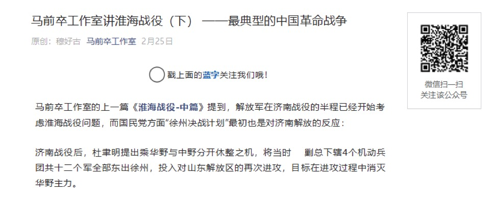
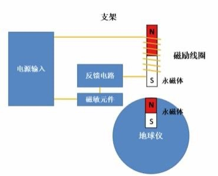

# 【睡前消息13.5】解放军打赢淮海战役，是如何在后勤上开挂的？

2019年8月25日睡前消息文字版第13.5期

::: details 【Bilibili】解放军打赢淮海战役，是如何在后勤上开挂的？
<iframe src="https://player.bilibili.com/player.html?bvid=BV134411k77q&page=1&high_quality=1" scrolling="no" border="0" frameborder="no" framespacing="0" allowfullscreen="true" height=400 width=100%> </iframe>
:::

::: details 【YouTube】解放军打赢淮海战役，是如何在后勤上开挂的？
<iframe width="100%" height="400" src="https://www.youtube.com/embed/rcw0azBsoCM" frameborder="0" allow="accelerometer; autoplay; clipboard-write; encrypted-media; gyroscope; picture-in-picture" allowfullscreen></iframe>
:::

大家好，这是第13.5期《睡前消息》。也是额外的一期。我们整个工作室正在努力，争取在国庆以前做到一周三更。现在这期节目是测试，也是预告片，感谢大家对睡前消息的持续关注。

首先，让静静休息一下，我来聊聊之前的话题。

[第12期睡前消息](12.md#替消防队开锁-300元该不该收-锁匠被道德绑架倒霉)我提到了山东寿光的消防队开锁事件，从弹幕和评论看，大多数观众都基本接受我的观点，认为军队应该保护人民的正当利益。这里我再补充一下，三大纪律八项注意的受益者不仅仅是人民，还有军队自己。

## 穆好古讲淮海战役

聊起中国解放军的传统，我们工地上就有特别有研究的穆好古同学，他这周还发了一条微博，比较了历史上两个类似的现象：

这条微博说的是福康安带的清朝远征军和解放军有两个共同点，一个是愿意在后勤上花钱，一个是经常打胜仗。这不是巧合，而是必然的趋势。

关于解放军作战纪律的历史，穆好古同学之前还给马前卒施工队专门写过一篇文章，写的是“淮海战役”。这篇文章的第三部分，标题是[《小推车的细节》](_doc/13.5-3.md#_3-小推车的细节)，是最值得读的部分，接下来我让穆好古同学自己来介绍。

[淮海战役（上）——最典型的中国革命战争](_doc/13.5-1.md)

[淮海战役（中）——粟裕的“野心”在成长](_doc/13.5-2.md)

[淮海战役（下）——最典型的中国革命战争](_doc/13.5-3.md)

[微信公众号·睡前消息编辑部·穆好古：马前卒工作室讲淮海战役（下） ——最典型的中国革命战争](https://mp.weixin.qq.com/s?__biz=MzU4MTU1NzI4Mw==&mid=2247488964&idx=1&sn=56112570f6fefe04ff8afa7feec4114a)

**穆好古：**

大家好，我是马前卒施工队的穆好古。

过去，我们说起人民战争，说起淮海战役的小推车，总是宣传人民站在解放军一边，自愿支援前线，所以解放军战无不胜。这说法在宏观上没有错，但缺乏历史细节，容易让人误会，以为600万民工都是无偿工作的志愿者。实际上淮海战役是中国自古以来最大的一次雇佣行动，每个替解放军出力的民工都可以拿到报酬，而且回报超出当时的平均工资。

 文章里面有数据，粮食每运100里，运输队可以拿走15%，综合算下来，一个民工每天可以赚四斤粮食，比农村平均工资高20%。所以民工的积极性非常高，跟着部队走几百里也不抱怨，这才是解放军后勤效率高的原因。

所以解放军总是以压倒性优势打胜仗，就算一时不能全歼，也有足够的粮食和敌人对峙。结果解放区越来越大，地盘大了，解放区政府就可以用更低的税率，收更多的粮食，雇更多的民工做后勤，这是一个信用越来越好的良性循环，和现代金融市场的区别不大。

有了信用，解放军不仅能使用现有的物资打仗，还能预支将来的税收。淮海战役动员的很多民工是山东老根据地的，他们知道解放军不会赖账，所以就算眼下没拿到报酬，只要给一张记账的白条，就愿意推车送货。这些白条将来可以找政府换粮食，也可以抵税，一直到1956年，很多农民交公粮还是用淮海战役的白条。换句话说，1948年的解放区政府，向1956年的自己借了一大笔粮食，用来应付眼前的战斗。

督工，我介绍完了。

**任冲昊：**

刚刚穆好古同学把历史规律总结得很好，这个规律反过来看就是信用必须长期培养，战战兢兢、如履薄冰，一点也不能破坏，否则吃亏的是十年后的自己。山东寿光这件事我们希望政府严肃对待，落实政策，就是怕政府将来需要信用的时候用不上。

8月9号[第九期睡前消息](9.md#贵州穷县借债400亿-独山县)，我提到贵州一个县借了400亿地方债。这么巨大的债务，既说明政府过去的信用好，也说明政府未来的信用压力很大，这个时候千万不能因为小事损失全国性的信用。

回到前面解放战争的话题，旧中国那种乱世，军队手里有枪，往往是无法无天为所欲为。三大纪律八项注意说起来容易，执行起来非常难，但只要落实下去，不敢说是百战百胜，最起码是立于不败之地。解放军就是靠这种简单朴素的纪律打下整个中国，而不是因为多了几个擅长骂街的李云龙才打胜仗。

## 静静没读错“菜城寿光” | 寿光蔬菜博物馆

另外还有一件事情和寿光也有关系，[第12期](12.md#替消防队开锁-300元该不该收-锁匠被道德绑架倒霉)静静的读新闻的时候提到一个概念“菜城寿光”。很多读者在弹幕里纷纷纠正，说应该是“莱”城，因为旁边的山东省莱芜市的确真的有一个区叫莱城。这里我替静静同学说句话，寿光真的是菜城，年产450万吨蔬菜，平均每个寿光人每年出产四吨蔬菜。这里的菜市场价格波动一下，全中国的菜篮子都要受影响。

寿光还有一个蔬菜博物馆，里面有中国最先进的蔬菜技术，还能买到最神奇的蔬菜种子。一株西红柿能够覆盖几十平方米，如果哪位观众的父母退休后喜欢种花种菜，一定要让他们去寿光的蔬菜博物馆看看，看看菜城的精华。

## 左手王画师显身手

接下来，我介绍一下施工队的隐藏角色，左手王同学，他是我们的画师。最近几期视频平均每期2000多评论，左手王同学亲手挑了几条做了灵魂配图，我们一起看看。

| 比如[12期睡前消息](12.md)的这位幽灵同学，从人工智能联想到三体的人列计算机。 | [11期睡前消息](11.md)的一位观众表示要养肥弹幕，左手王同学满足了他的愿望。 |
| ------------------------------------------------------------ | ------------------------------------------------------------ |
|  |  |
|                |                |

| [第10期睡前消息](10.md)一位观众可能被我说动，去看了《上海堡垒》，请他给鹿晗同学带一个问题。 | [第九期睡前消息](9.md)口袋熊做了一个精辟的总结：一期认识中国一个县。我们以后努力落实。 |
| ------------------------------------------------------------ | ------------------------------------------------------------ |
|  |  |
|                |                |

| [第八期睡前消息](8.md)一位武林高手要给施工队改名，我们如他所愿。 |
| ------------------------------------------------------------ |
|  |
|                |

总之，左手王同学配图的热情非常高，希望大家不要辜负他的热情。以上几位用评论激发左手王灵感的同学们，这几天请查看私信，我们将送你一个磁悬浮地球仪当礼物，希望大家继续和我们互动，我们以后再开发点更有趣的礼物送给大家。

## 孙宏宇介绍磁悬浮地球仪原理

说起地球仪，过去几期他也一直是弹幕的焦点。既然大家喜欢在这里看物理知识，今天就让马前卒实验室的孙宏宇同学来介绍一下磁悬浮玩具。

**孙宏宇：**

我是马前卒施工队的搬砖工孙宏宇。

所谓磁悬浮，当然是利用了同性相斥，异性相吸的原理。这个地球仪和支架里面都有磁铁，所以能够用磁力来抵消重力。

这说的好像很简单，但是如果支架没有通电，那么地球仪是无论如何也悬浮不起来的，不是被吸上来就是掉下去。

这说明磁悬浮不仅用磁力来平衡重力，还要保持结构的稳定性。在山顶上放一块石头和在山谷底放一块石头，都能用支撑力来平衡重力。但是显然山谷里的石头更稳定，不会随便滚动。在磁悬浮的问题上，不通电地球仪就找不到这么一个稳定的山谷。

这个现象要用1842年发现的恩肖定理（Earnshaw’s theorem）来解释，这个定理告诉我们，在仅由电荷的相互作用构成的电磁场中，一群点粒子无法稳定维持一个静止的力学平衡结构。

这个定义很绕嘴，通俗一点说，就是无论你把磁铁做成什么形状，也不可能用它稳定的托起另一块磁铁。

虽然恩肖定理看起来给磁悬浮判了“死刑”，但是我们仔细看的话，会发现这里面还是有后文的，他只是说静态磁场中没有静态磁悬浮。所以一般条件下要想实现磁悬浮，要么让磁场动起来，要么让物体动起来。

我手上这个地球仪就是让磁场动起来。大家看上面示意图，地球仪和支架里各有一块泳磁铁。除此之外支架内部的舌铁上还缠着线圈，构成了一个电磁铁，通过线圈的电流越大，电磁铁的磁性越强。

线圈和磁敏原件和返馈电路串联在一起，一旦磁敏原件感应到磁场的减弱，说明地球已在下落，磁敏元件会加强电流把地球仪吸回来。如果磁场增强，说明地球仪要被吸上来了，就减少电流，减弱磁场，让地球仪掉下去。这样就在支架下方形成了一个稳定区，地球仪挂在稳定区就能稳定悬浮，磁悬浮列车也是同样的原理。

除了这种从上面用支架吸附的磁悬浮地球仪，还有一种从下方用斥力来提供悬浮的地台式支架，但是基本原理都是一样的，都是磁场来在动。

还有一种磁悬浮陀螺，看起来和地台式的悬浮非常相似，但是原理完全不同。前面我们说了，磁场和悬浮物至少有一个在动。磁悬浮陀螺就是磁场不动物体动，利用陀螺的进动效应来保持暂时的稳定。

在磁悬浮陀螺的地台里面是一大块永磁铁，磁场代替的支架，陀螺只要旋转的够快，就能靠在这个不稳定的支架悬浮很久，当然一旦旋转速度减慢就会掉下来。

## 🔄 韦恩接力报道 | 追踪新闻后续

**江新泽：**

我是泥瓦匠韦恩，我们又见面了。我们现在先来复习一下旧文，看看之前督工报道过的事情有没有发生一些变化。

7月29日的[第六期睡前消息](6.md#薛蛮子柬埔寨炒房-西哈努克港三大支柱产业是电信诈骗、赌博和毒品)，我们提到了柬埔寨的房地产泡沫问题，告诉大家西港唯一赚钱的项目，就是面对中国人的赌博。一旦赌博被禁，整个柬埔寨的房地产泡沫都会破掉，大家千万不要被薛蛮子这样的房地产商骗钱。

刚刚过去的周二，8月20号泡沫就被戳破了。柬埔寨首相宣布不再发放新的赌博牌照，骗中国人钱的生意就此封顶，不许再扩大。这虽然不会立刻消灭所有赌场，但肯定会打破柬埔寨房地产的投机信心，眼下再投资柬埔寨的房地产，就相当于跳上一艘正在下沉的船，相信大家不会拿自己的钱去打水漂。

<a href="https://news.sina.com.cn/c/2019-08-20/doc-ihytcitn0612435.shtml">新京报：柬埔寨全面禁止发放网络赌博牌照 外交部：高度赞赏</a>

8月13号的[第10期睡前消息](10.md#意大利高铁和五星运动-意大利民粹党不得民心)，我们提到了意大利有一个反对一切的五星运动党。这个党居然还成了意大利的执政党，任命了自己的首相。但是因为五星运动反对一条非常重要的高铁，他的政治盟友和他翻脸，要求重新选举。这个周二，五星运动党终于顶不住了，总理下台，刚刚辞职的孔特是这个党的第一任总理，很可能也是最后一任。

|  |  |
| ---------------------------------------------- | ---------------------------------------------- |

<a href="https://www.jiemian.com/article/3426399.html">界面新闻：意大利总理辞职始末：一条跨国高铁引爆的政坛地震</a>

7月19日的[第三期睡前消息](3.md#东阿阿胶利润暴跌-因囤货和营销费用太高)，我们第一条新闻就是东阿阿胶公司预告利润暴跌，顺便介绍了一下这种有良心的智商税产品。这周正式的半年报出来了，果然如他所愿，利润下跌了77%。如果下半年东阿阿胶公司能从赚钱变亏损，马前族施工队会很高兴发挥了一些微小的作用。

<a href="http://finance.eastmoney.com/a/201908211213218657.html">东方财富网：东阿阿胶：上半年净利润1.93亿 同比下降77.62%</a>

## 🔄 蛋卷继续等老公

最后再插播一下蛋卷同学的征婚广告，希望各位同志能广而告知，有意向的朋友可以在我们的公众号后台留言。

---

好，今天的睡前消息加餐到此位置，祝大家周末愉快，下周二我们再见！