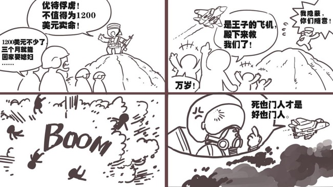

# 【睡前消息30】沙特三个机械旅被胡塞武装打尿——字面意思

2019年10月18日睡前消息文字版第30期

::: details 【Bilibili】沙特三个机械旅被胡塞武装打尿——字面意思
<iframe src="//player.bilibili.com/player.html?bvid=BV19E411r78h&page=1&high_quality=1" scrolling="no" border="0" frameborder="no" framespacing="0" allowfullscreen="true" height=400 width=100%> </iframe>
:::

::: details 【YouTube】沙特三个机械旅被胡塞武装打尿——字面意思
<iframe width="100%" height="400" src="https://www.youtube.com/embed/lnCLZXGLeMA" frameborder="0" allow="accelerometer; autoplay; clipboard-write; encrypted-media; gyroscope; picture-in-picture" allowfullscreen></iframe>
:::

大家好，2019年10月18日睡前消息第30期，先让静静介绍内容。

## 中国气候快速变暖变湿？ | 气候格局变化下结论为时尚早

**9月15日第[19.5期睡前消息](19_5.md)，我们介绍了一些改造国土的大工程，下面有很多读者提问，说最近传闻中国气候快速变暖变湿，想知道是不是真的。**

<BiliComment name="但随我心" content="督工，能不能说一下小冰期结束，气候条件可能回到汉唐甚至西周时期对国家的影响" time="2019-09-15 23:19" like="6" reply="
山海上人
大兴的象征，没一次的小冰河期结束，等降水线北移，都是我中原王朝的鼎盛时期
紫枫阙
回复 @山海上人：好像对美帝不太好，会增加美帝台风的频率。[尴尬]
明月故人心
有点乐观啊，现在都在说全球变暖，海平面上升什么的[doge]
山海上人
回复 @明月故人心：这个建议搜索温铁军教授的视频，他有讲等降水线北移这个对于中原王朝的影响
山海上人
回复 @紫枫阙：到时候就是北美第51州，加麻大州"/>

<BiliComment name="奇观误国秦始皇" content="说起来，据说未来气候变迁，中国可能气候要回复到西周水平了，不知道是不是真的" time="2019-09-15 22:41" like="2"/>

<BiliComment name="ACG军火爱好者" content="Q群看到一条消息，毛子那边说西伯利亚冻土层开始解冻了，他们联系了伊拉克的水利方面发现，两河流域一些断流几百年的河重新出水了，他们觉得气候变暖是真的要来了，我们方向的水气已经能过得了乌拉尔山脉，现在和国内交流气候情报，新疆的植物生长范围扩张已经超出了预测范围，东北已经长出了亚热带的阔叶林，野生熊猫的活动范围在向北扩张，野生鲟鱼在长江升温下灭绝已经是无可挽回了，如果他们预测没错，十年后长江以南就没有冬天了。气候将非常接近历史上的西周时期，明末开始小冰河期真的要结束了，全球新一轮的基建大建设已经刻不容缓了。" time="2019-09-16 03:17" like="56" reply="
星河砂数同
全球气候变化和受其影响产生的变量，在历史上冥冥之中有某种联动关系…… 像欧美那种纬度，如果没有墨西哥暖流，是不太适合人类宜居的…… 如果因为小冰期的结束，冻土层解冻，不仅欧亚大陆的西伯利亚冻土带消融会影响整个欧亚大陆的河流水文，气候模式。 甚至连北美大陆的阿拉斯加到格陵兰岛的冻土层也会消融，这不仅会影响到北美陆地上的河流水文，也绝对会影响到海洋的洋流以及整个海洋生态系统，甚至未来全球的气候模式都会变化。 气候影响产业布局，产业布局影响经济，经济影响政治……温度带分布，作物生产，人口素质，地缘政治都会变化…… 目前我们唯一的宜居的海洋星球，就是这颗在太阳系宜居带稳定运行数十亿年的地球。 地球地质史上随便哪次大灭绝事件对于目前的人类文明程度来说都是致命的，不讨论灭绝的可能，但至少文明会衰退。 在面临变局前，充分发挥主观能动性，改造自然，改造世界，这是在下一盘很大棋局啊…. 所以，目标是星辰大海，人类命运共同体之类的概念，绝非口号。
JJ200
要是恢复到唐朝的气温水平，那不仅是新疆，青藏高原上的可开发地也会增多，那就意味着真正充实边疆过好日子的时候到了"/>

**另外，从这些问题来看，多数读者很欢迎这种气候变化。督工，你能给他们解释一下吗？**

我知道这些读者为什么提问，因为上个月微博和qq群盛传一段口气夸张的描述，我相信很多读者也看到过。

<BiliComment name="😱震惊！我是谣言😱" content="转： 今年过临界点了…… 气候临界点在今年出现了 降水不但过了秦岭，穿越青藏高原了 穿越整个青藏高原，并且在新疆两大盆地下雨 已经保持3年了 现在新疆的植被，以一年一百五十公里的速度在狂奔 内蒙古的植被，今年的速度是四十公里的速度在狂暴的恢复 黑龙江的林区开始出现大量的肉植阔叶 就三年而已 肉植阔叶又一次出现在了黑龙江 降水过了秦岭了 如果能保持10年，黄河就会变清了 阿里的树都特码死了快两千年了吧 他们研究气候学的，说理论上间歇性气候不是这样的，这是一个长期的事情，是一个大周期的问题 然后问了他们全球气候的问题，他们说..升温是不可逆的了 如果这种情况继续持续下去 中东会在十年内恢复 北美地区会在十年内进入曾经的沼泽状态 密西西比流域会变成盐碱地 海水倒灌 降水增多会导致北美的一半土地变成沼泽 中东会恢复，同时欧洲也会恢复了" uid="0"/>

如果只是这段话，我觉得几乎不值得辟谣。以我上网20年的经验，用了这么多夸张描述的文字，必然是编出来哗众取宠的。文章里面提到，新疆的植被以每年150公里的速度“狂奔”，但是塔克拉玛干沙漠南北只有400公里宽，2年前我还去过沙漠正中间，总不见得我明年去，中国最大的沙漠就消失了。

但是9月16日，新华社又发了一篇文章[《真正的大事：寒冷干旱的中国西北正在变暖变湿》](https://www.jiemian.com/article/3513681.html)。这篇文章的第一作者是新华社甘肃分社社长任卫东，对舆论的冲击非常大，所以前面那个谣言跟着爆发性传播，几乎成为主流观点了。

**那么最近50年西北地区的植被变化到底是怎么样了呢？**

我看了新华社的报道，凡是提到植被问题的，都是2018年这一年的数据，就事实描述而言，不算太夸张。但气候变化需要看长期趋势，看宏观变化。1980年中国土地类型地图和今天的对比几乎看不出差异，这说明气候和植被没有根本性变好。

我还找了一篇2017年的论文，分析了新疆植被的卫星遥感数据，结论完全不支持所谓植被“狂暴恢复”的说法。

> "降水、气温及植被覆盖情况年际间差异不大，…… 植被覆盖得到改善的区域面积比植被退化的区域面积小，植被覆盖情况基本保持不变。”[1]

[[1]慈晖,张强.新疆NDVI时空特征及气候变化影响研究[J].地球信息科学学报,2017,19(5):662-671](http://www.doc88.com/p-3743567162159.html)

前面提到[19.5期睡前消息](19_5.md)，那一期马前卒施工队给大家介绍了叶尔羌河流域水利工程，说新疆正在建设中国第四大灌区。但这是水利工程的收集降水的结果，并不是因为降水忽然大幅增加。从年降水量看，叶尔羌河流域60年来增加了每年30～50毫米的降水量，但是上游的年蒸发量超过1500毫米，中下游蒸发量更大，降水量增加真的不是新疆农业发展的主要原因。

另外，过去50年，叶尔羌河流域平均温度的确上升了0.84-1.85摄氏度，导致流量有一定增加。但其中最重要的原因是冰川融化加速，消耗不可再生的冰川资源，制造短期的夏季洪水，这不算什么好事。就算我们能建大坝收集洪水，也不是好事。

到了10月9号，中国气象局的例行发布会批判了之前的传闻，说气候格局是否已经发生改变，现在下结论还是为时尚早。这算是最权威机构的说法。

从今年中国气候变化蓝皮书的内容来看，西北地区降水量和多年平均值相比，有增有减。虽然图上绿色比红色多，但普遍也就是20-50毫米，我们暂时还是不要传播很夸张的预言了。

 

**还有一种说法认为俄罗斯作为北方寒带国家，比较欢迎这种气候变化，这个说法准确吗？**

前几年，俄罗斯的确质疑过欧洲阻止气候变暖的政策，既因为国家整体上寒冷，也因为他们缺钱。俄罗斯觉得，气候变暖是别人的事情，挖石油赚钱是自己的事情，没准还能把北极冰山都化掉，打通北极航道方便运天然气。所以，俄罗斯人口占全世界2.1%，排放的温室气体占7.5%，是第四大温室气体来源。《巴黎协定》的197个签署国中有185个国家宣布执行协定，俄罗斯就是拒绝执行的12国之一。

但是最近俄罗斯也急转弯了。9月23号，俄罗斯总理梅德韦杰夫签署文件，正式加入巴黎协定，愿意和全球一起阻止气候变暖。

**为什么俄罗斯统治者忽然担心全球变暖？**

普京毕竟是克格勃出身，还是信数据的，最近的一系列统计资料颠覆了他们的看法。

俄罗斯是高纬度国家，大多数地区的地质构造和生态环境是在低温环境下生成的，温度上升直接引发了一系列地表变化，比如说滑坡，比如说岩溶扩散，勾壑侵蚀。在图片上看，俄罗斯几乎全部面积都受到了影响。（图略）

俄罗斯早就丧失了更新全国基础设施的能力，最后一条干线铁路是苏联解体前六年修的贝阿铁路。所以普京非常担心地貌变化毁掉基础设施，把整个亚洲部分变成孤岛。但温度变化恰恰在全面破坏俄罗斯的路网、电网，普京也希望尽快遏制这个趋势。

就在梅德韦杰夫正式批准执行《巴黎协定》之前，俄罗斯环境部发出警告，说俄罗斯气温上升速度是世界其他地区的两倍，西伯利亚森林火灾，远东地区洪涝的风险都在上升。如果北极冻土进一步融化，还会释放出放射性物质，制造辐射污染。所以俄罗斯急转弯，打算控制气候变化。

总的来说，全世界的基础设施都是在气候稳定的假设下建立的，如果气候剧烈变动，就算海平面上升不会淹没城市，农业和基础设施也受不了。

中国绝大多数人口分布在东部沿海平原，以后还要进一步往东南沿海集中。面对气候变化的威胁，中国可以质疑西方政策的问题，但千万不能置身室外，更不能抱有侥幸心理，希望自己从气候变化中得到好处。这就像小孩子拿炸药当鞭炮一样危险。

下一个话题。

## 上线四年，率土之滨为何逆势增长 | 《率土之滨》游戏玩家学历和社会地位高，玩家群体关系接近现实

**9月30日，“伽马数据”官方微信公众号发布了2019年8月移动游戏报告，这份报告里面有一点值得注意，随着时间的流逝，大部分老游戏的用户都会逐渐流失。但在这个报告中，战棋策略类游戏的收入增长突出，其中还有一款四年前上线的老游戏《率土之滨》，前八个月的收入比去年同期增长了109%，是所有成熟游戏中增长率最高的。督工，你怎么解释这个现象？**

我手机游戏玩的不多，但中国有5-6亿的手游玩家，作为媒体人我不可能忽略这么大的一个群体，所以我会尽力去观察手机游戏玩家，像观察现实社会那样总结社会运行规律。

战棋-策略类手游最大特点不是“设定”，而是玩家互相斗争，通过大脑之间的博弈，制造复杂性和趣味性。《率土之滨》的数据这么突出，马前卒施工队也做了点研究。目前看，四年的老游戏还有用户持续投入，主要是玩法足够复杂，玩家群体关系接近现实。

《率土之滨》游戏世界有225万块土地方格，每个玩家刚进入游戏时只占九块，是全世界的25万分之一，每个服务器都能容纳成千上万的用户，而且每个世界都要在半年左右走向统一。在这样的环境里，靠个人战斗，只能当炮灰，加入同盟是必然的选择。一个强势同盟往往会有几百名活跃玩家，比大多数企业的规模还大。

大型群体之间争夺生存空间，内部需要分工，需要复杂的组织结构，对外需要谈判和阴谋。所以盟主想要管理好一个几百人的团队，比管好一个普通企业还难，毕竟大多数普通玩家不是雇员，不会为了工资而服从命令。

所以在知乎和很多网络社区上，《率土之滨》的话题包含大量的管理性内容，以及对其他玩家的心理学分析。我们施工队的穆好古同学算是资深玩家，据他的体验，这款游戏到了后期最重要的能力就是大团队的管理统筹能力。为了管理好几百人的团队，几乎所有强势同盟都会起草详细的管理章程，有奖惩条例，和现实社会一样，注重制度建设和物质激励。

打盟战的时候，用EXCEL表研究阵型，这是基本操作。游戏甚至还衍生出了自己的对战文化，战前发新闻激励士气，聘用史官，在贴吧宣传同盟精神。央视报道过《率土之滨》中间产生的各类文学创作，甚至有可能走进现实世界，到国家图书馆公开展览。

去年互联网中心的报告显示，中国网民只有20%具备专科以上学历。伽马数据报告显示，《率土之滨》的用户90%是高学历用户，比如大学生、企业管理层、私企老板、公务员。所以在游戏里面，管理技术，激励资金甚至文化创作能力都比现实社会更集中，据说可能遇到上市公司ceo当盟主。这个用户结构是《率土之滨》成为站棋类游戏第一名的根本原因，是他在上市四年后强势增长原因。

反过来说，这也是游戏玩法筛选出了玩家。历史由一个具体的人书写，每个人都会选择自己眼中最优解，所以历史的细节比任何故事都精彩。《率土之滨》没有对玩家互动规则做太多约束，尽量让玩家自己开发博弈规则，让玩家互相玩，能在这款游戏中出头的玩家，现实中一般也有过人之处。

随着互联网的发展，游戏已经成为人们生活的一部分，未来社会也许真的会像《头号玩家》一样，生活和游戏的边界越来越模糊，甚至分不出那个更真实。到那个时候，欢迎大家和马前卒施工队组团，探索游戏世界。

## AI阅卷后，中国考生GRE得分变高 | 善作八股文的中国人，面对AI批卷更易得高分，但没意义

**8月20日，美国媒体发现在改用计算机评分以后，中国学生的GRE作文平均提高了1.3分，而美国黑人的平均得分降低了0.81。GRE作文的满分是6分，网民质疑说，这是不是说明人工阅卷的老师歧视中国人呢？**

不是阅卷老师歧视，而是ai更喜欢模式化的文章，喜欢“八股文”。中国学生的应试教育经验比较多，所以说换成计算机阅卷比较占便宜。

我具体介绍一下ai阅卷的情况。

所有的考试都希望规则公平，最好有标准答案。但作文的主观因素比较多，很难用统一标准打分，无论什么语言，作文都尽量有人工阅卷，而且是最优秀的老师阅卷。

但毕竟每个人对作文的打分标准不同，所以如果能够总结出一定的标准，计算机阅卷还是显得更公平一些。从1966年起，美国人就在研究如何用程序审核作文。现在GRE使用的E-rater系统，就是美国考试服务中心在1999年2月投入使用的阅卷AI，到现在已经发展了20年。现在美国至少有21个州用AI批改作文，大多数作文都直接给分，少数抽出来人工复核。

托福、GRE、托业等一系列国际考试，都是美国考试服务中心组织，所以都在用E-rater阅卷。E-rater评分标准包括八个部分，词汇量、复杂度、语法、用法、结构、风格、文章的展开方式，还有习惯用语。

> 1.基于词汇量的内容评估（content analysis based on vocabulary measures)
>
> 2.词汇复杂度（lexical complexity/diction)
>
> 3.语法错误占比（proportion of grammar errors）
>
> 4.用法错误占比（proportion of usage errors)
>
> 5.结构错误占比（proportion of mechanics errors）
>
> 6.对写作风格的评价（proportion of style comments）
>
> 7.文章的组织结构与展开（organization and development scores）
>
> 8.鼓励使用地道的习语/成语（features rewarding idiomatic phraseology)

这套评分标准是容易被摸出规律的。AI给中国学生的打分高，主要原因是中国人喜欢用复杂的高级词汇，抵消了语法不好减分。而美国黑人虽然语法过关，但用词比较俗，而且一些用词被过去阅卷人歧视，AI学到这些潜在的歧视，就给他们打低分。我个人比较喜欢写用词通俗的文章，如果换成ai打分，估计我的作文分数也高不了。

**那这么说以后ai评分越来越多，中国人的应试教育是不是会占便宜呢？**

中国学生靠高级词汇拿高分，实践也不一定总占便宜，毕竟英语是人家的母语，美国人自己总结起八股文经验比新东方更狠。托福资源网上有一整套详细的量化总结教程，教你如何骗过AI拿高分。

比如说全文分成4-5个自然段，结构要用“总-分-总”套路，文章不能太长，避免写的多、错的多，同时也不能太短，避免一个错误用词就提高全文的错误率。综合优化算下来，作文要控制在380-400个单词，这是个非常死板的标准。

写作风格方面要避免重复用词，但要多次强调标题关键词。行文要避免被动语态，少用and和俚语，用更生僻、更复杂的高级词汇可以得高分，但也会带来拼写风险。所以最佳方案就是用不太难写，但同时使用频率不高的词汇，在保证拼写安全的前提下尽量拿高分。有人专门整理了英语高频词排序，同义词尽量选高频词中频率靠后的，比如说“好”不要说good，要说excellent。“大”不要说big，要说large。

为了证明ai有缺陷，美国媒体使用了麻省理工学院的论文生成器。这个生成器能用大量生僻词组成复杂而且地道英语句式，语法用词非常漂亮，但内容乱七八糟。这样瞎编的作文评分稳定超过四分，算是高分作文了。看来ai确实没有官方宣传的那么靠谱，所以这次被骂的非常厉害。

国内现在也有类似的ai阅卷平台，比如说批改网，按南方早报去年报道，大陆已经有6万学校在用这个平台进行阅卷。马前卒施工队的成员比较好奇，也用上面说的论文生成器生成了一篇驴唇不对马嘴的英语作文，在批改网他得到了83.5的高分。

所以就目前的AI水平来说，中国人仗着应试教育经验得高分并不是一件很值得自豪的事情，要学好真本事还是要放下一些考试套路。

## 也门胡塞武装称“击败”沙特三个机械旅

**最后一个新闻，9月29日也门胡塞武装发言人发出战报，宣称在沙特境内击败了沙特联军的三个旅，打死打伤了500多人，俘虏2000多，缴获了大量的装甲车辆。也门这个小国真的能打败沙特吗？**

通过比较多方信息，我比较倾向于相信胡塞武装的说法。从规模和影响力来看，这绝对是过去一年全球战果最辉煌的战役。

国内很多媒体报道说战斗发生在9月26日，但这实际上是错误的，开打时间发生在8月27日，一个月后他们的发言人才宣布战果。战斗地点是在沙特南部的奈季兰地区和野门北部的基塔夫地区之间，战斗持续了72小时。

战斗过程非常古典，换到三国演义里边也不超前。胡太武装提前知道了沙特联军的行军路线，在公路两侧山坡上伏击。沙特联军的后勤很差，在沙特境内还需要找水源补水，而且他们的纪律很烂，没有安排分批轮换，一起跑到河边取水。胡塞武装趁他们全军喝水的时候，从两侧忽然袭击。

胡塞武装首先袭击车队的头尾，从前后堵住道路，让200多辆的车队停下，然后从山坡上发射反坦克导弹，还有廉价的无人机轰炸车队。不过他们的火力不强，一时没法歼灭装甲车队。战斗过程中，胡塞武装还向奈季兰的沙特军用机场发射导弹，阻止沙特空军支援。拖到第三天，一队沙特联军士兵士气崩溃，战场倒戈，导致整体崩溃，让胡塞武装打了一个歼灭战。

**那胡塞武装取得这么大的胜利，是因为他们的战斗力太强，还是因为沙特联军太没用了？**

如果战斗力和军费成正比，那么沙特是毫无疑问的世界第三大军事强国，超过俄罗斯。

| 名次 |    国家/地区/军队    | 支出（十亿美元） |
| :--: | :------------------: | :--------------: |
|  1   |        🇺🇸美军        |      643.3       |
|  2   |   🇨🇳中国人民解放军   |      168.2       |
|  3   |   🇸🇦沙特阿拉伯军事   |       82.9       |
|  4   | 🇷🇺俄罗斯联邦武装力量 |       63.1       |

沙特在也门的投入也不低。也门战争四年，沙特在日常的军费之外又打掉了2250亿美元，比中国今年军费还多几百亿。

这次沙特被打败三个旅，虽然不是精锐部队，但装甲车和重武器绝对不少，已经是冷战后期水平的机械化军队。被轻装部队打这么惨，完全是部队素质问题。再往深层次说就是沙特的社会结构问题。

沙特人均GDP也就是2万美元出头，和苏州差不多，其中很多财富还要用来抵消沙特的恶劣气候，之所以我们觉得沙特是一个很富裕的国家，是因为沙特有一大批生活非常奢侈的王子和商人。但总的gdp就那么多，这些王子的生活越夸张，穷人的生活就越难过，首都利雅得也有大片的贫民区。

所以沙特虽然很喜欢打仗，但是并不敢大规模在国内征兵，怕穷人拿到枪造反。当年沙皇就因为征兵太多，被革命军杀了全家。沙特也担心和100年前的沙俄一个下场。所以按照贵族数量控制国内的陆军规模，绝对保证贵族机关能够控制到基层。

沙特联军现在号称15万，前线只有两三万人，其中包括大量雇佣兵。这些雇佣兵一般是苏丹或者也门南部的平民，一个月赚1200美元，希望干几个月就回家娶媳妇，谁也不想给沙特送死。平时打仗他们就是靠重武器多，靠远程火力压制对手，很少打近战。这次被堵在山谷里面，很多人听到枪响就吓尿了。胡塞武装的视频证明我这句话就是字面意思。（视频略）

而且沙特自己也不拿这些雇佣兵当人看。这次战斗因为担心胡塞武装的导弹，三天没有一架飞机支援，战后一部分雇佣军被俘虏，沙特倒是派飞机来轰炸。估计下一次战斗，沙特陆军的表现会更差。

**那沙特军队这么不经打，胡塞武装会不会全面进攻沙特呢？**

沙特军队毕竟还有很多重武器，飞机也多，胡塞武装不太可能维持一条很长的后勤线打进沙特本土。另外，胡塞武装也很清楚自己的诉求，不是为了伊朗牺牲自己，而是利用伊朗和沙特的矛盾，两边拿好处，所以9月14日沙特油田被导弹袭击以后，两方面都表示要和谈。胡塞武装首先释放了3万名战俘，沙特方面也没有大规模报复，估计红海南部要安静一阵子了。

好，接下来我们关注下往期新闻的后续。

## 🔄 独山县县委书记被起诉受贿及滥用职权 | 贵州应反思避免陷入债务危机

八月份我们连续关注了贵州省的地方债问题，[第九期睡前消息](9.md#贵州穷县借债400亿-独山县)第一个新闻就是独山县400亿高利贷修大学城。

周三最高人民检察院消息，当时借贷的县委书记潘志立被正式起诉，罪名有两条，受贿、滥用职权。滥用职权的内容是：“低价出让国有土地，造成国家经济损失，情节特别严重”。

这个县委书记肯定有问题，但就算土地出让流程完全透明，独山县也不可能靠卖地偿还每年40亿的利息，更不用说400亿的本金。希望贵州在审判这个县委书记的同时，也深刻反思过去几年的发展思路，不要再普遍借债搞旅游和服务业了，因为如果每个县都借债搞旅游，赚钱最大障碍就是自己的邻居，最后必然是少数县赚一点钱，大多数县陷入债务危机。

## 🔄 中美达成实质性第一阶段协议 | 中美贸易规模的问题上，逻辑比情绪更可靠

四月份睡前消息开播之前，我在《观察者网》的《观天下》讲坛做过一期演讲，标题是《中美贸易战：为什么是大豆》。这个视频长两个小时，播放量23万，是我在b站输出内容第二多的视频。到现在在在b站搜“马前卒”第一个跳出来还是这个演讲。

::: details 【Bilibili】【观天下讲坛第19期】 马前卒 中美贸易战：为什么是大豆

<iframe src="//player.bilibili.com/player.html?bvid=BV1AW41157cL&page=1&high_quality=1" scrolling="no" border="0" frameborder="no" framespacing="0" allowfullscreen="true" height=400 width=100%> </iframe>

:::

在视频的最后（105分钟左右），我提出了两观点：

第一个观点，承认中国是当下世界体系的最大受益者，美国人说我们“搭便车”有一定道理。所以，如果中国能付出一定代价，把现在的国际贸易格局再维持十年，中国应该接受。

第二个观点，建议大幅购买美国的农产品，尤其要多买大豆，当作中美谈判的第一个筹码。同时借这个机会改造国内的小农经济。

这两个观点当时都被骂的很惨，但是，前天10月15号，外交部发言人宣布中美达成实质性第一阶段协议。

[人民网：外交部：中美在达成经贸协议问题上是一致的](http://world.people.com.cn/n1/2019/1015/c1002-31401934.html)

承认在贸易战期间已经买了2000万吨大豆，接下来还要加快采购进度。

[人民网：外交部发言人介绍今年中国企业自美采购农产品情况](http://finance.people.com.cn/n1/2019/1015/c1004-31401806.html)

这似乎说明我当时的观点有一定的合理性，起码到现在还是按照当时的逻辑在推进。在中美贸易这个规模的问题上，逻辑比情绪更可靠。大家如果有兴趣，可以去看看当时的两小时视频。

---

好，今天的节目到此结束。从本周开始，睡前消息开始稳定三次更新，我们周日再见！