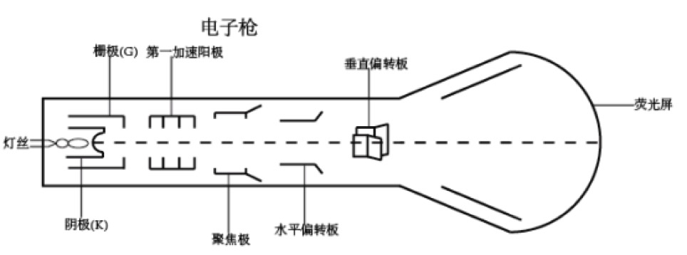

# 【睡前消息32】王选，一位连中国键盘侠都没法黑的院士！

2019年10月22日睡前消息文字版第32期

::: details 【Bilibili】王选，一位连中国键盘侠都没法黑的院士！
<iframe src="//player.bilibili.com/player.html?bvid=BV1tE41127VB&page=1&high_quality=1" scrolling="no" border="0" frameborder="no" framespacing="0" allowfullscreen="true" height=400 width=100%> </iframe>
:::

::: details 【YouTube】四川省政府办公用地怎么会被一家民企抢走？
<iframe width="100%" height="400" src="https://www.youtube.com/embed/s6v12_TcEdc" frameborder="0" allow="accelerometer; autoplay; clipboard-write; encrypted-media; gyroscope; picture-in-picture" allowfullscreen></iframe>
:::

大家好，2019年10月22日，欢迎收看第32期睡前消息，请静静介绍新闻。

## 四川省政府把办公地转给新希望集团 | 成都“狼来了”的游戏，还可以再搬一次

**10月10日，新希望集团董事长刘永好在“全国工商联主席高端峰会”上表示，将投资100亿元，在成都建设总部大楼。选址已经确定，就是原来四川省预留的省委、省政府办公基地。为什么一个企业可以和省委抢地方呢？**

首先，新希望集团是成都市乃至四川省重要的税收来源，营业收入是全省第一，政府让他三分也可以理解。但最核心的原因，可能是省委省政府故意改变办公地点，引导房地产和其他产业的投资。

四川是一个西部省份，自从汶川地震以来，超过一半的财政支出依靠中央转移支付，省内产业对政府及国有金融机构的依赖远大于东部发达地区。

最近几年，成都压倒了省内其他素有城市，把所有金融资源都吸收到省会，所以省政府和市政府搬到哪里，就会有一大批产业和资金跟着来。这次省政府让出的办公用地，在省市共建的天府新区，自从省政府宣称要搬家，土地楼板价已经从5000涨到1万三四了。

四川的官员不是第一次玩这种游戏。2008年，成都市政府就以抗震救灾的名义，把预定的市政府办公区卖了十五亿，跑到金融中心南边的软件孵化园租了几栋旧办公楼，现在是国内极少数租房办公的市政府。让出去的土地现在是天府国际金融中心，地价与租金都是成都最高。

这次四川省政府把办公地转给新希望集团，似乎还打算再玩一次搬迁游戏。省委书记在新希望集团之后发言，说：“政府办公不需要太热闹的地方，四川将另选更偏远一点的地方，建设新的省政府办公基地”。话音刚落，成都现在“东进”政策的主要区域，龙泉驿和简阳就开始传言，说省政府要搬过来，房地产和基础设施建设热情高涨。

**政府做一个搬迁的姿态就能引导社会资金去建设城市，那其他城市会不会学习成都？**

很难，狼来了的游戏大家都听过，能一直玩下去，成都也有自己的独特条件。

最基本的一点，大家虽然不知道省政府要搬到哪里，但都相信它一定要搬，因为省政府实在太小了。现在的省政府，就是当年的清朝四川总督府，十几亩地，就算盖了8层办公楼，也实在不够用。所以，省委被迫和省政府分开办公，在国内也很少见。现在四川8400万人，超过德国或者伊朗，这个办公规模肯定是不够用的。

另外，成都市的人口增量够大，城区本来也在自发扩展，所以省市两级政府不用折腾存量，就能引导资金和产业。2018年成都本科学历落户28万，其中一半是从北上广深回来的，这说明成都市的发展前景不错，跟着政府做生意的前景更不错。所以政府放一个搬家的构想，就有足够的人跟风，最后就算政府不搬家也不亏。

其他大多数省会，没有这么大的人口增量，腹地也不如成都大，如果也玩类似的游戏，玩一次可以，第二次估计就不灵了。成都政府眼下的信誉储备，估计还能至少再玩一次。

## 贵州牛肉粉集体涨价 相关部门：降回去 | 毕节市米粉店减量可以，涨价不行

**10月11日，贵州省毕节市、黔西县两级市场监管局发布联合调查结论，认定黔西县部分牛羊肉粉店的涨价是 “串通涨价”。处罚结果是两家带头的米粉店承诺降价，政府予以行政告诫。**

**10月13日，贵州省遵义市也出了类似的矛盾，习水县多家米粉店涨价，被当地市场监管局约谈，要求把价格降回去。商家涨价的理由是“猪肉价上涨带动了牛羊肉上涨”，市场监管局认为“理由不充分”。督工你怎么看这两个涨价事件？**

我们先看一下涨价的事实。

贵州城镇居民的确习惯早饭吃一碗米粉。黔西县的牛肉粉，过去是小碗9块，大碗10块，加一份肉5块。这次涨价厚，小碗涨1块，大碗涨2块，单加肉从5块变7块。

习水县的涨幅差不多，羊肉粉从8块涨到10块。大碗夹肉的羊肉粉，从15变19。这个涨幅不算小，我能想象当地民间舆论肯定会纷纷议论。但在贵州，每天早晨都能吃得起十几块羊肉粉的阶层，也算中上层，要说有人会因为这次涨价就饿肚子，我也不信。

**从处理结果看，黔西县很明确的认定了米粉店违法，只是主动认错，所以降价就不处罚了。习水县没有明确说米粉店违法，只是说他们涨价理由不充分。为什么两个地方的处理会有区别呢？**

主要的区别在于是否有串通的嫌疑。黔西县这次涨价首先是两个店主在微信群里面发了涨价提议，其他店主大致赞同，所以出现了普遍涨价。

《中华人民共和国价格法》规定，经营者不得“相互串通，操纵市场价格，损害其他经营者或者消费者的合法权益”。这是黔西县两家店铺被处置的关键原因。

习水县的涨价虽然也是几家同时涨价，但是并没有串通，至少没有找到没有串通的证据，所以市场监督局虽然要求恢复价格，但是只能约谈，不能用处罚来威慑。

**督工你怎么评价地方政府的两个处理结果呢？**

习水县的处理肯定是有问题的。找不到别人违法的证据，就不能随便干预市场。现在肉类食品价格上涨是事实，平均工资也在上涨。如果不许羊肉粉涨价，政府就应该补贴米粉店。只凭一张嘴让人家恢复价格，我看不到合理性。

黔西县的处罚是有依据的，而且不止有法条上的依据，还有很多可参照的案例。

2006年到2007年，方便面中国分会开了三次会，协调康师傅、统一、华龙等大企业一起涨价。当时的粮食和肉类也在涨价，如果企业自己涨价，属于合理行为，但行业协会不能组织涨价。所以国家发改委立刻要求恢复价格，而且要求方便面中国分会公开向社会道歉，消除不良影响。

具体到米粉行业，2010年，南宁市鲜一阁食品厂组织南宁、柳州两地的米粉厂统一涨价。在涨价之前，鲜一阁还组织了米粉厂会议，通过承包、联营、入股、分红等方式，建立了33家企业的价格联盟，所以也被当地处罚。

从这两个例子看，黔西县的处理算是合理。但是，从经济学的角度看，黔西县的处理方法还是值得讨论一下。

因为米粉行业的进入门槛非常低，如果经营成本不变，凭空集体涨价，结果必然是自己倒闭，给新的米粉店创造机会，让价格回到原来的位置。贵州本省就有这样的例子。2011年，一个80后看不惯周围的早餐店一起涨价，宣布要开一个平价早餐店，价格比同行低30%，一度成为网红店。

[央视网：贵阳：平价面馆“叫板”城市高价早餐](http://news.cntv.cn/20110703/103883.shtml)

但结果并不美好，不到一年，小伙子自己就把店关了，理由是原材料价格上涨，每一碗面涨价一块钱也不赚钱。人民网还因此发了评论。

[人民网：贵阳：“平价早餐”为何黯然退场？](http://politics.people.com.cn/n/2012/0816/c70731-18756289.html)

所以，在市场充分竞争的情况下，我建议政府还是不要急着搞价格管制。毕竟开一家米粉店很容易。这么充分竞争的市场，政府只要保护新店主的利益，不许原来的行业协会搞暴力威胁，就足以让价格保持在合理的位置上。最近贵州的牛羊肉价格涨了接近50%，强行锁定价格，既浪费政府的行政能力，也浪费了市场的自发调节能力。最后可能可能大家都没有米粉吃。

前面两个政府处罚的案例，一个是全国性的行业协会利用了康师傅和统一方便面的寡头地位，一个是米粉厂组织了卡特尔价格联盟，所以必须干预。对于米粉店这种小生意，几家店不太可能操纵市场，更何况早饭不一定要吃米粉，还有其他食品提供竞争。政府最好先看看市场的自发反应。

我之所以这么提醒毕节市地方政府，是因为这是一个有前科的地区。2017年，毕节市区一家面馆涨价，每碗涨价一元，导致顾客抗议。区政府组织公安局、信访局、市场监督局到现场联合办公，结论居然是让老板公开道歉，价格恢复原样。现在这个新闻还挂在七星关区政府的网页上。

[七星关区阳光党务政务网：七星关区发展和改革局关于调查“康家脆哨面”信息](http://www.qxggs.gov.cn/ct/166005.htm)

很明显，这就是地方政府为了省事，为了维稳，公开违法。至于到底谁利益受损，到底普通人有没有有得到好处，他们不关心。政府网页上第一句话就给出了最核心的理由是“微信圈大量转发”。这才是地方官员的逻辑。只要舆论暂时平静下来，原则性问题就不是问题。

[（微信朋友圈截图）](http://www.sohu.com/a/167362399_662765)

这一轮涨价，贵州省的地方干部还是同样的做法。习水县的领导虽然找不到米粉店串通的证据，最后还是要求降价。有媒体去当地采访，记录了当地干部的一句典型发言：

> “成本高的话，可以在分量和用料上适当控制，但价格要维持不变”

[界面新闻：【跟踪】贵州习水羊肉粉也涨价商户被约谈，市监局局长：涨价理由不充分](https://www.jiemian.com/article/3592710.html)

政府能接受减少分量，也不允许涨价，这是把自己和当地群众都当成了朝三暮四的猴子。按这样的逻辑去管理社会，很难想象能有什么长远规划。

好，新闻内容到此结束，下面是和读者的互动时间。

## 🔄 更正致歉：31期五台山

首先我给读者道个歉。上个周日的[31期](31.md)，马前卒施工队第一次在周末正式更新。包括蛋卷在内，我们每个人都有些紧张，所以内容有很多偏差。

比如说[提到西五台山的时候](31.md#加拿大五台山仿唐大雄宝殿落成-大陆新移民瞧不上低端佛教，又玩不了高端，只能玩比较中庸的文殊菩萨，到处建五台山)，图文脱节，把甘肃的文殊山和宁夏贺兰山里面的西五台混淆了。后面我提到菩萨的名字，“文殊师利”，本来是梵文（Manjusri）的音译，是一个完整的词，我外语比较差，断句位置没搞清楚，这也是低级错误。

其他内容还有一些表述不清晰的地方，引发读者的误解，这里一并道歉。下个周日我们争取做得更好。

## 🔄 市民希望农民为了国家稳定做出牺牲

另外[30期睡前消息的最后部分](30.md#🔄-中美达成实质性第一阶段协议-中美贸易规模的问题上，逻辑比情绪更可靠)，我推荐了去年谈中美贸易战的视频，给那个2小时的视频带来了几万新播放量。和以往一样，新增的评论依旧是两极分化，大多数自称农民出身的的观众，都支持消灭农民。大多数支持小农经济的意见，理由都是希望农民充当经济危机的缓冲垫，给中国口粮问题提供底线保障。

::: details 谈中美贸易战视频下新增评论精选 💬

<BiliComment name="wuli康康吖">
如果杜工和温铁军聊聊你就知道，彻底的消灭小农经济是多么危险的了。

朝鲜之前已经彻底经历过消除小农改用大机器，你知道为什么变成现在这样，石油是所有大型农场命脉，是所有工业命脉。

之前陈诉过美国如何拥有霸权，美国切断了所有石油供给，要养活全中国人口的粮食危机和石油危机就赤裸裸摆在面前。也许时不会出现问题，朝鲜经验告诉我们，进城了的人再也不会返回种地，就算因为没粮食种地到时候也没有什么种地经验，类似于知青下乡的状态还没人带，又会种出什么效率的产品，就类似于把脖子伸到人家手下掐住，除非有替代能源。

诚然农民的老龄化不可逆，年龄结构土地结构有问题，过于突然和激进的工业化改革都是不可取的，流转土地模式也在探索，

另一方面在于土地是农民的根，是农耕文明的基础，改革还是要经历实践吧。
</BiliComment>

<BiliComment name="RGB信仰才是王道" content="说白了，最关键还是一个消化能力的问题，国家的消化能力足够，能足够的解决就业问题，解决人们自我发展的需要。当然皆大欢喜，如若不然，决堤之水，谁来遏制？当然一味谈小农经济也是极为保守的，在这个大变革的时代里，一切保守的，不合时宜的东西必将被历史的洪水所吞噬，小农经济必将消失或者以另外一种形式存在不容置疑。"/>

<BiliComment name="不仅在于关键在于" content="汉弗莱爵士：城市中产最关心保护乡村因为他们不住在那里"/>

<BiliComment name="HOPE猪出击" content="国家有粮仓，有耕地红线，就是为了在打仗时保住自己的底线，不受他国威胁。但是种地当农民这种苦差，收益又差，又很苦，谁愿意当？目前的燃眉之急，还是希望科学技术可以发展起来，同时配合咱们国家干部下田普及技术，外加政府补贴。小农消失确实是一种趋势，但我希望逆此趋势的，是大农的崛起.……（粗浅之见）"/>

<BiliComment name="二十七幽幽子" reply="
stobin
想到小时候去姥姥家的事情了，我夏天去了半个月，有十只散养的鸡（估摸着1斤左右的半大鸡，一般养到接近3斤才卖掉的），看它们跑，喂鸡，捡鸡蛋很开心。可是一场雨过后，突然就蔫了几只，然后再过了几天，就死掉了两只。我觉得很难受，可是妈妈也只好和我说，“农村有句话，带毛喘气不是财(像非洲猪瘟，冰雹霜冻天气，菜种出来拿到市场上去卖才发现不值钱等等，真的是各种感受自然的力量，靠天吃饭）”，然后我才知道，其实一开始姥姥拿了30个小鸡仔，但是最后总就是这个样子了。">

说的很好，历史脉络很不错，后面的观点很大一部分我是支持的。

嘛，想想也是。

大概在2000年左右，河边田里种水稻、山坡上杂种玉米和番薯，远一些种点黄豆、花生，再远就是山林，只能打柴种树，最后门前地里种应季蔬菜，放养几只鸡鸭，圈里养着两三头猪，靠着队里分下来的地和租的别人家的地，除开基本人畜吃用、肥料消耗、给人家的租子、给国家的公粮（农业税）之类的，一年下来能有个几百斤结余就已经是很好的年头，然后这几百斤就是这一年其他花费的来源。电费学费先不说，谁家红白喜事之类的大事，虽然人情基本构成是礼金+粮食+其他，但是基本都是通过卖粮换钱再买的，至于普通亲戚往来，自家养的鸡鸭，一条腊肉，一篮子鸡蛋，都是情分。这样子不多事儿，一年也就勉强过了，钱是存不了几个的，来年，看来年吧。如果运气不好，当年事多，就有可能面临断粮的情况，那种饿肚子的感觉，你不会想知道的，这个时候，就只能临时借，有的人家好说话，有的人家不好说话，况且谁家也不是多富的，不管如何，人家愿意借你，就已经很仗义了，所以有借有还，借得九分，多数人家待得机会会准时还十分。这样子磕磕绊绊一年就过去了。后来物价上去了，粮食价格反而下来了，种地种出来的粮食已经不能自给自足了，家里的男人们就只能外出务工，一年省吃俭用挣回来的钱合着家里妇女务农的产出以维持家庭的运转，交了税，交了租，交了学费书本费，人情往来再挪开，拼了老命也攒不了几个钱，抗风险能力很弱，稍微有大事就只能低头求人——或许艺术家才会觉得这是一种浪漫的田园风光吧。

</BiliComment>

:::

这两种观点我都不做评价，但我记得几十年前的一句口号：“我们要到祖国最需要的地方”。有人认为国家需要小农经济，但自己不肯下乡，这似乎说明国家利益在某些地方出现了分裂。

https://www.bilibili.com/video/av22296462

所以，这个问题的要害不是逻辑，而是立场，我们必须说明白谁代表国家利益，搞清楚农民愿不愿意给别人当缓冲气囊，才能进一步谈论类似的问题。如果有人真的希望回乡务农，10月8日，[第26期第二个话题](26.md#🔄-在中国当农民会有哪些困难-农业不挣钱)就是农场经营问题，欢迎大家就下乡务农的细节进一步讨论。

## 🔄 王选院士到底做了什么？ | 克服重重困难，使汉字印刷技术走进现代化

**还是第26期的睡前消息，我们在第一个话题中引用了王选院士的发言，不止一个观众在弹幕和回复中都提到了五笔打字法，督工你能给大家介绍一下王选院士的工作重点吗？**

说到王选，我们首先要回顾一下中国印刷技术发展史。

中国是最早发明印刷术的国家，也是最早有活字印刷的国家。但是，由于近代中国整体上技术落后，也因为汉字天生就比字母文字需要更多的活字，一直到19世纪，清朝末年，中国的主流印刷模式还是在木刻雕版，和唐宋时代没有根本差别。

所以，近代中国政权，无论是清朝还是洪秀全，从西方引进技术，第一是枪炮，第二就是印刷技术，西方传教士也积极引进印刷机，在一个雕版印刷的国家占领宣传高地。

第一波引进的技术是石印，新型雕版印刷，在石板上用脂肪性墨水写字画图，然后涂酸性的液体，把没有墨水的地方腐蚀一遍。腐蚀过的地方不沾油墨，石板就可以直接拿来印刷。

到了清朝末年，金属越来越便宜，合金技术越来越强，字型复杂的繁体汉字也能铸造到小块金属上，铅印技术开始取代石印。一直到1980年，差不多100年的时间，铅印一直是中国的主流技术。

铅印首先要排版，把一个个铅活字挑出来，在排版框里面紧密排列，反复校对形成铅字底版。负责排版的工人，需要有良好的体力，能拿住几十斤的活字；要文化水平比较高，认识2000个常用字和4000个冷门字；还需要记忆力好，知道这些活字的固定摆放地点，一伸手就能把字拿过来。在中国管了几十年经济的陈云副主席，就是商务印书馆的排字工。我在网上找到了40年代纽约时报的印刷流程，在一代人之前，中国的印刷厂也是这个样子。

[凤凰艺术：铅字印刷时代 如何出版一份《纽约时报》](http://www.sohu.com/a/148490519_114886?qq-pf-to=pcqq.c2c)

小规模印刷的话，铅字构成的版面就可以直接涂油墨去印了。但为了避免磨损铅字，排出来的版面一般不会直接印刷，而是压在塑性很强的特种纸板上，做成纸型，这个纸型，就是大多数书籍的信息存储方式。

需要印刷的时候，用纸型做模具，把融化的铅浇筑在上面，形成最终印刷的铅版，刷上油墨就可以把纸变成书。

这个流程，从写稿到排版，再到纸型制版，大多数流程都需要手工操作，所以图书的制作周期非常长。70年代，特急印刷的小册子，需要十几天才能上市，几百页的书，大多数出版社的出版周期在1年左右。这个效率用来搞科普，写小说还可以，对于一线科技交流来说太慢了，所以急需提高效率。

提高效率有两个方面，一个是印刷，一个是排版。

印刷方面，铅印机是凸版印刷，需要在纸面上压一下，才能把油墨涂上去，每秒能印一张就很不错，极限印刷速度是每小时4000张左右。所以20世纪的大趋势是胶印机平版印刷，每小时至少1万张。

胶印机的原理，有点像前面说的石印，在透明胶片上打出黑色字，在金属板上涂感光材料，再把胶片贴到金属板上曝光。有字的部分，感光材料变性了，可以洗掉，没字的部分，感光材料可以被显影液定住，形成印刷版。印刷版沾上油墨，把油墨刷到胶皮布上，胶皮布紧贴着纸，印出书页。

这个流程说起来复杂，但除了制版，后面的部分都可以自动化。70年代初，最需要效率的军队开始推广胶印技术，率先在东北军区的沈阳7212厂成功，然后推广到北京新华印刷厂。到这个时候，从印刷方面来说，图书出版已经可以做到以天为单位了，但是制版方面还不行。

胶版印刷，最重要的底版是胶片。制版的时候，要把各种字的模型排列出来，用复杂的投影方式，投到感光胶片上，用照相的方式制作底版。汉字比字母文字复杂，所以非常容易出错。而这张胶片底版，本质上还是一块雕版，不能像铅字那样随便替换，所以制版的效率低，成本高。很多单位甚至开发了一套复杂的技术，把铅版转成胶版，再用胶印机印刷。

|  |  |
| ------------------------------------------------------- | ------------------------------------------------------- |

70年代的中国已经完成了基础工业的普及，下一个目标是追赶世界先进水平，不能再以年为单位翻印别人的旧书，至少要以月为单位，推广最新的科技信息。到这个时候，排版技术就是限制中国图书出版业的最大短板，也可以说是整个中国科研的瓶颈。

**那王选是怎么消灭这个瓶颈的呢？**

这个需要谈谈现代排版技术的发展。1965年，德国开发出了计算机照排技术。过去需要把具体的字型摆在光学仪器上制版，现在直接用数字信号代表字母，计算机自己就能发射电子束，在胶片上打印文字，和我们打字差不太多。到了1970年，美国报界已经全部采用电子排版。

1975年，英国计划再更新一代技术，用激光代替电子射线 ，搞数字激光照排机。同时西方企业也在研究汉字印刷术，准备占领东亚市场。

在这之前几个月，1974年8月，中国为了解决出版业的效率问题，启动了748工程， 全名“汉字信息处理系统工程”，其中第三个项目，就是汉字排版系统。

西方用计算机处理文字很简单，因为字母的数量少，每个字母就算安排10种版本的字型，数据量也很小。但汉字的一二级字库加起来差不多7000，常用字体十多种，再加上不同大小的字号，需要上百G原始数据才能保证日常印刷。70年代的中国不会制造磁盘，2个磁鼓才能存一兆的数据，所以大多数科研人员反对搞数字化排版，建议还是先搞机械排版，在光学仪器前面摆字模。

王选1975年加入748工程，他也觉得汉字的数据量太大，但他认为，可以对汉字的字符、偏旁部首进行矢量描述，然后用排列组合形成汉字，实现数据压缩。这个构想比西方早了十年。

1975年11月的报告会，王选提出了自己的想法，大多数同行觉得他吹牛，但电子工业部的计算机管理局局长郭平欣支持他。通过计算机工业局协调，新华社拿出140万设备投资，王选负责组织研究团队，潍坊计算机厂负责组装，坚持要搞国产激光照排。1981年7月，王选拿出第一台样机，华光I型；1983年拿出华光II型。

**王选院士说自己的成果都在当选院士之前，1983年到他当选院士（学部委员）还有8年，这期间他在做什么？**

从原理上说，汉字电子化排版问题已经解决了，但华光II型还缺乏量产检验，没有足够的生产数据反馈，细节问题很多，报社用起来不方便。如果是计划经济时代，报社不喜欢用，也得支持国产货，也要把自己的生产数据拿给王选。但1984年已经是市场经济时代了，各单位首先看重自己的生产效率，所以人民日报和新华社纷纷采购外国设备，准备踢开这个烦人的王选，一步实现电子化排版。很多同行等着看王选的笑话，说1984年秋天的印刷工业展，就是748工程的末日。

1984年底，美国IPX公司到新华社介绍产品，新华社的人积极学美国软件，劝王选项目组放弃，说 “人家都有现成产品了，你们还搞什么”。1985年，人民日报给美国HTS公司430万美元买设备，一分也不给王选。到了1985年底，新华社说亚运会快到了，我要建新闻大厦、缺钱缺人，也不能再补贴这个没希望的国产项目，彻底撤出了748工程。

不过这个时候还是有一小部分干部知道造比买好，利用计划经济时代的最后一点权力，命令国务院直属的经济日报用王选的设备。当然经济日报也很讨厌bug，给王选下了最后通牒，说再不解决华光三号的问题，我宁可重新用铅字印刷。王选争分夺秒，在1987年夏天解决了大多数问题。10月份，党的十三大召开，经济日报拿到了新华社电讯稿，20分钟就通过计算机完成排版，其他报纸还在用铅字排版，最快也要三四个小时。王选终于在中国站住脚了。

1988年7月18日，《经济日报》卖掉全部铅字印刷设备，彻底转向电子化。王选拿到经济日报的钱，把设备升级到华光4型，可以每秒处理710个汉字，全世界最强。过去一本书的排版需要1年，现在3天搞定。1989年底，国外照排系统全部退出中国市场。1991年，王选成为院士。

从宏观环境看，王选是计划经济时代最后的受益者，国家用行政命令给他提供资金，提供使用经验，最后在高科技领域造出了国产成熟产品。支持王选的力量，除了前面提到的计算机工业局局长郭平欣，还有1980年的进出口管委会副主任。这个副主任给新华社和人民日报写信，要求他们不要急着买外国成套设备，还给王选批了20万美元去购买关键技术。大家可以猜猜这个人是谁。

不过，尽管得到了一小部分官员的支持，王选的个人努力也非常重要。他1954年到北大学数学，数学基础非常好，后来分专业，他选择了当时冷门的计算机专业，搞硬件；1961年他又转行到软件。在70年代是极少数兼有计算机技术和数学基础的专家。60年代，因为收听英语节目，被指责说收听敌台，王选没有安排重要项目，但他始终没有放弃对国际先进技术的跟进。所以，70年代，一旦国家需要，王选就能果断抓住机会，给国家一个惊喜。

回到字幕提出的问题，很多人经常混淆王选和发明五笔打字法的王永民。这两个人都在80年代初做出了重要贡献，都降低了汉字进入计算机系统的门槛，再加上都姓王，新一代人分不出他们俩也可以理解。

但从贡献大小来说，王永民的技术有相似的产品可以替代，王选领导了国内唯一做类似方向的团队。王永民只解决汉字本身的录入效率；王选还要解决汉字不同字体，不同字号的编码问题。王永民处理的汉字，是一个个孤立的符号；王选处理的汉字，是以多种形式组合的图文。王永民针对一个成熟的系统搞开发；王选需要从0开始研发整套硬件。所以，尽管王永民也算是中国计算机时代的重要人物，但和王选还是差了一个层次，不应该在贡献上并列。

---

好，感谢各位读者引出的额外话题，今天的睡前消息到此结束，我们周五再见