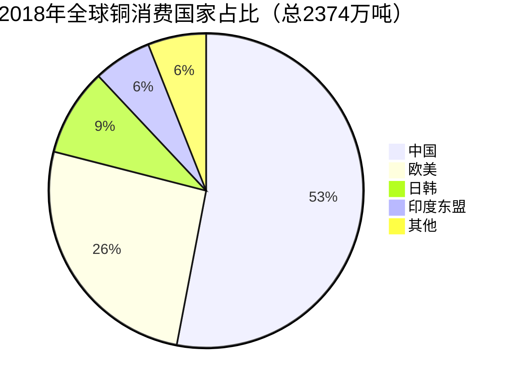

# 【睡前消息33】不是准备骚乱就是在骚乱，香港要变成智利吗？

2019年10月25日睡前消息文字版第33期

::: details 【Bilibili】不是准备骚乱就是在骚乱，香港要变成智利吗？
<iframe src="//player.bilibili.com/player.html?bvid=BV1sE41117bz&page=1&high_quality=1" scrolling="no" border="0" frameborder="no" framespacing="0" allowfullscreen="true" height=400 width=100%> </iframe>
:::

::: details 【YouTube】不是在骚乱就是在准备骚乱，香港想变成智利吗？
<iframe width="100%" height="400" src="https://www.youtube.com/embed/Qs6XbkVgsM8" frameborder="0" allow="accelerometer; autoplay; clipboard-write; encrypted-media; gyroscope; picture-in-picture" allowfullscreen></iframe>
:::

大家好，2019年10月25日，欢迎收看第33期睡前消息，静静介绍内容。

## 智利抗议活动持续升温 | 智利地理位置决定不能走制造业路线，香港人不愿去大陆工作只能骚乱

**最近两周，智利全国骚乱。和香港情况相似，智利这一轮骚乱也是从学生运动开始，也进入了破坏基础设施的阶段，所以中国媒体非常关注。督工你能分析一下智利的问题吗？**

智利骚乱的源头是一件小事，地铁一年涨了两次价，1月份涨了一次，最近要再涨一次，从800比索涨到830比索。不过比索的币值很低，按照骚乱之前的汇率，也就是3毛钱。

去年智利人均gdp1.59万美元，和福州差不多，明显高于成都和郑州。上海的GDP也只有2万美元，这么高的GDP，就算智利贫富差距有点大，老百姓也不会因为地铁涨3毛钱过不下去。所以智利的问题必然是是民间积怨已久，不是几毛钱的票价问题。

10月22日，智利宣布地铁不涨价了，同一天香港政务司司长宣布彻底撤回修例，陈同佳也宣布要去台湾投案自首，但香港和智利的局势不像能立即缓和的样子。所以，无论是地铁票价，还是香港逃犯条例，都是表面原因，核心问题在于民间积累的矛盾太多。

**那智利骚乱的深层原因是什么呢？**

往下深挖，第一层原因是学生的负担太沉重。

智利号称12年义务教育，还给大部分高中生提供免费午餐，但是公立高中教育质量非常差。智利排名前一百的高中，只有两所是公立高中，其中一所的排名是99。私立高中的学费很贵，高中报名费三四万，入学后每年再交三四万人民币。前面提到智利的人均gdp相当于我们的东部省会城市，省会城市的普通家庭承受这样的学费也不轻松。

智利大学收费和高中学费差不多，但是学制普遍很长，普通本科毕业需要六七年，如果选了医学和法学，三十岁以前读完是运气好。所以，智利学生不用等到毕业，就能体会到可怕的社会压力，很容易因为一点小事造反。

2006年，左翼总统巴切莱特执政，智利高中生爆发了一次大规模抗议。智利高中校服颜色像企鹅，所以这次抗议被称为企鹅革命。

五月底企鹅革命达到顶峰，学生加上工人号称80万，智利总人口也只有1800万。那一次，高中生们开始的诉求和这一次差不多，减免公共交通费用，免收50美金的高考报名费。最后对抗越来越激烈，学生要求搞全面教育改革。

2011年，右翼总统皮涅拉上台，当年上街抗议的高中生们读大学，发现智利的大学比高中还要命，又上街抗议。

2011年的抗议一开始很和平，上千学生在总统府周围，穿着超级英雄制服相互接吻。

但抗议很快升级成暴力冲突，学生拿出燃烧瓶，和警察对打。

大学生这次抗议的焦点是学费太贵，大学赚钱太多。同时他们还要求教育部长下台，因为这个教育部长自己就是一所私立大学的创始人，和其它大学的老板也有利益关联。抗议的结果是换教育部长，承诺从卖铜矿的收入拿出40亿美元补贴教育。

不过皮涅拉总统自己就是大资本家，大买办，一点也不喜欢平民学生的立场。上世纪八十年代，皮涅拉给Visa卡和万事达卡当智利代理，后来是苹果公司智利的总代理。后来他的投资渗透到传媒、航空、体育、房地产多个领域，身价几十亿美元。

所以，皮涅拉在让步的同时，又给私立大学的营利活动提供合法性。那个被解雇的教育部长也没回家，改成社会发展部长。所以抗议一直持续到了2013年，此前的左翼总统巴切莱特再次上台。她亲身经历过2006年的大规模抗议，知道学生们不会满足于小的改革。

所以，她落实大选承诺，降低大学学费，禁止大学变成企业，还承诺对到2017年拿出50亿美金资助免费教育，通过向企业加税筹集资金。但是，智利社会的抵制很厉害，2015年智利法院驳回了她的大部分计划，所以学生的怨气越来越重。

2018年，又轮到那个右翼总统皮涅拉上台了，他三月份宣誓就职，四月份就重新允许大学成为企业。当时智利就有抗议，不过暂时没闹大。今年1月地铁涨价，学生忍了，这次再涨价，学生心理上受不了，新账老账一起算，所以升级成全国性运动。

**右翼总统上台学生要抗议，但是左翼总统他们也不放过，为什么左右翼都不能满足学生的需求呢？**

如果毕业后工资高，就业环境好，无论左右翼总统他们都能勉强接受，大不了借贷款上学，毕业后还钱。但是智利的工资并不高，中位数是550美元，可以换算成圣地亚哥一套小公寓的租金，或者是每天两顿快餐。现在智利1800万人，720万在圣地亚哥都市圈生活，年轻人都要去这里找工作，吃住都很艰难，挤不出钱还贷款。智利1/4的人口还不起债务，主要原因就是自己和子女的学费。

现在智利的年轻人基本都要读大学，在读的本科生有七十万，占总人口的4%，换算到中国就是5400万在校本科生。但实际上中国现在只有1200万本科在校生。所以，智利学生问题，就是这一代年轻人的全部问题。

而且就算是550美元的工资， 年轻人找到这样的工作也不太容易。智利的青年失业率最高到过24%，最近十年也始终维持在18%左右。就算左翼总统把学费全免了，他们也未必能满意，右翼总统上台就更要抗议。所以智利年年有抗议，今年特别多。

**在整个拉丁美洲，智利经济排名第一，去年还有4%的增长，为什么给年轻人的机会会这么少呢？**

因为智利的经济太依赖开矿了。长期以来，矿业占智利GDP的比例保持在20%左右，相当于制造业占德国和日本经济的比例。

按照中国商务部的数据，去年智利矿业生产达到空前的水平：

[商务部：2018年智利矿业产量达到历史峰值](http://www.mofcom.gov.cn/article/i/jyjl/l/201902/20190202837417.shtml)

但是智利1000多万劳动力，只有20万在矿业，为2%。

[路透社：2018年智利采矿业从业人数上升4%](http://www.cbcie.com/news/803018.html)

所以，在智利，极少数矿业老板赚钱，少数矿工有实体经济就业，其他人只能给这些人做配套，基本是服务业。服务业的医学和法学比较赚钱，是热门专业，其他绝大多数智利年轻人分享不到矿业的利润。所以智利的贫富差距大，就业不足。

而且智利的矿业非常依赖于外国需求。中美贸易战只要对铜的需求产生一点点影响，智利的社会就会动荡。无论左翼右翼，只要改变不了这个事实，谁的总统也做不长。

 

 

**那智利难道不能发展一下别的产业，不那么依赖矿业吗？**

智利经济完全依赖矿业，除了资源丰富以外，重要原因是地理位置。

工业是一种需要复杂产业链的产业，大多数产业链既需要廉价的运输成本，又需要多国配合。比如说，中国造的零件，可能会送到韩国组装成一个分系统，再运到欧洲变成完整的机器，装船卖回中国，以后二手货再卖给朝鲜越南。这期间，同一个零件，要从港口和轮船进进出出好几次。

海运是很慢的运输方式，大家都不希望离主流的交通网太远，自从欧洲工业革命以来，工业区都出现在北半球一个环状地带。离开这个环，物流成本指数上升，就很难融进现有的产业链。

所以，南半球的国家，尤其是智利这种被甩在世界边缘的国家，最好不要指望加入复杂产业链，而是应该制造那种只运输一次的产品，比如说矿产品和农产品。智利挖铜矿，澳大利亚挖铁矿，新西兰养牛，智利种大樱桃都不错，搞其他的东西就不行。比如说，智利虽然自己需要大量的采矿机械，但绝大多数机械都要进口，因为如果自己造，无论和外国产业链怎么配合，也竞争不过北半球的国家。

最近几年，智利的矿业产量虽然上升，但随着采矿技术的进步，需要的人力越来越少。本来这部分减少的岗位，会增加到机械电子和化学工业方面，而且是蓝领矿工变成白领工程师。但是，岗位减少在智利，增加在东亚或者欧美，智利人又被国界限制在南美，所以社会不稳。

面对这种经济格局，政府搞福利社会，经济减速；搞自由主义，贫富差距大，是个典型的两难情况。左右翼总统轮着上，其实是谁也搞不定的意思。铜矿挖一吨少一吨，智利还是多种点大樱桃好。

**前面你提到香港和智利的问题有点相似，能具体比较一下吗？**

智利矿业占20%的gdp，雇佣2%的人口。香港金融业占18%，雇佣6.5的人口。其他所有人都围绕这么一点人口吃饭，再怎么努力，也只能提高名义工资，实际购买力是升不上去的。因为只有金融业从外面持续换物资回来。内部折腾，可以把服务业做的精细一点，物资不会增加。

香港这些年搞小政府，金融业和转口贸易赚的多，拉高本地物价，反而激化和下层的矛盾，所以闹出来的事情和智利差不多。如果把香港和智利烧地铁的照片放到一起，我猜很多人看不出区别。如果说有区别，智利因为离北半球太远，要自己造一代机器的备件，所以还有一点制造业，香港是完全没有工业，问题更严重。

当然，和智利相比，香港其实有两个优势可以化解问题。首先，香港的土地属于北半球经济圈，还有港口。新界那么多土地，要是放在深圳，搞工业园可以容纳一两百万技术工人，过去香港也曾经是轻工业中心。其次，香港属于中国，中国是世界第一工业国，香港人就算本地不搞工业，也可以到内地打工，分享工业经济升级的好处。 

但是，香港的房地产行业锁住了土地；香港的特殊身份和优越感挡住了他们到内地工作，所以香港浪费了化解矛盾的机会。无论香港政治上怎么搞，如果没有暴力打碎这两个障碍，香港就不会好。

下一个话题。

## 郭敬明官司问题再次引发争议 | 郭敬明想打赢官司就不该走刑事诉讼

**最近郭敬明因为一档新综艺上了热搜，没想到网民八卦能力比较强，把他去年的法律问题翻出来，变成了新闻。**

**2017年，男性作家李枫发微博，指责郭敬明性骚扰自己，而且还对公司签约的男作者、公司的男性职员下手，甚至性侵犯。郭敬明直接去法院，以诽谤罪起诉李枫。**

**2018年终审结果出来了，法院认为缺乏罪证，驳回郭敬明的诉求，所以郭敬明一方也很低调，假装什么也没发生。现在网民把判决书翻出来了，嘲笑郭敬明，督工你怎么看？**

这是个很有代表性的的法律问题，但是因为郭敬明自带流量，大家的讨论重点偏了。

我先说结论，郭敬明上诉被驳回，但在事实上不算输了，只能说李枫的说法既不能被证实，也不能被证伪。我们看法官是怎么说的。

网友的关注点在于“缺乏罪证”，既然事情闹上过法庭，我们就来看看裁判文书的原文。

一审法院认定郭敬明的指控“缺乏罪证”，但郭敬明认为：自己已经提交了足够的证据；如果不足，法院应该说明要补充哪方面的证据。

二审认为，郭敬明提交的证据，只能证明李枫在微博上发表了文章，浏览和转发数据都达到了一定标准，但对文章描述的事实没有分析。

回头看李枫的微博文章，虽然很刺激，但是如果真要取证，难度很大，不管证实还是证伪都不容易。

::: details 李枫的微博文章《关于郭敬明。致所有人》 📄

李枫 2017-08-21 阅读数：2171万+

我从小热爱创作，渴望出版自己的小说，2008年的时候在网上看到郭敬明和长江文艺出版社一
起举办的“第一届文学之新全国新人选拔赛”，那时知道郭敬明抄袭案败诉，对他没有好感，但是看上去他依然在网络上生龙活虎，并且长江文艺出版社也拉来了许多中国著名作家加持，这两点影响了我的判断，参加了比赛，签约了郭敬明公司。

之后出版了第一本书《燃烧的男孩》，开始参加签售，那时刚好郭敬明的小说也出版，因此一
起去签售。

在四川成都的签售，我被安排与一位工作人员一起住，郭敬明自己住一个房间，当天他说他不
想一个人住，让我和他一起住，那时我是将他当作一个前辈来看待的，那时的网络上也有关于他性取向的风言风语，但他自己从未承认过，因此那时的我不能确定。

我和他一起住，房间有两张床，我们各睡一张。

当天晚上他就来到我的床上，把手放到我的身上，我抓住他的手腕，他尴尬地笑了一下，回到
了自己的床上。

第一天就这样相安无事了，我以为我的态度能够让他明白，结果第二天他仍不死心，居然还想
给我口交。恶心至极。

第三天我就不和他一起住了。

他已经对我构成了性骚扰和性侵犯，曾经咨询过律师，律师说目前中国的法律里，同性性侵犯
犯罪是空白，而且这样的犯罪取证困难。

郭敬明的世界是一个淫乱的世界，他经常性骚扰、性侵犯签约到他公司的男作者、公司的男性
职员，据我所知的就有五个人，我不知道的就更多了，在我知道的人里面，有一位，一个直男，一表人才，我很欣赏他，并且他当时有女朋友，有美好和稳定的生活，结果遇见这种事，他早已离职了，我为他感到可惜。

:::

所以法院驳回郭敬明的起诉，说诽谤罪不成立。

**那这个判例是不是证明我们可以随便说别人的八卦，只要不能证伪就不用担责任？**

这里的问题，在于郭敬明是以诽谤罪起诉，是刑事案件中的自诉案件。《刑事诉讼法》规定：“公诉案件中被告人有罪的举证责任由人民检察院承担，自诉案件中被告人有罪的举证责任由自诉人承担。”

对于普通公民来说，刑事责任是非常严重的惩罚，就算不坐牢，也会严重影响以后的个人发展，所以适用无罪推定原则。

> 第二百四十六条【侮辱罪、诽谤罪】以暴力或者其他方法公然侮辱他人或者捏造事实诽谤他
> 人，情节严重的，处三年以下有期徒刑、拘役、管制或者剥夺政治权利。
>
> 前款罪，告诉的才处理，但是严重危害社会秩序和国家利益的除外。
>
> 通过信息网络实施第一款规定的行为，被害人向人民法院告诉，但提供证据确有困难的，人民法院可以要求公安机关提供协助。

而诽谤罪成立必须同时具备几个条件，其中一是说假话，二是严重破坏他人的名誉。郭敬明必须证明李枫说的是假话，而且假话是李枫编造的，才有机会胜诉。

现在这个案子没有进入审理程序，就在前置审查程序卡住了。法院认为郭敬明的证据太差，不能强迫对方到庭受审，更不能要求李枫自证无罪，所以直接驳回了起诉，事情根本没有走到判决书的阶段，所以我们说是平手。

郭敬明如果真的想赢，这个案子就不该用刑事诉讼，而是用民事起诉，要求对方就侵犯名誉权道歉赔偿。 

《最高人民法院〈关于审理名誉权案件若干问题的解答〉》第七条有明确解释：

> “是否构成侵害名誉权的责任，应当根据受害人确有名誉被损害的事实、行为人行为违法、违法行为与损害后果之间有因果关系、行为人主观上有过错来认定。”

换句话说，名誉侵权的核心是名誉被损害的事实，以及和侵权行为之间的因果关系。至于言论是否属于事实，倒是次要问题。大多数明星维护自己的形象，都是走这个程序。

这几天当当网创始人李国庆和自己的妻子在微博上吵架，互相揭露私生活，曝出来的东西可能是真，也可能为假，而且都很难证实或证伪。在这种情况下，李国庆依然宣称要走法律程序，要发律师函，不意外的话，他就会发起民事诉讼，以侵害名誉权的名义要赔偿。

现在回头看郭敬明的起诉，不知道他为什么坚持要走刑事程序。也许是因为要出气，也许是 他请了一个同样情绪化的律师。总之，从他起诉那一刻起，就注定了不可能赢，当然也很难彻底输掉。不过，眼下裁判文书被网民翻出来，郭敬明在名誉上实际上再输了一次，可以说是最差的结果。

## 🔄 贵州米粉涨价问题 | 米粉店老板不是阶级敌人，不要煽动舆论，让政府超越法律胡来

[32期睡前消息的第二个内容](32.md#贵州牛肉粉集体涨价-相关部门：降回去-毕节市米粉店减量可以，涨价不行)，是贵州米粉店的涨价问题。督工你的观点是米粉店很难构成垄断，所以应该主要靠市场力量调节。我看了留言评论，很多观众表示，作为社会底层，从立场上就不赞同你的观点，你打算怎么回应他们？

💬

> **和了可可**：反对米粉涨价，支持政府干预，因为我是贫困阶级，不是小资。屁股决定脑袋

> **懦弱者的哀伤**：关于米粉涨价的事情，督工观点不赞同，颇有一种站着说话不腰疼的感觉

> **白鸦之羽**：何不食肉糜啊，督工，以后只能跳过所有关于底层小民的经济观点了，太过于想当然了，感觉督工对于底层人民的经济十分不了解

这几位观众对自己的阶级定位肯定有问题。我在32期里面说过了，每天早上花10元左右吃早餐的人，在整个中国都是中上层，在贵州尤其是。

> 💬 **用户太多取个名字真难**：督工说我是中上层……哭了😭

现在我再用数据证明一下。

2018年我国人均消费支出不到2万，其中食品烟酒合计5631元。我假设婴儿少吃的部分被烟酒抵消，直接除以365，是15块4毛钱。注意这是人均数，不是中位数，必然有超过一半的人每天饮食开支少于15元。

以中国人的习惯，早餐占一天的比例是低于1/3的，所以早餐的人均开支应该在4元左右，中位数可能要低于3元。换算成各地物价，这就是一个菜包子加一个肉包子，馅还不一定是什么好肉。至于比平均数低的那一半人，恐怕只有馒头和自己家的咸菜。所以，前一阵子榨菜销量上升，有人说消费降级，我就说他们没见过世面，能吃袋装榨菜明明是消费升级。

在这个前提下，只要你去早餐店吃粉，你就比大多数人的生活强。如果你吃肉汤粉，你就站在中国的前1/4。能吃十块上下的牛肉粉，说中上阶层可能还算低估，因为我们的统计局把前20%的富人称为高收入群体。

在这个前提下，逻辑我们可以讨论，但阶层定位是很清楚的。去年贵州人均收入排名全国倒数第三，能吃牛肉粉的群体自诩穷人不太合适。我看评论里面也有很多朋友很清醒。

💬

> **凌曦云上**：又一次看弹幕受到了惊吓，20块早餐不算贵？我这每天5块热干面搞定，有时甚至恨不得两个粉丝包子凑合。这些没房贷车贷压身的孩子是真的幸福
>
> > **江山谁守**：5块钱，一个豆腐脑3个烧饼
> >
> > **伟大导师林登万**：毕业后摔打一个月就都老实了hhh

其次，绝大多数米粉店也不是各位的阶级敌人。一个县城米粉店，三四个人，做好了每个月能赚几万，似乎比工薪阶层高。但收入不能这么算。

首先，上班不需要投资，开店需要投资，投资就有亏损的可能，米粉店的收入要有一部分用来抵偿风险。

其次，米粉店的劳动时间非常可怕，一般起码12小时，16小时也不稀奇。这次黔西县被处罚的那家米粉店，界面新闻的记者跑到现场去调查了，一家三口就是早晨6点干到晚上十点半，全年无休。就算不按劳动法的几倍工资算，直接用收入除以劳动时间，他们每小时的收入也比8小时工作制，一周休5天的人低64%。

[界面新闻：【特写】涨价风波里的贵州牛羊肉粉馆老板们](https://www.jiemian.com/article/3606767.html)

第三，经营米粉店的家庭需要给自己缴社保，他们的收入还要扣除社保，和工薪阶层拿到的工资比较。

所以，大多数县城夫妻小吃店，实际上的收入，能赶上工资三四千的工薪阶层就不错。之所以工薪阶层不去抢他们的生意，主要就是不愿意担这份风险和辛苦。

很多人猜测，说开米粉店有很多门槛，比如被砸店，比如说被同行断了供应链什么的。对此我只能说，今年国家办的最有模样的一件事，就是打黑除恶，举报有奖，尤其喜欢收拾这种小型街头黑社会。谁要是在县城看到米粉行会动用暴力，我先恭喜你要发一笔小财。否则，仅仅羡慕米粉店赚钱是没用的，先想想人家过的是什么生活。

另外，很多人说吃米粉是固定生活习惯，是地方文化，其他食品对米粉没有竞争。对此，我只能说B站的平均年龄有点小，没见过电磨普及以前的时代。

我虽然不到40岁，也推过石磨和碾子，在北方磨一点杂粮面。我不知道观众里面有没有人用石磨、石臼做过米粉米线，反正只要你试过一次，就知道吃米粉当早饭，一定不是普通家庭的传统习惯，而是70年代农电网络建设的结果。电磨和搅拌机普及以后，米粉制作成本越来越低，相对工资越来越便宜，不断降价，这才有了普通人吃得起的牛肉粉。贵州花溪牛肉粉就有明确的发明脉络，70年代才出现。

对于这个问题，我今天不打算展开说，之前我在B站另外有一个100分钟的视频专门谈过中国食物的起源，标题是《保卫我们的现代生活》。

::: details 【Bilibili】【观天下讲坛第15期】马前卒：保卫我们的现代生活！

<iframe src="//player.bilibili.com/player.html?bvid=BV1PW411e7Ct&page=1&high_quality=1" scrolling="no" border="0" frameborder="no" framespacing="0" allowfullscreen="true" height=400 width=100%> </iframe>

:::

在这里，我谈米粉的历史，是想告诉大家，不要总用传统去装饰自己的消费习惯，最起码要知道米粉店老板和你一样传统，大家的利益都值得尊重。当年米粉降价，才产生吃米粉的文化，现在米粉店老板涨了一块钱，你对此不满，最好的办法是自己开一家店，去赚自己想象中的超额利润，而不是煽动舆论，让政府超越法律胡来。

**“不依法治国，国将不国。”**

这次习水那几家没有串通的米粉店，就被舆论搞的很冤枉。

最后是往期内容回顾时间。

## 🔄 薛蛮子失联了

7月30日[第六期睡前消息](6.md)，我们报道了薛蛮子在柬埔寨圈钱计划，网易财经报道，薛蛮子同学失联了，多名委托他投资的金主都要找他。在此我们也替投资人转发一次，希望薛蛮子同学看到寻人启事以后早点出现，果断担负起应有的责任。

[网易新闻：薛蛮子失联？投资人发寻人启事 希望协商退款事宜](https://www.163.com/money/article/ES8AR5QE00258105.html)

## 🔄 左手王配图：蛋卷拒绝上工、淮安弟中之弟

[第32期睡前消息](32.md)以前，观视频工作室发了一条花絮，蛋卷同学跳到房顶拒绝上工，在罐头的诱惑下才肯回来。有读者回复了四个字，精确地复述了这个场面。

💬

> **Celestron D：你立字据！！**（👍1924）
>
> > **星KZ的鱼→←♂**：为什么你可以发图片
> >
> > **zhangdapaooo**：把你的表情包交出来
> >
> > **明月清山笑**：有内味了

我们请左手王同学出手，把读者的创意变成一张更具体的图片，欢迎读者提供更多的创意。

还有一位网友等不及左手王同学来画，主动为[29期](29.md)的行政区划讨论贡献了一组图片。

https://weibo.com/5387972927/IbI0ljnfC

对此，我们也非常欢迎。大家如果还有创意，可以@一下马前卒工作室，或者观视频工作室。我们共同创作。

## ⏩ 预告：观视频年终活动

最后，我向大家做一个预告，12月7日、8日，观视频工作室在上海喜马拉雅中心举办年终活动，我的场次在8日下午。作为一个在20世纪、21世纪各生活了19年的中年人，我打算和大家聊聊两个世纪的观感，描述一下我在20世纪想象的21世纪，以及我在21世纪总结的20世纪。欢迎跨世纪的观众扫码参加活动，更欢迎21世纪的00后到场。如果名额已满，各位还可以收看网上直播。

这是我第一次参加观视频的年度活动，希望睡前消息和观视频工作室可以一直合作，第一步先合作到23世纪再说。 

---

好，本期睡前消息到此结束，我们周日再见！