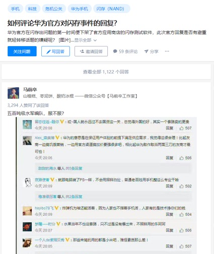
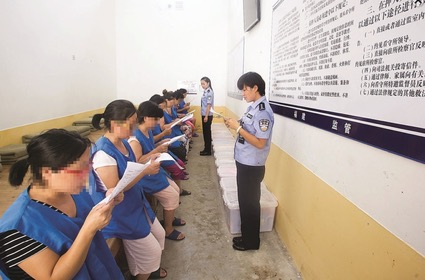

# 【睡前消息50】关于“251”事件，华为应该自己来解释清楚

2019年12月3日睡前消息文字版第50期

::: details 【Bilibili】关于“251”事件，华为应该自己来解释清楚
<iframe src="//player.bilibili.com/player.html?bvid=BV1RJ411q7xC&page=1&high_quality=1" scrolling="no" border="0" frameborder="no" framespacing="0" allowfullscreen="true" height=400 width=100%> </iframe>
:::

::: details 【YouTube】关于“251”事件，华为应该自己来解释清楚（年龄限制）
<iframe width="100%" height="400" src="https://www.youtube.com/embed/hatpB0DrTt0" frameborder="0" allow="accelerometer; autoplay; clipboard-write; encrypted-media; gyroscope; picture-in-picture" allowfullscreen></iframe>
:::

大家好，欢迎收看马前卒施工队的睡前消息。7月12日睡前消息第1期登陆b站，到今天是第50期。过去5个月，各位观众的热情支撑了我们的工作，感谢大家的支持。

[第一期节目](1.md)的播放量马上就逼近100万了 ，现在回顾一下，最热的内容是加拿大政府卖大麻亏钱的故事。现在让静静介绍一下加拿大政府贩毒的最新进展。

## 50期过去了 加拿大滞销的大麻更多了

**11月23日，英国《金融时报》报道，截止8月底，加拿大全国大麻库存已经接近400吨，可以满足两年半的需求。督工你怎么看待大麻滞销的现实。**

这就是加拿大政府官营大麻扭曲市场的结果。官营大麻要赚钱，又觉得自己是合法毒品，所以敢于要高价。私营贩毒集团被这个虚高的利润刺激，纷纷加入大麻生产，结果就是供大于求，大家一起积压。

按加拿大统计局第三季度的数据，官营大麻每克7.82美元，黑市每克4.27美元，人民非常理性地选择了私人大麻。按加拿大丰业银行（Scotiabank）的预测，黑市大麻占了今年71%的销售额，换算成重量就是82%。

[The Motley Fool：The Scariest Statistic Pot Stock Investors Will Ever See](https://www.fool.com/investing/2019/11/03/the-scariest-statistic-pot-stock-investors-will-ev.aspx)

[The Motley Fool：Canada's Black Market to Control 71% of Marijuana Sales in 2019](https://www.fool.com/investing/2019/02/09/canadas-black-market-to-control-71-of-marijuana-sa.aspx)

[第一期睡前消息](1.md)我们分析过，个人生产大麻的门槛很低，加拿大政府只控制流通环节，搞不了专营。现在官营毒品店把价格抬到这么高，影响产量最大的因素就是成本。一般认为，规模化种植大麻，成本大概是每克16美分，所以加拿大政府认为自己贩毒肯定能赚钱。但是，私人小块土地种大麻的成本也不高，就算用花盆种，也就是几十美分。官营大麻喊价7美元，结果激发了全民种大麻的热情，所以无论是政府还是私人，大麻都积压。8月底那个400吨的数字，是月销量的30倍，现在可能又涨了几百吨。

[MJBizDaily：‘No longer a shortage,’ Canadian cannabis industry group declares](https://mjbizdaily.com/no-longer-a-shortage-canadian-cannabis-industry-group-declares/)

[BNN Bloomberg：Cannabis Canada: Aurora CEO sees 'carnage' for Canadian pot sector, eyes U.S. market re-entry](https://www.bnnbloomberg.ca/cannabis-canada-aurora-ceo-sees-carnage-for-canadian-pot-sector-eyes-u-s-market-re-entry-1.1355408)

### 政府下场打价格战，扩大潜在吸毒群体，证明国营毒品是个错误想法

**在第一期节目中，我们提到加拿大贩毒亏损的原因之一是网点覆盖率太低，建设成本太高。有观众建议他们学习淘宝京东，上网贩毒，这个方案怎么样？**

加拿大政府学了，但没什么用，网店销售额勉强超过1%，因为新老顾客都不喜欢。

 

第一次买大麻的人，需要的不仅仅是商品，还要要亲眼看看大麻长什么样，听人现场讲解一下经验，所以网店不行。经常抽大麻的人，对品质是有要求的，网购闻不出气味，所以也需要现场订货。

 

还有一个因素，就是加拿大人比加拿大政府更在乎脸面。网购会留下痕迹，可以证明一个人买过大麻，很多国家会拒绝买过大麻记录的人入境。加拿大联邦隐私专员公开对国民提建议，尽可能用现金买大麻，所以网店没有竞争力。搞线下交易的话，国营公司肯定比不过私人网络，所以合法大麻卖不动。

[Global News：Pay cash for pot if you can, federal privacy commissioner urges](https://globalnews.ca/news/4773407/privacy-commission-pay-cash-for-pot/)

[Reuters：As 'Cannabis 2.0' kicks off in Canada, industry strangled by limited retail outlets](https://www.reuters.com/article/us-canada-marijuana-anniversary/as-cannabis-2-0-kicks-off-in-canada-industry-strangled-by-limited-retail-outlets-idUSKBN1WW0DH)

为了节省建零售网点的费用，安大略省已经打算允许私营零售店卖大麻。但这又回到第一期的问题，怎么保证这些店铺不趁机进私营大麻，打着合法的名义卖，最近几个月也没看到新方案。

[BNN Bloomberg：Ontario to allow private sector to handle legal pot distribution](https://www.bnnbloomberg.ca/ontario-to-allow-private-sector-to-handle-legal-pot-distribution-1.1350914)

[BNN Bloomberg：Cannabis Canada: Ontario sets plans to let private sector handle cannabis distribution](https://www.bnnbloomberg.ca/cannabis-canada-1.1351119)

[🍃Cannabis NB：About Us](https://www.cannabis-nb.com/about-cannabis-nb/)

最后还要说一下外部因素。从人口地理上说，加拿大是不存在的，只有贴着美国边境的一条郊区。

 

美国很多州不管大麻，已经有10个州对大麻完全开放，这张图中深绿色的地区，很多紧靠着加拿大。所以加拿大管得了自己管不了别人，这个官营生意做不成。

[A Portrait of Canadian Youth: March 2019 Updates](https://www150.statcan.gc.ca/n1/pub/11-631-x/11-631-x2019003-eng.htm)

https://cannabisreportworld.com/united-states-of-weed/

 

所以，最后加拿大国营公司还是用了最笨的办法，打价格战，准备在魁北克推出大麻烟丝，1盎司125.7加元，1克3.37美元，比黑市还便宜。

 

[The Motley Fool：The Scariest Statistic Pot Stock Investors Will Ever See](https://www.fool.com/investing/2019/11/03/the-scariest-statistic-pot-stock-investors-will-ev.aspx)

[The Motley Fool：Another Day, Another Marijuana Production Cut in Canada](https://www.fool.com/investing/2019/11/29/another-day-another-marijuana-production-cut-in-ca.aspx)

 

 

不过，我估计这一招也没有好结果。黑市大麻贵，原因是要跟着合法大麻的价格走。反正成本那么低，政府降价，私人也可以降价。但是，官营大麻，目的除了赚钱，至少当初还许诺要减少犯罪，避免吸大麻的人升级到更厉害的毒品。现在政府亲自打价格战，导致潜在的吸大麻人口迅速增加，无论最后是不是能赚钱，都证明国营毒品是个错误想法。

### 💬 回应观众留言：加拿大错不在国营大麻，而在不够亏钱？

**9月末，有一位观众在第一期视频下面留言，用瑞士的经验提出了一个另类思路，说加拿大搞国营毒品不是错，错在居然想赚钱。**

💬

> **@waterloo1989**：加拿大搞的是大麻合法并不是毒品合法化，瑞士才是真正的毒品合法化。国家免费给无法戒毒的瘾君子提供高品质海洛因，而且通过其他途径获取毒品依旧是犯罪行为。这样毒贩在黑市卖得再便宜也没有生意了，瘾君子也脱离了毒贩控制，毒贩只能改行。于是就不会再有新增的吸毒人口，因为毒贩不干了，瘾君子也不会再受到毒贩威胁去怂恿亲友吸毒，更不会为了凑毒资而去偷去抢，不会因为吸食劣质毒品而危害生命。毒品所引发的犯罪消失了，社会对瘾君子的抵触和歧视也会下降，大多数瘾君子能和正常人一样工作生活。这些并不是我的主观臆测，而是在瑞士实行毒品合法化以后真实发生的改变，瑞士从饱受毒品问题伤害到现在成为毒品治理最成功的国家之一也仅仅用了二十多年，瑞士才是真正毒品合法化政策的试点先驱。
>
> > **@cloverseeker** 回复 **@waterloo1989** ：需要如此精密环环相扣的政策和管控，可能这也恰恰说明了为什么瑞士这样的小国可以成功。当国土面积和人口分散到一定程度，这种管控还能不能在成本可控的情况下精准的凑效就是一个很大的问题了，尤其是上面说的这一整套方法，一旦出现一个漏水的地方就会变得一发不可收拾。有时候问题只是简单的规模放大，就会导致整个解决的逻辑和方法都天翻地覆。管理一个县和管理一个国家的方法截然不同，我想加拿大政府在这方面失败的原因恰恰是没有考虑到自己国家的规模和人口分散程度所导致的政策成本爆炸。
> >
> > **@waterloo1989** 回复 **@cloverseker** ：所以说加拿大的问题并不是卖大麻亏钱，而是他们亏得还不够多，政府要把价格降低到黑市倒闭才行。政府的目的应该是严格控制新增吸食人口，国营垄断大麻产业的好处就是能建立数据库，只向成瘾者出售大麻而且限量购买，同时严格禁止个人大麻交易和转让。只要做好了以上几点大麻问题就完美解决了，黑市赚不到钱消失了，成瘾人群能低价获取自用量大麻就不会闹事，未吸食者由于政府数据库严格监管和黑市的消失很难再接触到大麻，也不会有更多的瘾君子出现。

**既然大麻和其他毒品的成本都很低，如果加拿大政府像瑞士那样彻底免费供应，让毒贩子都饿死，没有动力扩大吸毒人口。是不是效果更好呢？**

大麻是软性毒品，也是其他毒品的带路人。就算不引入其他毒品，大麻自己的浓缩提炼物致幻效果也更强，更容易成瘾。比如说用大麻提取油做成烟弹，做成口腔喷雾，做成大麻蜡，都比大麻本身更受欢迎。

::: details 认识大麻、大麻烟弹、大麻蜡 🏞️

:::

大麻中的强效致幻物质，主要是四氢大麻酚（THC）。做成提取物后，可以直接升级成强效毒品。如果政府免费供应大麻，或许可以打击私人大麻农场，但也会刺激贩毒集团产业升级的。所以不可行

《2019年世界毒品问题报告》14页，联合国毒品和犯罪问题办公室

https://wdr.unodc.org/wdr2019/prelaunch/WDR2019_B1_C.pdf

现在加拿大国营毒品公司库存积压，也在努力开发大麻衍生品，他们努力的方向是降低大麻含量，生产 “软”毒品，比如含大麻的糖、饮料、甜点等。去加拿大旅游的人要小心了，不要随便吃糖，避免回国的时候被海关拦下来。

::: details 含大麻的糖、饮料、甜点举例 🏞️

:::

[News Frontier Data：Growth of the Canadian Legal Cannabis Industry](https://newfrontierdata.com/cannabis-insights/growth-of-the-canadian-legal-cannabis-industry/)

中国外交部已经反复提醒大家这一点了。

### 烟草与大麻有别 | 香烟应该算作有害的技术型奢侈品

**7月19日[睡前消息第3期](3.md#武汉出台“最严控烟令”-国家改变“卖烟的人控烟”的政策)，督工你提到了国内禁烟和烟草专卖问题。有的国家把烟草和大麻都归类为软性毒品，为什么加拿大国营大麻亏损，中国烟草专营就能赚钱呢？**

从生产方式来看，加拿大官营大麻和中国烟草专卖的确有点像。加拿大政府管不住私人种大麻，中国政府基本不管私人种烟草。加拿大政府控制不了民间大麻买卖，中国烟草专卖法第七条规定，其他晾晒烟可以在集市贸易市场出售。农民种烟叶，晒烟叶自己抽，甚至卖给别人都是合法的。之所以加拿大政府卖大麻亏钱，中国政府卖烟草赚钱，主要原因还在于大麻和烟草的化学性质有区别，需求曲线表现不一样。

 

从对人体的效果看，大麻是强效致幻剂，吸大麻会影响人的判断力，所以，虽然不同大麻的品质有差异，但核心指标还是对神经系统的冲击效果。私人制造的大麻，对吸毒者来说就算比政府卖的差，也差不了多少，所以稍微便宜一点就能抢走市场。

 

烟草的致幻效果没有那么强，吸烟的人是在神智清醒状态下享受烟草的，所以口感和气味非常重要。现代烟草工业从选种育种开始，就和私人旱烟拉开了差距，烘烤、烟丝加工、添加香料、过滤嘴工艺，每个环节的研究都非常深入，需要一大群高级工程师来控制。所以，就算是很便宜的工厂香烟，对烟民的吸引力也大于旱烟，让他们愿意出高价，给政府额外交税。

 

世界上有很多地方，政府是不专营烟草的。但即便是这种地方，旱烟和私人卷烟也斗不过大烟草公司，比如说台湾省，2002年就率先放弃了烟草专卖制度，但大家还是要买进口品牌香烟抽，只是想逃关税而已。7月26日[第五期睡前消息](5.md#蔡英文随员走私一万条烟-台湾省公务员系统走私是常态)，我们分析了台湾民进党和国民党官员利用“国安局”走私香烟的新闻。这个例子说明，就算不专营，香烟也是一个小资本做不大的技术密集型行业。

 

所以，大麻是典型的毒品，香烟应该算做有害的技术型奢侈品，中国政府只要管好大烟厂，就能收到税。

### 完全禁烟比较难，重点在控烟 | 进一步提高烟草税是大趋势

**督工你在[第三期](3.md#武汉出台“最严控烟令”-国家改变“卖烟的人控烟”的政策)提出的观点是，工信部管理的烟厂，主要目标是赚钱，如果同时让工信部负责禁烟，吸烟的人不会减少。从加拿大卖大麻的案例看，督工你怎么看中国的禁烟行动？**

过去中国政府把烟草行业当成税务局，应该说是有一定合理性的。1981年，中国决定实行烟草专卖制度，那一年中国人均预期寿命67.8岁，大多数劳动者是干体力活，60岁就会失去劳动能力。所以，无论是看人均寿命，还是劳动者的工作能力，烟草的影响都不大，反而可以缓解相当一部分体力劳动者的疲劳。我小时候生活在矿区，对矿工下班后吸烟休息的场景记忆深刻。

八十年代甚至有烟草公司企图和药厂合作，制造能治病的香烟。

 

但现在21世纪已经20年了，中国人均预期寿命延长到76岁。世界卫生组织估计，到2025年，我国每年肺癌死亡人数可能会达到100万。如果吸烟率不下降，到2050年，中国每年与烟草相关的死亡人数将增至300万。放纵吸烟不符合人道主义精神。

[知乎·翱宇：肺癌发病率全国第一，最大元凶是什么？](https://zhuanlan.zhihu.com/p/31245437)

[果壳·日色提：三分之一中国年轻男性将死于烟草](https://www.guokr.com/article/440823/)

[（Web Archive）世界卫生组织中国代表处·媒体中心：烟草介绍](https://web.archive.org/web/20180608010922/http://www.wpro.who.int/china/mediacentre/factsheets/tobacco/zh/)

 

 

考虑到退休年龄将来必然提高，中国交税的劳动力数量也会因为肺癌而减少，烟草专卖在财政上算可能也要亏本。政府不会做亏钱又不人道的事情。

 

[澎湃号·西部城事：卷烟产量连续三年降，中国人为何越来越不爱抽烟了？](https://www.thepaper.cn/newsDetail_forward_2663237)

 

2015年，中国把烟草税从5%提至11%，算上专营利润，也就是25%。但在孟加拉、新西兰等国，烟草税已经达到75%以上，中国的税率是很低的。所以，完全禁烟可能比较难，但进一步提高税率，肯定是中国烟草行业的大趋势。

## 华为正式回应李洪元251事件

### 督工谈华为“海军”

**[上一期](49.md#黑糖奶茶和麻辣烫成为韩国最受欢迎食物-中国大陆城市化工业化进程，引领东亚饮食文化，是必然结果)，观众留言和弹幕有两个热点，一个是因为我说错了一句话，把2019年说成了二十年代末，这里我要对观众道个歉。**

**另外一个热点，就是华为李洪元251事件，还有人怀疑我们办公室就有人是华为HR赶出来的，签了保密协议，所以不敢说话。督工你能回应一下观众的诉求吗？**

作为媒体人，一项重要工作就是帮助观众保管记忆，视野不能局限于最近几个月的舆论场。在谈251事件之前，我要回顾一下华为的舆论形象。

 

中国很多大企业都有公关问题，有的是因为产品造假，让用户不满；有的是因为对员工苛刻，导致其他企业的雇员也心有余悸，一起抗议。但一般说来，压榨雇员往往是为了满足用户，欺负用户是为了掩盖高级雇员的错误，所以大多数企业不会同时犯这两方面的错误。

 

只有华为，在贸易战激化之前，两方面同时惹麻烦，闪存虚假宣传激怒了用户；8年奋斗条款和34岁下岗事件让整个IT行业产生恐慌。而华为的对策是不认错也不解释，派出中国数量最多的水军去骂人。以至于别的公司和单位的马甲叫水军，华为的公关马甲叫海军。我过去在知乎有个帖子，还保存了华为海军的战绩：

 

 

 

 

华为的网络形象之所以在过去一年快速提升，不是因为这家公司忽然学好了，而是因为特朗普制裁，让加拿大扣住孟晚舟，在更大范围内激发了中国人的共情心，用中美矛盾掩盖了华为之前的问题。

 

昨天是孟晚舟被扣一周年，上周中美双方都宣布贸易谈判取得了很大的进展，特朗普这一波助攻也该到半衰期了，所以华为的公关问题重新露出水面。无论有没有251天坐牢事件，只要特朗普不帮忙，华为公司的对内形象近期一定会出问题。

 

当然，我也不是觉得华为是一个坏公司，我的手机是华为的，之前华为公司的雇佣制度引发争议，我多少还替他说过几句话。

 

 

我只是觉得，一家血统纯正的资本主义企业，正常经营给国家交税就可以了，追求利润的行为就不该套上道德光环，否则别人看着虚伪，它自己做生意也别扭。

**这次李洪元事件华为又扮演了什么角色呢？**

251天坐牢事件，这首先是一个劳资冲突问题。李洪元认为自己从2005年给华为干活，不能用普通的手段解除合同，但华为认为，依据“奋斗者条款”，咱们的合同每八年清空一次，所以最多有八年的合同，补偿标准不能超过八年。

 

对于这一点，我暂时不做结论。感情上我支持个体劳动者维权，但也要注意到，劳动者要求长期雇佣权，对抗的不是公司，还有新来的其他劳动者。有人觉得自己在一线城市干到中年，就应该长期占据这个岗位。但还有更多的年轻人要发展，要摆脱小城市停滞的社会，他们很愿意和这些中年人竞争工作。如果没有这些年轻人，大公司也不会和现有的员工重签合同。

 

李洪元自己当初来华为，就是因为老家的工资是2000，华为能给9000。现在新一代的李洪元来了，如果用长期合同阻止这些年轻人来竞争，我觉得不是一个妥善的立场，至少不能让一家私营企业承担同时保护两个人群发展权的责任。如果国家要保护，可以多收企业的税，但不能在法律之外提要求。

 

我们换个思路，如果一个国企员工、一个公务员高调宣布，我在这个单位努力了十年，所以接下来我无论努力不努力，单位也必须给我终身雇佣的保证，让我轻轻松松到退休，这种言论虽然是实话，但他肯定会被网络言论喷死。公务员和华为员工，最大的区别，就是普通网民知道公务员发工资要靠自己交税，不希望终身雇佣制养太舒服的干部。所以说，劳资问题太复杂，今天我先略过，因为这也不是问题的重点，重点是法律和滥用法律工具的问题。

### 中国取保候审制度形同虚设

关于李洪元事件，今天互联网上有一个新段子：

上学985，工作996，离职035，维权251，发帖404。整个链条，引发最大关注的一点，当然是维权251。

 

我们要注意到，从头到尾，李洪元并没有被判刑，他被关押251天，始终是以嫌疑人身份在坐牢。虽然他被公安局刑事拘留了，而且检察院批准延长侦察羁押时间，但是我们国家是法制国家，疑罪从无。没有法官判决，哪怕一百万人指认，哪怕是华为这种带着光环的公司举报，他也只能是嫌疑人。公安局和检察院在这方面可以发表自己的意见，但只要法官不判决，他们没有一丝一毫的决定权。这个原则如果不能贯彻到底，国家就危险了

 

嫌疑人的身份等于普通公民，享有一切权利，那么问题就是，我们为什么要把普通公民关押大半年，连他的爷爷去世也不许回家探望。最后还要全体人民出钱，替少数人补偿这个本来就不该有的错误。这里就必须提到一个我们的制度缺陷，取保候审制度被扭曲了。

 

国家有义务制止犯罪，如果某个公民被指控，被怀疑有罪，国家就要去调查。但是，既然嫌疑人是合法公民，就要创造一个保护性制度，尽量不要让调查影响他的生活，否则大公司法务部不需要真的打赢官司，连续起诉就可以让一个人实际上被判无期徒刑。

 

这个保护制度就是取保候审，你用自己的财产或者其他东西做担保，在调查结束后继续自由生活，等法官判决。绝大多数国家都认为，这是嫌疑人的基本权利，甚至大多数情况下，保释是无条件的，不需要真的出钱，因为调查完了让人保释回家不需要理由，把人留下才需要理由。这个特殊的理由，可能是涉及暴力犯罪，放回去可能危害社会，也可能是关乎国家安全，要保守秘密。

 

但中国的问题有点特别，刑事诉讼法虽然设立了取保候审制度，但前面加的描述词是“可以”，而不是“应该”“必须”。一般认为，只有检察院认为你的罪行非常轻微，最后必定缓刑的时候，才会取保候审，否则把人抓来就不能放，放了就有一大批办事人员没面子。

 

这就带来三个结果。首先是公安机关“以押代审”，用长期拘押迫使嫌疑人认罪。其次是羁押时间越长，检察机关的定罪压力就越大，绝不能让判的刑期比实际羁押的时间短，避免有人担责任。最后就是法院面对长期羁押的现实，接受上级某些机关的调节，照顾公安局和检察院的面子，忽视证据重判。李洪元的案子虽然证据不确凿，但是只要坐实不太可能缓刑，所以各个司法执法机关拼命要坐实犯罪，不肯取保候审，施加各种压力。

 

另外还有一个很荒诞的情况，就是在某些方面，嫌疑人生活的看守所，比罪犯生活的监狱条件更差，权利更少。各地监狱的建设目标是白天像工厂，晚上像宿舍，大力发扬人道主义精神；而看守所却仍然普遍停留在几十年前的大通铺时代。监狱里面的罪犯可以和外面通信交流，申冤举报，看守所里面的人什么权利都没有。这不是对待普通公民的合理方式。

::: details 众多监狱与看守所照片 🏞️

上海南汇监狱监房

江苏常熟市看守所监室

广西女子监狱监房

福建宁德市看守所监室

原安徽蒙城县看守所监房

:::

我前面几期反复提到的李宁院士，就是因为没有判决，所以常年住在看守所，没人可以上门探望，比蹲监狱的待遇还惨。（[第13期睡前消息](13.md)）

这些问题结合到一起，再加上华为法律工作人员的优秀工作，在李洪元事件中制造了最恶劣的结果。

李洪元在2018年12月16日被传讯后拘押，但直到2019年3月21日案件才被移送检察院。我们工作室的员工注意到一个细节。这个案子最关键的证据，李洪元与HR商谈离职协议的录音，不是第一时间提交的，而是2019年4月1日，李洪元接触到自己的律师，才通过律师告诉自己妻子去寻找的。如果李洪元早点能取保候审，他立刻就能证明自己无罪。如果李洪元一直像李宁院士那样被关着，如果连自己找个好律师都难，他可能永远都不能证明自己无罪。倒是他对面的大公司有时间处理各种文件，把所有事情办得合理合法。

 

作为普通公民，我遇到麻烦的时候，也希望能用法律自我保护。所以，我认为，国家必须认真对待取保候审制度，至少保证非暴力犯罪嫌疑人的保释权利。现在人脸识别能力已经这么强了，一个普通人逃到国外的概率为0，像李洪元这种犯罪，就算是真的，也没有杀人放火，也没有普遍危害社会，所以应该第一时间保释，而不是为了少数人的利益和面子，毁灭他自证无罪的机会。

 

所以，李洪元事件，从根源上说是我们的制度缺陷，但就事论事，华为的法务部门利用了国家的漏洞，放大了地方执法部门的错误，这也是一种恶意操作，是把华为的利益和国家名誉绑定。法律上我们不能惩罚这种操作，但依据法制精神，我们必须谴责无赖行为。

### 督工锐评华为回应

**最新消息，华为公司回应李洪元，支持李洪元运用法律武器维护自己的权益，督工你怎么看这个声明？**

[观察者网·央视新闻客户端：华为：支持李洪元运用法律武器维护自己的权益](https://www.guancha.cn/politics/2019_12_02_527123.shtml)

华为公司这个态度明显是忘记了自己之前说过什么。当初华为公司是以敲诈勒索罪起诉华为，认为自己被李洪元敲诈了一笔钱。如果这个罪名成立，说明华为公司承认李洪元抓住了自己的短处，华为公司有些事情就算不违法，也很可能破坏了公众利益，是不能公开说的。

 

现在国家认为李洪元敲诈勒索不成立，公开付了赔偿金，说明李洪元没有敲诈，也可以侧面证明华为的短处不成立，华为理应利用这个机会洗清自己的名誉，而不是假装无事发生。现在看最新的声明，华为用中立的态度说话，仿佛国家的赔偿和自己无关，我很好奇华为在回避什么。

 

昨天是孟晚舟被扣留一周年，在这一年里，无论华为公司是否要求过，控制这家公司的家族都在事实上享受了全国人民的支持。昨天孟晚舟发表公开信对全国网民表示感谢，对作为整体的“华为人”、“华为员工”表示了感谢。李洪元也曾经属于这个群体。

 

[百家号·环球网：一年了，孟晚舟发公开信](http://baijiahao.baidu.com/s?id=1651790593451743470&wfr=spider&for=pc)

::: details 孟晚舟公开信全文 📄 《你们的温暖，是照亮我前行的灯塔——写在一年之际》

> **你们的温暖，是照亮我前行的灯塔——写在一年之际**
>
> -　　冬天的脚步近了，万山红遍、层林尽染，自然之美映入眼帘。
>
> -　　本无意流连，却困顿此间，斗转星移竟已一年。
>
> -　　这一年，经历了恐惧和痛苦，失望和无奈，煎熬和挣扎。
>
> -　　这一年，学会了坚强承受，从容面对，不畏未知。
>
> -　　从前的深圳，时间总是过得很快，每天的日程都是排得满满的，从一个目的地奔向另一个目的地，从一场会赶往另一场会。“早餐会”、“午餐会”、夜里总开的“夜总会”，已是华为人的标配。我总是觉得分身乏术，总是觉得时间那么的不够用，在一个时间段里平行地多任务处理，是唯一的解决方案，这也是每个华为员工的真实写照。从太平洋之东到大西洋之西，从北冰洋之北到南美南之南，都有我们忙碌的身影，都有我们努力的付出。也正因为这样，我从来没有时间静下心来看看风景、读读时光。
>
> -　　忙碌把时光缩短，苦难把岁月拉长。
>
> -　　现在，时间总是过得很慢，慢得让我有足够的时间去读完一本书，慢得让我有足够的时间去跟同事们讨论一件小小的事情，慢得让我有足够的时间细细地完成一幅油画。
>
> -　　一年的光阴，慢慢地从指尖滑过；一年的陪伴，你们的温暖和鼓励一直在我心间。
>
> -　　华为的同事们在心声社区上一次又一次地留言，任何一个关于我的消息，都能筑起高楼。
>
> -　　我们的客户和供应商们，在这个至暗时刻，选择了给予我们更多的信任、支持和等待，这当然也成为我们更加努力的动力。
>
> -　　每次庭审，法庭外都排起长长的队伍，大家的热情和支持一直暖在我的心头。
>
> -　　我还听同事说，有外卖小哥在我们的外卖单上留言：“华为加油”、“华为努力”，寥寥几字足以让我们瞬间温暖。这些点点滴滴都支持着我们勇往直前。
>
> -　　还有无数的网友们，常常在各种与华为相关的新闻下跟帖，有的温暖，有的坚定，有的绵长，有的精练，有的深情款款，有的质朴如兰，无不表达对我们的信任与支持，还有一如既往的关心。
>
> -　　当然，在这个国度，民众们的善良也令我难忘。枫叶岭女子矫正中心狱警和狱友的善良，让我熬过了最艰难的日子；法官宣布同意保释时，听众席上响起的掌声，让我禁不住泪如雨下；彻夜的大雪之后，保安公司的员工暖心地为我年迈的母亲扫出一条小径，让我们感受到了冬日的暖阳。
>
> -　　每次出庭，都给法庭的工作人员增加了很大的工作量，真心地道一声：“谢谢，给你们添麻烦了”。
>
> -　　这些点滴时刻，这些无数瞬间，总能带给我温暖，总能带给我力量，真心谢谢你们的陪伴常在，真心谢谢你们的温暖如春，这些都已汇成生命的记忆，都已聚成奋斗的力量。正是你们的一句话，你们的一份心，支持着我多读一本书，多上一堂课，不惧距离遥远，不畏前路泥泞，在不自由中寻找心灵的自由，在坎坷中品味生命的芳香。
>
> -　　灯，左“火”右“丁”，火是希望，丁是人本。有你们的地方，就有万家灯火，荧荧光芒是温暖，更是方向，总能在黑暗中给予我们信念的力量。
>
> -　　亲爱的你们，这些温暖都是照亮我前行的灯塔！
>
> 孟晚舟
>
> 2019年12月1日于温哥华

:::

现在中国网络上大批网民都在质疑华为的操作，质疑华为是不是利用法律漏洞掩饰自己的错误，其中很多人当初也支持过华为。我想，华为有义务对最近的事情做一个完整解释，而不是再次发动华为海军，把公关队伍派到全国，用他们习惯的办法解决问题。

---

好，第50期睡前消息到此结束，感谢各位收看，感谢各位老观众长期的支持，我们周五再见。