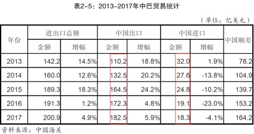
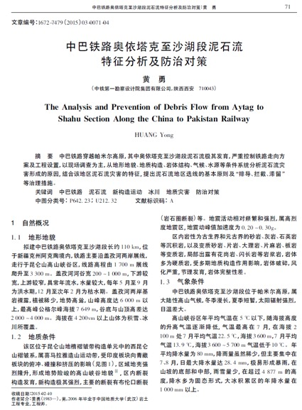
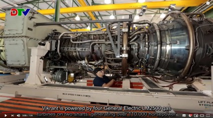
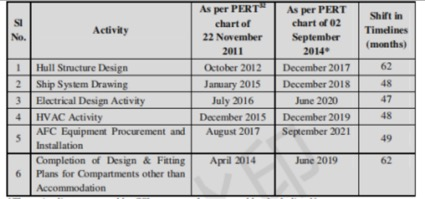
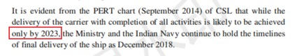
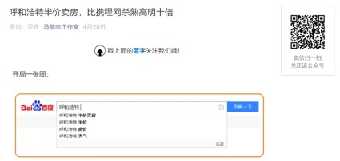

# 【睡前消息52】什么，印度第一艘国产航母又要完工了？

2019年12月10日睡前消息文字版第52期

::: details 【Bilibili】什么，印度第一艘国产航母又要完工了？
<iframe src="//player.bilibili.com/player.html?bvid=BV1mJ411y7Qz&page=1&high_quality=1" scrolling="no" border="0" frameborder="no" framespacing="0" allowfullscreen="true" height=400 width=100%> </iframe>
:::

::: details 【YouTube】什么，印度第一艘国产航母又要完工了？
<iframe width="100%" height="400" src="https://www.youtube.com/embed/stdxEciyd5o" frameborder="0" allow="accelerometer; autoplay; clipboard-write; encrypted-media; gyroscope; picture-in-picture" allowfullscreen></iframe>
:::

大家好2019年12月10日，欢迎收看52期睡前消息，年会以后我们又回来了。静静介绍新闻。

## 喀喇昆仑公路二期项目高速段通车 | 从政治、经济、技术上看，中巴修路都不划算

**新华社报道，11月16日，巴基斯坦喀喇昆仑公路二期工程取得进展，有40公里高速公路通车。很多人都说中国高速公路要修到巴基斯坦了，是这样吗？**

这段高速确实在中巴喀喇昆仑公路上，但是完全在巴基斯坦境内，而且不在中巴之间的克什米尔地区，距离巴基斯坦首都伊斯兰堡只有一个多小时车程，远远称不上连接中国。

 

整个二期扩建工程只有120公里，另外的80公里按照二级公路标准建设。全都修完，对于全长1224公里的中巴公路来说，也只是一小段。之前的2010年，我们搞一期扩建工程，把克什米尔段的公路设计时速提到每小时80公里，目前看来，这就是中巴交通干线的极限了，短期内不会继续扩建。

**从新闻报道看，中国企业同时还在巴基斯坦进行许多其他工程，如果不是连接中国和巴基斯坦，那他们在作什么呢？**

主要工作就是帮助巴基斯坦新建覆盖国土的交通干线。

 

今年11月5日，中国刚刚修了苏库尔到木尔坦的高速公路，全长392公里，设计时速120公里，双向六车道，是巴基斯坦第一条有智能交通功能的高速公路。

 

这392公里，是白沙瓦到卡拉奇高速公路的一部分，整条线路1152公里，是贯通巴基斯坦南北的最强交通骨干。

 

 

中国还在帮助巴基斯坦升级一号铁路干线，也是从北部白沙瓦到南部港口城市卡拉奇。

 

 

总的来说，目前巴基斯坦国内的交通水平很差，公路密度只有每平方公里0.32公里，不到印度的三分之一。英国人给巴基斯坦留下一万多公里铁路，现在剩下不到8000公里还能用。巴基斯坦政府刚刚提出了一个目标，到2030年“使铁路成为国家主要运输形式”，中国就在帮它做这件事。

**这几年，中国最主要的对外战略就是一带一路，巴基斯坦又一向被认为是中国最牢固的盟友，中国直通直通巴基斯坦的高速公路或者铁路还没有开工吗？**

的确这件事还没有排上中国的日程。当初修中巴公路，中国很积极，希望实现战略突围，但巴基斯坦一度是拒绝的，直到1965年，第二次以印巴战争战败，巴基斯坦才倒向中国，接受修路的提议。

 

现在想修中巴铁路，巴基斯坦很积极，但是中国方面很慎重。

 

2005年到2008年，穆沙拉夫当总统，他就多次向中国提出，修建中巴铁路，从喀什修过去，最好能连到瓜达尔港。2011年，中国国务院发布《支持喀什、霍尔果斯经济开发区建设的若干意见》，提出“积极推动中吉乌、中巴铁路建设”。2014年，中铁第一勘察设计院牵头，在喀什召开了中巴铁路预可行性研究报告方案研究初稿座谈会。虽然座谈会的修饰语有点多，但似乎真的要动手了。

 

但是到了2016年，新疆政府工作报告写的还是“做好中巴铁路，以及中吉乌铁路前期工作”。

 

后来又出台了一个中巴经济走廊远景规划，覆盖时间是2017到2030年，其中没有关于中巴铁路的内容。到目前为止，网上所有关于中巴铁路进度的文章，都只能拿2014年的座谈会说事，证明最近没有进展。

**那为什么中国不想升级这条战略通道呢？**

修路，主要考虑三方面因素，经济，政治，技术，但中巴高速公路一条都不满足。

中国14亿人口，巴基斯坦2.1亿人口，现在的贸易额才200亿美元上下，其中主要是中国对巴基斯坦出口180亿美元，巴基斯坦对我们出口只有20亿美元。

 

 

中国对巴基斯坦的出口，主要是机械设备、钢铁、有机化学品、电子设备、塑料制品；进口是原料为主，比如棉纱、棉布、大米、矿石和皮革，其中最主要的货物是棉纱，占一半。概括一下，就是中国沿海工业区对巴基斯坦这个沿海国家倾销廉价工业品，进口一点原料。用廉价海运最合适，陆上通道能满足紧急经济运输就可以了。

 

从政治来说，巴基斯坦根本不算一个现代国家，北部有大量的部落区，这里法律没有用，部落长老世袭，还有自己的武装，就算政府同意修路，他们也会提出无穷无尽的要求。

 

巴基斯坦内部还有恐怖袭击和党派冲突，经常有人攻击中国。所以中国现在帮它修内部交通干线，等国家正常了，再升级战略通道。否则游击队在任何一点都能切断交通干线，几百亿的工程就废了。

 

最后，从技术角度看，中巴战略通道实在是太难修。在欧亚地形图上，中国和巴基斯坦之间的帕米尔高原非常显眼，比它高的地方，山脉没有它多，比它山脉多的的地方，高度和它差很远。可以说这是全世界最难修路的地方。

 

http://img.jk51.com/img_jk51/241371348.jpeg

 

在巴基斯坦地震分布图上，帕米尔方向的红色都要挤不下了。

 

现在的中巴喀喇昆仑公路，穿越了喜马拉雅山、喀喇昆仑山和兴都库什山，世界前三大山脉经过两个。中间还要频繁跨河，印度河就跨越三次。所以虽然开始只打算修一条10米宽的普通公路，结果修了11年，牺牲700人。

 

2010年，巴国北部洪扎河大滑坡，形成堰塞湖，淹没了20多公里，整个中巴陆上交通中断，两边都是把货物运到堰塞湖边上，用渡船来回运。

最近几十年，中国充分研究了帕米尔高原的地质问题。

现在对这条公路的难度有充分认识，所以暂时热情不高。

总的来说，一带一路战略，最大的弱点就是只谈经济合作，不插手也不关心各国的内部情况。中亚，南亚，西亚，大多数国家的政治水平还停留在中世纪，社会制度容纳不了生产力进步，甚至反对生产力进步，害怕社会变革。如果中国只和暂时执政的高层打交道，和落后的统治集团拉关系，恐怕一带一路很难变成赚钱的买卖，反而可能成为少数人炫耀政绩的赔钱工程。在这种情况下，暂时不升级中巴战略通道，还算是一个理智的选择。

## 韩国延续《日韩军情保护协定》 | 美国不想见韩国破坏日韩军事协定，文在寅政府只好低头

**过去几个月，韩国为了抗议日本的贸易制裁，威胁要废除日韩军事情报保护协定（GSOMIA）。11月22日，韩国政府宣布，有条件延长协定，督工你怎么看文在寅这种自相矛盾的操作。**

韩国政府认输了，而且是彻底认输。我们可以回顾一下最近半年的韩国被打脸经过。

 

日本在7月1日发起了对韩贸易战，宣布对出口韩国的三种半导体产业原材料加强管制；8月2日，日本政府内修改《出口贸易管理令》，把韩国开除在“白色清单”之外。

 

在日本掀起贸易战之后，韩国上下群情激愤，文在寅政府表示要报复。除了经济手段之外，最重要的是两条措施，一条是废除日韩军事情报保护协定，一条是准备向WTO起诉日本的单方面行动。

 

8月22日，文在寅政府宣布作废军事情报保护协定。但是按照之前的约定，正式作废需要提前3个月告知，所以11月22日就是最后期限，韩国政府在最后一刻宣布认输，继续延长协定。在这之前，文在寅已经暂停向世界贸易组织起诉日本的贸易制裁。可以说，韩国政府自己剁了两只用来反击的手，全面失败。

 

而且，从程序来看，日本完全不顾及外交礼仪，没有给韩国留一点面子。韩国认输的新闻，是日本人抢先宣布的。就在韩国政府宣布延续协定之前一个小时，日本媒体已经发出了新闻，庆祝韩国政府服软，还说韩国承认了自己的出口管理政策有问题。

 

11月24日，韩国总统府国家安保室长郑义溶在釜山召开记者会，说日本歪曲了谈判内容，韩国在谈判中没有承认自己的出口管理政策有问题，同时抗议日本政府违反了两国之间的默契，把消息提前泄露给了日本媒体，让自己陷入被动。郑义溶还表示，因为日本在程序上操作不当，已经私下对韩国政府道歉了。

 

但是，日本政府立刻打脸，说日本的做法没有任何问题，更没有对韩国道歉。韩国纯粹是自己嗨。既不想让韩国得好处，也不许韩国人留一点面子。

 

韩国政府只好继续自言自语，说这次延续日韩军事情报协定，不是单方面让步，而是 “有条件延续”。但是， 12月2日，美国知名智库“捍卫民主基金会”发表评论，批评文在寅政府延续协定不够真诚，影响韩国外交的长期稳定，会给中国可乘之机，所以必须删掉“有条件”这个定语。如果说前面的操作是扒掉了文在寅的衣服，这一下就是连内裤也扯掉了。

**韩国一向是一个很在乎面子的国家，对日本的态度尤其强硬，为什么这次外交谈判连续让步？**

主要是受不了美国的压力。日韩军事合作，是美国主导的“东亚再平衡战略”的一部分。在美国看来，文在寅政府退出协定，打乱了美国的布局，必须制止。

 

7月15日，日韩贸易战刚刚开始，美国政府就对韩国外交代表团直接表示，希望韩日《军事情报保护协定》不要因为贸易战而动摇。

 

8月8日，新上任的美国国防部长埃斯珀访问韩国，要求文在寅政府不要废除协定。

 

8月9日，特朗普直接发话，敦促日韩尽快改善两国关系，他表示：“日韩明明是同盟国，反而让美国很难选择立场”

 

特朗普这个人从来是说了就要做，不玩虚的。韩国不让步，美国就要求韩国增加美国驻军费用。从每年10亿美元变成50亿美元。韩国受不了特朗普直接敲打，只能对日本低头。

 

另外，韩国内部的压力也很大。

 

因为殖民时代和独裁政府时代的经济原因，韩国右翼一直都和日本亲近。朴正熙是日本军官，朴正熙的女儿朴槿惠，在2016年代表韩国签订了日韩军事情报保护协定。

 

最近，文在寅的亲信曹国被人抓住了一些把柄，虽然不算大，但证据比较确凿。反对派和韩国财阀连续组织示威游行，要求文在寅下台。现在曹国已经被迫辞职了，但是韩国反对派，自由党党首黄教安，还是去青瓦台绝食抗议，要求文在寅继续维持《韩日军事情报保护协定》，同时修改两项国内法案。文在寅暂时不想在国内政治让步太多，只好选择先对日本低头，缓和一下与反对派的关系。

8月23日的[睡前消息第13期](13.md#日本放过三星-但不放过文在寅-日韩右翼联合打击韩国左翼)我们指出了一个事实，东北亚的问题，不能把国界看得太重。日本右翼和韩国右翼团结起来对付左翼文在寅，才是当前的主要矛盾。现在看来，当时的判断依然成立。

## 印度国产航母发动机点火 | 印度的外交部和审计总署比海军靠谱

**印度《经济时报》12月2日报道，印度第一艘国产航母“维克兰特”号取得重大进展，船上主机首次点火运行成功。督公，我记得印度这艘维克兰特号航母光是下水就反复好几次，这次是终于真的快要造好了吗？**

这件事只能证明一个结论，就是美国发动机很靠谱。维克兰特号的主机是美国通用公司的LM2500燃气轮机，全世界最顶级的船舶动力设备。不但功率大、性能稳定，而且结构紧凑。4万吨的航母，发动机只需要长8米，宽2.7米的空间，所以只要在甲板上开一个小缺口，就能把发动机装进去。

 

 

马前卒施工队比较了2018年7月与最新的卫星照片，发现维克兰特号在甲板上重新打开了一个大约十米长的开口。应该就是安装发动机的地方。

| 2018年7月 | 2019年 |
| ------------------------------------------------------------ | ---------------------------------------------------- |

 

之前曾经有人质疑过，说船壳和舰岛都已经安装好了，航母还没有动力，只能靠拖船移动，印度海军是不是打算造个模型。现在看来，印度的外交环境真是好，能在战略级武器上使用美国核心系统，造航母真不难。

 

但是，这并不能说印度航母快造好了。从最新的卫星照片上，可以看到，维克兰特甲板上十分零乱，很多系统还在安装，比类似阶段的中国航母多了很多临时设备。

 

中国的辽宁号，最早被外界观测到锅炉冒烟，是2010年5月30日。一年零三个月以后，辽宁号首次出港海试。两年半以后才正式服役。如果印度人的速度和我们差不多，航母也要2022年夏天才能交付。

 

印度这艘航母，是2003年就开始启动的项目，2016年，也就是项目开始12年后，印度总审计署审查项目，认为最早也要2018年底交工。

 

但是，报告里面埋了一句预言，说2023年之前，海军都拿不到船。

 

 

现在回头看，印度的外交部和审计总署还是比较靠谱的，起码比海军靠谱。

接下来我们回顾一下往期新闻的发展。

## 🔄 河南村医集体辞职问题可能会重演 | 这次是云南

[睡前消息第一期](1.md#三十六名村医集体辞职-因收入太低)我们提到了河南村医集体辞职问题，当地政府克扣了村医的补贴。

11月29日，云南政府拿出一个报告，2019年上半年， 13个县市区的基本公共卫生服务补助资金拨付率低于50%，甚至有县市的拨付率为0，一分钱都没给。估计河南省的问题要在云南重演了。

## 🔄 地方融资平台卖不了地 还不了钱 | 这次是呼和浩特

从[第九期睡前消息](9.md)开始，我们连续关注了地方融资平台的借债问题。当时重点关注了贵州山区，最近问题开始向经济条件更好的地区蔓延。

12月6日，呼和浩特经济技术开发区投资开发集团拒绝兑付自己的融资产品，引发了市场恐慌。

 

12月9日，据说呼和浩特市已经筹集了5亿资金，分期兑付，但目前这个产品还处于违约状态。内蒙古的人均gdp是每年6.8万，贵州是4.1万。而且呼和浩特是省会，这里的城投公司出问题，问题比贵州贫困县出问题更严重。

 

在睡前消息开播之前，4月28日，马前卒工作室的微信号曾有一篇分析呼和浩特房地产的文章，分析了呼和浩特新区房价问题：

 

 

目前看来，呼和浩特的房地产经济转不下去了。

 

11月19日，经济观察网有一篇关于地方融资平台债务问题的好文章，我推荐大家读一下：

[经济观察网：一家城投董事长的借钱困境：这日子什么时候是个头啊？](http://www.eeo.com.cn/2019/1119/369857.shtml)

这篇文章90%的内容，是西南部某市融资平台负责人的自述。在文章的最后，这个负责人表示，手里有很多土地，只要周转一下，拿到开发商的土地出让金，还债不成问题。反过来说，如果土地卖不掉，还债就没指望。

> 现在，已经有金融机构准备起诉孙双喜所在的城投，他告诉记者，金融机构这么做，我都理解。但是、假如，我也成了被执行人，连飞机、高铁都坐不了，我还怎么出去跑资金呢？怎么还钱？
>
> 虽然面临很多问题，甚至会被投资人起诉，但是孙双喜对他所在城投的未来，还是非常有信心的：“其实到了明年，我就很有信心了。我们的存量债务里，60%以上是报到财政部隐性债务系统里的，只要商业银行的债务置换逐渐到位，这部分债务压力就化解了。另外的部分，我每年还有新增授信，化解20%还是没问题。我们区的条件比较好，人口也多，房地产市场比较繁荣。之前有1000多亩地，已经卖给知名的房地产开发商了。但是房地产开发商一直不缴纳出让金。我们也知道房地产开发商难，一下子能接受1000多亩土地的房地产开发商也不多，所以我们也没有紧逼。如果明年房地产复苏，这部分土地的出让金一到账，债务问题也就化解了。”

 

最近的房地产市场并不乐观，恐怕还有更多的地方融资问题暴露。

## 🔄 中美都有局部奴隶问题

9月20日[睡前消息21期](21.md#美国教会“强征”流浪汉劳动-21世纪奴隶制随处可见)，我们提到了美国教会奴隶问题，一部分流浪汉被教会集中起来，没收个人财产，每天干农活。教会认为这对他们也是福利。在那一期，我们还引用了之前的一张“中国奴隶案案发地图”

11月29日，云南又有一起类似案件结案，砖厂老板加上4个帮手，奴役了十几个流浪汉，大多数智力有问题，老板自称这些流浪汉是从路上捡来的，给他们干活，还给饭吃，是做好事，是发福利，辩护理由和美国那个教会差不多。看来中美两国都面临类似的局部问题。

## 💬 督工回应鸡西评论 | 父辈当年来鸡西建设祖国，你也可以去沿海贡献力量，人不能越活越保守

[上一期第51期](51.md)，我提到了黑龙江省鸡西媒体集团欠发工资问题，认为这里的问题是行业衰落，地区人口收缩，建议他们到内地发展。在分析问题的时候，我说鸡西市过去人口稀少，完全是靠高工资吸引人来开发煤矿，才能几十年就快速成长为一个地级市。现在内地工资高，应该早点出来打工。

 

这个观点得到了两种回应。第一种总体上支持我的观点，认为黑龙江的编制过剩，冗员多，的确需要改革，还要给马前卒施工队送豆包吃。在这里我表示感谢。

> **网友一**：督工，我作为黑龙江人认为鸡西煤炭集团媒体人开不出工资不值得可怜！一方面都想进编制，一方面养尊处优！你看他们写的文章，那叫一个狗屁，不要说鸡西了，就是哈尔滨的收视率比较高的新闻夜航，也就是报报谁家花开的好看，谁家狗下12个狗崽这样的新闻！能有人看，也代表了黑龙江整体文化的没落！这些人从来不下去体验生活，自然做出的东西没人看，没有市场！自然开不出工资，通过自媒体卖惨，也真是够丢人的了！
>
> 另外，你想吃豆包吗！我们公司自己包的！很好吃的！给你和你们的小伙伴邮点！

 

还有一些朋友明确反对我的观点，认为祖辈来鸡西不是为了高工资，所以必须在本地创造就业，不要总想让人移民。

> **网友二**：关于您视频说鸡西传媒集团的视频，我看完心里不能平静，所以想和您谈谈。
>
> -　　我家也是鸡西的，传媒集团发不出工资的事情大部分本地人都知道的。传媒经营的不光是日报，晚报，电视台，目前也在向互联网媒体转变，这个过程必然会有一些人下岗失业。你说是珍惜编制问题是不大对的，因为传媒集团说欢迎员工自谋职业，更希望年轻人另谋出路，这个于卖苹果的人想法是一样的。
>
> -　　你批评说东北落后是事实，煤炭产业确实是过去煤城的支柱产业，但是鸡西也在转型，在尝试，也经历着转型的阵痛。所以像鸡西一样的城市就更需要一批又一批的人为之奋斗，要不然怎么实现城乡协调发展，实现共同富裕。
>
> -　　东北人确实很多都是之前移民过来的，但是你说为了煤矿的高工资这句话太不合适了。不仅仅是鸡西，东北的人口除了土生土长本地人之外，有闯关东来的，有开发北大荒来的，不是为了高工资。建国初期东北是全国的工业重地，目前也是全国的大粮仓，up您不要看轻东北，而且像鸡西一个煤城为新中国以很低的价格提供了多少煤炭你清楚吗，这些煤炭不是表层煤，都是旷工下矿开采的，风险多大，矿难死多少人，你知道吗？**鸡西有很多移民，但是大家生活了三代人了生于斯长于斯，对故土是有感情的。**
>
> -　　**我认为您在视频中说一出现困难就考虑往南方或者大城市走的这种想法有些片面，至少我是不会放弃我的家乡，要把她建设得更好。**
>
> -　　如有错误，敬请指正。

 

对这位朋友，我想说，我也是矿工的后代，很清楚上一代人为什么要做又危险又累的矿工，最直接的原因当然是收入加福利比周围的农民多好几倍。而且当时矿山工资分配高度倾向于一线，经常有矿工工资比矿长还多的情况，所以矿山城市不缺外来劳动力。

 

另外，就算是父辈为了建设祖国来鸡西做贡献，也不等于国家必须要在鸡西创造更多的就业岗位。实际上沿海地区很缺劳动力，出来工作，也算是配合国家最新的发展战略了，和父辈去鸡西一样光荣。父辈当年不在乎出来发展，自己不能越活越保守。

 

不过，有一个客观因素的确需要注意，就是现在发达地区的房价有点贵，本地居民因为买房早，占了便宜。鸡西或者说东北居民卖了本地的房子，到发达地区不一定够交首付，阻止了劳动力自由流动。这方面的平衡，需要国家收房产税，分走一部分房产利益集团的投机利润，给新居民创造发展空间。上周末年会的演讲，我也分析了房产税的必要性。过几天演讲稿会发在“马前卒工作室”微信公号，演讲视频会发在观视频工作室，欢迎大家批判。

## 🔄 持续关注华为李洪元251事件

最后[50期睡前消息](50.md#华为正式回应李洪元251事件)谈了华为和李洪元的矛盾，最新消息是李洪元昨天发微博，宣布深圳检察院对251事件再次立案，主动调查伪证和渎职问题。后续进展我们会持续关注。

 

[虎嗅：华为稳不稳（自媒体）：华为前员工李洪元：深圳市检察院已立案。](https://www.huxiu.com/moment/75008.html?f=chouti)

---

好，第52期睡前消息到此结束,我们周五再见。