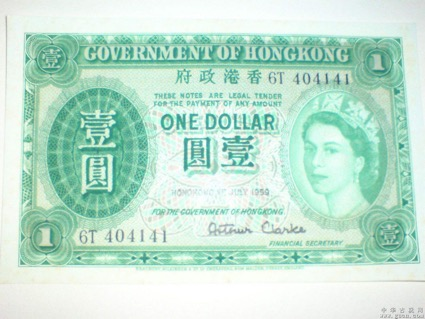
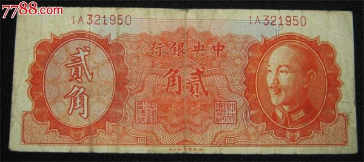
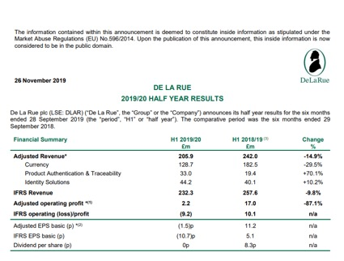
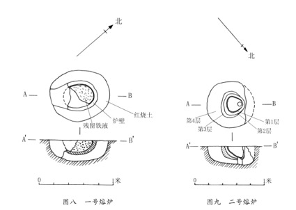
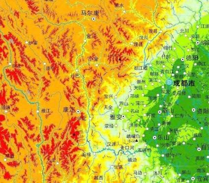
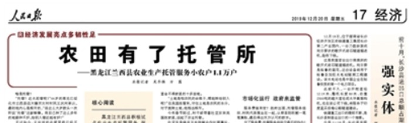
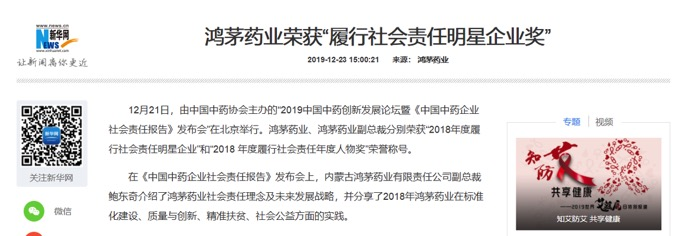

# 【睡前消息57】安倍想去印度，纪念当年日军带领印军共抗大英…

2019年12月24日睡前消息文字版第57期

::: details 【Bilibili】安倍想去印度，纪念当年日军带领印军共抗大英…
<iframe src="//player.bilibili.com/player.html?bvid=BV1MJ411W7sU&page=1&high_quality=1" scrolling="no" border="0" frameborder="no" framespacing="0" allowfullscreen="true" height=400 width=100%> </iframe>
:::

::: details 【YouTube】安倍想去印度，纪念当年日军带领印军共抗大英…
<iframe width="100%" height="400" src="https://www.youtube.com/embed/zairy7V9yc8" frameborder="0" allow="accelerometer; autoplay; clipboard-write; encrypted-media; gyroscope; picture-in-picture" allowfullscreen></iframe>
:::

大家好2019年12月24日，欢迎收看57期睡前消息，请静静介绍新闻。

## 世界最大印钞厂或将破产 | 德拉鲁公司是英国霸权的副产品 | 像样的国家自主印钞，不像样的资源卖不上价

**12月8日，俄国媒体报道，世界上最大的商业印钞厂，英国德拉鲁公司可能面临破产。这几年全世界手机支付发展都很快，德拉鲁公司是不是被支付宝逼死的？**

[环球网：说出来你可能不信，世界上最大印钞厂或要破产！这是真的穷得只剩下钱了……](https://baijiahao.baidu.com/s?id=1653531074424710800&wfr=spider&for=pc)

从长期来看，纸币行业肯定会被电子支付消灭，但暂时不会。因为还有差不多十亿人口等着进入商品经济时代，需要纸币做交易工具。虽然工业国的纸币需求不那么多了，但从全世界看，纸币的需求每年增加3%，非洲每年增加6%。拉美国家的通货膨胀严重，需要不断印钱，印到一定程度就要换新钱，所以每年增加16%。 

 

**全球纸币都在增加，那为什么德拉鲁公司的生意反而不好做了？**

印钱是一门高技术工业，同时也和主权有密切关系，虽然德拉鲁的印刷质量很好，防伪技术也很强，但比较大的工业国都喜欢自己印钱，比如说美国就自己印。德拉鲁一年印钞数量75亿张，但美国财政部就要印刷70亿张纸币。德拉鲁公司真正赚钱的市场，是那些没能力自己印钱的国家。全世界233个国家和地区，其中140个会找德拉鲁公司。但是加起来，也只是全球市场份额的11%。

**140个国家也不算少了，德拉鲁公司这11%的市场份额出问题是什么原因呢？**

第一个原因是大英帝国衰落。1860年，英国打赢了第二次鸦片战争，德拉鲁公司也在这一年开始印刷英镑。毛里求斯作为英国殖民地，是德拉鲁的第一个海外客户。过去港币也是德拉鲁公司印的（下图1）。

印度曾经是英国最大的殖民地，德拉鲁公司印钞部门过去三分之一的利润来源是印度。甚至中国也找德拉鲁公司印过钱，这是中国银行第一批订货（下图2-3）。

后来，中国每一次通胀都让德拉鲁公司发一次财。比如说，1936年和1937年发行的孙中山头像法币， 1948年蒋介石发行的金圆券，都有一大部分是德拉鲁公司产品（下图4-6）。

| 1【港币壹圆】  | 2【民国天津法币壹圆】 | 3【民国天津法币伍圆】 |
| ------------------------------------------------------------ | ------------------------------------------------------------ | ------------------------------------------------------------ |
| 4【金圆券壹圆】 | 5【金圆券拾圆】 | 6【金圆券贰角】   |

> （维基百科：**[德拉鲁公司](https://zh.wikipedia.org/wiki/%E5%BE%B7%E6%8B%89%E9%B2%81%E5%85%AC%E5%8F%B8)**）
>
> 公司创办于1813年，起先是印些报纸和扑克牌，1855年开始替英国印邮票，1860年起开始印刷钞票，曾经在1931年为中华民国政府所属的中国银行发行过仅限于天津本地使用的5元纸币，之后一直到1948年前常受到中华民国、上海英租界工部局和英属香港殖民地政府的委托印制和发行各种版别和面值的中华民国[法币](https://zh.wikipedia.org/wiki/法幣)以及1947年版壹角、贰角面额的[金圆券](https://zh.wikipedia.org/wiki/金圓券)，上海租界用纸币和[港币](https://zh.wikipedia.org/wiki/港幣)。 其中在1950年代之后德拉鲁公司更是为[渣打银行](https://zh.wikipedia.org/wiki/渣打銀行)和[香港上海汇丰银行](https://zh.wikipedia.org/wiki/香港上海匯豐銀行)（[HSBC](https://zh.wikipedia.org/wiki/HSBC)）印制港币，直到1996年香港移交中华人民共和国前一年，才由[香港金融管理局](https://zh.wikipedia.org/wiki/香港金融管理局)收购印制港币业务，并改组香港分厂为[香港印钞](https://zh.wikipedia.org/wiki/香港印鈔)。
>
> 2019年10月，该公司将其部分业务（Identity Solutions）以4200万英镑的价格卖给了美国的HID公司（HID Global）。

现在中国的钞票当然靠自己印，1996年香港回归前夕，香港不再找英国印港币。2010年，就连印度政府也决定自己印刷纸币，给德拉鲁公司一个沉重打击。

 

 

当然德拉鲁公司还有100多个小国的订单，而且印刷数量不少。但是，这些国家最近几年需求旺盛，恰恰是因为经济崩溃，物价飙升，所以不一定有外汇给德拉鲁公司付款。比如说委内瑞拉就因为印钱欠了德拉鲁公司1800万英镑。给这些国家印钱，并不是什么好事。

 

上个月，德拉鲁公布了2019财年的半年报，今年上半年亏损一千多万英镑，主要原因就是印钞业务和防伪标签业务的利润暴跌。

上半年，德拉鲁赚钱的业务还包括印刷证件。但紧跟着就是一条可怕的消息，因为报价太高，明年英国的护照要找法国公司印刷了。

所以大家都不看好德拉鲁的利润，股价暴跌。现在它的股票市值大约是1.3亿英镑，但是负债1.7亿，眼看就要破产。

总的来说，德拉鲁公司是英国霸权的副产品，靠第三世界国家的业务，变成世界最大的商业印钞公司。最近几年，第三世界逐渐分化，像样一点的国家，比如说印度要自己印钱；不像样的国家，资源卖不上价，印钱也拯救不了经济，所以德拉鲁的日子过不下去。英国脱欧以后，估计就没什么德拉鲁公司了。

## 安倍暂缓访问印度行程 | 安培想去印度东北邦看看抗英英雄，但东北邦本不属印度，民族宗教冲突暴乱不断

**12月13日，[第53期睡前消息](53.md#印度为什么放弃rcep-rcep包括了地球一多半的人口，印度又怕又爱)，我们讨论了印度拒绝加入RCEP的原因，提到安倍近期要访问印度。第二天，12月14日，安倍宣布，因为印度东北部爆发动乱，暂缓访问印度。为什么印度东北部几个邦骚乱，安倍就不见莫迪了呢？**

这次社会冲突的规模很大，现在至少死了23个人，抓了6000人，安倍因为安全因素不去也很正常。但最主要的原因，是这场骚乱的原因很尴尬，让安倍有点找不到自己的外交定位。

 

在安倍宣布暂缓访问之前2天，日本政府已经公布了安倍的行程，除了要和莫迪见面之外，还专门要去印度的东北部地区，到二战时期的英帕尔战役遗址献花。这个英帕尔战役，是二战后期轴心国很少见的战略进攻，日本人从缅甸进攻印度东北部，占领了一点又退回去。

 

 

按常理说，安倍作为侵略国的元首不应该主动回顾侵略战争。但是，1944年的印度还是英国的殖民地，英国军队带着一部分印度士兵防守，日本这边也有一大批印度士兵，而且比英国那边的印度士兵更积极，因为他们是印度领袖钱德拉鲍斯带领的印度国民军。

 

二战日本是侵略国，但是，对于亚洲大多数国家来说，原来的欧洲殖民者也是混蛋。日本进攻新加坡的时候，虽然兵力比英国人少，但英国人那边的印度兵都不愿意打仗，很快就投降了。这些投降的士兵被钱德拉鲍斯发动起来，组织了印度国民军，站在日本一边打仗。英帕尔战役期间，钱德拉鲍斯带着最精锐的部队跟日本人前进，还真的占领了一小块印度土地，升起了印度独立国旗，开创了现代印度的历史。现在加尔各答的国际机场，就用钱德拉鲍斯来命名。

 

无论从精神上说，还是从组织上说，钱德拉鲍斯都是莫迪的前辈。安倍晋三要到英帕尔战役遗址献花，莫迪很高兴，而且理由非常光明正大，怀念共同对抗欧洲帝国主义的历史。

【莫迪向鲍斯像致敬】

但是，印度东北部这一轮冲突，恰好是印度自己继承帝国主义遗产的结果。因为东北邦这个三角区，民族和印度主体不一样，总体上属于汉藏语系，从来没有被莫卧儿帝国统治过，孟加拉人对印度的归属感都比他们强。之所以现代印度包括这一块，主要原因是英缅战争后，英国人把它划进了印度殖民地。去年洞朗事件，印度对中国修路反应激烈，就是怕中国人威胁印度本土和东面这几个邦的联系走廊。

 

过去几十年，印度政府为了巩固对这一带的统治，很努力地向阿萨姆这一带移民，旁边的孟加拉国人口密度大，也有很多人到这里求生。现在已经有几百万人定居，改变了这一带的人口地理。最近莫迪公布了移民修正案，允许2014年以前的外国移民登记为本国移民，优先要印度教徒，唯独不要穆斯林。

 

结果，首先穆斯林上街抗议，抗议宗教歧视；但是阿萨姆、曼尼普尔这几个邦的本土居民闹的更大，因为土著不喜欢任何移民，无论是信印度教的还是信基督教的。他们绝不同意莫迪给那些孟加拉来的印度教徒公民身份。对于这些本土居民来说，印度自己就在搞帝国主义。昨天新德里警方暂时禁止居民集会，引用的法律是英国留下的殖民地规定。印度这么怀念英国的帝国统治，安倍晋三当然不好意思去纪念反帝国主义战争。

 

 

 

**如果说印度靠继承英国的殖民遗产才建成横跨南亚的国家，世界上还有很多地方，比如非洲，在殖民者到来之前根本没有近代意义上的国家和国界，这样的地方在独立以后应该怎么建国呢？**

帝国主义和殖民主义也带来一定的现代化改造，不是说所有遗产都必须放弃，把殖民地变成现代国家也是可以的。但是，既然新的国家是通过反帝国主义，反殖民主义建立起来的，自己就不能再搞帝国主义和种族主义，否则也谈不上进步。莫迪最近的政策，包括这次修正移民法案，目标都是建立一个从来没出现过的印度教国家，抛弃了世俗国家的立场。这是向野蛮时代退化，所以必然会激发巨大的矛盾。毕竟印度教首先歧视的不是外国人，而是自己的同胞。

 

但是，虽然印度很落后，虽然印度在政治上要倒退，但是有好几百万移民依然要留在印度，宁可和警察对抗也不回去，这说明十八层地狱下面还有十九层。孟加拉和巴基斯坦的社会比印度更落后，矛盾更多。将来南亚如果真的有大动荡，恐怕印度不是第一个挺不住的国家。

## 四川邛崃进行古法冶铁实验 | 邛崃也曾是冶金基地、商业枢纽

**中新网12月8日报道，四川邛崃市最近正在进行古法炼铁试验，建设了两座古代高炉。现在这两座高炉正在炼铁水。邛崃市这是要发展什么产业吗？**

这次冶炼并不是商业活动，不想卖什么古法铁锅，而是四川省文物考古研究院组织的严肃考古试验。新建的两座高炉，一个是长方体，仿造浦江古石山汉代方形冶铁炉。

另一座是圆柱体，仿造邛崃县平乐镇出土的圆柱形高炉，时代更晚，技术也更先进。

|           |           |
| ------------------------------------------------------- | ------------------------------------------------------- |
|  |  |

 

整个冶炼过程，除了要节约人力，用上了现代鼓风机，其他装置和工序都尽量还原古代的样子。现在正式报告还没出来，但从新闻报道来看，古法制造的农具，和邛崃本地的考古发现基本一致，和当时中原地区的产品差不多，证明了汉古代四川的技术水平。

**为什么邛崃会有大型的古代炼铁遗址呢？**

首先是因为地理因素。

从地形图来看，成都平原在西南方向有一个突出部，邛崃就在突出部的顶端。所以，四川平原农业地区和落后的西南山区做交易，乃至向缅甸印度卖东西，邛崃都是商路的起点。

西汉张骞从新疆方向到现在的阿富汗一带当外交官，看到市场上有印度转手过来的的筇杖和蜀布，这个筇杖就是邛崃特产。 

中国进入铁器时代比较晚，比中亚西亚晚了差不多1000年。但是，这多出来的1000年，让中国古人充分发展了青铜器，掌握了高温冶炼技术。

近代以前，中国以外的大多数地区都采用固体炼铁技术，适合锻造金属兵器，但是产量低。只能出口一点大马士革钢之类的武器材料。中国正好相反，从秦汉时代开始就应用高温液体炼铁技术，也就是用高炉烧铁水，制造生铁。生铁比较脆，不适合做兵器，但是导热快，耐磨，适合做铁锅，农具。如果坏了，本村的铁匠就能修。

中原地区掌握了高炉技术以后，大量出口生铁农具和厨具，西南山区的落后民族非常喜欢买。上周我还在观察者网关于李子柒的内容下面看到这样一条回复（见下💬），非常生动，应该是有过亲身经历。看来一直到最近几十年，西南山区依然有很多地方缺乏铁器。

::: details 点击展开该回复 💬  《驳马前卒对李子柒的怪论》

[观察者网·风闻·漠江之北：驳马前卒对李子柒的怪论](https://user.guancha.cn/main/content?id=211718)

> **@华纳王**：想象你去过这样的生活。
>
>  西南大山里面，农民住在石片和茅草混合覆盖的土木混合棚房里面，家里唯三的金属是菜刀，镰刀和钉锄，灶台里面的铁锅都是祖传的！这个房子是不防雨的，所以雨天里面要找不滴水的地方睡觉。楼上人睡在稻草上，下面就是耕牛，鸡狗、猪、鹅呆的地方。用具都是山间木头做的。还不是自己家做的，是巡游木匠到寨子里面做的。每家两厢挂的就是辣椒玉米，这是财富的象征，用盐都是线绑着锅里热水里面转一圈（硬块岩盐）。然后这样一幢草棚房子住得就是一家。多几家就成了一个寨子，家里有牛有马的就是大户，因为马可以拉车，完成拉粪，拉土，拉人，拖猪拖菜等等服务。厕所和排水是没有的，就是一个坑，上面排两块木板，布置在屋后，清扫一楼的时候木板打开，把猪粪，鸡鸭鹅的屎扫进去堆肥。再盖上木板给人做厕所。匠人都是巡游的，木匠，石匠，铁匠，磨刀磨锄头的，货郎担贩子也时常出现。李子柒拍的视频里面的事情，就是这种寨子里面的日常。要说美，春天那是真美，青山，碧水，山花烂漫，油菜黄花满田间。秋天就开始烧山，山一烧，都变黑的了，然后雨水冲刷，第二年薄田里面开始有点营养。啥都能种，就是产量不高。小孩子一早就赶着猪，羊上山吃草了，下午一吆喝回家。杀猪都是过节似得。少许的拖到节场去卖，换点剪刀，棉布，针线啥的。

:::

虽然向山区出口铁器利润很高，但铁器和铁矿石都很沉重，而且当时煤矿不发达，炼铁需要在山上砍树烧炭。所以大多数炼铁厂都建在山区和平原之间。恰好邛崃这里有很多浅层铁矿，所以出现了古代炼铁工业区。

**那邛崃的炼铁工业是从什么时候开始发展的呢？**

秦国在统一全国之前就占领了四川，发现邛崃这个地方适合搞工商业。所以设置了蜀郡临邛县，是中国最古老的县之一。从东方六国抓来的工商业人口，一部分被安置在临邛县，其中最有名的是赵国人卓王孙。

> 临邛境内凭靠经营冶铁业而致富，卓王孙氏“赵人也，用铁冶富。……致之临邛，大喜，即铁山鼓铸，运筹策，倾滇蜀之民，富至僮千人，田池射猎之乐，拟於人君。”程郑氏“山东迁虏也，……”（引用内容为史记货殖列传）

卓王孙的女儿是卓文君，女婿是司马相如。虽然司马相如主要的名气来自于他的文章，以及勾搭卓文君的浪漫故事。但对于秦汉社会来说，司马相如最重要的事迹是被汉武帝任命为中郎将，打掉一批西南酋长，让剩下的酋长接受汉朝的官职，维护汉朝的商路，销售他岳父的铁器。司马相如带着朝廷官职回到四川的时候，卓王孙和临邛的头面人物都立刻跑过去拜见，这是典型的军事经济联盟。我猜他们肯定给司马相如拿了不少军费。

宋朝以后，海洋贸易发达，去印度方向的商路不再走四川。元朝对云南和其他西南山区进行大规模开发，引进了一批技术，也不那么需要平原的铁器了。所以邛崃本地的工业逐渐衰落，很多人忘了邛崃曾经是中国西南部的的冶金基地。这次四川搞古法炼铁试验，算是一次非常严肃的科学考古，同时也是一次非常好的历史科普活动。我希望各地都能以考古的心态，重现一下古代工艺，比卖什么章丘熟铁锅对社会更有好处。

今天的新闻到此结束，接下来我介绍几条简讯。

## 🔘 农业集中效率高 | 企业帮农民种地，把农民解放出来，进城从事高效率劳动

首先是12月20日人民日报的一条新闻，《农田有了托管所》，介绍黑龙江省集中管理农田的先进经验。过去搞土地流转，是大户向农民交租金，把土地的收益拿走。现在反过来，农民向企业交托管费，企业用高效率劳动帮农民种地，收益卖了钱归农民。但两种方式也有共同点，都是消灭小农经济，把农民解放出来，进城搞高效率劳动。

可能有人会觉得，这是地广人稀的黑龙江经验，不适合内地。但是，人民日报找的样板是绥化市兰西县，人口53万，耕地216万亩，人均4亩，一年只能种一茬。和大多地区相比，这个人均土地不算太多。所以兰西县的例子可以向其他地区推广。就算农村没有农民了，我们也有办法种地。

下一条新闻比较意外。

## 🔘 鸿茅药业获奖 高管逆天言论 | “跨省”事件互联网没有记忆

12月23日新华网报导，中国中药协会给鸿茅药业颁发了“2018年度履行社会责任明星企业”奖。但是我记得，广东医生谭秦东被鸿茅药业送进鉴于，给中国互联网创造了“跨省”这个缩写词，就是2018年1月的事情。看来谭秦东跨省事件算是过去了。

同一条新闻还提到，中国中药协会给鸿茅药业副总裁鲍东奇颁发了“2018 年度履行社会责任年度人物奖”。 鲍东奇先生曾经公开说自己有纯净的黄金家族血统，是成吉思汗第19代孙子。这种身上背着整个欧亚大陆继承权的大人物，我估计他拿到这个小奖项也没有多开心。

[^陈默, 曹有涛. 鲍洪升:我是个真正的蒙古人[J]. 优品, 2009(11):4.](https://xueshu.baidu.com/usercenter/paper/show?paperid=63ee13e72b3b61568ee320e75e5539aa&site=xueshu_se)

[食品商务网：鲍洪升：我是个真正的蒙古人](https://news.21food.cn/13/588313.html)

接下来我分享几条有趣的观众评论。

## 💬 督工：静静，对不起

首先，之前几期，我为了节约时间，对静静不够礼貌，导致观众不满。

<BiliComment name="月落秋寒" content="督工你对静静态度越来越差了 从请静静介绍新闻 到静静介绍新闻 到现在就四字 介绍新闻 这恐怕是我看你视频最不喜欢的一点了" time="2019-12-23" like="3"/>

这位观众说得对，在此我要对观众道歉，对静静道歉。

## 💬 观众评印度

12月13日[第53期睡前消息](53.md)，我提到印度面对RCEP组织进退两难，加入怕竞争，不加入怕错过机会。有一位朋友生动地总结了印度的心态：

<BiliComment name="大王八33333" content="印度：忍一时越想越气，退一步越想越亏🤣弹幕都是人才" time="2019-12-13" like="2"/>

12月1日[第49期睡前消息](49.md#印度新德里的雾霾问题-先污染后治理，发展经济逃不过的一关)，我提到印度宁可空气污染也要继续修电厂，视频下面有一个朋友发表感慨：

<BiliComment name="叫我徐小胆菌" content="上大学以前课本和考试一直在教我遇到问题要找一个最优解；上了大学学习工科后，课本告诉我世界太复杂了很多时候找最优解不现实，找到够用的近似解就行；毕业之后工作了，我才发现社会这个大的分工协作体系下找一个近似解也是奢望，不选择最差的就是最好的选择。所以我一定程度上能理解印度用污染换发展，这也是过去各个国家都走过的路" time="2019-12-01" like="0"/>

::: details 还有一条评论仅出现于蛋卷俱乐部文字稿，未登视频，关于[第50期](50.md)华为251的

12月3日[第50期睡前消息](50.md)，我说华为公司利用法律漏洞，发动国家机器长期扣押员工，差点破坏了他自证无罪的机会。在知乎有一个回答总结了我的视频：

<BiliComment name="匿名用户" content="为什么要强调 推进国家治理体系和治理能力现代化 因为如果（国家）不够现代化，就会成为比你更现代化组织的工具" time="2022-12-0x" like="0"/>

:::

这几位朋友的总结都比我原来的视频更精准，在此我一并表示感谢。

::: details 同样未登视频，不过督工老喜欢在知乎点赞这种反对言论了😹

12月13日，有人发了一条微博：

我非常喜欢这个评价，这说明马前卒工作室蒸蒸日上。希望“稳我赢”同学继续鼓励我们进步。

:::

## 💬 静静长啥样

最后，翻上一期的评论，我注意到一位朋友的留言，根据声音描绘了静静的样子：

<BiliComment name="空间之王" content="等等，让我猜想一下： 静静是不是一身职业装，戴个厚框眼镜，梳着单马尾，五官俊朗分明，无时无刻不在拿着A4打印的材料，仔细研读的狠角色? 每当静静走过，办公室里都会弥漫着一股化妆品和油墨混合的香气? 我仿佛能听见静静敲击键盘那悦耳的噼啪声。 万人血书，静静出镜，与督工互换位置。听说下雨天，小姐姐和橘猫更配哦~" time="2022-12-23" like="2"/>

“职业装，厚框眼镜，单马尾发型，眼神凌厉，读材料的样子有杀气。”

我请左手王同学落实了他的描述。静静你对观众的想象怎么看？像不像你？

**我不是，我没有，别乱说。**（否认三连）

（蛋卷俱乐部原稿：**这位同学的内心戏实在有点多。**）

---

好，56期睡前消息到此结束，大家不要错过周四的日偏食，不要忘了给年终盘点提供意见，我们周五再见。