# 【睡前消息60】年终盘点（中）：中国有些企业需要“社会主义改造”？

2020年1月1日睡前消息文字版第60期

::: details 【Bilibili】年终盘点（中）：中国有些企业需要“社会主义改造”？
<iframe src="//player.bilibili.com/player.html?bvid=BV1fJ411b7Qj&page=1&high_quality=1" scrolling="no" border="0" frameborder="no" framespacing="0" allowfullscreen="true" height=400 width=100%> </iframe>
:::

::: details 【YouTube】年终盘点(中)｜中国有些企业需要“社会主义改造”？
<iframe width="100%" height="400" src="https://www.youtube.com/embed/IrpMSPfxQzI" frameborder="0" allow="accelerometer; autoplay; clipboard-write; encrypted-media; gyroscope; picture-in-picture" allowfullscreen></iframe>
:::

大家好，2020年1月1日，欢迎收看睡前消息60期，今天我们继续回顾2019年。

## 目录

[[TOC]]

## 2019年的大工程

### [长江] 白沙沱大桥退役、长江深水航道交工、白鹤滩电站、长江禁渔

我小学的时候，语文课本上有南京长江大桥，钞票上印着武汉长江大桥。这些年中国修了很多大工程，长江大桥接近150座，2019年就有好几座通车，已经不是值得上教科书的项目了。但是2019年还是有很多值得纪念的事件。比如说第一座退役的长江大桥。白沙沱大桥。

#### 白沙沱大桥退役——第一座退役的长江大桥

这座大桥在重庆，现在看起来比较土，但1959年通车的时候当年也算是中国的超级工程。苏联专家帮中国修了武汉长江大桥，然后中国人自己建了南京长江大桥，在两座干线大桥之间，中国先修了白沙沱大桥练练手。

|  |  | 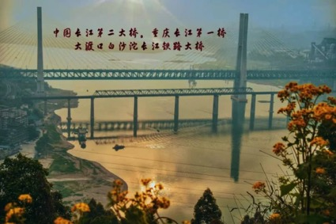 |
| ---------------------------------------------- | ---------------------------------------------- | ---------------------------------------------- |

现在大家看到大桥边上修了一座平行的新桥，而且以后重庆修了小南海电站，水位提高，这座桥可能会被淹没，所以老桥变成文物了。中国终于富裕到可以把长江大桥变成消耗品，而不是超级工程。

 [微博文章·睡前消息编辑部：长江第二桥退役 会不会是长江拆除第一桥？](https://weibo.com/ttarticle/p/show?id=2309404365383174867732)

#### 长江深水航道交工 | 南京大桥未来需加高

说起长江大桥，很多人经常会说，南京大桥修低了，影响南京和上游的长江航运。但是，南京长江大桥是1968年完工的工程，到2019年已经51年，这51年之间，南京下游的航道可用深度一直停留在个位数，直到2019年4月，中国人才第一次需要担心南京长江大桥的高度问题

2019年5月26日，长江南京以下12.5米深水航道二期工程交工，从施工单位转交交通部长江航务局，进入日常养护阶段。万吨轮船吃水深度一般在9米以上，换句话说，南京以下的长江终于变成常年可靠的万吨航道了。

[新浪新闻·交通运输部：[长航局]长江南京以下12.5米深水航道二期工程完成交接（图）](http://news.sina.com.cn/o/2019-05-24/doc-ihvhiqay1109775.shtml)

长江看着很宽，动不动就几公里，但是下游的可靠深度一直只有六七米。

【长江各段平均水深及平均宽度——主航道水深：】

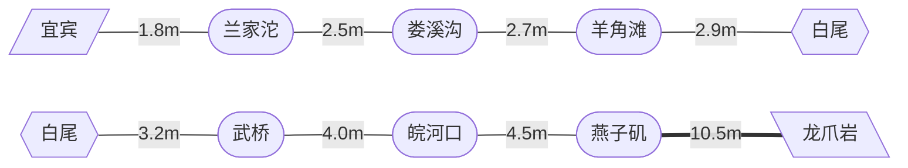

2004年接近10米，2014年南通以下挖到12.5米，2019年才真正挖到南京。之前南京长江大桥虽然不高，但是下面24米高的空间，也不会挡住太多船。南京长江大桥肯定不会拆的，但是从2020年开始，5万吨轮船小心一点可以开到南京，我们可能要严肃考虑南京长江大桥将来要不要提高高度，加大其中几个跨度，给未来的大船让路了。

#### 白鹤滩电站第一批百万千瓦水电机组交付安装

2019年长江上还有一件大事，世界上第一批百万千瓦水电机组开始安装，首批用户是白鹤滩电站。

[国际在线·新华网：世界首台百万千瓦水电机组核心部件完工交付](http://news.cri.cn/20190112/9755fcf7-f428-7c96-fe8b-8d27f54ba25f.html)

|  | 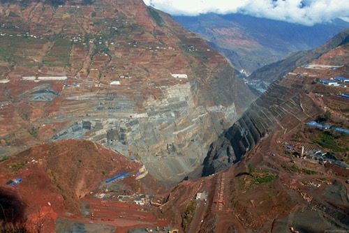 |
| ---------------------------------------------- | ---------------------------------------------- |

修三峡的时候，中国上了70万千瓦机组，修溪洛渡电站的时候，中国搞定了77万千瓦机组，向家坝是80万，今年上了马前卒工作室月历牌的乌东德电站是单台85万，到2022年的白鹤滩终于要用百万千瓦电站了，一台就和整个刘家峡大坝差不多。

#### 长江禁渔

另外，2019年，是长江捕鱼业的最后一年。从今天开始，长江11万条渔船将逐步退役，至少十年不打鱼。当然中国吃鱼早就靠养殖了，这次长江禁渔，主要是保护野生物种。这些新修的大坝也要考虑鱼类的洄游问题。

[澎湃·北京科协：应对“长江无鱼之困”——长江流域将分步禁渔十年](https://www.thepaper.cn/newsDetail_forward_5325674)

### [珠江] 大藤峡水利枢纽

除了长江，珠江流域也有大工程，大藤峡水利枢纽装上了闸门，以后珠江口的船队可以从南海一直开到贵州甚至云南，我们在[19.5期睡前消息](19_5.md#大藤峡水利枢纽-大藤峡工程让内陆变沿海)曾经介绍过这个工程，这里就不多说了。

[微博文章·睡前消息编辑部：一道闸门占领人民日报头版 云南贵州日后将成“沿海省份”](https://weibo.com/ttarticle/p/show?id=2309404377296394967943)

### [能源] 浩吉铁路

2019年的大工程还有很多，比如说[第15期（应为26期）](26.md#世界最长重载铁路开通-重载铁路运煤目前比特高压高效，以后可能不会)提到的浩吉铁路，也就是蒙华铁路，9月28日贯通，给中国增加了一条每年2亿吨的南北能源通道，解决南方缺电问题。

[澎湃新闻：中国新增纵贯南北能源运输大通道：浩勒报吉至吉安铁路开通](https://www.thepaper.cn/newsDetail_forward_4552731)

| 【9月28日，浩吉铁路开通运营】 | 【2019年9月22日，湖北省襄阳市，浩吉铁路位于襄州伙牌镇邓湖村的襄州联络线全线铺通】 |
| ------------------------------------------------------------ | ------------------------------------------------------------ |

在这些工程背后，是地球上第一个十亿吨钢铁产量的国家。现在最终统计数据还没出来，但是不考虑瞒报，合法数据至少是9.8亿吨，就算没达到十亿吨，那也是我们谦虚一下。去年的亚军是印度，每个月大概900万吨，合计一亿吨出头。如果地球上出现第二个十亿吨钢产量的国家，那有可能是30年后的印度。但是首先他们要解决污染和能源问题。毕竟印度国土面积只有中国的三分之一。

## 2019年的大事故

2019年的大工程我就不一一介绍了，但是，现在回忆起来，这些大型工程在2019年带来了一系列副产品，就是事故。

### [矿厂] 神木李家沟煤矿事故、内蒙古西乌旗矿车超载失控 | 与无锡高架桥事故、杀医生事件的对比

1月12日，神木李家沟煤矿事故，死了21个工人。

[观察者网·央视新闻客户端：陕西神木煤矿冒顶事故：被困21人全部遇难](https://www.guancha.cn/politics/2019_01_13_486666.shtml) 

2月23日，内蒙古西乌旗矿车超载失控，当场就死了20人。

[凤凰网·科技日报：内蒙古矿企事故：涉事车辆老旧 核载20人挤了50人](https://news.ifeng.com/c/7kYnq4zxyqF)

下半年，随着很多地方面对现实，开始放弃天然气换煤的梦想，几乎每星期都有严重煤矿事故。从不完全的统计看，2019年的煤矿死亡数字很可能比2018年有反弹，继续恢复到每天死一个人的水平。矿工依然是中国最危险的职业之一。但是，再过一两个月，估计2019年留下的伤亡回忆，就只剩下无锡的高架桥和年底的杀医生事件了。

[人民网：江苏无锡一上跨桥出现桥面侧翻 3辆汽车被压](http://society.people.com.cn/n1/2019/1010/c1008-31392825.html) 

但是，如果承认所有职业在生命上平等，职业风险控制就不能只关心那些容易上网的职业。

### [城市工地] 衡水工地升降机事故、深圳河道清淤事故 | 典型的管理问题

现在趁着我的回忆还热乎，2019年能想起的重大事故还有4月份衡水的工地升降机事故，11个工人。

4月份深圳下了一场暴雨，也是11个工人没了，都是在清理河道淤泥的时候死的。第一组事故发生在下午5点，后面两起都是半夜十点以后，典型的管理问题。

[人民网：深圳强降雨已致7名河道工人死亡（Web Archive）](https://web.archive.org/web/20190413013520/http://sz.people.com.cn/n2/2019/0412/c202846-32837857.html)

### [化工厂] 河南三门峡液氧爆炸、江苏响水县化工园区爆炸 | 地方政府竭力隐瞒 甚至总结出经验

不过，2019年最惊人的两起事故，都发生在化工厂。比较小的一次，是河南三门峡的液氧爆炸，死了15个，重伤15个

| 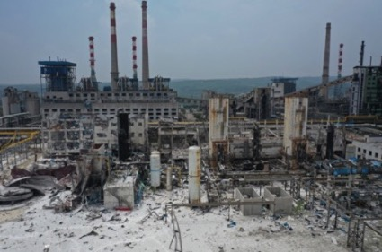 | 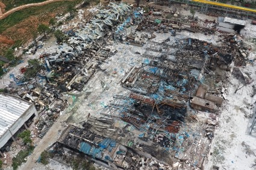 |
| ---------------------------------------------- | ---------------------------------------------- |

比较大的，就是江苏响水县化工园区爆炸。无论是看当时的照片，还是看事后的航拍，都像是挨了一发战术核弹，爆炸坑直径上百米。

|  | 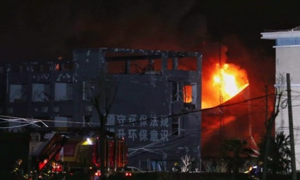 |
| :--------------------------------------------: | :--------------------------------------------: |
|  | 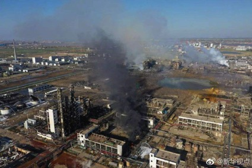 |
| 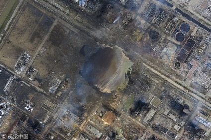 |      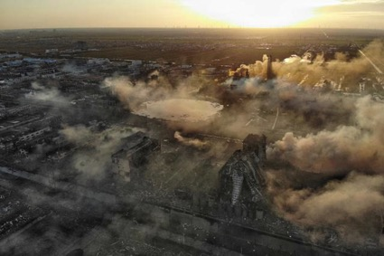       |

 [2021 🔄 百家号·北京日报：响水化工厂爆炸事故调查追责细节公布](https://baijiahao.baidu.com/s?id=1689501978481189675&wfr=spider&for=pc)

最终死了80人，5公里之外的房屋都受影响。

刚才这几张照片，都是无人机拍摄的。所以当地政府的第一反应是防火防盗防记者，尤其要防无人机，所以设置了无人机干扰器，后期抢险的照片就拍不到了。

之所以地方政府这么有经验，是因为十几年前他们就处理过类似事件。2007年也是这个县，化工厂爆炸，县里立刻成立工作组，围追堵截各地记者，同时安排豪华招待，砸钱，甚至派出美女色诱，最后总结出响水经验。这次大爆炸就用上了。

【相关新闻截图存档，点击放大】

| 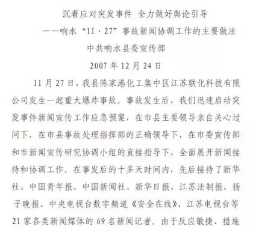 | 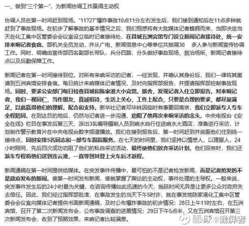 | 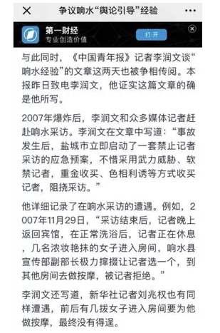 |
| ---------------------------------------------- | ---------------------------------------------- | ---------------------------------------------- |

从这些经验看，响水爆炸一点也不偶然，甚至可以说必然。因为地方政府的精力都用来对付记者了，真的没空去企业安全检查。

### 北京铁路局两工人被撞死

临近年底，还有两件事，第一件事是北京铁路局撞死两个工人，因为工作安排是用微信群下发的，火车不知道轨道上有工人。

[新浪新闻·新京报：北京铁路局两名员工凌晨作业时遭高铁撞轧身亡](https://news.sina.com.cn/s/2019-12-08/doc-iihnzahi6027432.shtml)

> “上级的作业命令都是用系统层层传递的，但该车间内的一名干部用微信群发送推迟上线作业时间命令后，没有确认作业班组回复命令，导致了命令漏传。”

### 兰州生化泄露

第二件事是兰州一件类似于生化危机的故事，生物制药厂消毒工作失败，制药罐培养了传染病细菌，随风传播，导致200人感染，甚至从哈尔滨来的实习生也感染上了，又把病菌带回哈尔滨。

[兰州市人民政府：中国农科院兰州兽研所布鲁氏菌抗体阳性事件调查处置情况通报](http://www.lanzhou.gov.cn/art/2019/12/26/art_127_838908.html?authkey=8nibm2)

这还是典型的人祸。

## 农村问题 | 地方政府拿钱不做事 | 管理水平亟待提高

中国现在已经是世界第一工业大国了，刚才提到每年生产十亿吨钢铁，平均每个劳动力一吨，大多数变成了越来越复杂的生产设备和厂房，经济的硬件上我们有很大的进步。但是软件方面的进步明显不够，管理水平不行，甚至不敢正视问题，所以出现了很多事故。就算不死人，也会抵消硬件方面的进步。

比如说，今年各地农村曝光了一批几乎完全一样的新闻。

### 南阳修机井不通电

最靠近年底的，是河南南阳市的消息，国家投入4000万给农村修机井，验收6年了，没通电，也没人管。

[观察者网·中国之声：惠农机井建成6年不通电，中央4000万专项资金打水漂？](https://www.guancha.cn/politics/2019_12_22_529134_2.shtml)

甚至有的工程是2010年搞的，现在还闲着，各个部门相互扯皮。

### 弋阳高标准农田变荒地

再往前看，10月份的新闻，江苏弋阳县，投入600多万建设高标准农田，结果一方面工程质量有问题，另一方面重新整理的农田打乱了之前的承包地，政府没有做好分配工作，结果耕地变成了荒地。中国这些年虽然攒了一些钱，但是肯定经不起这么花。

[澎湃·江南微上饶微信公号：江西弋阳耗641万打造高标准农田，一年后500亩荒草丛生](https://www.thepaper.cn/newsDetail_forward_4655798)

### 通辽修机井不管理变废品

再往前看，新华社瞭望周刊报道了一个大案，内蒙古通辽市拿了60亿国家资金，给农村建机井，连续投入十几年。

[澎湃·瞭望周刊：巨资投入！60多亿“民生工程”为何成“闹心工程”](https://www.thepaper.cn/newsDetail_forward_3800760)

但是设施有人建，没人管，现在农民还是等下雨才能浇地，当年的设施反而变成了农田里面的障碍物。这又是一个典型的管理问题。而且连续三个新闻，内容几乎一模一样，只是地点有变化，我估计这已经是中国农村的普遍现象，说明小农经济和地方干部的素质现在是中国农业的绊脚石。必须让现代化农业企业接管农村，才能把现代化投入用起来。否则说是每年给农业大量补贴，其实都是泡沫。

## 金融领域大泡沫

更大的泡沫发生在金融领域。

### 大公评级与标普引进

2007年，中国成立了一家自称民族品牌的评级公司，大公评级。

2011年，人民日报曾经祝贺大公评级公司替中国说话，降低了西方国家的主权信用等级。

[新浪财经·人民网·人民日报海外版：国际评级体系有了中国声音](http://finance.sina.com.cn/china/jrxw/20110603/14049944020.shtml)

2019年的一个重大新闻，是之前高喊爱国口号的大公资信被国家接管，4月18日，国资委收购了大公评级体系。

[企鹅号·白开水妩媚：行业巨震！大公国际评估公司被央企国新控股收购，十问十答揭秘国资布局](https://page.om.qq.com/page/ONh2rCsZoabSaqkokM2olrvQ0)

5月22日，原来的“民族英雄”关建中被踢出局，国家派人给他收拾烂摊子。

[知网：民族品牌与国际化:中国信用评级业的发展之路——访大公国际资信评估有限公司总裁关建中](https://www.cnki.com.cn/Article/CJFDTotal-ZGJR200616011.htm)

7月14日，我们把标普评级公司请进了中国。

[百家号·参考消息：标普进入中国债券评级市场 具里程碑意义](https://baijiahao.baidu.com/s?id=1638999931785402787&wfr=spider&for=pc)

标普进来，给中国企业一套新的排名标准，它的第二份评级报告是地方的泸州银行，大公评级给AA，标普只给BBB。

[澎湃新闻：大公国际评AA的泸州银行，为何标普信评只给BBB？](https://www.thepaper.cn/newsDetail_forward_4070226)

事实证明，国家把标普请进来是对的。因为今年的地方银行连续暴雷，国家如果再不接管大公评级，不规范金融市场，就要做好接管全国地方银行，用全部国库来填坑的准备。

### 地方银行接连爆雷：泸州银行、包头商业银行、锦州银行、河南伊川农商行、营口沿海银行 | 地方政府债务累累：独山县、呼和浩特

5月24日，国家接管了包头商业银行。

[中国人民银行：中国银行保险监督管理委员会关于接管包商银行股份有限公司的公告](http://www.pbc.gov.cn/goutongjiaoliu/113456/113469/3834025/index.html)

6月2日，央行发言人对记者说，接管包头商业银行，依据是《商业银行法》第64条“商业银行已经或者可能发生信用危机，严重影响存款人的利益”。承认包头商业银行要倒了。具体坏账是多少，没人知道。但是包商银行2018年的总资产是5500亿。

[国际在线·中央广电总台央视新闻客户端：央行就接管包商银行热点问题再次重磅发声](http://news.cri.cn/20190602/42a07740-4629-40a9-20a4-a03fe515fc8f.html)

6月10日，央行给一部分中小银行提供信用支持，其中包括锦州银行。7月28日，工行出面，买了锦州银行11%的股份。专门处理坏账的信达公司买了6.5%，长城资产也买了一部分，不知道多少。但是锦州银行总资产是7500亿。

再往后，就是11月12日[第41期睡前消息](41.md#河南一农商行陷挤兑危机-地方金融为地方官服务，不暴雷不合常理)提到的河南省伊川农商行事件。当地出现了大规模挤兑事件，地方政府宣布银行破产是谣言，抓了一个所谓散布谣言的女人，但是拘留五天就轻轻放过。

接着，国家一天内调集了400亿资金来填坑，然后大家发现，伊川县农商行之前已经在用10%以上的利息在吸取存款了，上百亿资产是一个大坑。

说起10%的利息，去年睡前消息的观众印象最深刻的新闻肯定是独山县的400亿债务，每年财政收入10亿，利息40多亿，修了一大批魔幻建筑，我这里就不多说了。之后营口沿海银行传出挤兑的消息，和伊川县差不多。呼和浩特作为省会城市，居然也和独山县一样还不起钱。

### 中央出手

最后，就是12月22日的[56期睡前消息](56.md)，今年国家替地方担保。发了4.3万亿地方债，用来替换地方借的高利贷，其中相当一部分还款周期是30年。2049年，建国100周年再还。

2018年有媒体报道过，大公评级这样的机构，喊着爱国口号，收黑钱乱评级，和地方国企合谋借钱。如果我们不规范金融市场，继续放纵地方乱借钱，谁也不知道最终会出现多大的一个坑。

8月1日，欧洲核物理研究中心宣布，正在升级高亮度大型强子对撞机，设备总预算是9.5亿瑞士法郎，合人民币67亿。

[观察者网·科技日报：欧洲大型强子对撞机正进行重大升级，亮度将提升5到10倍](https://www.guancha.cn/industry-science/2019_08_05_512291.shtml)

之前的4月29日，杨振宁在中科院回答一个学生提问，说200亿美元造大型对撞机不是不可以，但是太贵了，中国承受不了。

我算着200亿美元也就是1000多亿人民币，当然是一笔很大的钱。但是在我刚才的回顾中，提到县市级坏账的时候，单位基本都是百亿，提到省级单位的时候都是千亿甚至万亿。所以，一方面我尊重杨振宁，为国家精打细算是好的。另一方面我不得不感慨，要是中国能正视自己的问题，要是地方政府和地方银行稍微收敛一点，又何必让杨振宁这么精打细算。

[网易新闻·观察者网：杨振宁:造大型对撞机要花中国200亿美元 没法接受](https://www.163.com/news/article/EE5IFV1P0001875P.html)

## 《百度已死》

这一期的最后，我们关注百度问题。

2019年初的时候，百度有差不多600亿美元的市值，有人声称百度潜在的市值是1200亿。2020年1月1日，百度市值是437亿美元。

2019年1月22日晚，一篇标题是[《搜索引擎百度已死》](https://think.sina.cn/doc--ihqfskcn9577609.d.html)文章刷屏，指责百度搜索结果一半以上会指向百度自家产品，尤其是百家号，已经不具备客观性。

[新浪·界面新闻：百度搜索结果大量指向百家号 内容质量低遭吐槽](https://news.sina.com.cn/s/2019-01-23/doc-ihrfqzka0172819.shtml) 

这篇文章指出的问题非常尖锐，作为媒体人，我过去十年，最主要的工作助手是谷歌，后来被迫变成百度。但自从百度开始用垄断地位推自己的百家号垃圾内容，我就果断放弃了百度。也许是我这样的用户太多，百度市值那一天跌了好几十亿。

[新浪·一财网：自媒体文章刷屏指责百度搜索 百度股价跌超6%](https://news.sina.com.cn/s/2019-01-23/doc-ihqfskcn9583239.shtml)

1月30日，人民网发表文章，承认《百度已死》这篇文章有道理，说搜索引擎不能搞私家花园，因为互联互通是互联网的基础。看来人民网也后悔把百度养成独家的抢劫犯了。

[人民网：人民调查:“搜索引擎”百度已死？画地为牢动摇互联网基石](http://society.people.com.cn/n1/2019/0130/c1008-30599885.html)

在外界压力下，百度从一月开始修改考核模式，向谷歌学习，号称要“去KPI化”

[网易科技：百度"去KPI化":引入谷歌式考核 李彦宏也要执行](http://tech.163.com/19/0203/07/E72RIHJV00097U7R.html)

3月3日，全国政协会议开幕之前，记者问李彦宏， 百度在BAT里面占什么样的位置。李彦宏说我们一直在搞人工智能， 研发投入很大，我们将来要专心搞技术含量最高的东西，比如无人驾驶汽车，比如智能音箱。

[凤凰网科技·驱动之家：李彦宏回应百度BAT“掉队”：我们擅长技术含量高的](https://tech.ifeng.com/c/7klRoD2J1ZT)

4月30日，中国工程院公布了2019年院士候选人名单，百度的李彦宏、王海峰，都是候选人，但是6月6日，工程院宣布李彦宏被筛掉了。。

[4/30 界面新闻：中国工程院候选院士名单公布，李彦宏、王坚、王传福、沈向洋等人入选](https://www.jiemian.com/article/3091628.html)

[6/6 中国工程院官网：中国工程院2019年院士增选进入第二轮评审的候选人名单](https://www.cae.cn/cae/html/main/col323/2019-06/06/20190606145318888235627_1.html)

5月17日，百度公布一季度的财报，营收241亿元人民币（约合35.9亿美元），同比增长15%，还不错。但是李彦宏开掉了搜索总裁向海龙。 

[新浪科技：百度发布一季度财报 宣布搜索公司总裁向海龙辞职](https://tech.sina.com.cn/i/2019-05-17/doc-ihvhiqax9237183.shtml)

5月25日，微博网民转发李彦宏演讲被砸场子的老新闻，29号，派出所叫她去调查，到现在也没下文。

[观察者网·澎湃新闻：南昌警方：一学生转发涉李彦宏微博后被问询，系依法初查](https://www.guancha.cn/politics/2019_05_31_503938.shtml)

<BiliComment name="策划张三（观察者网评论）" content="依法？好，那条我也转发了，跨省来北京吧，司法公平嘛，是吧？如果微博没找到，观网我也发一遍。 ---------------------就这条------------------ “这是三年前的新闻，李彦宏在中科大演讲被砸场子，现在有大学生对他大唱robin之歌 ，不知道李彦宏敢不敢去魏则西的母校去看一看。”" time="2019-05-31" like="677"/>

2019年，有人翻了百度在山东代理商的账本，这个开创集团一年靠推广百度产品，就赚了差不多12亿的中介费，前五大客户不是美容医院，就是妇产科医院，其中两家是莆田系医院。

[搜狐财经：山东开创集团去年收入11亿，五大客户中两家来自莆田系](https://www.sohu.com/a/316194041_100001551)

5月份，百度继续给全国医疗类平台发邮件，要求签署独家合作协议，只要让百度搜索，就不能把资料给其他搜索网站。

[凤凰网财经·第一财经日报：百度要求近60家医疗健康平台签排他协议 从源头上独占？](https://finance.ifeng.com/c/7nOYc7dohO4)

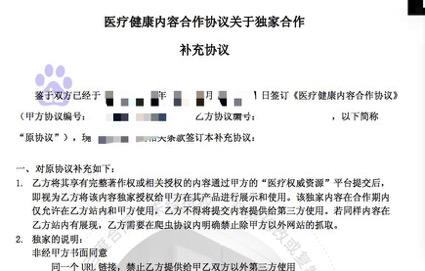

6月，甘肃公安扫黑除恶，查了6家民营医院，刑事拘留了包括院长、医生在内的25人。这6家医院，其中5家是百度喜欢的福建资本医院，都有夸大病情、加价收费，严重的还有敲诈勒索、诈骗、强迫交易，上了手术台要钱。百度虽然没有直接参与，但也间接赚了不少类似的钱。

[澎湃：临夏医疗治乱：多家被查医院现莆田人身影，莆田健康总会关注](https://www.thepaper.cn/newsDetail_forward_3659616) 

6月25日，各地高考结束。山西省招生考试中心发布提醒，考生在网上填报志愿时，一定不要使用搜索引擎搜索网上填报志愿系统网页，否则可能被假网站骗了，志愿信息无效。

[百家号·新华社：山西省招考中心：考生切勿用搜索引擎搜索填报志愿网页](https://baijiahao.baidu.com/s?id=1637301564680345129)

虽然山西省并没有明说是哪个搜索引擎，但是百度立刻回应，说我们重视高考相关信息查询的权威性和准确性，而且会在结果页面进行风险提示。这也算有自知之明。

[快科技：考生勿用搜索引擎填报志愿 百度回应：高度重视 已在显著位置展示](https://news.mydrivers.com/1/633/633313.htm)

7月9日，上海市民周先生家里老人去世，百度搜索 “上海龙华殡仪馆”，打电话要求上门服务，被收了两万块。工作人员说，这费用是国家定的。第二天，周先生到龙华殡仪馆上门去问，发现被百度误导了，那个殡仪馆是假的，他多交了一倍的钱。

[新浪科技：老人去世后用户在百度搜到假殡仪馆被骗:收费贵2倍多](https://tech.sina.com.cn/i/2019-07-10/doc-ihytcitm1063206.shtml)

8月12日，百度和快手联手，给知乎投了4.5亿美元，宣布下一阶段要和知乎站内开业务合作。用户和市场都很关心，到底是百度学知乎，还是知乎学百度。

[新浪科技：百度确认战略投资知乎 后者以小程序接入百度App](https://tech.sina.com.cn/i/2019-08-12/doc-ihytcitm8665423.shtml)

8月14日，百度股价跌出一个小低谷。331亿美元，连网易都不如，变成了国内第五大互联网公司。 

[新浪科技：网易市值超百度 成国内第五大互联网公司](https://tech.sina.com.cn/i/2019-08-15/doc-ihytcern0921436.shtml)

最近，百度的股价有所回升，但是还是不如京东。所谓BAT三大巨头的说法，基本已经终结了。

作为一个深度百度用户，我对百度提供的便利还是有一定感激的，可以说，在不能用谷歌的情况下，如果没有百度，我当不成媒体人，我工作过的所有媒体都要倒闭，睡前消息节目根本不会存在。但是，我和朋友聊天，也经常感慨百度坐在金山上不会经营，一个百度贴吧本来就可以压倒中国一切社交媒体和电商，结果被自己玩成了包袱。这只能归结为体制问题。

## 总结

在回顾百度之前，我提到了大公评级问题，最终下场是国家接管，不允许它滥用国家事实上赋予的垄断性地位。今年遇到类似争议的，还有视觉中国和知网，都是滥用垄断地位，打击信息流动，压制文化发展，

4月15日，马前卒工作室的微博和微信公号发了一篇文章，[《社会主义自留地种资本主义，养出了视觉中国和知网》](https://weibo.com/ttarticle/p/show?id=2309404361286925302574)。在这篇文章里，我提出一个想法，对于那些政府出面制造天然垄断性的企业，对于那些必然会走向自然垄断的企业，政府应该重新考虑公私合营的方案，搞社会主义改造。我们不反对企业靠市场赚钱，也承认某些行业有天然垄断性，但垄断利润必须由国家控制。百度这些年事实上享受文化垄断地位，但无论是资本运营还是文化经营，效果都不好，未必不能参考一下50年代搞社会主义改造的经验。

当然，我的想法不一定靠谱，但2019年一系列事实证明，中国现在最大的短板不是投资，不是生产能力，而是控制资源的管理水平。过去几十年，我们靠摸石头过河的方式走到今天，现在应该认真考虑一下，解决内部体制问题了，要主动设计体制，而不是自由放任。只要我们不胡乱糟蹋自己的投资能力，中国就必然是最有希望的国家。

最后，插播一条观众应该已经知道的消息，被关了5年的李宁院士，年底终于出庭。庭审只允许40人旁听，被告人张磊认罪，但是李宁拒绝认罪。现在法庭是休庭状态，准备择期宣判。

[观察者网·新华网：中国工程院院士、中国农大教授李宁及张磊贪污案一审开庭](https://www.guancha.cn/politics/2019_12_31_530013.shtml)

之前的12月12日，广东韶关学院教授娄高明的类似案件被平反，韶关法院宣布羁押972天是错误的，赔偿41万。承办法官给娄教授道歉。李宁院士到底怎么判，我们拭目以待。

[澎湃新闻：教授娄高明获赔41万：被羁押近千天后检方撤诉，法院将道歉](https://www.thepaper.cn/newsDetail_forward_5215800)

---

好，第60期睡前消息到此结束，我们下一期继续回顾2019年的中国，周五再见！