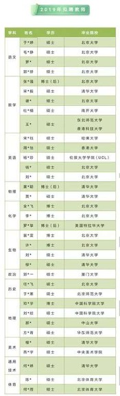

# 【睡前消息61】年终盘点（下）：那些本身就是段子的新闻

2020年1月3日睡前消息文字版第61期

::: details 【Bilibili】年终盘点（下）：那些本身就是段子的新闻
<iframe src="https://player.bilibili.com/player.html?bvid=BV1SJ411j7LB&page=1&high_quality=1" scrolling="no" border="0" frameborder="no" framespacing="0" allowfullscreen="true" height=400 width=100%> </iframe>
:::

::: details 【YouTube】年终盘点(下)：为了维持孩子的阶级稳定，清北毕业生选择去中学当老师
<iframe width="100%" height="400" src="https://www.youtube.com/embed/dCXcMts8xmE" frameborder="0" allow="accelerometer; autoplay; clipboard-write; encrypted-media; gyroscope; picture-in-picture" allowfullscreen></iframe>
:::

大家好，2020年1月3日，欢迎收看睡前消息61期。2020年的第三天，我们和2019年做一个最后告别。今天我先谈谈教育和科技。

## 目录

[[TOC]]

## 教育

### 重点大学去发达地区异地办学

过去几年，中国有一个大趋势，就是名牌大学不断向经济发达地区搬家。国家不允许整个搬过去，就分期分批地搬。先建分校，再建校区。

[新浪教育·中国青年报：投60亿 福州将迎首个985大学新校区](http://edu.sina.com.cn/gaokao/2019-05-28/doc-ihvhiqay1898318.shtml)

2019年，这个趋势继续发展。5月17日，福州市发出正式文件，宣布在福州市滨海新城建天津大学的校区，总预算60亿。

[福州市长乐区人民政府信息公开：关于天津大学福州校区项目建议书的批复](http://www.fzcl.gov.cn/xjwz/zwgk/zfxxgk/zfxxbmgk/zlszfgzbmxxgkml/zlsfzhggj/fdzdgknr/zdjsxmdpzhssqk/201905/t20190520_2891809.htm)

这种项目，地方政府一般会尽量压低土地成本，所以60亿投资非常不少了。以后福建人可以在省会读985。

过去有一段时间，异地办学收不到优质生源，2018年，在某些省份，哈工大深圳校区的分数已经超过了哈尔滨本部，可见考生对异地办学是认可的。以后，重点大学很可能会以这种方式，实际上搬到经济发达的中心城市群，既为了更好的生源，也为了更多的资金。2030年的时候，没准天津大学就要改名天福大学。

### 发达地区不得用竞价从中西部抢人才 

就在天津大学分段搬家之后不久，2019年5月28日，中央办公厅、国务院办公厅发出一个重要通知，全名是《关于进一步弘扬科学家精神 加强作风和学风建设的意见》。这个意见提出，要支持中西部地区稳定人才队伍，发达地区不得片面通过高薪酬、高待遇竞价抢挖人才，特别是从中西部地区、东北地区挖人才。

[中共中央办公厅、国务院办公厅印发《关于进一步弘扬科学家精神加强作风和学风建设意见》的通知](https://www.sohu.com/a/322157609_120029245)

> （十五）正确发挥评价引导作用。……。支持中西部地区稳定人才队伍，发达地区不得片面通过高薪酬高待遇竞价抢挖人才，特别是从中西部地区、东北地区挖人才。

从大道理上说，文件的精神我是支持的。但设身处地，如果我是文件里面提到的中西部人才，第一反应是国家不喜欢我们加薪。为国家奉献是好事，但首先应该是个人选择，而不是国家强行安排的政策，如果这个文件真的落实，恐怕中国科研人员的士气会受到普遍打击。

### 降低收入保持子女阶级稳定，是当代人才的普遍理性选择

当然，科研人才喜欢去发达城市，原因也不仅仅是现金收入。

2019年6月，中国人民大学开办了人工智能学院，发布招聘启事，招聘各种教授级岗位，年薪最高180万，还能配上400万元住房补贴。

[新浪财经：高瓴人工智能学院高薪招教授 长聘教授给400万房补（Web Archive）](https://web.archive.org/web/20190607180224/http://finance.sina.com.cn/chanjing/cyxw/2019-06-04/doc-ihvhiews6718237.shtml)

为了尽快招聘优秀人才，人民大学又拿出了一条非常给力的条件，安排教授子女进入人民大学附属的中学小学和幼儿园，这最后一个条件吸引了全国媒体的关注。 

6月23日，北京市公布2019年高考成绩， 全市文科生680分以上14人，海淀区占了10个， 人大附中占3个。全市 理科生700分以上24个，海淀区占了17个，人大附中占9个。全市理科生680分以上的302人，海淀区占了192人，人大附中占75个。

[北京教育考试院：2019年北京市高考考生分数分布](https://www.bjeea.cn/html/gkgz/fujian/2019/0623/74445.html)

可以说，子女进入人大附中，就基本锁定了一个985大学的底限，让高级知识分子实现阶级传承，所以人民大学会用这个条件招聘科技领军人物。

反过来说，如果能保证知识分子的家庭阶层稳定，就算相对降低一点待遇，他们也能接受。前面提到人民大学提供180万年薪和400万房屋补贴，考虑到最近各大公司给人工智能人才的待遇，再考虑到北京的房价，这个现金报酬并不算很夸张，可能还是子女进入人大附中的诱惑更大。

甚至刚毕业的学生也看清了这个现实，愿意放弃一部分前途，先稳住家庭的阶层。5月份，深圳中学发布2019年招聘教师名单，35个人有20人毕业于清华、北大，1人毕业于哈佛大学。（下图1）

[人民网·新京报：清华北大等名校硕博中学任教：人尽其才（社论）](http://edu.people.com.cn/n1/2019/0518/c1006-31091498.html)

【点击放大】

| 1【招聘名单】 | 2【工会活动】 | 3【深圳中学毕业生】 |
| --------------------------------------------------- | ----------------------------------------------------------- | ------------------------------------------------------------ |

马前卒工作室研究了这个现象的深层原因。

[微信公号·睡前消息编辑部：清北博士涌进中学，学历再次输给学区房](https://mp.weixin.qq.com/s?src=11&timestamp=1665979406&ver=4109&signature=rG*ms*uCns3EFKtgmEc5QdYefVWUGhAj1N7Kee-sW2aK36odSUEbYL9G8HakN54mO2xoccyDX3d7Y2TDO6vKq*ZGku37WCi6CiouhDSIuI17qFqM-ZdDdaQJcA8H922b&new=1)

根据各种公开信息，可以看到，深圳中学的年薪大概是24万元左右，未来提升空间不大，相对清华北大毕业生的预期收入而言，不算高。但是，深圳中学教师工会活动的信息显示，教师子女可以直接进入深圳中学，不用考试。（上图2）

https://www.shenzhong.net/news_78/2480.html

深圳中学的毕业生，有40%的大学排名高于中山大学，10%可以进入中国排名前10的名校。（上图3）

考虑到教师子女的水平一般高于平均数，可以说，这些教师子女基本锁定了一个较强985大学的未来。这么多清华北大毕业生去中学当老师，实际上是降低自己的预期收入，保证子女的阶级稳定性，是非常理性的选择。

### 社会的另一边：被家庭、国家和社会放弃，还可以选择去犯罪

在社会的另一边，教育和经济水平也保持了自己的同步性。2019年4月23日，甘肃陇西县渭河初中，初二学生张某在校外被五名同学打死。

[澎湃·红星新闻：甘肃少年被同学殴打致死续：双方家属就赔偿达成一致](https://www.thepaper.cn/newsDetail_forward_3403568)

这个新闻本身虽然很可怕，但我注意到一个更可怕的细节。红星新闻拿到了这个初中班的成绩表，最近一次考试，班上43个学生只有一人合格，被打的学生排名28，带头打人的学生排名垫底，七门课的平均分7.57分。很多人在走上社会之前，就已经被社会抛弃了。九年义务教育，最后几年时间纯粹是给他们打架用的。

临近2019年底，中青网报道了一个人体藏毒走私网络，来自主犯雇佣00后给自己走私毒品，从云南向长沙运一次毒品，给2000块。

[网易新闻·中国青年报：未成年人沦为贩毒"骡子":00后吞47颗毒品获刑7年](https://news.163.com/19/1230/06/F1KGAODE0001875P.html)

这个团伙一共抓到8个人，主犯30多岁，其他都是00后，8个人有5个未成年人，都来自云南文山州，共同特点是家庭贫困，父母不重视教育，没有读完中学就被拉出来打工，先是到广东上流水线，然后就有毒贩子去劝说，说在工厂干活又苦又累没前途，不如去运毒品，很快就拉下水了。

2019年还又有一个新闻的后续，就是十年前的网红苏州“杀鱼弟弟”蹲监狱了。这个孩子很早就辍学，跟着父母卖鱼变成网红。2018年，他和父母吵架，喝了百草枯，幸亏喝的不多被抢救回来。2019年1月3日，他与父亲在苏州水产门市参加斗殴，一起被刑事拘留。从年龄算，杀鱼弟现在还是个未成年人，被刑事拘留也不会判很重，但是很明显，他的阶级和发展上限在十年前就定了。

[百家号·光明日报：“杀鱼弟”被刑拘，再强调一遍：读书很重要](https://baijiahao.baidu.com/s?id=1622989327678201108&wfr=spider&for=pc)

### 小结

从2019年这些消息看，虽然我们国家不承认教育是明码标价的商品，实际上已经根据阶层划分了教育服务。上层社会嘴上不说，也承认优质教育服务可以决定下一代的阶级。下层社会买不起优质的教育，重新开始相信读书无用论，甚至默许子女辍学。现在中国暂时还有一大批简单劳动需要这些辍学少年去干，比如说杀鱼卖鱼，甚至三和大神也能打零工，干一天，玩三天，所以问题还不算太严重。不会有太多的人反社会，不会轻易参加贩毒集团。

## 科技

但是新技术来的很快，2019年秋天，我在上海交通大学看到了实用化的快递机器人，能收快递和发快递，估计很快就要开上外面的非机动车道。

[搜狐·环球网：上海大学校园首现自动送取件机器人](http://www.sohu.com/a/318856914_162522) 

今后20年，人工智能和机器人每年都要消灭上千个简单劳动力职位，没有技术的劳动力很快就要下岗了。在这种情况下，底层被教育抛弃的人口不是联合起来反社会，制造类似于香港的问题，就是被贩毒集团个别说服，变成犯罪预备队。所以我过去一年不断强调要搞社会化抚养，把父母承担不了的教育和抚养工作接过来，避免20年后出现明显的社会割裂。

### 航天相关，马斯克相关，中国成就

说到科技进步，2019年值得回顾的科技消息也不少。

2019年8月30日，俄罗斯天文爱好者根发现了一个轨道异常的天体，9月25日，国际天文学联合会承认，这个天体和2017年10月份发现的“奥陌陌”星一样，都来自太阳系之外。 

[百家号·科技日报：官宣！疑似星际彗星的确来自太阳系外，正式成第二颗星际天体](https://baijiahao.baidu.com/s?id=1645724404775666894&wfr=spider&for=pc)

这说明，太阳系接收来自其他恒星系的天体并不罕见，随着人类航天技术的进步，人类很快就会知道其他恒星附近的物质是什么样了。

6月23日，科技日报报道，在距离地球12.5光年的地方发现了两颗类地行星，都处在恒星宜居带内，很可能有液态水。这个距离从宇宙尺度来说，几乎就是邻居，银河系自己就有十万光年的直径。我们在10几光年的地方能随随便便找到类似于地球的行星，说明宇宙中和地球接近的行星千千万万。但是，到现在我们还没发现其他地方有文明的迹象，似乎在证明一个非常恐怖的可能性，就是其他星球的文明都很快灭绝了，没有能力连续几十万年向宇宙发出无线电信号。虽然我们不知道未来会发生什么，但是似乎文明灭绝是一个大概率事件。人类如果不想把自己的文明玩死，必须多加小心。

美国的马斯克坚持一个理论，就是人类必须通过移民外星来避免灭绝。现在人类努力探测的第二个行星是火星。5月份，美国火星轨道探测器发现了火星雪崩。 

[新浪科技·环球网：两颗类地行星“潜伏”于12.5光年之外](https://tech.sina.com.cn/roll/2019-06-24/doc-ihytcerk8848451.shtml)

[百家号·环球网：NASA拍摄了火星上猛烈雪崩的照片](https://baijiahao.baidu.com/s?id=1644791616457991503&wfr=spider&for=pc)

春天的阳光融化了火星北极的冰川，巨大的冰块从500米悬崖上掉到谷底，掀起一大片尘土，恰好被探测器拍到。这说明火星的确有足够的水资源，也有值得开发的太阳能，只要航天技术进步够快，未来我们的后代很可能会在火星过年。

6月5日，我国用海上移动平台发射了长征十一号固体运载火箭，把七颗卫星送上天。

[观察者网·新华社：中国航天完成首次海上发射：长征十一号成功发射“一箭七星”](https://www.guancha.cn/politics/2019_06_05_504474.shtml)

|  |  |
| ---------------------------------------------- | ---------------------------------------------- |

12月27日，长征五号遥三运载火箭在海南省发射，解决了上一次发射失败的问题，把实践二十号卫星送入轨道。这是工作室穆好古同学在现场拍摄的视频。将来中国登月和探测火星，就靠这个胖火箭了。

【视频略】 

2019年，中国的小型探测器已经在月球表面登陆，而且是人类有史以来第一次月球背面软着陆。之所以中国能用较小的火箭探测月球，是因为我们事先发射了一颗更远的微型卫星，龙江二号，侦察月球背面的情况。龙江二号撞击月球之前，给人类发回了一张漂亮的地球和月亮合影。将来的人类历史会记得这张照片。 

 

当然， 2019年最重要的航天进步，基本上都是美国的马斯克团队干的，我们之前做过很多期详细介绍，这里就不多说了。虽然马斯克在进一步拉大中美之间的技术差距，但是从历史来看，人类航天技术进步最快的年代是冷战年代，我们应该感谢太平洋对面有一个优秀的的竞争对手。

### 高温超导突破

去年还有一些值得记住的重大科技进步，5月份，《自然》刊登了美国德国合作的论文，在零下23度实现超导。

[^Drozdov A P, Eremets M I, Troyan I A, et al. Conventional superconductivity at 203 kelvin at high pressures in the sulfur hydride system[J]. Nature, 2015, 525(7567): 73-76.](https://www.nature.com/articles/nature14964)

我写稿的时候查了一下，黑龙江根河市，现在的温度零下25度，已经可以超导了。所以，虽然美国这次试验的条件很苛刻，需要170万个大气压，但依然是非常惊人的进步。期待我们下一代的电力设备都用上超导元件。

### 首次太空犯罪

不过，2019年的科技也带来许多新的问题。比如说，8月24日，纽约时报报道，美国女宇航员利用太空互联网技术，在未经允许的情况下，侵犯自己地球上同性伴侣的银行账户。制造了人类首次太空犯罪。

[观察者网·赵挪亚：首起“太空罪案”！女宇航员从空间站入侵同性配偶账户遭调查](https://www.guancha.cn/internation/2019_08_25_515149.shtml)

### 巴尔的摩市的教训

5月7日，美国巴尔的摩市政府网络遭到了黑客袭击，被勒索10万美元的赎金，要求比特币支付。

[站长之家：美国巴尔的摩市服务器遭黑客攻击，勒索约10万美元比特币遭拒绝](https://www.chinaz.com/sees/2019/0527/1019254.shtml)

巴尔的摩市政府担心以后被持续敲诈，宁可整个城市的市政系统崩溃两周，花600万美元升级系统，也不交赎金。马前卒工作室专门写了一篇文章谈这件事。

[微信公号·睡前消息编辑部：人类最好的过去、最差的未来，都在美国巴尔的摩](https://mp.weixin.qq.com/s?__biz=MzU4MTU1NzI4Mw==&mid=2247490335&idx=1&sn=0d61940ea0e4cc41bc9fa422ac961d86&chksm=fd449653ca331f45e0babe1ee780eef35db31b11a123885f1c81f741fb35cd0d8d6d23f2eb5a&token=410690256&lang=zh_CN#rd)

巴尔的摩曾经是美国最重要的港口和铁路枢纽，一度是美国第三大城市。现在巴尔的摩市所在的马里兰州也是美国人均收入最高的州，家庭收入中位数7.89万美元。所以巴尔的摩市的市政系统很早就进入了信息时代，2000年左右就有一套全面的数字化监视系统，用大数据管理城市。中国的市政计算机网络就学习了巴尔的摩市的经验。（下图1）

|  |  |
| ---------------------------------------------- | ---------------------------------------------- |

但是，因为美国工业空心化，大量产业向亚洲移动，巴尔的摩市基于港口和铁路建立的工业区迅速衰落，原来优质的黑人体力工人集体失业，在巴尔的摩市中心制造了一个几十万人的衰落社区。这个马里兰州最大城市就像1999年的沈阳铁西区，日常被黑帮统治，每年都要爆发种族冲突。

2015年时代周刊有一篇封面文章报道了几十年来最大的种族冲突（上图2）。2017年，巴尔的摩升级成美国最危险的城市，每万人有5.2个人被谋杀，犯罪率比芝加哥还高一倍，市民找不到工作也交不上税。所以巴尔的摩市的市政系统没钱更新，停留在21世纪初的水平，非常容易被掌握新技术的黑客侵入，今年的勒索事件几乎可以说是必然结果。

### 小结 | 教育要跟上社会进步

巴尔的摩市的问题，和我前面提到的云南未成年人贩毒事件一样，本质上都是一部分人口接受的教育跟不上社会进步，最终被社会抛弃。美国经济抛弃过巴尔的摩和其他地方数百万黑人蓝领，抛弃中东部的几千万体力工人，结果出现了罗斯福以来最严重的内部矛盾。中国不能再重复美国的错误。

解决教育和社会割裂问题的办法有很多，但有一点是肯定的，不能把跑在前面的优质教育拖回来。比如说解散人大附中，这显然不是聪明的做法。所以，国家必须下决心，用中央财政来垂直管教育，让落后地区的教育水平尽快追上来。虽然最终还是有人学习好，有人学习差，但至少要让排名靠后的人也掌握一定专业技能，不会被自动化设备淘汰。否则科技进步越快，社会越割裂，美国就是我们的反面典型。

在年终盘点的最后，我们看看2019年比较轻松的旧闻。首先请静静帮我读一条。

## 国际旧闻

### 🇺🇦乌克兰总统学习乌克兰语

**4月23日，乌克兰喜剧演员弗拉基米尔·泽连斯基当选总统。他当选的第一件事就是学乌克兰语， 因为他在苏联时代出生，真正的母语是俄文，小学二年级上乌克兰语课，才听到标准的乌克兰语 。**

[澎湃·海外网：泽连斯基胜选后，开始拜师“恶补”乌克兰语](https://www.thepaper.cn/newsDetail_forward_3333988)

### 🇷🇺俄国人修假哨所收移民智商税

12月初，俄罗斯出现一种新型犯罪。一个人在边境很远的地方修了一个哨所，然后把非法移民带到哨所附近，让他们交钱，说走过去就是芬兰，是欧盟的地盘。至少有4个移民，每人给他10000欧元。这份智商税收的非常给力。

静静轮到你了。

### 🇻🇪委内瑞拉政变失败 | 40个人想当总统，却没一个人领头

**4月30日清晨，委内瑞拉军人企图在首都加拉加斯企图发动政变，很快失败。事后，美国委内瑞拉问题特使艾布拉姆斯接受记者采访，总结了失败原因。他说，本来委内瑞拉有一大批重要人物要参加政变，但是政变开始的时候，他打电话过去，这些人都关机了。**

[网易新闻·观察者网：美国特使抱怨:关键时刻 委内瑞拉"叛徒们"大都关机](https://news.163.com/19/0504/07/EEAK43EC0001875O.html)

**但是，风头一过，这些大佬又重新跳出来。《华盛顿邮报》6月5日报道，蓬佩奥在纽约开会，说在委内瑞拉搞政变，最难的事情是想当总统的人太多。马杜罗一旦离开，就会又有四十人宣布自己是总统。看来委内瑞拉反对派总是失败，不是因为人少，而是都等着别人先出手。三个和尚没水喝，40个更没有。**

[观察者网·徐蕾：蓬佩奥抱怨：团结委内反对派太难，40多人争当“总统”](https://www.guancha.cn/internation/2019_06_06_504634.shtml)

### 🇰🇷韩国运动员对自己人也犯规

接下来我们看看韩国。过去几年，我们经常看到韩国运动员犯规作弊，影响别人成绩的消息，在滑冰项目上尤其严重。3月4日，世界大学生冬季运动会，韩国选手再次出手，不过这次两名选手都是韩国人，争抢位置摔倒，共同出局，第三名是中国人选手安凯，利用机会抢到金牌。事实证明，韩国运动员是真喜欢犯规，而不是对外国人犯规。

[搜狐·观察者网：又内讧！韩国选手双双摔出赛道，中国选手夺冠](http://www.sohu.com/a/299323857_115479)

### 🇰🇷韩国人侮辱慰安妇，却假装自己是日本人台湾人

去今年，日韩因为二战慰安妇历史问题产生很大争论，7月6日，四个人来到汉城郊区的慰安妇少女铜像，做出侮辱性动作。有市民制止的时候，用日语回骂，还有一个人自称来自台湾。没想到，警察通过摄像头信息找到了这四个人，发现全都是韩国人。如果不是现在的人脸追踪技术太先进，估计这又是一次永远说不清的东亚民族冲突事件。

[观察者网·赵挪亚：装成日本人、台湾人侮辱慰安妇少女像，结果4人全是韩国人](https://www.guancha.cn/internation/2019_07_08_508616.shtml)

### 🇺🇸黑人说中美竞争是种族文明冲突

**5月5日，美国国务院政策规划主任，凯润·斯金纳（Kiron Skinner）发表演讲，说中美竞争和冷战不一样。因为苏联人也属于西方文明，冷战是西方文明内战，现在是两个文明，两个人种之间的斗争。虽然类似的右翼胡话在中美两国的互联网上都常见，但这次的发言者是个黑人，让人很难理解她到底站在哪一边。**

[新浪·环球时报：美高官此言一出全国震惊：这白送中国“子弹”吗](https://news.sina.com.cn/c/2019-05-05/doc-ihvhiqax6773966.shtml)

### 🇺🇸爱泼斯坦家里藏了个女装总统画像

2019年，搞不清自己身份的美国人还有很多，比如说上一期我提到爱泼斯坦给美国政界人物提供未成年人性服务，被逮捕之后很快自杀。美国警方检查爱泼斯坦的豪宅，发现一副前总统克林顿的油画。这幅画上的克林顿穿着一套蓝色裙子，酷似当年莱温斯基的形象，目前还不知道爱泼斯坦为什么要把女装总统挂在墙上。

[新浪财经·参考消息：辣眼睛 爱泼斯坦家中惊现一幅“女装克林顿”奇怪画像](http://finance.sina.com.cn/roll/2019-08-15/doc-ihytcern1100779.shtml)

### 🇬🇧英国脱欧欲拒还迎

**2019年，欧洲最大的新闻是英国脱欧。但是英国两党意见不一，来来回回的折腾。** 

**法国对英国反反复复也受够了。英国《独立报》3月18日报道，法国欧洲事务部长娜塔莉·卢瓦索说自己有一只猫，每天早上吵醒她，要开门。但开门以后又不肯出去，被赶出去还要抱怨。所以，卢瓦索决定，把猫取名Brexit，也就是英国脱欧的缩写（British exit or Britain exiting from the EU）。蛋卷以后要是这么干，我们就叫它“首相”。**

> 督工：Yes, Prime Minister! 　　　　蛋卷：😿

[观察者网·童黎：法国欧洲事务部长给猫取名“英国脱欧”：吵着要出去，门开了却不动](https://www.guancha.cn/internation/2019_03_19_494141.shtml)

首相鲍里斯·约翰逊当选的时候宣布过， “英国无论如何都会在10月31日脱离欧盟”。为此他花500英镑订购了一个倒计时器，以秒为单位显示还有多久脱欧。但是，现在2020年了，英国还在欧盟之内，不知道约翰逊怎么处理这个倒计时器，也许上面显示的数字是负的。

## 国内段子

### 台湾傻事：木筏反登陆、投诚方便面

**接下来我们看看国内的精彩段子。5月29日，台湾军方举行“汉光演习”，例行练习反登陆。但是，和以往不一样，台湾这次演练是军民结合，把渔民的木筏连接起来，拖到港口附近，企图截断航道，充满了三国演义的风格。**

之前的4月14日，台军展示了用来招降解放军的“投诚食品”。我直接请大家看图，就不一一介绍了。

[网易·海外网：台军要拿一包方便面"招降"解放军？台网友看笑了](https://news.163.com/19/0414/17/ECO6FQR90001875P.html)

|  |  |  |
| ------------------------------------------------------------ | ------------------------------------------------------------ | ------------------------------------------------------------ |

### 河南贫困县项目层层转包，4000万变10万

今年最魔幻的段子，还是我们河北省的。6月24日，导演陈熙在公众号发文，说张家口市万全区要拍一个投资4000万的冬奥会水幕电影，层层转包，最后包到自己手里负责。但层层转包以后，陈熙连十万报酬都不能结账，只能上网抱怨。

[凤凰网·界面新闻：贫困县4000万拍电影献礼冬奥遭层层转包？官方回应（Web Archive）](https://web.archive.org/web/20190624134548/https://news.ifeng.com/c/7nlsJzaaxvf)

7月5日人民网报道，张家口万全区区长张志友被审查，可见拖欠工资是一件风险很大的事情。

[人民网·新华网：张家口市万全区区长张志友接受审查调查](http://politics.people.com.cn/n1/2019/0705/c1001-31217302.html)

### 儿子贪污，母亲捡废品 | 动用财政资金出版个人文选

今年还有两名地方干部展示了自己的喜剧才能。2013年，央视《朝闻天下》报道过“县委书母亲捡废品”。说汶川县青理东书记工作忙，没时间陪家人，老人为了打发寂寞，只好隐瞒身份在儿子的“地盘”上天天捡废品。3月1日，已经升为厅级干部的青理东被检察院公诉，罪名包括受贿、滥用职权、巨额财产来源不明。

[网易·北京头条："母亲捡废品"的汶川原书记被诉:巨额财产来源不明](https://news.163.com/19/0301/17/E96U6I5M0001875N.html)

11月2日，《中国纪检监察报》报道了江苏射阳县前县委书记徐超的案情，贪污腐败就不说了，其中一条罪名是动用财政资金出版《徐超文章选编》26卷。

 [网易·澎湃新闻：江苏一名县委书记获刑 曾用财政资金编辑个人文选](https://news.163.com/19/1102/12/ESVPT6JO0001899N.html)

看这两位县委书记，简直是从古代明清笔记小说里面走出来的人物。

### 幼儿园也要查涉黑

**5月28日，无锡市的一份官方表格上网，要求幼儿园调查儿童涉黑情况。当天下午，无锡市委宣传部新闻处表示表格属实，是信息传递中出了错误。**

### 假中医以身证道驾鹤西归

2019年11月11日阳光森林生物科技有限公司董事长林海峰在云南丽江意外身亡，终年51岁。林海峰是中国第一批安利销售员，自称中国长寿专家组营养专家，大力推广自己创造的“整体自然疗法”。他有一句名言：人体“有孔的地方都是排毒的出口”，无论什么病，都不需要去医院，只要想法排出毒素就可以。

出事前几天，林海峰在微信朋友圈发了一条动态，说吃了一包过期的红枣，“全身僵硬”，但他没有去医院，通过呕吐的方式恢复了健康。现在看来，林先生也算是以身证道，值得敬佩。

[观察者网·界面新闻：“自然疗法大师”林海峰意外身亡：曾鼓吹断食排毒](https://www.guancha.cn/politics/2019_11_30_526947.shtml)

**2019年，广东也有一位类似的医生，虽然无证，但是言行合一，敢于尝试。7月11日，韶关一名患者因为腰疼，到这家非法诊所治疗骨质增生，医生拿出一些药粉给她口服，事后患者觉得头晕，质疑药粉有问题。医生对质疑非常不屑，自己当场吃掉一勺，很快倒地不起，送到正规医院也没救过来。**

[观察者网·广东DV现场：广东韶关假医生欲证明自己的偏方安全，吃下一口后中毒身亡](https://www.guancha.cn/politics/2019_07_17_509828.shtml)

## 两个冷段子

我再分享两个有借鉴意义的冷段子。

### 被五步蛇咬伤后男子斩断手指——完全没必要，六小时内就医就不会有问题

10月份，杭州山区一位农民在山上干活，被五步蛇咬伤，他非常果断，一刀砍掉食指，然后去医院看病。医生给他治好了伤，但是没保住手指，很惋惜地发了一篇文章，提醒大家不要被民间传说误导，最毒的银环蛇，只要6个小时内有正规医院解毒，也不会死人，五步蛇更不是走上五步就死。现在手机这么普及，能联系到医院就不要急着对自己下刀。

[新浪·澎湃新闻：男子被五步蛇咬伤后斩断手指 医生：完全没必要](https://news.sina.com.cn/s/2019-10-28/doc-iicezuev5496550.shtml)

### 车在门前掉头破坏风水？——引得一众司机纷纷在其门前掉头打卡

**5月30日，广东新会，一个女司机开车在一户人家门前调头，被房主攻击，说破坏了自家的风水。视频上网以后，当地司机纷纷绕路到这条街道，专门在这家门前调头，汽车电动车摩托车为了调头打卡，甚至排起长队。如果不影响交通的话，这真是一场非常好的反迷信快闪游戏。**

[中国小康网：男子自家门前阻止司机掉头称“破坏风水” 民警呼吁不要盲目跟风](http://news.chinaxiaokang.com/shehuipindao/yuqing/20190531/702166.html)

## 两个预言

最后我们记录2019年的两个预言。

### 山东民众放飞航母风筝 舷号17——新航母真的是山东号 舷号17

4月20日，第36届潍坊国际风筝会开幕，山东潍坊人民制作了一艘航母风筝，甲板上有舷号17。年底国产航母下水，真的是山东号航母，舷号17。山东人民实现了预言

[观察者网·高雪滢：“航空母舰”试飞成功： 航母风筝亮相潍坊风筝会 被称“最硬核风筝”](https://www.guancha.cn/politics/2019_04_21_498538.shtml)

### 中国乒乓无敌

4月28日，布达佩斯世乒赛，中国包揽五个项目的冠军。刘国梁第一次以中国乒协主席身份带队参加世界大赛。赛后总结，刘国梁对记者说，无论世界怎么乱，中国乒乓球不会乱，做好自己，强大自己，成绩就会越来越好。希望刘主席的预言和山东人民一样，都能在2020年变成现实。

[网易·澎湃新闻：国乒包揽世乒赛五金 刘国梁:世界怎么乱国乒不乱](https://news.163.com/19/0429/13/EDUDSNDU000187VE.html)

[新浪·新华社：刘国梁：对日本一直有正确评估 做好自己强大自己](http://sports.sina.com.cn/others/pingpang/2019-04-29/doc-ihvhiqax5658504.shtml)

---

好，2019年年终盘点到此结束，感谢各位收看。下一期我们开始关注2020年的话题，周日晚上再见！