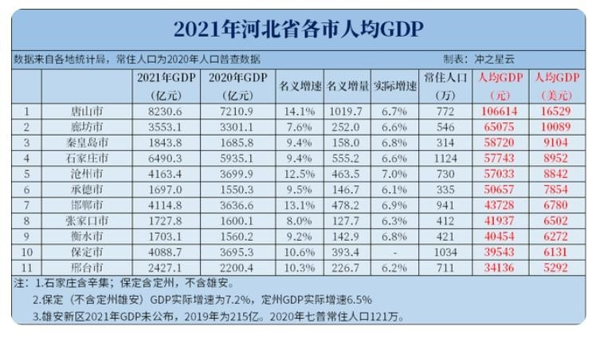
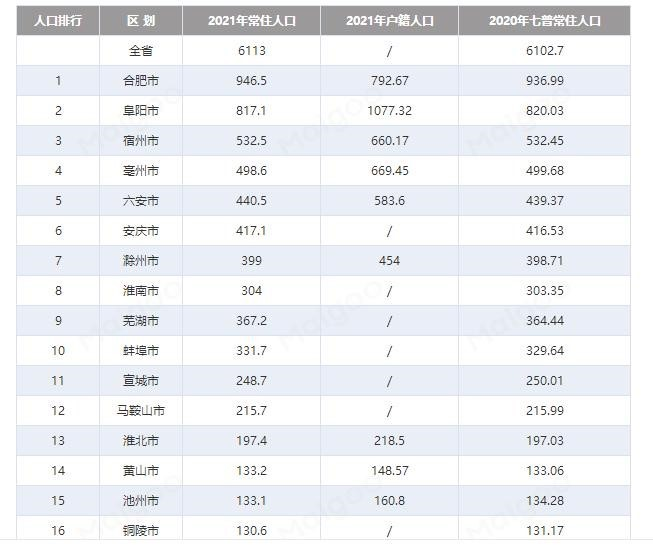
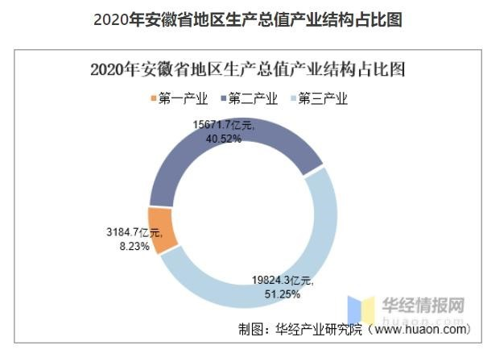

# 2022 年第零期 | 总第零期 试刊

2022 年 7 月 17 日

## 目录

[[TOC]]

## 黑马奖

### 马督工《睡前消息》三周年视频观后感（节选）

- 作者：[合川老农民norlanseed](https://user.guancha.cn/user/personal-homepage?uid=265502)
- 平台：[观察者网风闻社区🔗原文](https://user.guancha.cn/main/content?id=804349&s=fwtjgzwz)

> 首先，马督工起手给自己搞了一波无辜人设，列举了自己几个争议比较大的视频背后的真正作者（就是他工作室的员工），然后表示自己只是个念稿子的，却要承担被网友骂的职责。
>
> 马督工此番起手行为，颇有一种将自己工作室员工抬到台前来作为挡箭牌使用的味道。
>
> 按照马督工的说法，这些稿子都是我自己小编写的，里面的内容都是他们自己的个人观点，我任同学就是个念稿子的。
>
> 潜台词大概就是：你们骂错人，要骂骂我家小编去。
>
> 讲真，你作为睡前消息的老板，员工写出来的内容不经过你的审核和同意，能发出来？你难道忘了在高超那几期节目你是怎么跟高流闹分歧的?
>
> 敢情被人称呼为媒体战士的时候，就你上；视频有争议的时候，你就把员工实名抬出来背锅？而且这个实名抬出来真的是绝了，难道你就不怕某些网友去网暴这些为你辛辛苦苦码字的下属吗?

## 合订本

### 阆中拍卖食堂 | 普通中国城市没钱了

7月9日，[第455期睡前消息](https://www.bilibili.com/video/BV1MW4y1S79Z?spm_id_from=333.999.0.0)，我们分析了阆中核酸自费，标志着“普通”中国城市没钱了。数位观众都给我们提供了阆中拍卖食堂的新闻，恕不一一@。

以及阆中本地媒体转载了马督工的分析：

[【抖音】阆中网：从省会跌落五线城市，GDP不足300亿，叫“阆中”却医不好自己？](https://www.douyin.com/video/7118255760290745608)

## 观众社论

### 马督工对房产税的观点解说及个人见解-房主可以自己决定房产税税额吗？

- 作者：[还不多发点](https://www.zhihu.com/people/qian-nu-wu-hun)
- 平台：[知乎🔗原文](https://www.zhihu.com/question/396602325/answer/2579521052)

#### 摘要

马督工暴论频出，很多观点都被各方批判，其中有关房产税的观点，也不乏有人不赞同。但就我个人观察来看，大多数批评马督工房产税的人，都没提最关键的一点：他建议房主自己决定房产税税额。这句话单独拿出来，很是荒唐，但是基于一定条件下的社会模型，这个反而是我所见的最优解。

本文将分为两大部分：一是马督工观点的解说，二是笔者个人的见解。而前者原因又分为，原因解说和税收操作解说两部分。

PS：毕竟我只是一个观众，不是马督工，对其观点的解说可能有错误的地方请指正（这里主要是马督工指正），以及马督工或我的观点有不妥之处，也请每一位朋友有理有据批评。

#### 一、马督工房产税观点解说

##### 1.1 收房产税的原因

###### 1.1.1 公共建设支撑的房价。

房子的价值来源于周围的基础设施（如学校医院，商场、交通站点），而基础设施修建资金来源于财政，所以良性循环就是房主交钱给财政，财政修建基建，基建促使房价保值或升职，房主因此享受保值或升值部分（租客也享受基础设施，但享受付出了成本就是房租不降或涨，损利平衡）。我们收的是土地出让金，财政只在第一步收钱，后续房子升值，就没多大关系了。但是基建不只是建还有维修和保养，这就出现已建成生活区要依靠新土地的出让获得维护支出，这是拆东墙补西墙的做法。一旦能买出的地都卖光了（城市停止扩张），整个已建成的生活区岌岌可危。

###### 1.1.2 如同中彩票的城市房。

绝大多数城市拆迁户的房子在房地产爆发前是不值钱的，而房子变的值钱也不是房主自己努力出的，是政策倾斜加外来工漂撑出的。这就如同房产中了彩票一般，让房主获得了意外财产增值。凭什么一二线原住民比三四线幸运，凭什么城市居民比农村居民幸运，我们说分配方式的时候可没说运气也算在里面。

###### 1.1.3 劳动者与受益者错位。

房价靠基础设施，基础设施靠财政，但现实情况是，基建财政的绝大部分的租客支撑的（租客劳动力量远大于房主），他们来城市务工，自身交税以及工作的企业交税，这才让城市财政有钱修建。基建受益者是房主，而劳动者绝大多数是租客，这就出现劳动付出者和收益者错位。

综上所述，从谁付出谁受益的公平角度，更为了城市建设的良性循环，应该收取存量税。

以上这些观点马督工和其他支持房产税的博主大体一致，只是马督工在不同期节目，各说一些，我在这里汇总加起来。

##### 1.2 收房产税的操作建议

###### 1.2.1 房主自己决定房产税税额。

房主自己对自己持有的房产进行资产评估上报（限定时间内不可更改），高低由你。政府按照区域划定统一税率，两数一乘，税额就出来了。

###### 1.2.2 集体可以随意强收房产。

当遇到集体事件，如修路征地，老小区安装电梯，若遇到某家不同意，收益方集体可以以一定的比率（可以是1.5也可以是2，但像税率一样一个区域要统一且固定）乘已上报的房产价格强买此房。

马督工作为一个万物皆应量化的老土木，在房产税这里充分体现了他的量化观。就如同用不同孔眼大小的滤网，筛选特定大小的筛子，用房主不愿多交税的心理，确定房价上限，用房主担心房子可能被强制收买的心理，确定房价的下限。

#### 笔者的观点

##### 2.1 优点

###### 2.1.1 消除围观者的同情。

你既然这么看重这套房子，为啥不多交税，之前贪便宜，现在哭给谁看，我都交了那么多税了，你怎么不交。

###### 2.1.2 准确评估房产对房主的价值。

双滤网让房主对房产的价值评估自动趋于准确。这样房主为了不亏损，就会自己去用尽一切信息，去准确评估价值。甚至这个方式还量化了房主对房子的情感价值，若很喜欢，就多交税，让收购变成不可能喽，毕竟其他人没必要为房主个人的喜恶买单。

###### 2.1.3 节省评估花费

同时房主自己定价，还节省了开发的前期评估费用，对于住宅，只要评估该地区统一强制收购的比率就行，甚至若比率全国统一，连这一步都免了。也免去被控诉评估不当的麻烦。

##### 2.2 缺点

###### 2.2.1 价格定了就是定了，没有一点商量的余地，你一离开这个房就嗝屁也没法。

###### 2.2.2 执行漏洞带来的问题会不会让情况恶化，毕竟没有理想的条件。就现在暴露出的各种管理问题，谁也对一个几乎影响所有人都政策抱有不信任感。

总之，笔者认为马督工的房主自定税就是我见过的最好的选择（如果您有更好的，请讲，不要只说一句，那是你见的少）。

不能因为一个政策不能因为它会损害现有所有人就不去考虑它，也不能因为条件没有完美满足就等待，要去衡量利弊大小。就如同计划生育，在当时绝对是非实施不可，但是可以说它损害当时几乎所有人利益，也可以说当时决定没有完美的条件去依托它，但我们还是要去做。

当然利＞弊，不意味着我们就不管弊，因为很多弊不是客观无奈的弊，而是主观导致的错。比如说全州县，湖南省让外国人“收养”超生儿，这是计划生育的客观弊吗？不是，这是人为的错，这是明明可以避免的。又比如说上海疫情期间蔬菜被倒卖，民众送医不及时，这是防疫的客观弊吗？不是，这是错。

所以我们需要完善这个方案，尽可能的考虑一切会发生可避免的错，不让前期规划“缺位”（高流说航天缺位+越位问题，其他又何尝不是呢？）。

## 线索

### 小镇做题家——产地解析

- 作者：[会飞的刺豚](https://space.bilibili.com/307231720)
- 平台：Bilibili
- 联系方式：2975830725@qq.com

小镇做题家最近被大家纷纷提及，目前个人了解的三个很有名的“小镇做题家”产地分别是河北衡水的衡水中学，安徽六安的毛坦厂中学和河南周口的郸城一高。为什么这三个地方是“小镇做题家”的产地，我很想知道答案，所以我从以下几个方面试图探寻答案。

#### 方向一，人均GDP

因为各个学校所在市的人口不同，计算GDP总量我觉得不合适，就从人均GDP入手。

|  |  |  |
| ------------------------ | ------------------------ | ---------------------------- |

从以上三个图可以简单看出，河北衡水的人均GDP在河北排名倒数第三，人均 40454元；安徽六安人均GDP在安徽排名倒数第四，人均4.38万；河南周口市人均GDP在河南排名倒数第一，人均38761元。从人均GDP可以简单看出，“小镇做题家”产地的第一要素就是贫困，三个地方的人均GDP在各个省都基本处于垫底的存在，所以经济条件催生了“小镇做题家”的产生。

#### 方向二，人口总数

一个有名的“小镇”学校，生源需求是很大的，所以当地的人口可能也是因素之一。

|  |  |  |
| ------------------------ | ------------------------ | ------------------------ |

如果从人口总数上来看，河南周口市和安徽六安市在人口总数上占据优势，人口总量在省内排名前列，而河北衡水在人口总数上并不占据优势，人口总数排名靠后。所以按照开始的推论进行论述，人口总数在郸城一高和毛坦厂中学是成立的，但是河北衡水却不支持上述论断，所以我在想衡水是不是面向全省招生，以解决当地人口基数小的这个问题。

#### 方向三，产业结构

|  |  |  |
| ------------------------ | ------------------------ | ------------------------ |

三个市的产业比例几乎都是以第三产业为主，其中周口市第三产业与第二产业相对一致。而且在三个城市中，第一产业几乎都在15%左右。三个地方的第一产业占比，都高于全省平均第一产业占比。是不是可以大胆的估计一下，第一产业的占比与“小镇做题家”有很严密的关系在这三个地方。第一产业又与城镇化率息息相关，我查了第七次人口普查数据。三个市的城镇化率都显著低于省平均水平。小镇做题家的产地，一般要满足，一，当地第一产业占比较高，城镇化率低的地区；二，人口基数较大的地区；三，人均GDP较低的地区。

- 2019年年末人口，衡水的常住人口城镇化率为53.2%，比上年提高1.2个百分点。
- 2019年年末人口，河北的常住人口城镇化率为57.62%，比上年末提高1.19个百分点。
- 2019年年末人口，周口市城镇化率达到44.36%。
- 2019年年末人口，河南居住在城镇的人口为5507.9万人，占55.43%。
- 2019年，六安市常住人口487.3万人，城镇化率47.09%，
- 2019年年末人口，安徽省常住人口城镇化率55.81%，提高1.12个百分点。 

|  |  |  |
| -------------------------- | -------------------------- | -------------------------- |

## 段子

### 可以把造飞机比喻成包饺子

<BiliComment name="呵呵起个名这么难（B站）" content="可以把造飞机比喻成包饺子。  当我们的包饺子技术还有大片空白，生产饺子的产业链没有完全搭起来时，一味的追求国产化是有问题的。 好比要开一家饺子店，我们第一年的选择，应该是买一些饺子皮，再买一些饺子馅。包起来以后卖掉。在这个过程中我们没有擀饺子皮和做饺子馅的核心技术，所以利润微薄，但好歹是能撑起饺子店。一片饺子皮1毛钱，一份饺子馅5毛钱，一个饺子卖一块，我们就有利润。拿着这些利润，第二年就可以搞饺子技术升级。第二年我们可以依旧买饺子馅，然后买一些面，试着自己擀饺子皮。这样节省下来的成本可以作为下一年的研发成本。再一年就可以自己买牛肉大葱回来拌饺子馅，又多掌握一项技术。  在这个过程中，一方面可以持续性开发，维持住原有的人员队伍；另一方面由于技术的升级提高了利润，可以雇佣的伙计也越来越多，逐步掌握包饺子的全产业链技术。相反，如果一开始就要求从底层做起，我要开饺子店，第一年开始学种麦子、种大葱、学养牛。且不说能不能搞出来，这套队伍都难撑下去，让人觉得遥遥无期" time="1小时前" like="51"/>

<BiliComment name="呵呵起个名这么难（B站）" content="顺带一提，我司一般开会只说二幺 九幺九 九二九，所以带不带R影响不大[猫头]" time="1小时前" like="10"/>

左手王配图：

