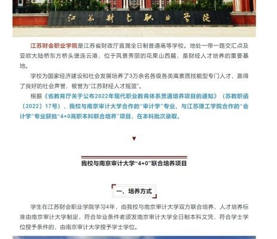
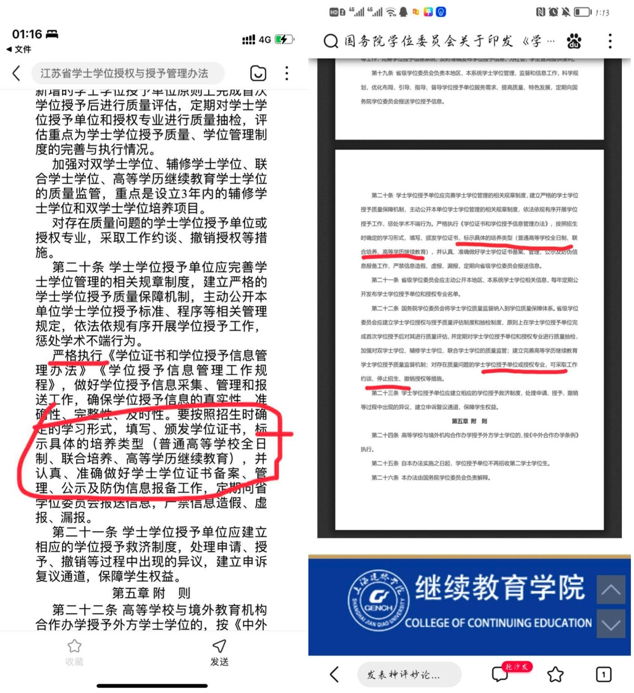
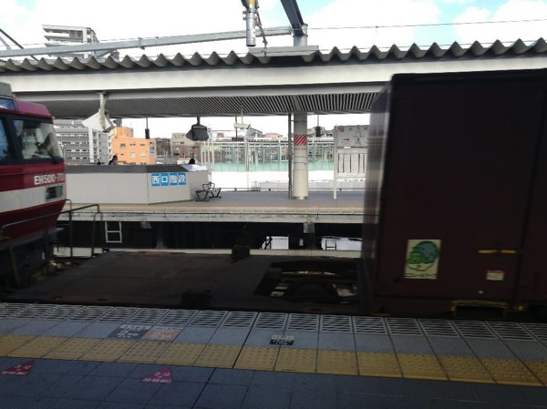
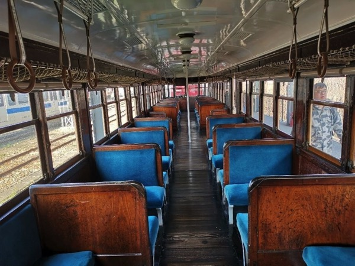
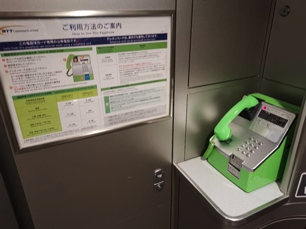
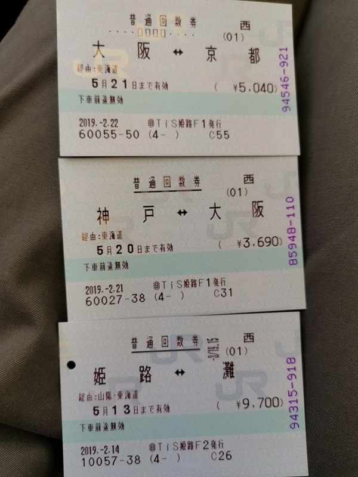

# 2022 年第一期 | 总第一期

2022 年 7 月 25 日

## 目录

[[TOC]]

## 黑马奖

### 如何评价睡前消息 460 期？ | 小镇做题家

- 作者：[董恩威](https://www.zhihu.com/people/dong-en-wei)
- 平台：[知乎🔗原文](https://www.zhihu.com/question/544230670/answer/2583206744)

这期稿子一看就是秃头咪蒙写的，文章风格很有他自己的套路，通过扯一些并没有直接相关的东西貌似打了一个虚空的靶子。之前很早就在构思一些全面评论他想法的文章，正好借着这个机会写一点罢。

我认为，督公说的很对，但很遗憾，这是真空当中的球型鸡。为了达到督公的理想状态，我们首先需要大幅度降低管理成本、全面移风易俗、并且物理清除掉绝大部分不能适应这套管理体系的人。我可能正好是他的反面，从小接受广博的素质教育，初中开始每学期班级组织游学一次，高中更是开了一百多门选修课。因为学校性质的原因，大学差不多也聚集了全国最少的小镇做题家。自己在还不错的高校这个小社会里搞it，老婆在地方政府工作多年。碰巧还去过以色列参观过社会化抚养的先驱，基布兹。算是有资格评论一下督公的这套理论了。

督公很贴心的为他的视频制作了十个小标题，我们正好一一来讨论。

#### 一、“小镇”是什么？

督公认为，小镇青年是认识到自己生活在主流社会的外围边缘。努力利用应试教育体系摆脱边缘身份。

这个说法我认为有待商榷，但无伤大雅。实际上社会阶级并未真正的广泛拉大，只是因为近十年来互联网的高度发达，让原本就存在的阶级差距被成倍放大了而已。而感谢算法推荐，让绝大多数真。小镇青年反而根本不在意也没有能力改变，阶级差距已经达到连梦想都不配有的地步了。当看到有小学能够在鸟巢办运动会、开学典礼有院士发言时，我想即便是北京一般的小学生家长，都会心生出“小镇做题家”之感。然而院士也是有孙子的，鸟巢也只是北京的一个比较大的体育场馆。这是一种“正常现象”，只是之前未被曝光而已。我认为“小镇青年”大致可以划成除了拥有中国最顶尖教育资源的那批人之外的所有其他尚有考试能力的人，能被叫做“做题家”的，大致也得是双一流学校的学生了。他们不一定生活在主流社会的真正外围边缘，而是真正的主流社会本身。只是被新媒体成倍的聚焦了“主流社会”的范围。他们被放到了高考这条赛道上，考上之后四年也真的至少在形式上和所有人人人平等，享受同样的教育，吃同样的食堂，翘同样的课，拿同样的奖学金挂同样的科。至少在这如梦一般的四年里，在学校事务内部可能也的确真的做到了平等。

::: warning 马督工点评

一言以蔽之，小资产阶级，不上不下。对上要平等，对身后的人有戒心。如果能反过来就是革命精神。

:::

#### 二、“做题家”的世界观

督公认为，小镇做题家本身就是在内卷的考试中胜出，在互联网大厂结束扩张后内卷无效化竞争之内开始卷基层公务员岗位。并且维护这个考试体制本身。

这里有很多事实很生艹，但结论问题不大。能被互联网大厂减员影响到的小镇做题家真正内卷的，一般也是中直岗位和东部发达地区的基层岗位，我监考了几年国考和京考，至少在我们这国考还是明显比京考热很多的。而计算机行业也远还没内卷到要去考基层公务员的程度。我们部门最近在招人，这个我还是有发言权的。但就整体上看，2022年的就业形势确实要成倍严峻于2021年，真实原因那肯定就是最近发生的事了。

::: warning 马督工点评

你这发言就显得年轻，80 年代考生也只有一个想法——考大学，进城当干部。关键指标不是经济是否繁荣，而是体制内外提供增量的比例。

体制外的企业，没利润就不融资。体制内的政府，没信用也可以融资造奇观，所以核心问题是地方政府不能破产顺便遣散所有地方公务员。

:::

#### 三、“做题家”与编制 四、 进士轻薄？ 五、王安石的反击

督工认为，“小镇做题家”要求自己熟悉的考试制度能够包括所有的体制内上升通道，公务员考试制度是相当于是古代的科举制度。

这里就在偷换概念了。我国公务员制度和古代最大的区别就是官吏不分，现代公务员考试制度实际上只是在选拔“吏”这个层面的东西，他们是办事员而非决策者，只有当你满足组织考验你才有可能变成决策者。而科举考试实际上是考取政治家，他们不负责具体事务。具体的施政从来就是通过吏员来完成的。而吏员在古代可是从来就没听说过要考试，都是家学渊源，公务员体系也是通过大大增加办事人员的专业化程度来完成的。为此增加的公务员考试和为了选拔政务官而产生的科举制毫无关系。这点我想任何一个参加过公务员考试都能够体会到。

科举考试的目的实际上是建立一个统一的文化圈子，同样的进士懂得同样的典故，有着类似的经历能够产生共鸣，用着一样的语言，若不是我们有统一的书面语言，很多进士都有严重口音根本没法交流。执政官实际业务能力很重要吗？看到如今的欧美政坛的政治素人上台，国家也没有彻底停摆想必就了解了。执政官核心是平衡人、做决定、担责任。讲求的是做人与用人之道，这一点放到如今的体制内也是相同的。

另一方面，督公讲的考公务员作为优秀人才的蓄水池和安定剂作用也是有的。只是现代社会这个蓄水池也早已经有考研读研，教师资格证等等替代物了。而且按实际论，现今社会也远远没有到最优秀的人才不考公务员就没有去处的程度。事实上考公务员的往往也都是那些没什么能力又追求稳定的女生（他们也是易烊千玺的受众），家里往往还有一点小钱，可以帮衬着他们有个体面生活。这个基本逻辑不存在，后边又臭又长的扯历史就没有什么意义了。

::: warning 马督工点评

科举制的核心矛盾，不是考官还是考“吏”，在于用“考”来界定身份，考上了不当官也有“功名”，有国家补贴和免税指标，除非犯罪终身有效。这就必然让懒得上进的躺平，想上进的耗尽一辈子去考。如果考上了也要终身努力，就没那么多问题了。

:::

#### 六、改自己的命

督公通过他那段又臭又长的分析最后又绕到了教育改革，改变考试的范围和方法。我理论上是支持的，但真的代价太大。正如我前面讲到的，这本质上就是让小镇做题家们通过抖音看到了炫富，通过微博看见了王思聪。在少数教育发达的地区，比如我的初中，背靠中科院，给了我们良好的科研环境，参加了各种兴趣小组，有自己的天文台和标本馆，每学期组织一次外出游学，假期还有去国外的暑期学校。但全国又有几个中科院呢？又有几个老师能够指导这样的项目呢？有几个学生承担得起这样的费用呢？我的高中开了几百门选修课，古代史交响乐作曲各种小语种数电模电应有尽有，那又能怎样呢？绝大多数课程，可能一节课里真正认真学习的也只有2-3个人，但每周一个半天又能学到多少东西。有些人可能确实在某些方面比较突出，那也是因为他从很小的时候就花费了大量业余时间，在专门的论坛等地方学习过了。绝大多数人都只是划水而已。有没有真正的天赋在这个过程当中被发掘的？也可能有。但我还是认为这样的代价还是太大了。

我们简单列举一个事实，诸位在大学里可能学过高数，在一个一般的双一流学校，真正用两个学期，每周2-3个课时把高数讲明白了的老师有多少？如果考试内容不是课后作业变一变数字，能过的人又有多少？如果现有的大学在一年时间里都不能好好做到的事，怎么可能下放到高中生就没有问题了？同样的道理也可以放在大学其他的公共课程上。如果在现有体系下大学都没法好好做到，又怎么期盼能够推而广之全国统考呢？

::: warning 马督工点评

大学和大学之间的区别，比航母和轮渡之间的差别还大。大学生和大学生之间的区别，比人和猴子的区别还大。优秀的教育，对于“听不懂”的人无用，然而人类并不需要 100 个爱因斯坦解决相对论问题，培养一个就够了。教育本来就是拼概率。我作为同济土木系路桥专业的，流体力学一塌糊涂，但我从来不抱怨同济开流体力学课。

:::

顺便，督公说的清末改革是顺应潮流，真是23333

对呀，不改革清朝至少还能再苟五年，不改革哪来的那么多革命家？这些人哪个在革命前不是个秀才举人了？这件事对清朝是有利还是有害历史早有定论。如督公前面所说，不改革前农民起义的智囊最多是个破落秀才，改革了革命党级别一个比一个高。本质上科举就是维护清朝这个想象中的共同体非常重要的一部分。改了，还不给原来的人出路，不造反还能干嘛呢？

我爱大清国 我怕它完了 可谁爱我啊！

::: warning 马督工点评

对大清国不利，然对中国有何不利?你爱大清国，但中国人民不爱。

:::

#### 七、“做题家”的自我批判

督公表示，不要陷入考试制度里面去，要注重对社会的整体了解，关心发展增量。靠考试出身的寒门更注重利益，执政手段更严厉，不在意普通人的生活质量。也要反思自己考试好的客观原因。

督公所描述的现象也是客观存在的，但与督公论述的问题恰恰相反。事实上现在很多中直机关新入职人员已经被所谓的“世家子弟”占了相当大一部分，道理很简单，中直机关实行“阳光工资”，对于小镇做题家来说工资之外的收入几乎没有，就算是可以分到宿舍，多年以后分到房子，解决住宿问题，工资也实在是少的令人发指。在部委完全靠自己生活就基本只能活着，工作强度还巨大，男生相亲绝不算是一个加分项。他们虽然相对来说有一定的家学传承（家里是公务员老师或者经商），可能知道一些做人做事的道理。但这些人对基层状况确实不了解，也没吃过什么苦头，对他们来说巴黎纽约可比燕郊在心理上近多了。省级公务员也有类似的现象。

在市一级，才是小镇做题家的主场。夹在中间的公务员确实想的很少，对上不了解巴黎纽约，对下也不知道农民工人的辛苦，对基层了解的不够。乡一级那倒是真的挺接地气，是真正接触人民的公务员。但如文章开头所说，除了极少数发达地区，真正严格意义上双一流学校的小镇做题家往往也不太看得上了。往往来自于普通高校的一般学生，卷也是卷的，但毕竟不能称之为做题家了。

这种脱节，也有一部分来自于当前教育模式。从小就在疯狂内卷读书，前十八年两耳不闻窗外事，四年大学是象牙塔，从大二大三起就在准备考研考公考教师资格证律师证acca之类的，谁有功夫管社会是什么样的呢？公务员偏偏还基本只招应届生。这确实是现在教育畸形导致的问题。

::: warning 马督工点评

世家和进士互黑是永恒的话题，你可以再说 100 年 1000 年，但新青年如果不先批判自己，对社会的任何批判都没有建设性。

:::

#### 八、 世界不是一根棍子

督公认为，小镇做题家维护自己的尊严与考试这个选拔方式的尊严才批判此次事件。需要通过扩大新的生产力，开辟出新的上升通道来解决问题。

但我认为，这是一个两条平行世界突然相交，让小镇青年破了大防的故事。正如我前面所分析的，四字弟弟的受众大多是年轻女性，而他们有的或许正在复习公考，有的可能刚刚上岸。当发现自己刷题之余看的微博上为之打榜投票，寄托了很多感情的四字弟弟突然不费吹灰之力的拿下了自己或是正在努力，或是费尽千辛万苦的编制时，自己为他所寄托的情感一下子反噬了过来。碰巧，这群人也是网络上发声的主力军，一下子点燃了汹涌的舆论大潮。

至于督公借题发挥的观点嘛，我也认同，后边再讲。

::: warning 马督工点评

“上升通道”本身就是反动说法。有升就必须有降，这句话类似于澳门赌场鼓励你“手气旺盛”

:::

#### 九、强学校 废科举

督公指出，学校要主导考试，而不是考试主导学校。国家要拿出钱来，建设多类型的公立学校，而不是只注重维护单一考试的公平性。让学校变成了考试复习班。

::: details 提出了这六条观点。

1. 官方不能拔高名校的地位。

2. 加强对教育的投入，让普通学生能够接受的教育服务超过中产阶级能够达到的上限，同时用规模化来降低成本。

3. 是强调教育主导考试，不考试的科目一定要有。

4. 增加考试门类和频率。高校提高淘汰率，提供退出机制。

5. 打破编制，增加动态考核

6. 公开承认某些领域选拔不适合考试，只要结果公开就要可以有多种选拔方式。

:::

怎么说呢，无力吐槽。

1、督公在不久以前的456期睡前消息刚刚说过科研是一个依靠骑士冲锋的手工业行业。如果不拔高名校的地位，不在全社会给这个骑士手下不适合科研的伤兵一个荣誉出路，谁又会死心塌地的跟随骑士冲锋呢？不能在说导师压榨学生的时候说这是合理的，榨完了想去干别的了就说抬高地位，拔吊无情啊这是。名校光环是保证科研骑士们有优质耗材的非常重要环节。

::: warning 马督工点评

荣誉归荣誉，但不能搞“正途”，你自己都证明不了荣誉代表力量，就不要指望荣誉换实际待遇。

:::

2、如果普通学生能够接受的教育服务超过了中产阶级能够达到的上限这句话实现了。要么就是学生人数急剧减少，要么就是中产阶级没了大家都是穷光蛋。这是一个不合逻辑的提法，中产阶级本身就是社会的中等偏上阶层，从国内语境来看，可能还要偏上很多。督公可能想的是消灭中产阶级，但我认为先没的可能是学生。孩子又不光是教育成本，收那么高的税是没有办法应付的。而且教育又不是app，实际上是一个高人力成本，极度定制化的场景。不上人力的纯视频课到了职业教育才勉强有那么一点好处，很难通过规模效应降低成本。老师水平有优劣，实践也证明了小班制、导师制可以大幅提高教育质量。除非强人工智能实现，否则教育的规模化就是一个伪命题。

至于他提出的占gdp20%这个问题。这就有一个误区。对于个人来说，钱的确是钱，但站在国家角度来看，钱就不是钱了。突然增加的经费是没有地方花的，现在学校早已经过了缺钱建大楼的年代了。钱基本花在人身上（或者相关的软件），不提前培养，是变不出符合督公要求的人才的，这不是帝国时代里造兵，点了科技树就能出来的。整个社会没有准备好，投再多的钱也是浪费。

::: warning 马督工点评

钱是用来雇佣优秀人才的。其实中国七十年代如果把民办教师都按公办教师发工资，GDP的10%已经在教育方面了。

:::

3、督公说的对，具有可行性，双手支持

4、普职分离、春季高考、江苏省的高考改革、高校自主招生都已经做出了实验，结果如何也看到了，一地鸡毛。至于提高大学淘汰率，前文你已经用大篇幅论述了高考和科举制度的相似性，把一批人暂时束缚在这个轨道里，现如今光是应届生已经非常艰难，如果再加上一堆肄业的那更是难上加难。如果说是增大招生人数，减少毕业人数的话，据我了解小镇做题加们青睐的高校基本上都已经是把基础设施用尽，不存在大规模扩招的空间。本质上，这个可以称之为上山下乡嘛，问题是我们已经无乡可下，打包送去非洲吗

::: warning 马督工点评

就是因为考试不是常态，所以增加考试就是增加“变态”。类似于路上都是行人，增加两辆车还得多开红绿灯，增加混乱。但如果路上都是公交车，交通秩序反而变好了。

:::

5、任何一个公立单位，必然都会将人事权与上级领导分离，不管是中国还是外国都一样，不分离只会造成一把手拥兵自重，到时候后果极其严重。这个就不多展开了，我不认为这个可以改。现在看到的政府机关里有很多尸位素餐的人存在，更多程度上还是因为近40年来发展的实在太快，政府职能转变也太多，原有的人员不能够适应新的工作造成的。在进入存量时代，把老人消耗掉后事情就好很多了。

::: warning 马督工点评

最大的问题不在于谁能开除公务员，在于公务员不杀人放火就终身雇佣。当你把问题故意收缩成“直属领导开除”的时候，其实潜意识已经带着恐惧和认同，全面投降我的观点了，谢谢支持。

:::

6、督公说的对，只要他能说服更多的人，双手支持。

本质上，我们看到的现状已经是多方博弈的结果。如果一个制度尝试改革了很多次而改不动，必然是有其深厚的历史基础的。在2022年的中国，确实看不到太多改善的地方。

#### 十、为谁维稳

督公说，此次争议是因为陷入了增长停滞的阶段，所以小镇做题家重新要求维护考试的权威性。进而提出了一些观点，在此不多做描述了。

我的问题是，先有停滞？还是先有维稳？显然是先停滞，再维稳。不解决停滞的问题，再好也不过是改了个姓而已。如果没有创造性的生产力提升，再怎么扑腾挣扎也是没有用的。

#### 那么，我们要怎么办呢

我个人觉得，能够看到方向就是建设整个国家的大数据中台，以生长模式，不依赖现有业务结构，从0梳理出一套符合数字化时代政府的一体化业务系统。推广数字人民币，让中央，或是任何想知道的政府/机构能够得到每一笔资金的流向，把m0牢牢掌握在自己手里。这两项系统建成，目测可以淘汰掉一到两个层级，公务员减员80%以上，行政透明化，在数据中台进行绝大多数程序性的处理。同时让中央对地方掌控力度前所未有，多余的能力进行改革。

我曾经在某双一流高校参观，他们通过做数据中台打通了学校的多个系统，在校园内部实现了全景敞视的效果。不仅仅是摄像头，而是把校园里几乎每一个系统都打通，融会贯通到一起。在校园内几乎所有事务性的工作都可以通过线上完成。一个不到一平方公里的校园，两三千学生，硬件+软件花费大概在1亿左右，这个成本并不算离谱。考虑到高校已经是一个小社会了，我相信总有一天，有那么一群聪明的程序员能够完成这个工程。希望我能够在有生之年看到类似的系统成长起来。

这样的系统，一定不是从现有系统上改造下来的，这是一场革命。最开始可能是局限于一个自治社区，一个自治街道，慢慢的一个区一个市。通过不断地增加逻辑逐步完善整个系统。能够比旧系统提高一个数量级以上的效率的话，就有很高的胜算。如果真的达到了这个效率，那么多出来的人发放基本社会福利我觉得也是挺好的事情。消费才能产生经济流动，如果生产端已经过剩，那么满足人的自由发展就是第一要务了。

通过接受足够良好的教育，并在受教育过程中形成与人良好的沟通交流和协作能力，并能够对某些领域有专门的兴趣。

在工作之余，人会自由的划分出一些小的赛道。轨道交通、公共政策、税收、航空、羊毛毡、战棋、模型等等等等，每个领域都会有一群爱好者，也应当有专业人士进行交流，可以提出自己的意见，就好像现在的同好会一样。每个人出于兴趣而非工作去学习专业技能。了解一项税收减免的提出就像了解一架飞机研发史一样自然。不仅仅是这些与公共领域息息相关的内容，依靠在某一条小赛道里达到一定的水平，就可以在同样爱好内容的小圈子里得到赏识付出一定的费用。考虑到社会基本福利的普遍发放，这样的圈子足可以让自己过上一个平均水平的生活。

但，这真的是我们想要的生活嘛？

## 线索

### 义务教育和普通高中教育中的“边缘学科”如何才能不边缘

- 作者：白酒五两
- 平台：知乎
- 联系方式：[greatttttwall@gmail.com](mailto:greatttttwall@gmail.com)

<ruby>2011-07-19<rt>应为2022-07-19</rt></ruby> 光明网转襄阳日报社报导《不会用电脑的 18 岁少年高考 632 分：大学想读计算机专业！》

[2022-07-19 光明网·襄阳日报社：不会用电脑的18岁少年高考632分：大学想读计算机专业！](https://m.gmw.cn/2022-07/19/content_1303051704.htm)

附上湖北省教育考试院和襄阳市教育考试院分别对于高中和初中的学业水平考试的要求。

[湖北省教育考试院：湖北省普通高中学业水平考试实施办法](http://www.hbea.edu.cn/html/2016-09/11486.html)

[襄阳市教育考试网：襄阳市2019年初中毕业生学业水平考试实施方案](http://www.xyjyks.org.cn/a/zhong__kao/wenjiangongshi/20181120/18886.html)

文中描述高三毕业生电脑使用只会开关机，抛开媒体夸大事实的部分，一定程度上也反映出该学校和地区普通高中教育和义务教育中对于一些实用但属于考查的科目重视程度不足，像信息技术、音乐、美术等科目被边缘化。

 希望《睡前消息》能够在“边缘学科”这条线索上有所挖掘。

::: warning 马督工点评

年青一代（相比他们的学长）不会用电脑，的确是个值得关注的现象，我觉得和这样几个问题相关。

**首先是两个背景：**

1. 十几年前，大多数高中生和大学生也不会用电脑，现在因为大学扩招和电脑普及，逐步暴露了这个问题。
2. 现在的手机和各种大平台应用的确替代了一部分过去电脑的功能。比如说求职，过去要发邮件，现在 hr 也能接受微信联系。

**然后是 4 个问题：**

1. 电子设备越来越廉价，国家应该给普通学生配发统一的个人计算机，既提高教育效率，也降低教育成本。然而因为惰性，并没有。
2. 家庭教育视个人电脑为游戏机的惯性依然存在。
3. 电脑能做的事情在减少，搜索引擎的劣质化，个人网站越来越难开，通过互联网互动能得到的通识知识受到极大污染。不如直接用手机-平板直接看中心化传输的食谱。
4. 现在的大学生和学长相比，独立解决问题，独立搜索知识的积极性在下降。既然没有通过互动提升自己的欲望，也缺乏通过创作锻炼自己的意识。这当然和扩招带来的人才稀释有关系，但也和教育体制有关系。 

总之，如果你将来有孩子一定要鼓励他用电脑，能主动调整自己获取信息的渠道，也能通过反馈信息获得更深入的信息。最重要的是，电脑是创作工具，表达自己才是最好的学习方式。而手机和平板有利于单向接受信息，不利于输出高质量信息，是电视遥控器的后继者，不是电脑的后继者。如果能用个人电脑替代，尽量替代。

:::

### 对南京供奉战犯牌位事情的疑惑和担忧

- 作者：猫小咪呜喵
- 平台：B站
- 联系方式：QQ 1824699375

这场闹剧一样的新闻最终随着政府通报水落石出，没有什么日本外务省，没有什么汉奸，仅仅是一个受到心理创伤的女性用供奉牌位的方式获取心理安慰，在我个人参加的 qq 群，以及在知乎上的了解来看，并没有人对政府通报表示怀疑，但是我个人对这件事情有一些看法。

首先是供奉牌位的女性本人是个 90 后，算是比较年轻的一代人，本人也是大学学历，并且在医学院就读同时还在医院从事护理工作，我可以大胆的说这位女士是新时代的知识分子，可是就是这样高学历，高文化的女性，在受到心理创伤后三次进行心理治疗，最后却选择的宗教安慰，甚至出家当了尼姑，这是不是意味着我国在心理治疗方面相对于宗教而言基础太过薄弱，也不受到重视。

另外我比较惊讶是的，这个供奉牌位居然一年/100 元/1 个，这么低廉的价格是不是也是许多人选择宗教而不是选择心理医生的原因。

### 希望分析下西部地区职校学生被学校“卖”到东部发达地区进厂打工的情况

- 作者：[猫-鲸鱼](https://space.bilibili.com/87418923)
- 平台：B站
- 联系方式：TEL 18469170922

我是 94 年云南昆明东川人，学历：高中辍学。现在深圳工厂做普工。

有一个弟弟 2021 年初中毕业后就读我们当地一所职中。他们学校有硬性要求，组织学生到沿海地区进厂打工，不按要求完成就没毕业证。

相关新闻：抖音搜索“9 元工价”会有学生工相关新闻

《睡前消息》有一期提到蜜雪冰城未成年人打工被罚款新闻也有一定关联性。还有我上网经常看到别人评论，并不是地区孤立事件。

个人希望了解到的：一，学校以毕业证书要挟学生进厂打工是否合法合规。 二，这种产业发生的背景是什么，什么时间开始的，是否有规模化，扩大化的趋势。

个人看法：我们这边经济发展差，我身边遇到过一些，家里人会故意把自家孩子的年龄报的大个两岁，可能方便上学，打工，结婚。  所以这个事大家也不是很抵触。 不过很多未成年人自身劳动赚钱的意愿就很强，但是因为未成年人保护法，企业禁止招收未成年人。 反而让这些未成年人去了劳动环境更差，工价更低的地方。 督工直播说过一句话大概意思是法律不按实际情况来就没有用处。 我觉得这种情况就挺合适的。 希望《睡前消息》可以做一个全面的分析评价。

::: warning 马督工点评

感谢投稿，我这里首先提供一个侧面的解释，链接如下，强烈推荐阅读！

[11 岁女儿不肯读书，爸爸带她烈日下挖 4 小时藕体验父辈日常劳作。你支持这种教育方式吗?](https://www.zhihu.com/question/530117365/answer/2461088003)

:::

### 南审“本升专”事件

- 作者：胖头鱼

我不是很会组织语言，还是先把相关链接都贴出来

[从南审到广财，没有同学愿意被“本升专”](https://mp.weixin.qq.com/s/FfbcQf9MLJ_1lZH8ukhfPQ) 

[全国唯一一所“本升专”的大学出现了](https://mp.weixin.qq.com/s/yac1LYweK-pEoKVPxT4z6A) 

[别错过，速报!财院“4+0”项目圆你本科梦](https://mp.weixin.qq.com/s/9J3fdfE-DdUNj4BvFoMbRA) 

[江苏一大学被指集资 7 亿元建房严重腐败](https://www.chinanews.com.cn/fz/2015/01-04/6934007.shtml) 

起因

这件事情起初南审的学生都不知情，因为校方从来没公开过联合办学的消息，只是后来相关院校

选自公众号胡小铭驻京办《全国唯一一所“本升专”的大学出现了》 6月30号，江苏财会职业学院公众号发布了关于财院“4+0”项目的招生宣传。其他内容不重要，重点是“根据《省教育厅关于公布2022年现代职业教育体系贯通培养项目的通知》（苏教职函〔2022〕17号），我校与南京审计大学合作的“审计学”专业、与江苏理工学院合作的“会计学”专业获批“4+0高职本科联合培养”项目，在本科批次录取。”

根据另一个江苏财会职业学院的朋友透露的信息，报考“4+0”联合培养项目的同学： 学籍在南京审计大学 毕业证与学位证由南京审计大学颁发 不带联合培养字样 同时，档案、奖惩、学业成绩单等过程性材料由联合培养的两所学校共同盖章认定。 当然，学校也说了，录取工作在考试院指导下，在本科批次录取。

高考是不仅是一场选拔性考试，更是无数莘莘学子寒窗苦读十二年的结晶，甚至对一些寒门子弟来说，高考是改变人生唯一的道路。因此，高考素来以公平著称，而录取作为高考的延续，也必须以公平为唯一原则。

但现在，作为普通大学生的一员，我们失望地发现，南审与广财等高校，拿出王牌专业与专科高校以不同分数获取同样毕业信息的联合培养，就是不公平的体现！

首先需要说明，我们并不反对联合培养计划！！！但是，如果通过高考的统招本科同学和联合培养的同学在毕业后获得的毕业证都一样，分不开差距，那高考的选拔意义在哪呢？又有什么公平可言呢？

哪里有不公平，哪里就有反抗。南审学子面对不公平，当然要勇敢地站出来，维护自己的合法权益，大声地说出自己的诉求。作为权益受到侵犯的大学生，我们希望同样权益受损的高校同学们能大胆站出来，和我们一起合理合法发声，依法维护自己的权益。当然，这件事肯定会被一些别有用心的人曲解甚至毁谤。他们说，其他高校也有联合培养，只有南审在闹；南审招收人数很少，闹的人却很多；南审本科生看不起专科生；南审无视专科生的辛苦与努力。

很明显，这些言论是片面的、狭隘的，无视了南审与其他学校联合培养的不同！！！首先，南审以审计与会计分别为王牌专业和次王牌专业，在此之前很少有与南审同分数段的学校开展联合培养，即便有，也不会用本校的王牌专业来进行联合培养。

其次，与南审合作的专科高校，其毕业证学位证和南审普通学生没有区别。这是南审与其他学校联合培养的最大不同。审计与会计作为南审的王牌专业，录取的学子都是极其优秀的，高考分数大多能达到985211的较好专业的分数线，

如今，其他与南审联合培养的高校老师明确告知我们，专科高校的学子拿到的双证和我们一模一样，没有联合培养字样，高考的选拔意义何在？同样的专业，同样的双证，却是不同的录取分数。同样都是努力三年，专科生又凭什么看不起本科生的努力呢！更何况还有复读的学子对审计会计专业的坚持不懈。

南审这么做，是对我们学校的声誉，学校的社会认可度以及学校的感情的严重伤害。作为南审学子，我们有必要，也有义务向大家解释这一切，维护自己母校的品牌，声誉，向公众揭示南审的不公平现象，同时希望大家支持我们的合理诉求，维护我们的合法权益。

因此，我们提出以下诉求：

- 其一，南京审计大学必须在联合培养出来的毕业生学位证和毕业证，学信网的登记上加上区别于其他南审毕业生的字样；
- 其二，南京审计大学领导必须做出公开保证不追究任何一个参与此次事件的学生或家长的责任；
- 其三，南京审计大学需出具盖有南京审计大学公章的澄清声明，消除对本校学生就业和考研带来的不良影响。

我们的诉求仅此三点。在校领导对上述三条作出公开渠道回复之前，南京审计大学的学生和家长仍将采用合理合法的正当手段，维护南审品牌形象，维护教育公平，对校方行为进行公开抗议！

另外，根据同学们从网上寻找到的数据来看，这场“闹剧”似乎 **并不合法** 。

从国务院和江苏省的文件中可以看出，联合培养是需要在双证上进行标注的，然而根据相关职业学院的表述来看，似乎并没有这样的标注：

1. 学籍在南审。毕业证和学位证由南审颁发， **不带“联合培养"字样** 。
2. 档案、奖惩、学业成绩单等过程性材料由联合培养的两校共同盖章认定。
3. 录取工作在考试院指导下，在本科批次录取。

根据高教处的领导反馈说，两者培养会有区别体现，体现在过程管理记录，例如成绩单、奖学金盖章、毕业生登记表都会是高职那边的章，和我们不一样，档案也是在高职院校，因为培养都在他们那。

::: warning 马督工点评

这件事很有意思，本质上和易烊千玺事件很像，和其他名人被扒高考成绩也像——“考分差的凭什么和我享受统一待遇”。

这里有两个层面的问题

1. 统一待遇，的确提高了招聘单位的筛选成本，不利于社会发展。211大学985 大学就算废掉，社会也会制定自己的“简化分类模式”。
2. 反过来说，“优秀”的学生也发现，自己无法用学历证书之外的东西证明自己比那些“差生”更强。你说这不是巧了么……

:::

## 观众社论

### 对应届生和往届生区别就业是否公平的一些看法

- 作者：[又高又壮的韭菜](https://space.bilibili.com/153063968)
- 平台：B站
- 联系方式：TEL 15151855257

我觉得督工对此事的观点论证有瑕疵，我们国家无论是公务员招收，国企招收，都对应届生和往届生有极大的区分，包括毕业未就业有两年的应届生择业期，但是只要你有一个月的社保，你就算往届生，再加上传闻中政府对私企也有应届生的补贴，所有这些充分证明，应届生往届生不仅仅是一个市场选择的问题，而是一个政府的政策倾向的问题，马前卒的论证丝毫没有涉及到，所以说论证有瑕疵。

另外一点，督工在谈论这个话题时，所用的思路是，市场筛选决定了倾向应届生，存在即合理，然而，督工自己在企业涉及性别歧视时，也说到了，我们应该给女性生育补偿，政府直接给，而不是企业给，以提高企业雇佣女性的积极性，换句话说，并不是存在即合理，而是政府应该通过政策，促进不同性别公平就业，那么为什么不同性别区别对待应该用政策进行纠正，应届生往届生就不应该纠正，督工这个话题仅仅聊到了表层没有聊到根上。

::: warning 马督工点评

1. 我根本不认为有就业歧视，你自己开个企业，只会选性价比最好的劳动力，以及筛选成本最低的劳动力。也许双非的毕业生也有不错的，但筛选成本高，政府又不帮助筛选，那只好不用了。
2. 至于国企，选应届生也算帮助学生获取就业经验。真正的问题在于“终身雇佣”，而不是只要应届生。如果国企用工减少就直接 n+1 辞退，就没这么多人在意国企招谁。

:::

### 关于社会化抚养

- 作者：[vidi_vici_veni](https://space.bilibili.com/503474085)
- 平台：B站
- 联系方式：[prion@live.de](mailto:prion@live.de)

::: tip 搬运者注

后续讨论：[《蛋卷俱乐部》第三期·编读往来：关于社会化抚养](3#关于社会化抚养)

:::

马前卒多次在节目里提到儿童的社会化抚养，这里有几个问题需要澄清。那就是社会化抚养的儿童，在未成年之前，监护的主体是谁。如果是政府或者某种形式的公权力（下文简称政府），事实上政府和父母关系就是买卖儿童的关系，父母生下来一次交易基本就失去了关系（未来器官捐赠、换骨髓这种极端生物学需求除外）。在这个前提下，监护主体政府拥有全部的处置权。那么马前卒提到的各种措施除了财政需求和技术细节，没有大的阻力。儿童本身就是政府的，非主观故意的养死了，养坏了，仅仅是国有资产流失而已。但是这个方式，有比较大的风险。在没有强有力的宣传措施介入下，肯向政府出售子女的父母，存在着一定的道德伦理压力。事实上可能是社会经济地位较低的人群，换句话说，是统计学上意义上基因比较差的人群。长期下去，会不断强化，后果可能是政府抚养本身就成了一个事实上的低素质标签，长远看会引发社会问题。另一种形式，是监护主体还是父母，政府是养育儿童的被委托人，代替父母行使部分养育任务。这种模式孩子还是父母的，在社会伦理道德上，接受度比前一个形式要接受度高得多。那么随之带来的一个问题是，父母如何信任政府能把孩子养好？比如现有的公立幼儿园这种模式，父母有比较深的介入，大多数情况可以相信政府。而马前卒倡导的社会化抚养，政府介入程度要远大于幼儿园。父母让渡出的权力责任，怎么监督政府？我们现在有一个类似的情形，就是养老院。在相当程度上，养老院是和马前卒的社会化抚养委托程度是类似的，抚养方负责大部分照顾责任。但是目前的养老院，或者说社会化养老做得非常不如人意。统计上的多数，基本上把老人送到养老院，属于不孝行为。相对养育儿童，养育老人更容易监督，因为老人是成年人，大部分有一定意识和判断力，可以比较清楚的评估自己的满意度。因此，如果试图进行后一种方式的社会化抚养儿童，我建议先从社会化养老开始，这个事情办好了，才能取信于群众，办好社会化抚养儿童。而且社会化养老一样有重大的社会意义，集约化养育可以大量的节约社会资源，包括劳动力资源和住房资源。比如相当一部分高价值劳动力，很多人出于不信任养老院而花费大量时间自己担负起码部分的养老任务。

小结一下，向政府出售儿童式社会化抚养目前和社会现实差距较大，不合适。委托政府抚养的模式更现实。但是后者要求先把社会化养老做好，才能取信于民。

::: warning 马督工点评

只说两个问题。

1. 现在已经是“穷人多生，中产少生”了，如果你真觉得阶层和基因优劣有关系，现在的世界正在飞奔向你想象的地狱。
2. 社会化抚养的本质，是国家直接保护公民——无论成年和未成年。只要用要求现在公立学校的标准去衡量父母，社会化抚养就成了一半——老师打学生留下淤青是什么惩罚，父母也一样。

:::

### 【睡前省流第一期】省流总结以及我的看法

- 作者：[进步思潮](https://space.bilibili.com/10985326)
- 平台：知乎、[B站🔗原视频](https://www.bilibili.com/video/BV15S4y1E7Ju)
- 联系方式：[1592985163@qq.com](mailto:1592985163@qq.com)

::: details 【Bilibili】【睡前省流第一期】省流总结以及我的看法

<iframe src="//player.bilibili.com/player.html?bvid=BV15S4y1E7Ju&page=1&high_quality=1" scrolling="no" border="0" frameborder="no" framespacing="0" allowfullscreen="true" height=400 width=100%> </iframe>

:::

这期视频睡前消息讲的是生育率下降的现状，但其实现状我觉得首先要人大部分意识到为什么需要生育率上升。

马前卒说提问题要有自己的观点，云曦替身表示，对于生孩子我们要从两个角度去鼓励，并去减少两个角度的问题：

第一：孩子代表着生活的一种目的和期望，人的生活有两种可能，为了某种目的而生活和为了生活本身而活。多数人往往是两者皆有，但现代丰富的娱乐提供了一种对于后者更详细的细分，享乐主义彻彻底底的为了感官享受生活。

这里不批判任何生活方式，只指出一点，后现代社会的虚无主义本身就是社会整体缺乏目标才产生的，从工业发展时代和后现代的对比来看，有目的的生活确实是比无目的的享乐精神更好也更有更多可能性。而在生活的目的中，繁衍是综合性价比最高的，（最大的可能性，和较低的难度，和其他诸如创业等社会追求比）

第二：人口结构问题不仅仅是解决养老，更重要的是发展可能性。更多的年轻人口才有更多的可能性，年轻人的诞生不仅仅是解决社会的生产问题，而是能带来更多的可能性，比如我们追求共产主义的社会，试想一下如果未来社会都是老年人占据多数，年轻人少之又少，共产主义的社会恐怕很难有出现的可能性。

社会会更倾向于追求稳定，年轻人也会习惯用那些熬年龄低变化的生活工作，社会进步的可能性就会更少。

而年轻人更多，首先有更多人愿意去尝试，其次更大的尝试规模会产生类似于自由市场一样的机制，社会的变化会更有可能向好的角度出发。

### 应试之我见

- 作者：十月

这期（《460期》）视频的主题是考试制度，以下内容是我的一些读后小思考以及一些视频中可能没有提及到的我的想法：

首先，以下结论的依据是“我国社会主要矛盾是人民日益增长的美好生活需要和不平衡不充分的发展之间的矛盾”。无论是高考也好，还是考编也好，"小镇做题家"们的本质需求是将选择好岗位的“特权”占为己有。

现阶段，只要资源有限，考试就无法摆脱多数人争少数特权（获得选择好学校的特权、获取“铁饭碗”编制）现状，衡水中学的演讲口口声声说自己是为了改变命运，但是他只能改变他自己的命运，而且每有一个衡水中学的学生改变命运，那么就会有一个人失去改变命运的机会。为什么他的演讲这么令人反感，因为他想考高分的目的是去“拱城市里的白菜”，是为了他自己的阶级提升（甚至可能他本身出身就并不差），跟那些“一眼看到头的普通人”划清界限，而不是通过提高社会生产力，让每个考生都获得改变命运的机会。

……易这次被录用的是国家话剧院的演员岗位，国家话剧院是自收自支事业单位，收入来源不是财政拨款，都引发如此大不满，编制亟需改革。参考现在大学的非升即走制：在录用期内如果没有达成一定的考核要求，那么后续不再录用或者降级。编制内也需要指定一定的考核要求，自收自支的单位由单位自行指定，财政拨款的编制考核目标需要接受纳税人的监督。

## 体验

### 关于西湖大学本科招生与传统高考的区别

- 作者：匿名
- 平台：B站

作为西湖大学首届本科生，我想聊一聊西湖大学本科生的招生录取方式，顺便希望睡前消息能评价一下它的优劣。

西湖大学招生特别的一点是，他们不注重高考成绩，只要过特控线即可，不将其算入最后决定录取的分数中，这也使得许多高二同学能够考入。我想这可能表示其对于当下高考制度的反对。（我是高于特控线60分进的,甚至有高于特控线90分进的）。

其招生的方式如下：先全省范围内初试，初试报名需要选物化，且物化学考a，高三同学要总共8a，高二6a（高二时学考只考了部分），a不够的如果有五大学科竞赛省一也行。初试全省选300人，考数理化，数学物理难度大概高考选填压轴的难度，化学有一些竞赛初赛的内容。初试的300人在高考之后高考成绩出来前可以参加复试（复试一旦进了，高考分过特控线就无法选择其他学校），复试分为综合素质测试，学习能力测试，专家面试和小组合作。其中综合素质测试包括英语还有简历相关的评分，学习能力测试包含数理，大概是上一堂课后考试，专家面试就是大学教授面试其中也有英文问答，小组合作就是随机分组讨论问题并在规定时间内呈现小组讨论结果。

::: warning 马督工点评

这是一个值得分析的案例，感谢分享，但目前还没看到西湖大学的模式是否有扩展性。但有特色的教育机构，必然要采取有特色的招生方式。如果体制不改，就自然有优秀的体制外大学取代他，我们拭目以待。

:::

### 生活片段

- 作者：夢色之鄉
- 平台：QQ
- 联系方式：QQ 3237116084

督我记得我小时候我这个小城市还有祥子拉的车似的这种人力车，只不过是用三轮车蹬着的，具体结构就是三轮车但是后两个轮的车轴上放着个座位，座位左右和上面有板子组成棚子给乘客挡风雨挡阳光。棚子似乎总是是用黄色的塑料做成，和它的名字“黄包车”相呼应，特别好记。我记得我小时候和我的母亲坐在黄包车里去城市的某个地方。蹬车的大多是50岁以上，黑皮肤，头上皱纹又多又深，夏天的时候头上还会盖一块毛巾。他们蹬的车速度不快，乘车主要图省事。坐在车上有很好的视野，你可以慢慢地观赏街旁的景色各色的人家，可以仔细地感受马路上的坑洼是怎么让车身上下震一下，还可以蹬车师傅或衰老或卖力的背影发呆。雨天的时候你还能感觉到有水分的空气从前方徐徐地吹过来，能看着地上的水洼被轮胎挤到身后，大雨时还能再收获一份还好自己上车了不用弄湿身体的窃喜之情，很是惬意。

不知道什么时候起黄包车就不见了。我记得我初二的时候还坐过黄包车，那天我边看着车外的细雨一边和车夫聊我们这儿唯二两家新华书店的位置。那时候想要打出租车还得站在马路边上等哪个出租车路过，然后挥手加大喊地招揽他过来，或者就去我家附近的一个很大的公交车站点，那边通常会有很多出租车停在那里。

再后来的记忆中就找不到黄包车了，也不知道是因为公共自行车越来越多了，还是因为有网约车了，还是因为家旁新修了跨河的桥。总之渐渐的这座城市变得越来越现代化了，黄包车车夫大概像牵骆驼的祥子一样，被更现代工业的事物打垮淘汰掉了吧

和黄包车一起出现在我的记忆里的还有一种车，也是用三轮载着人的，但是动力用的是马达，师傅坐在前面把着车把一拧油门车就会往前。乘客坐的座位一样是放在两个后轮的车轴上方的，但是这回棚子是用铁皮做的了，把左右前后头顶都给包围起来，像个贴盒子似的，两侧甚至还有能拉开的车门，车子的座位也比黄包车多，在黄包车的基础上车对面也有座位，可以和亲戚一起坐，乘坐体验就是拉上车门，发会儿呆，车子在马达声中猛地前进，不知不觉目的地就到了。

这种车我不知道名字，但是也是已经好久不见了。最后一次见到还是在苏州一个没有地铁又看起来很小镇的地方，我当时从网吧出来过了网瘾之后赶着去一场音乐会，让那个阿姨载着我去最近的地铁站。我当时已经三四年没见过这车了，但是上车就很自然地做好开始发呆偶尔和阿姨问问路，现在想来其实是因为我小时候经历过这种车子。真的很奇妙

可惜这种车现在我也见不到了，而且也用不到了…地铁、公交、共享单车、滴滴和步行构成了我全部的外出方式，我再也用不到他们了。督工比我老二十多岁，不知道这种车子督工有没有经历过呢?不知道这种车子从人们的(至少是我的…?) 视野里消失有没有什么更大的历史趋势在后面推动着呢…

啊对了，还有几个生活细节，也许能帮忙督工理解我初二时这个小城市的状态… 那会儿我偷偷有了手机，手机流量从2G升到3G又很快升到4G，每一次提升让下载速度大幅增加真的都惊到我。还有那时候我们这儿唯二的新华书店是我除了不能玩的电脑不能看的电视还没有的手机之外获取信息缓解无聊的最佳地方，其次是放学回家路上的报亭和文具店，因为会卖一些漫画和网络小说的实体书() 但是现在新华书店因为经常没有我想要的书已经被我很嫌弃了，真的很感慨时代的变化和我自己的变化()

最后…其实我也不知道用“城市”来形容我生活的这个地方对不对。我生活的地方是台州市下的黄岩区(希望把地名隐去)，但是我作为一个父母都忙难以得到陪伴孩子来说凭自行车能活动的这几条街道就是我活动范围的全部了。也行应该叫做小镇更合适一点?

还有一个细节是我上面提到的两种车貌似都是我现在生活的这个地方才有的。我小学的时候家里住的是在乡村边缘的一座父亲自己盖的房子，出门踏上的第一条路是碎石子构成的路，沿着路走能看到许多农田。这种地方就很难见到这两种车，或者说我家门前这条石子路有陌生的车经过都很奇怪

大概是因为城市里的上班族才是黄包车存在的原因吧

::: warning 马督工点评

很高兴看到00后也开始怀旧——怀旧的意思，是感受到了世界的变动。

我理解，过去的人力三轮，是在中国普遍禁摩背景下的替代品。比较适合路面已经硬化，但公交还不发达的城市，也是一个缩影，欢迎更多的类似投稿。

:::

### 夏虫见冰——留日两年的感受

- 作者：519878
- 平台：B站
- 联系方式：[dongqian43@outlook.com](mailto:dongqian43@outlook.com)

任何一个社会都是复杂的，重要的是亲眼去看，亲身去感受。这一次主要介绍一下日本的铁路。

“鬼子那里搞得怎么样”这是我父亲，一位出过国战斗的前解放军战士问第一次去日本旅游回来的我，“搞得好得很，就是吃不惯，太淡了。”儿子在日本留学， 老爸在家看“抗日神剧”，这就是那边留学生的日常。

日本的历史观众了解的很多了，我就说说其中有个容易漏掉的“大”细节，它的古代历史有中国的影响，大化改新时面对盛唐也有“**全面汉化**”的声音，最后也没有完全汉化，它的现代化过程中，面对船坚炮利的西方也出现了“**全面西化**” 的声音，但是同样留住了民族的传统。它的工业体系和信息化体系，与西方国家相似，也与中国相似。“以史为鉴，可以知兴替”，普通中国人最熟悉最直观的就是平成早期泡沫经济，再往前昭和时代大兴基建也有类似之处，比如新干线高铁，围了一圈的护岸，遍布全国的铁路网，城市周边山上的缆车。但更要明白任何一个社会都是复杂的，包括这篇文章都只是一个片面的说法，亲自去走一走看一看，就算是走马观花，也闻到了花香，见到了真花。

下面说一说我观到的几朵花，第一朵是大型城市和通勤铁路。督工讲过香港铁路， 讲过美国铁路，但是应该没讲过日本铁路。日本的面积并不小，从福冈到大阪， 大阪到东京都是约 500 公里的直线距离，从东京到札幌，又是 800 公里的直线距离，自发形成的都市圈也非常巨大，大阪从西宫市算到奈良市直径有 50 公里，

东京从八王子市算到成田市直径有 100 公里。在大型都市内部和之间运输人员的铁路，只能非常高效。总的来说，见到日本的轨道交通，就是“夏虫见冰”的感受。简单说一个数值，有 36 个站台，200 多个出入口的新宿站 17 年一日平均上

下车 353 万人次，同期虹桥枢纽是 105 万人次。第一次到日本是去旅游，亲自坐他们的轨道交通。比起火车，更像地铁，从关西机场到鹤桥，买票坐地铁，住在鹤桥站附近，去 40 分钟车程的奈良，买票坐地铁，1 小时车程的京都，买票坐地铁，那么去 500 公里外的东京是不是也可以买票坐地铁一站站摇过去，后面我从租住的地方出发途径广岛姬路大阪到京都跑了一趟旅游，从折尾站坐“地铁” 一个一个城市“摇”过去的，就连高速铁路新干线的运营也是和地铁一致。特点就是区间售票，随到随走，互通换乘，多数自由席少数指定席。想象一下，如果你恰巧时间充裕财力雄厚，就可以从家附近的地铁站出发，买一张“地铁票”坐“特急”不出站换乘到北京、深圳。可以说，**在国内乘火车的体验像是坐飞机出国，而日本的铁路更像是一个大城市里面的地铁**。这个“地铁”还可以客货混跑，在“地铁站”之间还夹带了一些物流中心。修地铁搞房地产是一种做法，但是无异于杀鸡取卵，这条地铁以后只能亏本贴钱运行，修建一套统一、高效、客货两用、便捷互联的地面铁路网络，以此在经济发展期快速扩张城市，带来的经济收益远远超过地铁站旁边卖几块地然后赔本运营。至于节目特色钱从哪里来？从国家角度看，用同样的劳动修建地面线扩展城市到更远的地方，让卖地从高价少量变成薄利多销，让远郊的市民住在村里也能到市中心通勤，通过铁路把大量的货物拉进城市各处的物流站，这些省下来的劳动和多赚取的税收本身就足以覆盖成本，而且铁路网络形成边际效应递增，修铁路可以变成赚钱的生意。

| 【在电车站台通过的货车】 | 【九州铁道博物馆 大正时代的电车车厢】 |
| :----------------------------------------------------------: | :----------------------------------------------------------: |
| **【新干线列车上的公共电话】** | **【从姬路坐到京都的“地铁票”】** |

第二个讲讲“常识”的颠覆。

四川地区，家家都通天然气，自然就可以在家里洗澡，北方烧煤，只能去澡堂。国内都可以有如此大差别，那去到另一个国家，是不是生活的常识都不一样？其实是的，虽然全世界工业化国家都是类似的系统，比如都有火车飞机公交车，都有超市便利店，都可以网上购物，但是具体到每一个细节，却是处处有别，比如在那边的一个月就重新学会了如何数钱，因为现金仍然是主要的支付方式；比如装宽带应该是很快的，一天就能装好，其实我们等了15天；还有贵到离谱的电子元件，每个市都不一样的垃圾分类。水电气费，居然是一封信，拿着信上的条码到便利店去交费。真正长期生活过，对另一个工业化国家的看法一定是复杂的，有先进到我们望不到的远方，也有我们几千年前就玩剩下的糟粕，更有近处的经验，特别是在现代化过程中掉过的坑最值得讨论。陈独秀和李大钊也和我在同一个学校学习过，虽然我是学计算机的，但是学校的氛围使我关心起了政治，收获了很多意外的知识。希望督工有一日能从日本发来报道，去看看直径100公里的大城市，看看夕张和鹤岗的相似与不同，看看长崎和广岛的原子弹博物馆，亲自去过，一定会有所收获。

【贵到离谱的电子元件（3 个 LED 3 个电阻接近 30 元)】

小平同志讲过“听过枪声的士兵就是不一样”，自古以来也有“读万卷书行万里路”，从深入内陆的家乡，到福冈租住的公寓，单趟航线就是八千里，我来回跑了4趟，有一趟往东京有一趟往大阪，大抵也有三万六千里。长期在国外生活，就是走出自己的“庐山”，从远处走进别人的“庐山”，从别人的山看自己的山，最后又走出别人的山回到自己的山回看别人的山。我建议所有的大学生，有机会有条件一定要出国留学长期生活，“（屏）幕上得来终觉浅绝知此事要躬行”，不仅是看别的国家，也是从另一个角度看自己的国家。

::: warning 马督工点评

喜欢这一类观察，不仅观察到的内容有意思，你观察的视角也有意思。之前欧洲殖民者带了一个美洲印第安知识分子回到欧洲，他的第一评价是“你们这里的洞穴很漂亮”，因为他没见过成片的房子，只能把砖瓦楼房看做悬崖上的洞穴。这种描述是欧洲本地人很难写出来的。但从生物学角度来说，这种描述又非常合理。城市里猫多，鸽子多，除了食物原因之外，还有一个原因是，鸽子在自然界生活在悬崖上的洞穴，猫在自然界生活在石头之间较高的缝隙。希望类似的观察越来越多。

:::
