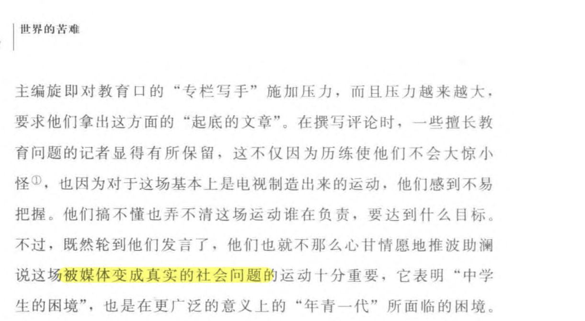
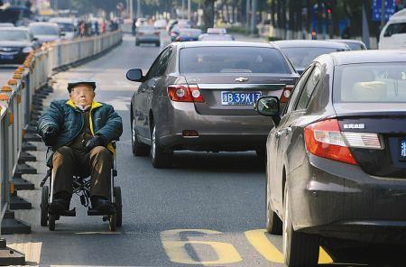
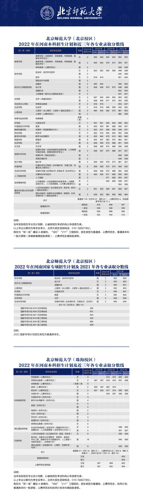
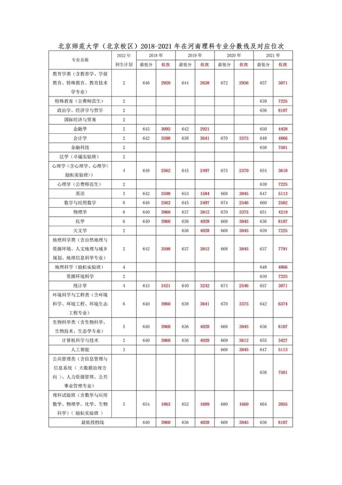
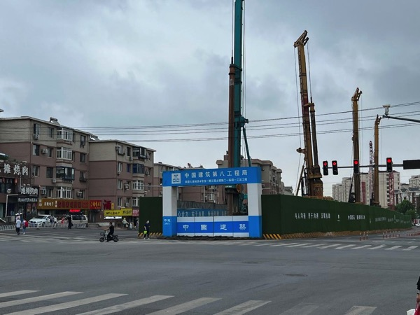
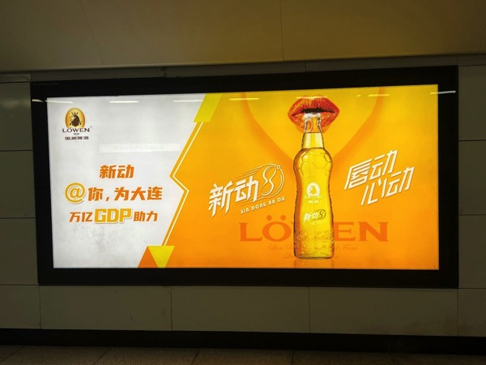
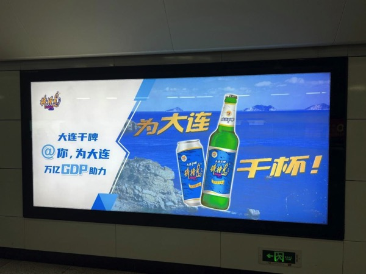
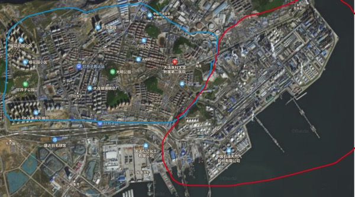
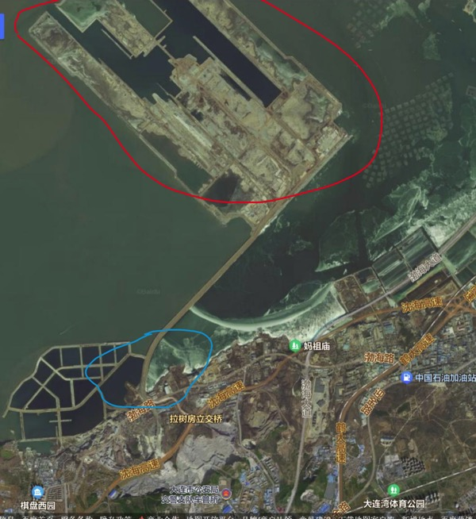

# 2022 年第二期 | 总第二期

2022 年 8 月 1 日

## 目录

[[TOC]]

## 黑马奖

### 高中生暑假发自拍朋友圈被学校处分，如何看待学校的做法？

- 作者：[Austin](https://www.zhihu.com/people/reseted1527151603930)
- 平台：[知乎🔗原文](https://www.zhihu.com/question/545418905/answer/2598556271)

> 问题描述：近日，一女生发文称，自己暑假期间在朋友圈发自拍被学校通报记处分，在网络引发网友热议，不少网友认为学校做法太让人窒息。对此事盘锦市教育局回应称：教育局没有此项规定，但是有的学校会有自己的规定，学校不让学生玩手机，让学生把注意力放在学习上也是正常的。据了解，盘锦大洼高中“去网去微”制度第一条规定就是同学一律使用非智能手机或者不用手机，发现三次开除学籍。

对于大多数不擅长教育的家长而言，学校作为专职的教育机构，是一个合适的推责对象，因此贯彻落实学校的规章制度就成为了一种缓解教育焦虑的手段，不管这些手段是否科学、人性。如果我是家长，不说把这种行为挂到网上/投诉到管理部门等等，至少我会教他怎么应对学校的垃圾管理，比如说朋友圈分组，两个微信号互不打扰等手段，然而现实是家长对这种处分毫无反应，一方面固然是因为家长缺乏话语权，另一方面许多家长也不能理解手机、电脑、互联网的功能，尤其是这些现代工具如何塑造出适合现代生活的身体技术。

从家庭整体角度来说，社会分工也不一定是好的，教育的功能从家庭中分化出来之后，不需要为教育“负责”的家长就没有动力去提高自己的教育水平，因此不同于马督工的社会化抚养，我提（che）出（dan）一套新的解决方案:社会学抚养。就是说父母必须取得社会学或哲学学位，或者修读专门的，其内容可以帮助父母理解并解决育儿问题的社会学and哲学课程，并通过标准化考核才能取得生育资格。此外，全教育阶段加入社会学与哲学课程，这样，我们的人民有知识，民族有希望，父母与孩子互相理解，教育方法无比科学，知乎小编就再也没法把这种不是问题的垃圾问题送到热榜了

### 上海和广州生活你怎么选择?

- 作者：[drurrdtit](https://www.zhihu.com/people/bkfbvfk)
- 平台：[知乎🔗原文](https://www.zhihu.com/question/403519639/answer/2602263564)

肯定去广州啊

举个简单的消费的例子

上海那地不是普通人，甚至中产能吃的起的，昨天看督工往期视频，一顿火锅吃了2800，没几片肉，一顿烧烤加炒牛蛙680，你给我三千，我都能买一头牛了，我之前看峰哥直播，峰哥自称在深圳租房每天花400吃自助，也没上海这个消费离谱

今天和一老哥聊天，在上海计算机年收入22w，天天宅在屋里，不谈恋爱，无任何除必要的衣食住行的消费，一个月就剩一万，一个月一万，十年一百万，在上海够干啥的，已经回老家考公了

年收入低于30w的，就不用考虑上海了

::: warning 马督工点评

似黑似粉

:::

## 合订本

### 医学毕业生服务基层

- 作者：[xiaofu2077](https://space.bilibili.com/268144713)
- 平台：B站
- 联系方式：[xiaofu2077@qq.com](mailto:xiaofu2077@qq.com)

之前郑州医院那期，督工讲到，医生培训可以专门培养一批人去服务小地方的社区医院，文章中受访人考上的这个专业就是走这条路的。2019 年开始的

[《30 岁人大硕士为学医重新高考，已被首都医科大学录取 | 对话当事人 》](https://mp.weixin.qq.com/s/qIeHWCb65GrMmtZJNsiy7A)

::: warning 马督工点评

个人觉得，走这条路，医生培养门槛还是嫌高了。高门槛，就会促使医生要求高回报。某些操作，现在的快递员培训三年，未必不能做。

:::

## 线索

### 请问如何看待中国电动轮椅市场的日趋展，电动轮椅对城市交通所造成的影响。

- 作者：匿名

我老家所在的西南小城，由于城市青壮年的外流，老龄化日趋严重。由于青壮年的外流，城市的孤寡老人群体越来越多，由于外出能力的逐步丧失，老年轮椅逐渐在这个西南小城普及。由于小城市的步行路面仍然采用老式的镂空硬化路面，不少老人开着电动轮椅在交通道路上行驶。由于老人们普遍缺乏交通规则意识，导致我时常看到电动轮椅在交通干道上逆行、闯红灯、横穿马路，不佩戴安全带。城市管理者似乎也并没有对这些老年代步工具做出相应的准则、规范与人员培训。且由于大多数电动轮椅的使用者多为失去行为能力的老人、残障人士，实际上交通管理也很难对当事人做有效的劝诫或者执行。

由电动轮椅仍然是锂电池充电的方式。由于其轮椅的特殊性，大多数电动轮椅仍然是在室内充电，加上孤寡老人行为能力的缺失，这无疑又加大室内火灾的风险。

孤寡老人和残障人士的外出需求无疑是应当得到满足的。在小城市逐渐空心化、老龄化的今天，人工成本（即传统的保姆/护工）成本日益增加。电动轮椅与老年车（老头乐）似乎就成了一个刚需。随着未来医疗技术的进步，高龄老人也会越来越多，如何解决中国未来的老年人口的出行、社交问题，特别是这种以后注定高龄化的小城市的交通安全和室内安全问题。

如今电动轮椅行业快速成长，预计2-3年内就会成为一个百亿级规模的市场，且增长极为迅速。至2020年，中国电动轮椅市场规模达62.83亿元，同比2019 年增长22.53%。2020年我国电动轮椅行业产量达到188.92万辆。显然，这个行业正在快速增长。但其安全性仍然值得质疑，其现行的国标为GB/T 12996-2012 由“全国残疾人康复和专用设备标准化技术委员会”主持修订，实际上本标准涵盖了载重在100kg以内的代步电动车。

另外，请问督工，为什么普遍不在人行道上铺设平整的路面呢，这样一来就电动轮椅一类工具只要在国标上限制时速也能在人行道上行驶了。毕竟像是特大城市中的拆不动的老街区，中小城市的道路，普遍是没有专用的非机动车道的。

随文附上相关车祸链接：

- [网易号·一个岛岛：91岁老人坐电动轮椅进隧道被撞身亡，死者家属情绪稳定](https://www.163.com/dy/article/G679FJ8H0529TARF.html)
- [百家号·新平果网：突发车祸！新平路一台电动轮椅被夹在货车和汽车中间](https://baijiahao.baidu.com/s?id=1689121861755027080&wfr=spider&for=pc)
- [搜狐新闻·重庆晨报：老太坐电动轮椅载孙儿上机动车道险象环生(图)](http://news.sohu.com/20120107/n331439555.shtml)
- [新浪视频·30秒懂车：浙江一位九旬老太，扶电动车休息摔倒骨折。家属：车主赔钱！](https://k.sina.cn/article_5685395646_m152e040be03300z888.html?mod=wpage&r=0&tr=381)
- [网易号·永嘉娱乐说：惨烈教训！靖江一电动轮椅车被卡车撞飞，车主不幸身亡](https://www.163.com/dy/article/GQC0JKL405373CMQ.html)
- [企鹅号·V眼看大连：湖南一残疾人坐轮椅过路 被载重卡车撞倒身亡！肇事司机逃逸](https://new.qq.com/omn/20220223/20220223A01PSR00.html)
- [搜狐号·微靖江：沿江路一人驾驶电动轮椅车横跨5条车道，被卡车撞飞！](https://www.sohu.com/a/505172796_100046665)

火灾链接：

- [凤凰视频·娱乐先锋团：电动轮椅电池突然爆炸，屋子被完全烧毁，幸亏人没有伤亡](https://v.ifeng.com/c/8Clkce7cMen)
- [搜狐号·搜狐北京资讯：电动轮椅充电电池爆炸起火 致残疾老太丧生](https://www.sohu.com/a/214365263_384516)
- [千龙网：轮椅充电电池爆炸起火致人死亡 谁该担责？](http://beijing.qianlong.com/2018/0102/2295475.shtml)
- [邻友圈：朝阳一居民家中起火！原因有可能是电动轮椅！](http://api.linyouquan.net/v1/threads/2362165?ivk_sa=1024320u)

::: warning 马督工点评

中国现在的管理原则，多一事不如少一事，而且对相对弱势群体，无法做到公正和严厉相结合。当年批了一些残疾人车，现在这些非法营运，到处逆行的车辆还在城市里到处杀人，有关部门恐怕也不敢随意放开。

我对残疾人的看法是，千好万好，不如就业发挥自己的能力好。政府从幼年开始给残疾人多投入点钱，如果家庭养不好就政府来养，把他们培养成一定程度的劳动力，长大后多少交点税（可以打折），也比现在纯粹当负担好。

:::

## 观众社论

### 7.27 直播观后感

- 作者：[不是林夕只是梦](https://space.bilibili.com/129093898)
- 平台：B站
- 联系方式：[my5837@qq.com](mailto:my5837@qq.com)

本人是个零零后，但是生活风格和浏览内容却被身边人称“老干部”。手机每周屏幕使用最长的应用是微博，在微博看的是一些媒体发表的时政和对事情发表观点的博文。对于我来说，这些博主使我受益良多，他们发表形形色色的观点丰富我看问题的角度并提高我对事情的辨别能力。本人高中就读于职高，高中玩手机浑浑噩噩度过了三年时光，或许在我国有许多和我相似的情况，初中成绩还不错，但因父母缺乏对升学的了解和认知被招生办的老师忽悠过去上了中职。高中三年不同于其它同学，我不打手游，只在微博-知乎-B站之间流荡。进而我学到、了解的杂七杂八的知识比同学多了很多，有时候会调侃自己说道：我上的是微博大学。现在我上的是一所位于郑州的民办本科，我觉得在学校里学到的知识真的很有限，老师们教课只是为了完成他们的教学任务，上课念PPT，我上我也行，获取知识、了解社会的渠道可能也只有在微博等应用平台。这就不得不进行反思了，获取知识应当发挥主观能动性，而不是被动的汲取。

第一次观看睡前消息是在2019年11月份，说实在的，我是把它当做一个吃饭时看的节目，截止到2022.7.28日出到了463期，其中有些观点和看法很难苟同，但是睡前消息用公开的消息带着理性分析和逻辑分析进行论述，作为受众群体之一，对事物的认知首先是0~1，其次才是1~100，我觉得这无可厚非，看待事物要带着辩证的态度，不要做二极管。对于学生观众来讲，最吸引我的点在于睡前消息编辑部的脑洞，一些使人眼前一亮的观点、想法、甚至是“暴论”。看了昨晚（7.27）的直播我觉得这是一个很有意义的节目，尤其是云游五位城市，带着观众了解祖国大地，拓展我们的视野，不恭维的讲，睡前消息编辑部做的事情远超学校的贡献。最后一句我想说的是，用爱发电很难，各位有能力都支持一下，让睡前消息编辑部做到六十年后。

::: warning 马督工点评

我小时候电视节目很少，有一个《祖国各地》节目，印象深刻。后来的《话说长江》等早期纪录片，和交通地图册一样，是我了解国家的窗口。现在类似节目很多了，不缺我这一个，但是如果我的节目能引发观众进一步查询资料，产生自己去了解国家的兴趣，我很高兴。

:::

### 我们该当一个“二舅”吗？

- 作者：[六盘水一哥张文博](https://space.bilibili.com/25418999)
- 平台：B站
- 联系方式：[811426275@qq.com](mailto:811426275@qq.com)

我也不想看这种视频，奈何他占了两个热搜，还弹出到了我的首页上。我觉得这是一个贵编辑部可以找机会聊一聊的内容和看法。因为这不太容易遇到观众的专业（应该没有专门写鸡汤的专业吧）。

以及更扩展的，希望听编辑部谈一谈如果你们要讲故事对“叙事结构”和故事的“最终落点”有如何的倾向。

最后我想问，对于一种故事典型：“轻描淡写A的错误，浓墨重彩B的牺牲来歌颂A与B所在共同体的精神”这样的“叙事逻辑”和“最终落点”有什么样想作的分析与看法。

::: warning 马督工点评

1. 普通观众，不喜欢的视频不看就是。但对于媒体人来说，只要是有影响力的内容出来，我们总要看看同行做了什么。
2. 叙事结构和每个人的习惯有关系，也和作者要表达的内容有关。和“是否正义”关系不大
3. 典型故事每个人都可以讲。《乱世佳人》完全站在白人农场主的立场讲南北战争，但故事讲得好，大家都爱看。

怎么办？

当然是随便它讲了。

你在进步一边讲不出更好的故事，说明你发掘现实能力差，说明你升华主题太生硬，就该对剥削阶级学习。黄巾军写不出自己的桃园三结义，说明历史进步还不该到来。

好的时代，是每个人都可以随便表达自己，都有机会把自己的创意给别人看。世界不是靠“正义”来定义言论自由的。

顺便提供一个上不了黑马奖的典型言论：

[观察者网·风闻·合川老农民norlanseed：论舆论场的协调性：对过度言论自由的批判](https://user.guancha.cn/main/content?id=805739)

:::

附评：然后我就直接带着剧透评价了。这很是我上文说的典型“轻描淡写残疾人扶持，就业和平等的失败，浓墨重彩二舅的牺牲，最后却要歌颂一句中华民族” 我不会去提任何主题有什么不该说的。所以我只能劝观众有时该多去注意那个轻描淡写。

前面大半段讲二舅的生平和现状的时候我就已经猜到他会给我们灌什么了。从09：15左右开始的up的总结，果然不出我所料，通篇都有教人逆来顺受的倾向。我实在没想到21世纪过去了五分之一，我还能在互联网上看到鸡汤文字。

视频单刀直入在前40秒就介绍完了作者概括的“全部起因”，屁股被隔壁村医生打了四针。这种简短，难免引导了很多观众认为，这原因只是遇到了坏人，遇到了庸医，甚至只是抽象的“命运”上。后来在这位二舅的残疾证办不下来去到北京的时候，也可能是这个up的语调没有什么起伏，也可能只是我的阅读理解能力太差，从这句“他公平”里读出他去北京维权的失败结果没有那么自然而然。总之弹幕没人关心最后办下来了没有，而是刷着大堆的“他公平”，我和我的小伙伴们从情感到理智上都惊呆了。这时我就难免隐约感觉，这些观众真的只想看个视频安慰自己而已。之后又讲了两个故事和二舅的现状，让观众以一种欣赏“水司楼”的猎奇态度品读了二舅的人生以后，果不其然，收束到了“你们这代青年正值大好年华，应该过得更乐观更成功”这样的概念上。我对讲这样的故事本身没有任何意见，觉得难受的只是他只止步于此。比喝鸡汤更悲哀的，是在日常生活中找鸡汤给自己灌。

这样的故事不该收束到视频的结尾和评论的任何一个模样，暨既不去探明为什么二舅明明只是腿脚不便却那么惨，也不去想怎么帮助这个群体的未来，以防止惨剧再次发生。二舅的残疾证到现在办上了吗？宁宁是被抛弃的还是被计生办调剂的？她知道自己是领养的吗？我看到up之后的动态里，还有提到说请这位二舅开直播增加收入的观众。我想说这个想法本身不坏，他们也是积极的，但排在一些问题的解决之前，那些问题甚至谈论都没有。出于人情施舍的个人努力的讨论，完全掩盖了推动完善立法和执行，这类能最终解决此类问题的社会努力的讨论身影，这个环境透露着一种不该出现的妥协性。

::: warning 马督工点评

我个人觉得，一件完整的艺术作品，既包括作品本身，也包括观众的解读。我们古代大多数文艺作品，眼里都只有帝王将相，才子佳人，不妨碍我们欣赏其中的潇洒，欣赏其中的美感，也不妨碍我们批判作者的狭隘和保守。现在“二舅”的视频本身也许不完美，但加上观众的评价就完美了。

:::

而那些把鸡汤喝了下去，真就完全停在了欣赏“猎奇”和自我鼓励的观众。我来引用一句话：

> “阿Q从来不把自己当人看，安于做奴隶，把做稳了奴隶视为最大的满足。面对压迫，面对肉体和精神的凌辱，他敢怒而不敢言，只能默默地忍受。阿Q精神的麻木，是因为做了几千年的奴隶习惯。在等级制中，被强者欺凌似乎顺理成章，欺负弱者也似乎理所应当。”[1]

当时在面对诸如皇帝这样的强者欺凌自己时，奴隶们既不去思考皇帝来由与合法性，也不想如何出手让皇帝变好，或者用别的东西替代皇帝。转而去欺负边上的小尼姑，以这种转嫁痛苦的方式让自己再次安于现状。现在没了在法律上明文地作为强者的人，但面对这个接口的其他实现（这里我就不举例了），似乎也能调用起这种奴隶习惯。观众们仅仅止步于一边告诫自己要活得乐观，另一边用“命运”这个抽象来替代这个欺负二舅和自己的强者，庆幸自己起码是过得比二舅更好的话，那观众们也只不过个隔着屏幕欺负尼姑的阿Q了。如果“我们这个民族身上所有的平凡，美好与强悍”（原视频10：26左右）就是这种喝鸡汤，妥协和接受命运的本事的话。那对继承和发扬这种本事，我还是挺乐观的。

如果说《后浪》是一篇拿着天龙少年和你类比，来形容你有多好的鸡汤的话，那《二舅》就是拿这个二舅与你做对比，来形容你有多好的鸡汤。大部分人把自己代入天龙少年很难，但这里认为自己比二舅过的好些可容易得多。我不会去反对某个民事主体不能说什么，但是对于止步于此的观众，我再重复一句没必要注明来源的话。“能做事的做事，能发声的发声。有一分热，发一分光，就令萤火一般，也可以在黑暗里发一点光，不必等候炬火。”这句话的前半段其实更经典，但发出来容易被解读成和上文鸡汤一样的意思。不是不该向上走，而是不该总是自己向上走，不然我们也只是几亿个什么也做不到的个人罢了。

补充：[这个视频](https://www.bilibili.com/video/BV1Er4y1L732)底下又出现了一个新闻媒体的链接，而这个时候评论的反对意见声势大了许多。自己灌的就可以，同一碗汤别人灌就有毒，也许这正充分体现了网友对人不对事的评论态度。

::: details 【Bilibili】零度时评：二舅治好了我的精神内耗 我们凭啥埋怨生活？

<iframe src="//player.bilibili.com/player.html?bvid=BV1Er4y1L732&page=1&high_quality=1" scrolling="no" border="0" frameborder="no" framespacing="0" allowfullscreen="true" height=400 width=100%> </iframe>

:::

<BiliComment name="渔灯困倦倚波眠" content="你应该问问如何改善劳动者的境遇和状况，而不是告诉大家不要埋怨生活" time="2022-07-27" like="29292"/>

<BiliComment name="哇咔咔咔嗷奥黌大大" content="你的文案让我连静下心来观看一分钟的欲望都没有，二舅的视频十一分钟，我看了三遍，一个视频究竟是用心还是别有用心，能看出来的" time="2022-07-27" like="4750"/>

参考文献

^[1] 历彦军.《阿Q正传》《边城》：中国形象的文化隐寓——鲁迅、沈从文乡土小说个案比较[D].长沙：湖南师范大学，2007-11.

### 对北师大在河南招生情况的一些补充

- 作者：57525222
- 平台：B站
- 联系方式：TEL 18738338821

下面是我在哔哩哔哩评论区中的评论

我是21级从河南考入北师大的学生，并且全程参与了今年的招生过程，我想对北师大今年在河南的招生情况给出几点补充。

1，师范类并不是河南高分考生的热门选择，就北师大来说，它在四川，重庆，北京的录取分数排名要好于河南。河南教师的待遇相对很多省份偏低，高分考生更多会选择和计算机相关的新兴工科的专业，而北师大以文理基础学科和教育，心理见长，并且往年的招生宣传工作做的非常少，我们在学校都吐槽几乎没有感受到北师大的招生宣传，不论线上还是线下。

2，北师大在河南的录取名次不是单纯的提高，而是回升。如果你可以查到前些年的录取分数线的话，你会发现，在21年之前，北师大的提档线一般在4000 名左右（不包括公费师范生，优师计划等特殊类型）而21年，也就是我这一年，因为北师大把很多本来放在提前批招生的专业放在了本科一批，很多考生可能在本科一批找不到北师大的历年招生情况，再叠加招生宣传非常少，导致断档到了 8000名（但是好像说其他大学也有类似的经验，过两年就涨回来了）今年是法学院的老师们主动请缨到河南招生（因为法学院有很多河南籍的老师），我在招生群里看到，老师们都非常努力，几乎从早到晚都在回答问题（这还只是我在群里能看到的）考生普遍反映北师大的招生群热度比其他同水平大学高很多，并且很多往年的同学，家长都主动参与招生（包括我）可以说今年回升到6000名是大家一起努力的结果。如果说因为疫情或者说经济形势差导致高分考生报考北师大，这既不符合21年疫情中的招生情况，也不符合今年我了解到的高分考生的意向情况。

3，结合上一点，我认为22年华东师大的录取情况和土木有相似之处，应该是行业＋上海共同导致的结果。（有一个问题是华东师大的新工科发展的很好，但是可能考生不太了解）

WangYZ-_我报考北师大（数学与应用数学）是因为据说北师大的学风非常好（但我没有上过其他大学，无法比较，也只能是据说）并且保研率比较高30%-40%（疫情前出国的同学多的时候我们院能保到50%）剩下的同学还有很多人会考研+出国。北师大本科的就业情况不是特别好（大家几乎很少有人想凭借北师大本科毕业证就业）

WangYZ-_河南同学对高校情况不了解可能是除了志愿选择少以外录取分数线波动很大的一个主要原因（但同样我不清楚其他省份考生对高校的了解情况，只是马督公这么说了，而我认识的同学很多也确实对高校不太了解）

WangYZ-_今年应该只是一个意外情况，同济在考生心中的“淫威”尚存，反正我去年还想报考来着，因为怕录取不了就没报，结果今年一下掉这么多，明年肯定会回升到和之前差不多的水平，可能只会低一点。

**无论什么学校，今年的考生都要工作到2070年或者2080年，风物长宜放眼量，我希望大家把高考分数波动看做一个分析社会的案例，而不是太关注高考分数本身。**

**据我观察，读大学后，长期谈论自己高考分数的人，以后发展都相对差一些。**

后面附上两张图，第一张是北师大这几年在河南的录取分数（原图可以在北师大本科招生网上查到）第二张是我们同学自己对照分数转换的排名（更直观）（建议看最后一行“最低录取排名”）

::: details 第一张 🏞️ 北师大近三年河南录取分数线

:::

::: details 第二张 🏞️ 北师大近三年河南理科专业分数线及对应位次

:::

### 睡前消息 460 期观后感:为什么教育改革必然失败

- 作者：[进步思潮](https://space.bilibili.com/10985326)
- 平台：知乎、[B站🔗原视频](https://www.bilibili.com/video/BV1ur4y177g5)
- 联系方式：[1592985163@qq.com](mailto:1592985163@qq.com)

::: details 【Bilibili】睡前消息460期观后感

<iframe src="//player.bilibili.com/player.html?bvid=BV1ur4y177g5&page=1&high_quality=1" scrolling="no" border="0" frameborder="no" framespacing="0" allowfullscreen="true" height=400 width=100%> </iframe>

:::

在这期节目中，马前卒多次谈到王安石变法（变相自比当代王安石），并和西方的变革进行过一次对比，结果是，王安石变法没有成功还给后世的统治阶级打了一个大补丁，而西方的资本变革大获成功，并在20世纪用武力重新让中国捡起了王安石变法的大部分内容，再次改革。

虽然很有千年爽文，跨越历史长河打脸的快感，但马前卒并没有过多的讨论这个结果，而是回到当代的教育改革中来。

而我注意到后情不自禁的提出了一个问题，为什么同样代表历史发展潮流的改革，在时间差差距不大的基础上，西方的资本主义改革大获成功，而中国的王安石变法却人走茶凉，人死政息。

大家自己思考一下，我这里说我的思考。

因为西方的资本主义改革在大航海的刺激下，诞生了一批长时间鉴定维护改革方案追求进步的群体，而王安石变法则看似国家整体收益，但没有任何具体的群体有根本性改变，没有诞生一个彻底长时间支持变革的群体，所以变法失败。

同时我看到很多弹幕说道外部压力不一样，我这里说一下，王安石变法就是在国立弱小外部压力最大的宋朝时期，如果这样都算没有外部压力，那中国也没有什么更大的压力了，相比于压力大小，我认为外部的航海环境影响才是主要原因。

扯远了，回到马前卒的教育改革方案，在我看来，马前卒的教育改革，其实和王安石变法类似，都是站在国家或者说社会整体的角度谈到了问题，和改进方式，在一个非常聪明大脑和科学的经验使用下，提到的改革方案其实没有任何“问题”。

但这样一个优秀的改革方案，却缺少最关键的一点，如果这个方案实施，到底上社会那一部分群体会长久的支持教育改革，在推广过程中的阻力如何消弱，如何保障支持改革的群体可以长久支持，这一群体在改革获利如何不阻碍更多人继续支持改革。

这个根本性的问题不解决，那这个改革方案其本质就是空中楼阁，是幻想着一个强有力的万能中央克服一切困难的软弱表现，宋朝时期封建程度的集权都无非在低段位区成功推行王安石变法，更加复杂的现代社会也无法仅仅依靠万能中央来完成社会改革。

## 段子

### 君の愛馬が

- 作者：[b 站臧僖伯](https://space.bilibili.com/169551182)
- 平台：B站
- 联系方式：QQ 2740179637

个人是从第十四期巴西那期收看睡前消息的，那时自己还是大二的学生，被视频信息密度以及对事件独特的视角所吸引。当时就自己所了解的自媒体中与国内新闻相关的自媒体很少，而且不少是单纯输出情绪或者水货太多，当时就关注了

后来自己参与实习后对视频里的内容有了跟深入的体会，以及对时政兴趣的增加，睡前消息是自己获取一些新闻的不错的渠道。就这样每周定期观看睡前消息成为了自己新的生活习惯，有时还会内容比较精彩的一期反复观看。虽然有时观点分歧比较大，但大部分时候观点还是赞同的。

非常希望督公能阐述一下社会化抚养的执行细则自己至今还是比较模糊的概念，周五还是更希望能讲讲二舅视频的背后的社会因素。

自己也去看了棋王以及一些其他up主对此的点评。个人的感觉第一眼看后比后浪与入海更令人感动。

但是回过头品味来总有一种不适感。感觉像是看了阿甘正传一样，一样是遭受了苦难但是凭借个人的努力与历史的进程，得到了周边的尊重与实现了自身的价值，可到最后也没有给出年轻人精神内耗的原因，也没有给出方案，而是只传递朴素的正能量，像喝了一口有点过时的鸡汤。

希望能节目继续保持真诚，也希望节目越做越大，提高网民的键政水平，也希望能早日弥补军工生物的短板，提供更专业的内容

这两个视频纯调侃性质的 价值可能就只有图一乐，自己比较热爱acg内容，因此视频形式上也偏相于，二次元同人创作希望不要介意，也算是自己在网络上看到的一些有趣的梗的小总结，包括了未能在b站保留的409 183 170 74期视频的封面以及临高启明一些梗

[【Bilibili】臧僖伯：[仿pv]键政主播重度依赖](https://www.bilibili.com/video/BV1oP4y1c7VB)

[【Bilibili】臧僖伯：【马前卒】君の愛馬が](https://www.bilibili.com/video/BV1WB4y1e7K2)

自制的 scorpo 鬼畜风格的临高启明梗图

正在制作中的视频，如果觉得冒犯我就停止视频制作

[【Bilibili】臧僖伯：突然意识到可能只有睡前消息结晶粉才知道我做的是什么了](https://www.bilibili.com/video/BV1JU4y1q7pi)

::: warning 马督工点评

欢迎随意制作鬼畜视频，越多越好。我们期待看到的不是“赞同” 或者“不赞同”，而是“为什么不赞同”，以及“我赞同什么”。

:::

## 体验

### 关于睡前消息提议政府公开拍卖学区房

- 作者：妇女儿童船长
- 平台：知乎

本人坐标西部地级市，2008年上高一，2011年参加高考。

一中是全区最好的中学，二中也是重点，规模大概一中的一半，我那时候二中能考上一本的人数大概是一中的零头，至于其他中学学生能过个二本线那就烧高香了（2011年）

2008年中考时一中简章收700+100人，100人我们当地称3限生，除了学费要额外掏5000+分差\*x元，08年时当地公务员教师工资也就2000多。但是到了高一结束时，我们年级总共1400人，多出来的600人除了要交5000+分差\*x元，还要掏打通关系钱可能远远不止，哪怕中间一个介绍人也能收两条烟的好处。

很多人骂督公的公开拍卖方案破坏公平，那么上述我经历的“700+100+600=1400” 算哪门子公平，从90年代算起到2022年，已经这么搞了快30年。

我觉得公开拍卖反而可以降低中间环节的损耗，这笔钱可以由教育部门分配给2 中或者3中，提高教育质量，拉平和一中之间的差距

::: warning 马督工点评

这里体现的不仅仅是教育资源货币化分配问题，还有高中教育本身的尴尬处境。高中不属于义务教育，不要顾及就近入学，甚至也不需要像义务教育那样顾及本身的公平，理论上说地方政府没钱就可以不搞，有钱也可以随便市场化。

但实际上，地方政府很重视高中的投入，无论是学校的标准化质量，还是升学率，都是重要考核标准，也是“官声”来源。这就带来一个矛盾——地方政府努力花钱，培养本地几乎用不上的人才（考上大学不回来工作），更是现任主官绝对用不上的人才。

这意味着地方上读好的高中，是一种完完全全的“薅社会主义羊毛”行为，考进去固然可以享受超额国家补贴，而送钱进去也多半是赚的。与其如此，不如一半择优，一半公开拍卖。

:::

### 一个医生的就医经历

- 作者：薛定谔的猫头鹰
- 平台：知乎
- 联系方式：[yqah2016@163.com](mailto:yqah2016@163.com)

本人是一名医学博士研究生，就读于北京的国家某医学中心。长期从事临床和研究工作。作为一名低年资临床医生，每天要接触很多患者/患者家属，然而，上周，我也成为了一名患者家属，我母亲因病来本院看病，从病人和家属的视角完整的体验了一次就医过程。并由此对分级诊疗、医患纠纷、医疗改革、医学教育等方面产生一些自己的想法。

**关键词： ** 中国医疗/分级诊疗/医患纠纷/

**背景：** 笔者今年28岁，是一名专业型临床医学博士研究生，专业是一个急诊较多的手术科室。从本科实习开始算，已经有7年的医学学习和工作经历了。读博之前也曾就职于上海的某家大型三甲医院（同专业）。日常除了从事医学科研工作，基本是在科室里泡着，要接触很多的患者和患者家属。一直以来都是从一个医疗工作者的身份参与到医疗活动中来。然而，上周，我母亲在家乡的医院检查出了疾病需要进行手术。多方权衡之下我决定把她接到我所在的医院进行手术，于是，从患者家属的角度经历了一次挂号、术前检查、入院、手术等完整的治疗过程。结合自己的工作经历和体验，对分级诊疗、医患纠纷、医疗改革、医学教育等方面产生一些自己的想法。

**经过：** 我母亲是7.14突发症状并向我求助。我联系了老家一个三级医院工作的同学，为我母亲进行初步的检查，存在手术指征，而且是三级或以上的大手术。考虑到对我的家乡仅是一个三四线小城市，医疗技术确实参差不齐，我打算将她接到我所在的医院进行手术。7.15号分头行动，我爸在家办理医保转诊等手续，我联系本院的老师加号；7.16（周六）我母亲到京暂住一天，7.17进行第一次核酸检测（本院要求，住院患者必须在本院完成一周内三次的核酸检测）；7.18 下午看了门诊，开了术前检查单，并进行了第二次核酸检测；7.19完成了全部术前检查及第三次核酸检测；7.20收住入院，7.22下午完成手术，目前在术后恢复阶段。

整个过程非常高效，没有半点拖沓延误。以我对本院的了解，普通患者想达到这个速度几乎毫无可能。首先，挂号、预约检查都得到了老师的帮助，全程由我带着做检查，差不多是一路绿灯；手术排的也比较快，对我来说，是非常顺利的一次就医过程。但是，这是我作为本院的一员能享受到的待遇，对于普通患者来说，这个过程恐怕充满了不确定、不愉快。主要是几点：

首先是准确找到这家医院，全北京与我们医院名字类似的医院至少有7、8家，一个李逵被7、8个李鬼包围，我不止一次的遇见过患者来到我们医院抱怨说饶了好大一圈、花了好多冤枉钱才找到我们医院；第二就是挂号，患者和家属在找到我们医院以后，大概率会被保安拦在门外。本院是一家专科医院没有急诊，所以只能通过门诊挂号入院。想通过正常的网络挂号等途径入院，基本要等到2 个月以后了，于是催生出了黄牛号这个畸形的产业：专家号差不多5000一个号；普通门诊号大概要3000；前面提到的核酸筛查号，也要1000元一次（这也是我以患者家属身份才了解到的）。黄牛号的巨大利润是如何分成的，以我目前的资历是无法得知了。

历经波折顺利看上门诊后，会开出检查单，预约检查单又是一个难关；正常预约的话基本要1-2周，有些特殊检查甚至要一个月左右；检查完毕后告知当初看门诊的医生，会给你开出住院证，才可以办理住院（前提是14天内没有中高风险区的地级市旅居史）。

住院后效率就很高了，以手术科室为例，1-2天的相关检查排除手术禁忌后，基本上就可以排手术了，但是这里有一个特殊的“隐藏关卡”，本院手术室有一个特殊规定，有存在中高风险区的地级市旅居史的患者，必须在京满21天后才能手术。这个医患共愤的规定也令很多患者眼看明天就能手术，结果停掉。我之前最担心的也就是这一点，这是硬性规定，幸好没被我碰上。

**思考：** 造成患者就医难的主要原因是医疗资源的高度不均衡发展，分级诊疗制度的极度欠缺。北上广等大城市的医疗资源完全可以对标欧美发达国家；而三四线小城的医疗资源却连基本的医疗保障都无法很好的做到，更别说覆盖一半以上人口的县级以下的医疗机构了。这一巨大差异首先体现在医务人员的配置上，目前省会及以上城市的三甲医院除紧缺科室外基本都是博士起步，协和、华西等医院至少需要做一站以上的博后才有可能获得一份编外的工作；而广大的二级医院、医疗卫生所，人员配置基本上处于自娱自乐的状态。十年前以“推动基层医院均衡发展”为由推出的住院医师规范化培训制度（规培），经过十余年的发展，已经彻彻底底沦为了三甲医院对基层医院吸血的制度工具。基层医院招了人，首先要倒贴工资送到三甲医院白打三年工；待规培结束后，学到多少东西先不谈，年轻医师有了规培证、执业资格证和三年的工作经验，是否愿意回原来的医院还是个未知数。现阶段去基层医院看病，外科系统几乎很少能看见年轻的医生，要么是入行较早的老一辈，要么是专科毕业，入职就躺平的执业助理医师。对于人员配置差异如此巨大的医疗现状，现在想达到分级诊疗是不大现实的。但凡有选择，所有人都会愿意去更高级别的医院治疗。

前几期的睡前消息节目中，督工讨论了在国内实行分级诊疗制度的可能性和形式，提出由高级医院派驻医生至基层医机构，对患者进行分流。对于这一点，我本人持反对态度，且不说这一制度可能造成的巨大权力寻租空间，高级医院会选择什么样的病人进行治疗？是“需要得到高级医疗支持”的患者？还是“对医院创收有利”的患者？举个例子，对于一个合并多种基础疾病，如糖尿病、高血压的肿瘤患者，很可能无法耐受手术、化疗或靶向治疗，一旦医院收住这样的病人，意味着一张病床将被占用，无法带来效益，基本上没有医院愿意收住。而符合治疗指征，可以手术/放化疗的患者，则被高级医院收走，这对基层医院的生存更是不利。

所以，高级医院从人员配置、病源选择上同时吸基层医院的血，医疗机构的差异被进一步放大。造成的马太效应也越来越强。

那么该如何解决？笔者在这里大胆提出一种设想：既然制度的设计对基层医院如此不友好，那么久干脆一点，抛弃基层医院这个概念，对于经营不善的基层医院，将其进一步分解成为小型的社区医疗机构，承担两个方面的任务：急诊和慢病管理。一方面，将卒中、胸痛、创伤等急性疾病的救治力量前延至社区医疗（这一点可以由目前建设的各地区卒中中心、胸痛中心、创伤中心等负责），这一层级的医疗机构仅进行最为重要、最为急需的医疗救助工作，如心梗、脑梗的急性溶栓，创伤的初步处理，患者的抢救等等；另一方面，对于在高级医院接受完治疗后的患者，可以在社区医院拿药、复诊。例如糖尿病、高血压患者的复诊取药，甚至肿瘤患者的后续化疗等，完全可以下放到这一层面的医院进行。而高级医院则进行更高级的治疗，如三级以上的手术、放化疗方案制定、完成临床研究和新药开发等等。

患者该如何选择医院？医院又将如何选择患者？这一点笔者并没有很好的思路，但上海市的一些做法似乎可以作为参考：浦东的复旦大学肿瘤医院附近有一条“医院街”，短短一条路上云集了7家中等规模以上的医院；在嘉定新城附近，则集中了瑞金、仁济、中医院等众多大型医院的新院区；北京近期也宣布将于雄安新区新建宣武医院和协和医院的新院区；这些大型医院的扎堆建设，似乎提出了一个“医疗城”的概念。所谓的“医疗城”，必须建设在交通节点城市的新城区，鼓励大医院在此扎堆建设，这里的建设成本相对较低，也可以盘活周边的住宅租金，降低患者的等待成本，毕竟在三环内租房子，比在雄安租房子贵了不止一个level。更重要的是，大医院之间可以存在充分的竞争，医护人员的流动性将大大增强，大型医院将逐步放大自身的强势科室，对于创收少、专业排名差的科室，将被医院自身所抛弃，也可以进一步避免类似“宇宙一附院”这样的巨无霸医院出现。

还是那个虽迟但到的问题：“钱从哪来？”

要做到这一点，首先要实现医保基金的统一结算。在这一制度设计中，高级医院是挣钱的，而承担大量急诊、慢病管理的社区医院显然是亏本的，这就要求医保要大力扶持这些社区医疗机构，从高级医院按比例上交的营收中，分割一部分用于保障基层医疗机构的人员配置、日常运营。而各大医院，则应该进行充分的竞争，大力发展高水平专科医院，抑制“超级乡镇医院”的出现。对于一些不合理的制度，如要求综合三甲医院必须配备儿科、康复科等予以废除。

第二是建立独立于医院的检测机构、影像诊断机构。现在各大医院纷纷购买64，甚至128螺旋CT，购买PET-CT,甚至是PET-MRI机器，造成很大的浪费。完全可以由国家成立专门的公司，照价收购这些机器，在医疗城内建设专门的影像中心和检测中心，各大医院开具的检查单、影像单到这里统一预约，检查结果互认。

第三是引入社会资本建立专门的康复中心，对于手术完成的患者，出了危险期以后，完全可以转入康复中心，丰俭由人，有保险或者经济条件好的患者完全可以在更加舒适的环境中进行康复治疗；经济条件差的患者可以选择一般的康复病房；这样一方面避免了对手术科室床位的占用，另外也减缓了患者的担心，毕竟如果出现什么急性情况，主刀的团队完全可以在短时间内赶到处理。

以上是笔者的思考，信口雌黄，仅供参考，欢迎讨论。

::: warning 马督工点评

医疗行业内部人的直接体验，很值得一看。尤其是前半部分，我也有类似体验——有“内部人”引路，中国的医疗性价比就非常高。但如果“摸不到门道”，就算买了很好的商业保险，中国的医疗性价比也很差。我曾经开玩笑对朋友说，中国医保没有瞬间破产，唯一原因是老百姓还不熟悉自己（理论上）的权利，也不能熟悉地办理各种手续。

:::

### 到深圳找厂上班，分享些基层务工情况

- 作者：[猫-鲸鱼](https://space.bilibili.com/87418923)
- 平台：B站
- 联系方式：TEL 18469170922

2021年12月份到深圳找厂上班，加了中介微信，分享些基层务工情况

一： 我进的厂是一家日企3300底薪，上班时间八小时，严格遵守劳动法。 要求高中学历35岁以下，算是低要求，只要年龄够，学历中介也能搞定。 普工岗招人很多，一直在招，由于大量年轻人，留存率据我观察三分之一不到。 PS（这个工厂还有工会，我第一次见识） 算上加班和各种补贴薪资在五千多，算沿海地区基层岗位的大多数了。 据说其它厂基本都是底薪最低薪资两千来块，加班很多。

二： 华为和比亚迪 这两个比较有名。 华为最低学历需要大专，有一定要求，据中介说是深圳最高底薪4800。 比亚迪年轻人都说是黑厂，特别累，一个工作过的朋友说月薪能到七千多，都在加班。 以上信息仅限普工职位。

结论： 给我的感受就是制造业升级带给普通人的福利。 华为的薪资明显高出其它厂一个层级，比亚迪虽然年轻人看不上，但是年龄限制就宽松了很多，且提供了大量工作岗位。深圳街上公交基本都是比亚迪。

三： 五月份中介发的招聘信息里有个——成都工厂招人，月薪六千左右，三个月补贴一万三。 我问之后发现信息不是太真实有水分，不过有个有趣地方，那边工厂实行补贴四川本地户口，每小时补几块钱。

结论： 部分产业流向成都，但还是竞争不过沿海，还要防止本地劳动力外流。

### 关于大连市“GDP三年破万亿”目标的疑惑和思考

- 作者：[村东摸鱼王](https://space.bilibili.com/486604411)
- 平台：B站
- 联系方式：[1263179460@qq.com](mailto:1263179460@qq.com)

其实我也不知道这算不算“体验”，但是看来看去好像只有这个栏目最符合，所以姑且先投着看。

说实话，第一次在本地新闻上看到这个目标的时候我是有所怀疑的，作为一个 90年代末出生，在大连生长到今天的老大连人，这真不是我灭自家志气涨他人威风，实在是大连经济几乎是处于一个停滞状态，近十年来只有很微弱的增长，虽然总量在东北地区还能坐头把交椅，但是和内地那些迅速发展的城市相比已经越差越远了，作为比较，我记得2012年看各市GDP数据的时候，郑州都还在大连后面好几位，这几年郑州不论实际实力如何，最起码字面上的GDP数据已经早早过了万亿，而大连市至今都还没过8000亿（数据可能有误，但是官方一直不公布具体数据，我只好以最近能查到的作参考）连烟台的数据都比大连好看，更不要提2004年就超过大连的青岛。

之前在市民们的谈论里，大连市最近发展的不好是因为“余毒未清”，当然也有人说是因为整个东北经济整体上疲软——大连毕竟是“东北之窗”，没有人肚子不舒服的时候脸色还能好看。我暂且不去考虑这些捕风捉影的说法合理性如何，只是这次官方放出风声要“三年破万亿”之后，停工多年的新机场开始征名、挖了十年的地铁2号线北段十月即将全线贯通、沟通主城区和北面县区的快速路开始施工、原来只停留在规划中的地铁4号线开工（见[附图1](#附图1-5)）、最典型的就是地铁站随处而看见的海报（见[附图2、3](#附图1-5)），看起来大连市各方似乎真的都行动起来了。

我知道督工团队对地方经济尤其是地方债很关注，心里也希望自己的家乡经济能够健康发展，而不是走借债发展的老路，那样在即使大连市是计划单列市，财政也必然会形成难以负担的压力。因此我希望督工团队能在力所能及的范围内对这一目标加以分析，如有需要，也欢迎督工团队来大连进行考察。

1. 在东北经济现有的发展模式下，相对东南沿海已然停滞，得到的国家资源和项目不如内地其他地区，大连市如果以东北作为自己的经济腹地， GDP过万亿是否可行？
2. 大连市虽然人口还在增长，但是能吸引到的外来人口主要集中在东北三省的其他地区，在上有政治压力下有东北人口收缩的大趋势下，大连市靠吸引人口推进发展的方法是否可持续？大连市本地能否有效利用这些人口发展优势产业或培养新兴产业？
3. 大连市长期缺乏全国知名的大企业。国企央企方面，大连造船厂虽然能造航母，但毕竟是国有军工企业，对地方经济拉动效果甚至不如一汽（上海也有江南造船厂）、华录集团总部在大连，但是就连本地人平时都不太提它；民企方面，万达总部搬到了北京、实德集团已经破产了、大商集团在本地零售称雄，但在全国一二线城市根本找不到踪迹，其他城市也严重缺乏知名度，同为辽宁省内，沈阳市都难觅大赏的踪迹，一方集团同理、百年集团不久前还被曝出老股东阻挠浙江资本新股东接管公司的纠纷案例。
4. 大连市一直是“因港兴城”，港口设施在东北地区首屈一指，甚至抵消了一部分货物从东北内陆陆路运输的成本。近年来，辽宁省持续培养营口、丹东等港口，在这样的安排下，大连市“因港兴城”的战略未来是否需要改变？
5. 大连市也有上世纪兴建的央企石油炼化厂（见[附图4](#附图1-5)），周围就是我小时候长大的老甘井子居民区，距离比督工之前讲过的济南炼油厂还要近，也有地下管道延伸到厂区之外，甚至因此干扰了地铁线路的施工，大连市的市民也有过要让厂区搬迁的想法，之前督工提到过的辽宁2000万吨的恒力石化就在大连长兴岛，那么大连市区的炼油厂是否有搬迁的可能？班前后会留在大连市吗？如果不留在大连市，可能会搬到哪里？
6. 大连市新机场采用了海上机场模式，号称要做全国最大的海上机场，为此要从市里不断挖山填海（[附图5](#附图1-5)）。抛去工程所带来的环保争议，工程角度从市区挖山填海是否可行？新机场建成后航道调整是否会带来市区内部建筑的限高问题？

最后再插两句闲话：我是90年代末出生的大连人，出生的时候正赶上大连市经济在某位现在已经不太好提名字的强人带领下高速发展，在北方乃至整个中国都名声在外，我小学初中的时候那位强人虽然已经不在大连，但是他为大连带来的强劲势头（也有可能是荫庇）还在，因此整个城市依旧蓬勃向上，大连实德队在中超攻城略地，大连市的企业在全国开疆拓土，大连市的工业扎实进步，大连市的旅游在外界风生水起，啤酒节、服装节、槐花节；“足球城”“旅游城”“东北之窗”“北方明珠”，无数大连人至今都引以为豪的称号都是在那时奠定的，一切一切的荣誉带来了这座城市市民心态的变化，最典型的就是“大连人不拿自己当东北人”，自我介绍的时候只说自己是大连人，连辽宁都不会加上，更不会像黑吉辽其他很多地方那样直接说自己是东北人（这句话到也没算说错，直到我上大学时班里三个大连籍同学都是这么介绍的）不客气的说当时大连人看待东北的心态有点像今天的上海人看中国其他地方的心态——我知道我和你们割裂不开，但是我自认要比你们高一等。

这一切的“好势头”在差不多十年前的时候就戛然而止了，从那以后形势就开始江河日下，足球队不行了，好企业搬走了、地标建筑拆除了，服装节停办了、城市口号也没人提了，好巧不巧，我也是在那个时候开始关注起各个城市的经济发展的……

接下来上图

##### 附图1-5

【点击查看大图，点不了就刷新，现在有个小bug】

| 【附图1：摄于松江路站， 未来将与现有1号线换乘】 |                        【广告位招租】                        |
| :----------------------------------------------------------: | :----------------------------------------------------------: |
| **【附图2：地铁站内的海报】** | **【附图3：地铁站内的海报】** |
| **【附图4：央企炼油厂（红圈） 及与之紧邻的居民区（蓝圈）】** | **【附图5：大连市新机场（红圈） 及其中一处挖山填海地（蓝圈）】** |

::: warning 马督工点评

大连在北方地区的相对衰落非常明显。一度沈大高速公路是中国第一条高速公路，南端的大连辉煌壮丽，符合我小时候对21世纪的想象；北端的沈阳灰暗衰落，几乎可以说停留在20世纪不动。

我个人觉得，这有大势原因，也有地方干部风格原因。

所谓大势，就是大连在日本经济最强势的时候引进日资，和日渐衰落的东北工业形成鲜明对比。接下来几十年，日本对中国大陆的技术落差减少，所以大连的优势相对下降。 中国内地技术水平上升，人均生产率提高，另一个效果就是经济和人口逐渐成正比——工业稀缺的时候，少量技术装备决定GDP，而人口稀缺的时候，人口决定GDP。

东北总体人口衰落，但沈阳腹地广阔，又是省会，集中人口速度超过了大连，沈大公路两边的经济平衡重新改变。

最后，从90年代的公开报刊看，某人管理的大连，是资本主义打工典范——压低工资，充分就业，无条件服从企业利益，最大限度减少政府对经营的干预。郊区遍布低工资企业，很多工厂工作时间14小时，和市区的壮丽辉煌成正比。这些打工者固然工资比在农村高，生活条件比大连好，但显然和市区滨海路的风景不成比例。

:::

## 带货

### 直播带货图书

- 作者：[灰色圣光](https://space.bilibili.com/33581552)
- 平台：B站
- 联系方式：QQ 806614775

我记得以前也推荐过几本图书，直播的时候可以直接带货以前推荐的书。

另外如果有机会可以学罗振宇早期的做法，和出版社沟通拿新出的好书做推广。希望督工推荐这类书：用历史唯物主义讲国内国外史的；真实向抗战历史的，比如《一个革命的幸存者》（曾志），看的初版，现在版本删了些内容；对历史名人重修解构的，比如《王阳明：一切心法》。。。

总的调性就是唯物主义，理性，数据，客观

::: warning 马督工点评

感谢建议，其他观众如果有什么想团购的商品，我也欢迎。

:::

### 直播改进建议

- 作者：[猫-鲸鱼](https://space.bilibili.com/87418923)
- 平台：B站
- 联系方式：QQ 806614775 [1363322352@qq.com](mailto:1363322352@qq.com)

三次直播都看了，买了两次饮料

评价: 好评一:饮料价格味道都很不错。 好评二:直播内容选题很好，信息量也很足，涨知识。

改进建议: 双人搭档直播熟练度不够。有时候督工讲的正嗨，突然被插个广告或者打断，感觉就没看录播好的节目那么顺畅。可以多磨练下，知识点停顿和广告时间把握好一点直播效果会更好。

建议: 一:《顺着网线来找你》直播时候说过，城市选择是用类似抽签的方式决定的。如果条件允许的话，可以把抽签过程录下来直播的时候放，搞个抽奖竞猜，我感觉很有趣味性。 二:我个人感觉《睡前消息》带货不适合走其它带货那种“流量爆款”型商品，如果后续复购率可以的话。可以多上些其它类目，做成“口碑优选”这种。 三:如果还能接受额外工作量的话，《顺着网线来找你》可以在进行一个二次剪辑，把其中介绍各地区的内容做成一个“人文社科”精品课合集。 可以以这个为噱头宣传引流，免费的精品课程，被吸引来的观众也更愿意给带货买单。

::: warning 马督工点评

很高兴您的建议，以后我的确打算组织全国的特产，来一个统一大团购活动。至于以后的抽签过程，让猫猫选吧。

:::

