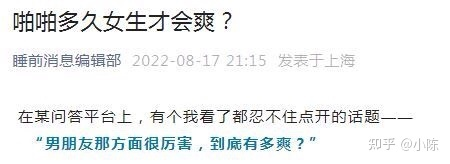
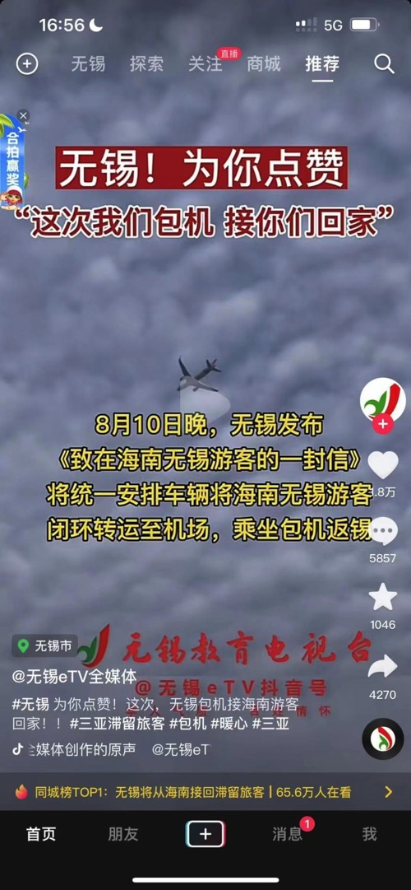
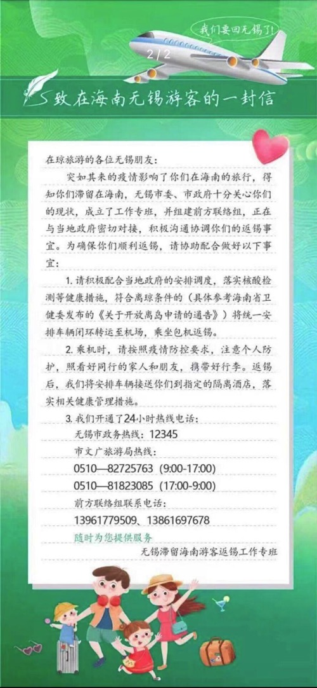

# 2022 年第五期 | 总第五期

2022 年 8 月 24 日

## 目录

[[TOC]]

## 黑马奖

### 如何评价张捷嘲笑马前卒智商低？

- 作者：[小陈](https://www.zhihu.com/people/chen-yun-fei-14-82)
- 平台：[知乎🔗原文](https://www.zhihu.com/question/548842702/answer/2634986002)

虽然我是马逆的拥趸，但张捷的这番话我绝对赞成。马逆要是智商有张捷那么高，睡前消息这个节目早就上天了，马逆也不至于穷成这个德行。

马逆肯定比我有钱，但绝对没有张捷有钱，看马逆接的广告就知道他穷成什么德行了。



### 如何评价张捷嘲笑马前卒智商低？

- 作者：[vb2](https://www.zhihu.com/people/vb2-78)
- 平台：[知乎🔗原文](https://www.zhihu.com/question/548842702/answer/2635577235)

说好听点叫针尖对麦芒，难听点就是狗咬狗。

这两个人有很多共通点，比如都特别记仇；而且都是玩批斗的高手，抓着对方的一个词或一段话不放，进行有罪推定，最后甚至会株连九族。

马前卒因为一个“解放”，就狂批傅正，最后把汪晖都一并打入反动阵营。张捷因为温铁军的一段短视频，就把温铁军打成境外势力的“主播”，然后连带着把什么国仁乡建、岭南大学一大串都揪出来当成境外势力批判。

这二位照理来说应当是惺惺相惜的，没想到还斗了起来。

不过张捷这次显然更low一点，毕竟马前卒破防也就在微信群里咒骂军迷，还不至于到做视频直接说对方智商低。

不过既然说到智商，张捷的一个微博至今让我印象深刻“河南一亿人80万新生儿一万好几的985名额，北京2400多万人22万小学生3000个985名额，而且北京没有农村分母，现在谁更激烈，按照人口算算。”

多牛逼，2021年的985名额比的不是2021参加高考的人数，而是2021新生儿的数量，合着等到2021年出生的新生儿参加高考时的985名额十几年都不会变的是吧？

显然这是一条非蠢既坏的微博，既然张捷自认为自己智商高，那么他就是妥妥的坏了。

## 体验

### 民营房地产债务风波的原因分析

- 作者：匿名
- 平台：B站

民营房地产债务风波的原因分析：1、轻资产模式；2、快周转模式；3、人性

最近一年，大家议论最多最长的话题之一应该算是这一次的民营房地产风波了。不但使得不少房子面临烂尾，更制造了大量的债务违约风险，拖累了经济发展。我自 18 年从某 985 大学土木工程专业毕业后，进入一家国内排名前列的房企工作了 4 年，时间不长，但在集团总部和全国东南西北的一线工地都有大量实操经验，现已彻底从这个行业离开，没有任何利益相关，今天凭借自己的亲身感受，谈一谈我关于此次民营房地产债务风波的一些想法。

为什么民营房地产成了现在这个样子？

我觉得是：轻资产模式+高周转+人性

#### 1、轻资产模式

从进房地产公司第一天起，我就学习到房地产本质上是一个轻资产行业，不需要靠自己的大量投入来开发项目。一块土地从拿地到项目交付完整结束，除了前几个月，都是靠别人钱来搞建设。很多人只知道房地产的预售模式是为了帮助房企融资，其实房地产玩的融资套路早已不是简简单单的预售可言，具体来说融钱的套路有：

①有从银行贷来的土地贷，开发贷，②有从业主那收来的购房钱；③有发行的海外债券；④有商票保理，施工单位垫资，延后支付工程款这种隐形的借款；⑤还有的通过让员工跟投，让员工，业主买理财产品的；⑥甚至有不少开发商还会去借高利贷（据我了解，这次某地银行的吕某，就是把从银行渠道获取的便宜资金用来给房地产公司放高利贷，吕某也没想到房地产这么快玩砸了，他还不上银行的这笔钱，快速跑路）；⑦明股实债；⑧合作方公司出资；⑨还有胆子更大的玩法，只有你想不到的，没有做不到的。

这样子的轻资产模式好处是让开发商能够以很低的成本开发项目（毕竟不需要自己垫太多钱），但是带来的风险不言而喻。如果项目开发顺利，房子也都卖出了好价钱，顺利交付，各种债务，借款也都按时还上，那么各方皆大欢喜，但如果项目遇到困难，整个工程就可能一下子现金流断掉，信任链断掉，大家都想着急从你这抽贷，一下子全完犊子，这也是为什么很多房地产企业说崩就崩。

#### 2、快周转模式

如果说轻资产模式是让开发商以很低的成本赚到钱，那么快周转模式则是让开发商更快地赚到钱。快周转模式，说白了，就是提高资金的使用率，让一笔钱在一年内多开发几个项目，多赚几次钱。其中，玩快周转模式最出名的应该是某碧，她最知名的就是 456 模式，4 个月开盘，5 个月资金回正，6 个月资金再利用，后来变成了 0357。

在这我和大家解释一下，456 模式是指：某地产公司手里面有本金 x 亿元，该公司用这笔钱去买土地，搞工程开发，然后再快速地工程建设，第 4 个月就达到房

屋预售条件，进行房屋销售，再催促银行放贷，业主交钱，做到第 5 个月就把这本金 X 亿元就从业主和银行那全部收了回来，这就叫资金回正。然后总部就会马不停蹄地把这笔钱抽走，在第 6 个月去投资下一个楼盘。也就是凭借这本金 X 亿元，该公司一年最快能够开发 2~3 个楼盘。其他各房企纷纷仿效，都设定了自己的现金流回正目标，一个比一个狠，这也是为什么前些年房地产公司增长速度特别快，低于 50%都没好意思见人。

凭借这样的快周转模式，很多房地产公司在前些年行情好的时候快速攻城略地，赚得盆满钵满，大型房企动辄一年几千亿的销售规模，带动地方经济和财政快速发展，但是也埋下了巨大的隐患，当房屋卖不动时，这些就变成了上千亿的债务风险，进而出现大量烂尾楼。这也是为什么现在各地政府都要求房地产要提高预售保证金，目的就是防止这些房地产公司总部把钱抽走去开发新项目。

#### 3、人性

大家其实看了我上面的描述，就会发现，房地产是一套高速周转的资金游戏，轻资产模式就够危险了，居然还快周转，这属于茅房里打灯笼，找屎（死）。那为什么国内这么多房地产企业的大老板，高管，金融界的风控人士，他们是傻子吗，他们不担心吗？

前几年很多业内领导，包括业内的书里面给出的理由是：

通过快速周转，抢占市场，规模达到一定程度，体量够大，就可以提高公司的信用评级，能够更顺利借到更多便宜的资金，新债还旧债，便可以持续把项目建设下去。未来房地产市场会像国外一样，只存在几家超大的公司，那么我们始终排名前列，把小公司熬死了，我们就是最后的胜利者

但我认为他们的内心真实想法：

老板们：我做大规模了，行业上下游这么多人都和我绑在一条船上，我就会大而不倒了（事实上，我所知道的一些大房企老板现在其实日子过得还真不错，到现在为止都没人进局子），风险就交给国家吧，而且这些老板大概率已是外国户籍或者永久定居了。不少房地产企业老板也知道泡沫破裂的这一天迟早会发生，但当时（15 到 19 年）行情这么好，都觉得还可以抓紧时间捞一笔。

高管们：快周转模式的一年的奖金可能是之前的十倍（大家可以搜前些年的地产天价年终奖），而且项目一下子增多，那公司一下子多出来一大堆总监，总经理，总裁的岗位，阿猫阿狗都摇身一变成了 X 总，岂不美哉？赶紧能捞一笔是一笔，鼓励老板加快速度搞开发，出现风险与我无关，我辞职跑路去其他公司就是。

另外，其实这个行业内的上下游的金融界，供应商，包括地方政府其实都有种侥幸心理，觉得现在这状态大家赚钱都挺快乐，财政也很富足，甚至可能不少人都觉得即便风险真的来了，国家也会管，自己的精湛的操盘实力也一定能躲过去，现在有钱不赚是傻子，大家都逐渐放松了警惕。

但是疫情、三道红线、银行控制按揭回款，加速刺破了民营房地产债务泡沫，也成了大家现在所看到的现在的样子。

#### 后记

我自己亲身完整地体验了房地产从近乎癫狂到黯然没落的过程，上面的内容都是自己的直接感受。本来还想谈一谈政府的角度，亦或者该如何解决这个问题，但是我也没经历过，也不合适，市面上很多这种专业书籍，就不写了。

::: warning 马督工点评

简明地介绍了赌徒在“锁定胜率”前提下的发展策略——就是不断把赚到的钱再投入赌局，以及借别人的钱投入赌局。

世上当然没有锁定胜率的赌局，但作为行业的坐庄赌场，是锁定胜率和收益率的，所以国家必须限制赌场牌照和发展空间，不许资金无限卷入。过去 20 年房地产的问题就在于，房地产并没有像赌场一样得到监管，而是被地方政府鼓励，被央企当做盈利工具。

上下交征利而国危矣

:::

### 汉芯事件冲击下的命运

- 作者：[课代表阿瓜](https://space.bilibili.com/216126935)
- 平台：B站
- 联系方式：[kedaibiao2022@126.com](mailto:kedaibiao2022@126.com)

我是 2004 年毕业的本科，在一所 211 学校学的电气，主要是工业自动化控制。因为比较笨也比较懒，那时国内考研刚刚热起来，因为不想工作（也是找不到太好的工作），我也加入了考研队伍。

当时成绩好的同学，一部分去了外资企业，一部分考研去了 985 甚至国外大学。我们这些愿意留在本校读研的，基本在老师眼里就是“没人要的废物”。不过照顾本校学生是传统，所以我依靠着老师专业课放水，算是混进了研究生队伍。

虽然我成绩不行，但是在学院里人缘还不错，走了些门路找了全院最“厉害”的导师。所谓厉害倒不全是说水平，关键是钱，能弄到项目资金课题就是厉害。我们这种工科院校，在这之外还要“揽活”。导师一年几乎见不到两次，都在外面不是开会就是跑项目跑工程。学校里的事情都是交给两个师兄管，人称“二头领” “三头领”。

虽说如此，他俩也都是副教授了，不大管事，于是把工作分组，各组设组长负责。组长被称为“小头目”。

只要把事情搞定就可以，谁干、干多少没人管。我因为不论动手还是动脑都比较差，计算绘图编程样样都一般，于是当了两个组的公用“杂工”。每天工作就是带着前一天的进度去开早会，回来宣讲头领的命令，然后跑上跑下送东西要东西，还要帮十几个人打饭。时间还蛮灵活的，而且越是厉害的导师，一般钱上越大方，吃喝都是公款，我每天上网的钱都从里面挤出来的。

至于论文啥的，他们从做的项目里找了一个好的挂我名，好像还是个省里的重点项目。算是我每天打饭辛苦的回报。

原本就打算这么混了，结果我遇到了一个机会。

那次去杭州开会，我没去过想去，于是组里指派我去参加。一行好几个人带队的是三头领。那次会开的不太好，晚上吃饭有几个借酒闹事，逮着三头领灌。我因为酒量自认很可以，加上听那几个说的话有点难听，上去开了瓶五粮液直接喝了半瓶。然后递给他们问哪个上来咱们喝一个？几个人都不敢接，事情就过去了。事后三头领说看我不错，遇到事情能维护自家人。他博导快下来了，到时候让我报，留校跟着他好好混，只要有个靠山，学校比在社会上容易过日子。

我本就是个比较得过且过的人，没啥目标和进取心。而且几乎每个学校每个大教授，都会有个拎包的马仔，天天就是鞍前马后忙杂事。别看没啥本事，论履历都学术成果丰富，领导有的都少不了他一份。我们背地里管这种叫给人“当儿子”，其实都很羡慕。

我就当时表了忠心，激动的说不出话了。三头领很满意，叫我回去还在原来地方忙，不要表现出来。平时不论院里组里，谁要是有什么言行举动，留心记下来告诉他。

原本顺利的事情，研二那年，也就是 2006 年初，汉芯的事情爆了。

一开始我们都不信，院里有的教授说造假的多了，没有拿砂纸干的。十几亿的项目，敢这么干，押到刑场打成筛子不可。

然后大家就被打脸了。而且等了很久，也没有处罚结果。大家猜估计事情太大，非要把链条整个拔了，都说交大这些年这么旺，这次要倒霉了。（2000 前后，交大或者说上海，气势真的是很吓人）。

然后大家就又被打脸了，事情几乎“阴干”了。有两个机械学院的教授开会，为这个事情吵起来，一个说以后学术研究彻底没规矩了，一个说换你这么没规矩肯定枪毙。两人吵的斯文扫地差点动手。

没想到到了年底，国家颁布了学术规范条例，一下子把无数人卷了进来。

当时国内科研基本被全面猜疑，不论项目本身、资金使用、成果真实性、成果实用性。连行内人都不知道到底有多少娄子，于是开始严查。

查谁？自然是谁项目多，谁资金多查谁。于是我导师成了出头鸟，加上平时所处的层次比较高，在学校里不注意人情世故。成了重点关注对象，特别是资金的问题，他过手的数目太大，又一向比较手大乱花，钱上的窟窿越查越大。

后来倒是查明他没有往自己口袋里塞，但是这下一搞什么面子都没了，好多项目也被停了，外面还一度传他“进去”了。导师这人打读书就是学霸，几十年没吃过亏，这次面子里子都没了，一气之下请了长假。

这一来人心就散了，有的比较活络的人，就提出申请转导师，而且公开带着做了一半的研究项目转。这下导师气得更厉害，说随便爱走就走，我不拦着你，就记着不要后悔就行。

我当时非常尴尬，转导师一来不大好意思，二来我没有项目估计也没人要我。于是就留了下来，好在有的项目还在做，走了一批人正好空出位置。我的论文还是没问题的。

至于给三头领拎包，他的博导到我毕业都没下来，至于为啥我不知道。反正没下来就是没下来。谁也不敢问，我们那群人都只能夹着尾巴做人。于是我稀里糊涂混到毕业，早早的通过关系找了个事业单位，成了那个单位第一个研究生，而且因为笨，把研究生三个字的名声给败光了。

工作倒不太累，天天还是忙杂事，一晃十几年就过来了。本就薄弱的专业知识，也几乎都丢光了。

导师后来风头过去又爬起来了，在学院里闹了一通无果，最后负气出走，现在已退休几年了。他走的时候带了一部分人，投奔的地方这些年经济发展很不错，这些人都没吃亏。我本就算是他们群体的边缘人，又留在原来这个城市。这么多年联系的不多，就是在群里时不时互相打打招呼。有机会遇到就吃吃饭，大家都默契不提当年的事情。

如果不是重提汉芯的事情，我都忘了当年居然还曾有个拎包的活摆在我面前。可惜我虽然珍惜，它却像个肥皂泡一样，被一场千里外的大浪一下打碎了。

### 关于《蛋卷俱乐部》第三期“政府公告过度强调稳的后果”督工点评的补充

- 作者：匿名
- 平台：QQ

::: tip 搬运者注

往期回顾：[《蛋卷俱乐部》第三期·带货：政府公告过度强调稳的后果](3#政府公告过度强调稳的后果)

:::

::: info 往期马督工点评

感谢推荐带货方向，我们会存档的。本期最有趣的内容是这一段：

> 最近国有银行存款比例飙升，是因为投资无望加上对中小银行的不信任造成，往年年中各大行为了完成业绩指标，会发布揽储任务，比如7天高息等等，今年却是毫无音讯。反而贷款任务困难重重，不断下调利率（房贷，消费贷，个人贷都是历史同期最低水平）也很难完成

> 让我茅塞顿开——前几天我考虑类似问题，想的都是银行期待政府大放水，认为未来的“钱”更多所以大银行不揽储。现在您提供了新的角度，如蒙同意，希望能在节目上引用类似观点。

:::

作为一名河南地方性银行员工，为督工提供另外一个视角：国有银行存款比例飙升，对应的是各中小银行自行压降存款成本，降低付息率，从而导致存款流向国有大行。

前几年经济形势好，中小银行为了从国有大行手中抢走存款，一直在抬高存款利率，以河南省为例：国有大行往年三年期利率跟中小银行一年期利率差不多。

除了利息高，各中小银行过年过节还会送礼品，尤其是每年 1-3 月份春节期间，每一万元新增存款除了正常付息还会额外再送 10 元左右的礼品，银行内部为了鼓励员工揽储，也会对揽储员工进行奖励，奖励金额也在每万元十元左右，也就是说各中小银行的实际付息率会更高。

付息率高意味着贷款利率会更高，之前由于经济活跃，贷款需求旺盛，所以就算中小银行贷款利率比国有大行高，仍然有很多人愿意用，那时候中小银行的日子过得也还很滋润。

等疫情来了，经济下行，贷款也越来越难投放，尤其是中小银行的高利率贷款，面对市场上越来越小的贷款需求，必然竞争不过国有大行。除了贷款难投放，更要命的是全国各地不断爆出的且在我所工作的小城市也有发生的断贷风波。如果说贷款投放不出去还只是一把没落到银行身上的刀，那各地的断贷行为就是插到银行心脏的匕首。

贷款是各大银行的主要利润来源，贷款投放不出去，各家银行的日子都不好过，最明显的例子就是前几天新闻报道的国有大行五年期利率跟三年期利率倒挂，国有大行都如此，各中小银行的生存压力可想而知。

为了缓解生存压力，各中小银行很有默契的选择了降息，除了降息，一些地区的中小银行由于“历史包袱重”，长期存款也不让存了，比如我所在的地区，由于之前吸收的高成本存款比例过高，总行决定快刀斩乱麻，只让存一年以下的定期，以此来调整存款结构，压降存款成本。

只有把存款成本压下去，贷款利率才能降下去，贷款利率降下去，贷款才有竞争力，中小银行才能活下去。

所以以我的视角看：国有大行存款上升除了投资者投资无望都把钱存到银行吃利息，另外一个原因是各中小银行主动放弃了往年凭借高息吸引过来的存款，而对中小银行的不信任充其量算是诱因。

我所在的城市紧邻许昌，也算处于此次村镇银行事件舆论的中心了，但这次村镇银行事件的影响很小，小到领导开会也只是提了一句控制好舆情就转而谈贷款投放去了。比起揽储，把手里的钱贷出去才是更紧要的，这也是各大银行都未发布年中揽储任务的原因。当然归根结底还是存贷市场的供求关系发生了转变。

最后补充一个个人观点：如果疫情前两年我们还对经济抱有乐观情绪，而今存贷市场供求关系的转变则意味着经济彻底走向低迷，（可能我是银行从业者，这点对我影响较大）所以我认为2022是中国经济的拐点，至于拐向何处，大家走一步看一步吧。

### 让「声智健康」删除个人信息的经历

- 作者：[木又](https://www.zhihu.com/people/13-70-21-30)
- 平台：微信、即刻
- 联系方式：微信号 sjrmy-yyjqh

在大同做核酸必须在「声智健康」微信小程序登记个人信息，但是核酸报告出来以后却无论如何都找不到删除个人信息的按钮，打客服电话也没人接。

而北京地区可以通过“声智健康”预约接种新冠疫苗，以至于我一共就 68 个微信联系人，居然有 15 个都使用过声智健康小程序，接近 1/4 的微信联系人的个人信息被声智健康获取，都无法删除。

所以我决定给「声智健康」加深一下对《个人信息保护法》的印象，于是我在五个城市的 12345 投诉了声智健康，24 小时不到，问题就解决了，详细过程请见：

[飞书文档·木又：让「声智健康」删除个人信息的经历](https://b75gu4xte2.feishu.cn/wiki/wikcnJz2YYCMMRjFe3VB1FIHuQc)

## 线索

### 海南抗疫骚操作

- 作者：匿名
- 平台：B站

朋友去海南度假，刚下飞机就遇上疫情，后来无锡政府接人回来，一开始我们都以为是免费的，结果是收钱的，隔离也是自掏腰包，其实这样没啥，自己花钱就花钱吧。但政府又给所有人发台词，统一要在社交媒体上唱赞歌，这就有点恶心了，更恶心的是，朋友家是无锡郊区的自建房，他想回家隔离还不允许，因为他家的房子没有消防验收。。。。。。

这防疫层层加码，没完没了，大有取代房地产，成为我国新的支柱产业。

以下是他朋友圈的原文：

> 积极配合防疫工作且守法公民的铁窗泪
>
> 1. 没有包机没有包机没有包机，全价机票
> 2. 下飞机采访给台词是什么鬼？
> 3. 文科生抠字眼是真有一套，几行字都能给你抠出个两室一厅来，层层加码就不说了。<br>低风险区返锡要求 3+4——没问题绝对配合<br>一定要所谓的单人单户——也没问题配合<br>农村私房还必须满足消防验收才可以居家隔离，那真是闻所未闻了！！!
> 4. 当我快火冒三丈的时候，鸿山街道工作人员居然还忍不住笑出了声。

无锡牛啊

|  |  |
| ---------------------------------------------------- | ---------------------------------- |

## 观众社论

### 如何看待上海随申码数据库 4850 万信息被 4000 美元拍卖？

- 作者：[Lloyd Bannings](https://www.zhihu.com/people/tyup2008)
- 平台：知乎
- 联系方式：[平台私信](https://www.zhihu.com/people/tyup2008)

距离马秃工的随身手环普及又远了亿点点

情绪就不宣泄了，说说我想的如何保护隐私。

首先，现在的隐私保护太过点状了，谁搞个 app，弄个抽茅台小程序就敢问你要身份证号。

那么有没有可能性，把公民信息，汇总到一起，然后给每个人发一个随机码，你在任何需要信息平台填信息，填这个个人唯一的码就可以了。这个码最终是向比如公安的服务器或者某个新部门服务器请求审核，审核通过，只反馈少量信息，比如就反馈身份信息无误这几个字。当然是区块链或者其他数字证书技术加密的反馈。。

当你打开游戏要输入防沉迷信息时候，过去是姓名身份证，现在只要这串码

为了保证只有本人可以使用，或者可以增加其他身份核验手段。个人也可以凭这个唯一码，查询自己的信息最近被谁调用过没通知过我

那么二级平台产生的各种信息，就变成不记名的信息了，比如你在哪家酒店开房，滴滴从哪到哪，虽然平台有记录，但并不能直接查到你是谁。

当然，这只是个初步设想。不知道有没有操作性。

```markdown
@睡前消息
有一个编号 9527 的用户申请淘宝实名认证
公安局发消息到登记过的 9527 编号公民手机询问是否本人操作
确认本人操作
公安局反馈淘宝，9527 已经通过实名认证。
淘宝：编号 9527 用户，注册用户名为 XXPP。
XXPP 今天在睡前消息淘宝店消费购买一只情趣小海豹，
睡前消息节目组打包寄到某小区菜鸟驿站，
XXPP 在淘宝 APP 上看到提醒，快递已到达菜鸟驿站
xxpp 取件
```

这就是一个基本流程，全程只有公安局知道有一个 XXPP 的人，真实名字叫秃平。但是公安局不知道秃平在淘宝上进行了交易。

淘宝知道有一个叫 XXPP 的账户，编号 9527，在淘宝购买了一个情趣震动小海豹，但是淘宝不知道 9527 是秃平。

这样个人信息就做了分离储存，你的 XP 只有你自己知道。外部黑客入侵也好，内部人员窃取也好，都要同时获得两个部门的完整数据库才可以拼成一个有效信息，这就像撕成两半的藏宝图一样，如果想获取更多比如你的游戏信息，开房信息，甚至还要黑掉更多服务器才可能。

服务器上可以用碎片化储存等技术，这样，只要坏蛋没本事爬下所有数据，单独一组拿出来，都是零碎的乱码。

顺带提一下如果你真这么在乎个人信息，就不要嫌未来的审核方式麻烦，一个安全的系统肯定是臃肿的，甚至是低效的，甚至是无数补丁的。

如果你不在乎个人信息安全，你点进这个问题的初衷就很奇怪了。

## 编读往来

### 【睡前消息 468】社会新闻有点“热”（7 月新闻回顾 下）

<BiliComment name="带带带黑猫锅锅" content="我是自己开店的，我招不在店里接待客人的比如美工策划，不会说你痊愈不能干，你有能力照样干。但是我面对客人的岗位短阶段不可能招新冠痊愈的，万一复阳，我要承受多少损失？来的客人要承受多少损失？ 现实就是有中高级技能的不管你是不是感染过你都能找到工作，没有技能只能干低技术岗位的感染后就寄。这究竟是疫情措施问题还是社会歧视还是自身能力问题？总之是个很复杂的问题"/>

<BiliComment name="水滴部队" content="主要还是用工单位可选择性比较多，要是少，他们也不这样，说明还是人多，还有 35 岁下岗也是，主要还是选择多"/>

<BiliComment name="咱别熬夜啦" content="建议尽快在微博开通“睡前消息”的超话，这对于能加你们的影响力是有利的，微博玩这个的还挺多的，尤其是年轻人，还差三个人就开通了"/>

### 【睡前消息 469】货运地铁通全国，瑞士替全球实验

<BiliComment name="名侦探爱伦坡" content="很多人提到瑞士就觉得是手表，其实瑞士的制造业水平比你想象的要全面和强大得多，瑞士在材料，化工，生物，医学和装备制造领域都拥有很好的表现，苏黎世联邦理工大学，洛桑联邦理工大学更是全球顶尖的理工学府，可以说瑞士在欧洲是仅次于法德的第三大工业强国。<br>当然，在互联网经济作为主要增长点的当下，传统工业再强也就那样，但是对于瑞士这样的小国而言，拥有如此多的强势企业，足够全国人民吃香喝辣了。" reply="<div class='bc-reply'>坚韧的水牛品茶</div>比意大利强么，意大利有一众跑车品牌，F35 欧洲制造中心也在意大利。还有瑞典，柯尼塞格宜家沃尔沃等<br><div class='bc-reply'>章台柳杨柳枝</div>回复 @坚韧的水牛品茶：重工业比意大利强，轻工业不如<br><div class='bc-reply'>名侦探爱伦坡</div>回复 @坚韧的水牛品茶：意大利主要是缺乏新兴增长动力，像生物医学材料这样的 21 世纪新兴增长点意大利是一个也没赶上，而且工业门类也相对单一，这就导致意大利的经济其实在过去几年一直没有增长，不出意外的话，意大利的人均 GDP 在 2025 年以前就要被北上广深全面超过去了，刚好北上广深的总人口也跟意大利差不多，相当于中国最发达的地区已经进入像意大利这样的中等发达国家水平。<br>"/>

<BiliComment name="李二的奇妙冒险" content="简单思考一下就能明白，两岸都是成熟的工业体，怎么可能禁运一些农产品和原材料就伤筋动骨，只能说对岸农产品是真的不行，所以才不得不禁"/>

### 【睡前消息 470】反击汉芯翻案风

<BiliComment name="幻想乡里说丰年" content="我大学电子信息工程，上课经常有老师谈汉芯事件，毫不夸张的说汉芯影响了中国芯片产业十几年。以至于之后的但凡中国自主造芯片就会被人说是汉芯 2.0。美国芯片商看到了睡觉都会笑醒"/>

<BiliComment name="松本杰少" content="干脆正大光明说我就偷了一段残缺源码，按照商业间谍给报酬，国家拨款给人给经费一起研究尝试逆向工程，这样没问题啊。就算是逆向工程失败了也能说得过去。根据商业间谍提供的报酬，吸引更多人偷来源码，大家一块研究，最终提高逆向工程成功率，这也算大功了。张捷的逻辑这样说没问题。<br>但是你非要说你属于天降超人，肩负芯片翻身使命，拿了纳税人十几亿，最后手磨芯片继续包装谎言，被打假的拆穿，这怎么能去喷打假的阻碍芯片发展呢。张捷的逻辑真的是张口就来。"/>

<BiliComment name="路人丶执" content="说实话，督工有些言论确实有点不敢苟同，比如军事类，但是即使我们看来是那是错的，也符合督工的逻辑标准，因为督工更多的凭借公开资料的准确性来评估事件，军工类确实公开的资料不多，大多数是个人的一些猜测与推理。同时，抛开这些我们认为错误的信息，督工往往能给出一些较为令人信服的建议，比如航天的几期、财政资金管理、农村银行等等。督工的出发点与逻辑永远是朝着公利出发，有一套自洽的逻辑链，错对可以自己判断，这也是我一直喜欢看督工的原因。张捷的视频我之前也看的很多，但是慢慢也没看了，说教味道太重，主观判断过重，都是些自己的内幕消息，没有自己的逻辑链。可能这也是督工与他们绝大多数的不同吧。"/>

<BiliComment name="fate 的守护" content="俄乌战争证明内部消息和公开消息都未必可靠，美国和俄都因此误判形势，军事这个东西迷雾太多，根本不适合键政。"/>

<BiliComment name="火烧彤云 6" content="张捷翻案的言论之所以有市场，有多层原因。一个原因是国人受以前那些打入敌方、窃取情报、被高调宣传为英雄的地下工作者的老电影影响较深。他们不管陈进是如何诈骗国家资金的，只是单纯地觉得陈进把从美国偷来的技术带入中国，他就是英雄。张捷就是利用这种情绪来为陈进翻案，为自己吸取流量。"/>

<BiliComment name="洗洗睡吧明早还要搬砖" content="那房谁拆的动，根本不是钱的问题，各方利益博奕各种院士话语权，他们码在那要，就一个中关村二小学区房谁愿搬，当初四环修到这什么环评扯好几年，就这一段通不了。"/>

### 《蛋卷俱乐部》选刊：如何评价睡前消息 464 期

<BiliComment name="匿名" content="答主父亲很棒！但不得不说，答主父亲年轻时候在探索自我这方面已经领先于很多同龄人了，有一定的先发优势。怎么让从前除了看电视以外没有其他爱好的老年人找到一个更能产生自我价值的爱好，是个难题"/>

## 读书

### 读书《乌合之众》

- 作者：[村东摸鱼王](https://space.bilibili.com/486604411)
- 平台：B站

> “《乌合之众：大众心理研究》为社会心理学领域的经典著作，作者勒庞在书中细致描述了群体心理的一般特征，分析了人们在群聚状态下的心理、道德、行为特征。解释了为何群体往往呈现出“盲目”、“冲动”、“狂热”、“轻信”的特点，而统治者又是如何利用群体的这些特点建立和巩固自身统治的。”

——上面这段引言是两个月前**浙江省委党校某教育中心**荐书时的引言，我现在原封不动地复制过来，官方怎么推荐我就怎么推荐。

全书共分三卷十三个章节，分别讲述了群体的心理、群体的意见与信念、不同群体的分类及其特点，自从其问世以来就得到了无数心理学家、社会学家、政治家的高度评价，以至于直到今天诸如政治家煽动国家疯狂、商业界鼓动群体购买、媒体诱导民众意志等等行为，都或多或少利用了勒庞的思想，很多行动纲领甚至根本就是参考了勒庞的群体心理分析而制定的。同时，书中对于犯罪群体的阐述，说明群体的犯罪倾向等，对于研究犯罪心理学的人们以及法律工作者们，也会有莫大的帮助。

然而一切事物都是在特定的历史环境下产生的，也必然带有一定的历史局限性。勒庞的这本《乌合之众》里面也带有一些受当时历史所限制的在今天看来并不正确的观点，例如基因决定论、歧视女性、种族偏见和歧视等，不过一个受过正常教育的懂得理性思考的人应该知道什么叫“取其精华，去其糟粕”，知道什么叫 “辩证看待”。另外，任何事物只要出现就必然会引来质疑。《乌合之众》这本书问世之后也引来了不少的批判，其中经常被提到的就是詹姆斯•索罗维基的《群体的智慧》，他的观点就和勒庞相对，认为我们要么是低估了群体的智慧,要么是高估了精英或者专家们的作用。《群体的智慧》这本书我目前还没有读过，希望有其他的读者或者睡前消息编辑部的成员能分享一下，这里先上我对《乌合之众》的部分摘录和自己的感想：

#### 引言：

> **只有深刻洞悉群体心理，才能理解法律和制度对他们的约束是多么苍白无力；才能理解除了强加给他们的意见之外，他们几乎没有能力提出自己的意见；而且想要领导他们，就不能以基于纯粹公平理论的规则条例来实现，而是要找出什么能给他们留下印象以及什么才能引诱他们。**

煽动情绪是一门生意。看看现在有多少百万+甚至千万+的自媒体博主都在靠煽动情绪来恰流量，尤其是性别问题和地域问题上，一个社会热点出来，就刨祖坟一样搜集各种以往的类似例子，借以证明自己的结论———哪怕两者没关系也要硬凑。这样的博主占主流，在叠加经济形势下行带来的戾气，网民情绪化一点也不奇怪。

#### 第一卷第一章：

> 在集群中，所有人的情感和思想会选择一个相同的方向，而且他们的意识人格将逐渐消失。如此一来，集群中的个体便形成了一种集群心理。

> 构成群体的个体在考虑事情时从数量方面出发，他们会感受到一种无敌的力量并因此而形成一种本能．但当他们独自一人时就必须努力克制这种本能。这时候，个体将不情愿地从另一种角度来审视自己：**群体是无名的因此也无须承担责任，然后一直控制着个体的那种责任感便完全消失了**。

“法不责众”或许就是这个意思吧。

#### 第一卷第一章：

> **群体的每一种情感和行为都属于传染的一种，而且个体在受到传染后很容易会为集体利益而牺牲个人利益。这种能力有违个体的本性，而且除非作为群体的一部分，否则一个人很少能做到这一点**。

这一点利用到正地方去，那就可以做出可歌可泣的贡献，要是被别有用心的人利用，那就是被人卖了还替人数钱了，这一点很适合用来形容某些互联网二极管。

#### 第一卷第二章：

> 在群体的观察之下，最简单的事情也很快会变得面目全非。

> 群体会永远徘徊在无意识的边陲地带，迅速屈服于所有的暗示，拥有所有无法上溯至理性影响的生命体所特有的暴力感受，同时失去所有的批判能力，而且除了过度经信以外再无其他能力。

> 群体情绪中的简单与夸张所导致的结果就是，群体中的人既不知道怀疑，也不知道确定与否……群体中的人会走向两个极端。一经宣布，这种怀疑就会转变成无可争议的证据。因而，赞成或不赞成的情绪就会产生，在这种情况下，一个独立的个体就会获得力量并立即成为群体中个体所愤恨的对象。

> 群体只知道简单和极端两种情绪；他们将所收到的观点、想法和信念暗示作为一个整体而接受或拒绝，而且会将它们看作绝对真理或绝对错误。对于那些通过暗示过程所诱发，而非通过理性思考而产生的信仰而言，情况总是如此。

个人认为，这段话几乎就是为描述眼下的中文互联网量身定做的，尤其是在一些具有重大争议的话题上，比如：地域问题、性别、文化、中医等方面，你总能看到勒庞所描写的人集中出现。

#### 第一卷第三章：

> **为公众留下深刻印象的不是事实，而是事情发生并引起注意的方式**……如果了解了如何为群体留下深刻印象的艺术，同时也就了解了如何统治他们的艺术。

参考督工对两次唐山打人案影响力天渊之别的评价：普通人如果不能从新闻中得到情感冲击，的确就容易无视别人的苦难，甚至没有监督的热情，要是没有充足的信息量，**大多数人其实并没有那么关心自己的同胞**。

#### 第一卷第四章：

> 群体并不理性，它们会将观念作为一个整体而选择接受或拒绝，它们既不会进行讨论也不会提出反驳，而且他们所接收到的暗示会侵入他们思想的整个领域，并立即使得他们将这些暗示转变成行为。我们曾说过，群体在受到适当的影响之后会准备为他们所激发出来的理想而奉献自己。我们还看到，他们只具有暴力和极端情绪，在他们所处的情况下，同情很快就会成为崇拜，而且厌恶情绪几乎在产生的那一刻起就会变成憎恨。

#### 第二卷第二章：

> 对于民众而言，他们从未渴望过真理。他们抛弃了与他们品位不符的证据，如果再受到谬误的引诱，他们宁愿选择将谬误供为神明。无论是谁，只要能为他们带来幻想，这个人就会轻易成为他们的领袖：**无论是谁，只要试图毁灭他们的幻想，这个人就会成为他们的受害人**。

不要劝架也是有点道理的，疯狗总要咬点什么东西，你强行阻止它去咬它原本要咬的东西，它就会来咬你。

#### 第二卷第三章：

> **长期享有威望的神和人从未经受过人们的议论。如果要得到群众的仰慕，威望的载体就必须与他们保持距离**。

郑渊洁说：太阳最高明的地方就在于它把光明撒向人间的同时不让任何人接近它；督工评价西班牙王室丑闻的时候也认为：维持想象中的完美形象需要距离，得到民众的认同需要亲民，这两个目标是彼此冲突的，看来古代的皇帝选择住在重兵把守的皇宫里也不止只为了安全考虑。

#### 第二卷第四章：

> 群体观念的可变性比以往更加明显，这要归结于三个不同的原因：
>
> 第一个原因就是，古老的信念愈加失去了它们的影响力，而且它们也不再有能力像以前一样形成短暂的观点。普遍信念的衰弱为许多偶然出现的观点提供了生长的沃土……**这种观点引导的完全缺失以及普遍信念遭遇毁灭的最终结果就是，各个阶级的信仰都存在的极端分歧，而且群众对与其直接利益无明显关系的事物表现得越来越漠不关心**。

多么准确的形容。

西塞罗有一句名言：教育的目的是让学生们摆脱现实的奴役,而现在的年轻人正意图做着相反的努力——为了适应现实而改变自己。这句话让我震撼的原因不是因为它说的有多对，而是它是古罗马人说的，到今天居然还是对的。同样的，勒庞这本书作给我的感触也在于，他在普法战争的时代的一些描述，放到今天依然能够超越种族、国家、社会制度甚至是历史，准确地把握群体的共同特点，不知道这背后是类似的社会关系决定的，还是人性中的一些共同点决定的……

::: warning 马督工点评

从基因或者说生理结构来说，我们是几十亿只高级猴子，只适应小群体生活，最近一万年被农业强行抛进了“大群体”生活，所以产生了各种直觉误判。比如说，在小群体里面，唱歌最好听的人，往往也是自己创作音乐的人，所以我们就把歌手当做整条音乐产业链的代表——这显然不合理，但符合直觉。

乌合之众这一类书，对“误判”的描述不错，但我们更需要解释为什么“误判”普遍存在，以及如何用社会科学缓解问题。

:::

## 另类参考

::: warning 马督工点评

代表了一种典型思潮，对本文内容不表态，权做各位读者参考。

:::

### 本人（非中医专业）对中医及中华文明的一些看法

- 作者：百草霜
- 平台：B站

不知道每个人对未来医学的看法是怎样的，但是我觉得中医就是未来医学。即一个医生以人的长寿为前提对病人进行所有方向的治疗。也许医生将来可以由机器取代。

就我目前的观察，医院只是一个治病的地方，这是它的优势，在身体的其他方面都健康的前提下，治疗好单个疾病而且不用承担其他责任，这解决了绝大部分的问题，更像是工厂的流水线。对病人来说的问题有：一、以药物为前提的治疗会导致医药集团控制医院（包含对国家的影响）；二、医生控制不了药物的副作用，病人往往要面临吃另一种药来对抗前一种药的副作用；三、需要治疗的单个疾病往往不是机械的出现，它是人体的复杂运行过程出现的产物，治疗一种疾病可能反而造成另一种后果。另外，制药的有几个人是一线医生？

中医的根本是“人身虽小暗合天地”，以中国最根本的结果论为治疗方向。目的是培养更接近自然的高级人类。它是一门以人为本的复杂学科，而人类本应进行复杂工作，这是人类的进化过程决定的。现代中医的最大败笔就是中医院的分科治疗、医药分离、针药分离。伤寒中的经方，就像是答案一样好用，这是古人留下的历史遗产，我们可以随意使用，只是这终究不是上乘，优秀的医生需要学会经方的道理，并且活学活用，不拘泥于某一味药。人体和大自然都是复杂系统，通过训练的中医可以将两个系统进行合理适配，自然的系统高于人类的系统，中医可以借用自然从各种角度进行同一种症状的治疗，进行针对性治疗，普通的医生是手工业者，优秀的医生更像大师；现代医学是人类创造的系统，它小于人体的复杂系统，所以可以更好、更规范的训练医生，仅使用规定的药物进行治疗，所以更像工厂和工人。督工说要废医验药，这就像以前的打倒孔家店，真实目的是救出孔子，在这里是存药失医，则医药两失，失去中医的中药不是中药，只是各种自然界存在的物体。

中医的基础是黄帝内经，伤寒杂病论。这两本书的存在相当于马克思主义对中国的影响。历史证明了这两本书的合理性，就像历史同样证明了马克思主义的合理性。

有人说，中医的哲学基础阴阳五行属于形而上学的东西，我挺好奇，这些人是否看过黄帝内经，就像我也不知道这些人是否了解过马克思主义、毛泽东思想、邓小平理论，但这也同样影响不了这些人生活在中国并且建设中国。阴阳五行只是哲学工具，是古人认识世界产生的结果，是一个名称，这受限于社会的发展水平。现代中国人的思维方式很大程度上受西方人的影响，中华文明历史上也经历过多重磨难，兼收并蓄而最后屹立不倒的也只有中华民族，但是如果抛弃中华民族的根基－－隐藏于万物的哲学思维，恐怕离灭亡也不远了。

也有人说，中医里的魂、魄、气，这三样东西就是典型的唯心主义，因为根本看不见，无法证明它的存在。那我就要提问了，暗物质是什么？数千年时间差的几个名称放在人类的身上显得漫长，放在宇宙纬度来看呢？一个是通过数千年的观察人体发现的模糊概念，一个是通过观察宇宙后发现的模糊概念，两者相差的仅是一个有充足的实验证明，而另一个，因为年代久远，实验数据丢失。并且我想问一个问题，科学规律是创造出来的吗？

中国的现代发展很大程度上受到了立国之本－－唯物主义的限制。受到了唯物主义教育为基础的科学教育的中国人天然对中华文化的唯心主义敬而远之并且充满了傲慢和偏见。中华文化的精华相当程度上是现代人理解的唯心主义，这些东西是古人的假设、推理与验证而受制于时代发展，但这个体系回答了我是谁，我从哪里来，我要到哪里去的问题：我认为中华文明已经解决了这个的问题。它有一个宗教的外壳，但是和西方宗教的本质并不相同，以我们在唯物主义的视角下现在无法理解的角度，就是他们作为个体每个人都成功的以个体身份回答了我是谁我从那里来我要到哪里去的问题，我认为中医是这个回答的平行产物。因此解决了这三个问题后中华文明数千年没有发展。也因此产生了独特的中式考古（体现在小说中，就是主角往往从悬崖下捡到前人遗留的秘籍，有趣的是秘籍就在身边例如西游记）。着急否定很可能会丢掉文明皇冠上的明珠而被西方人捡起，这一点对我来说是无法接受的。

现代中国人从小接受的教育基础就是西方人创立的科学体系，并且从马克思主义到科学基础到先进的科学成果，最好的东西往往全是西方人，并且它们既是裁判也是选手，中国人很难突破这个限制，也因此出现了很多皈依者狂热，往往会出现学的越好屁股越歪，我常常都在想教育是不是已经失败了，以至于绝大多数人不仅没有解放全人类的信念和勇气，反而把金钱作为实现自我的唯一途径。我认为解法只有把马克思补充进入中华文化的哲学宝库。

我不知道是否有人做过古代没有而现代人独有的病的调查，如果做过，我很想知道，这些疾病的致病原因和现代工业的关联。

中医的进步之法目前来讲我认为应该是引入最优秀的物理学家并且针对现代工业创立新的学说。我也设想过中医的消失，目前为止，人类还脚踩大地，头顶天空，中医不会失去生命力。也许就是当人类进入太空的那一刻，中医才到了寿终正寝的时候，但是它留下来的哲学永远存在，因而它不会真的死亡，只会换一种模式存在于宇宙中。

我们只有先保住中华文明这个基地，才有可能解放全世界。

（如果有机会我希望督工去一趟武当，与一些老道长深入交流，发表一下对唯物主义不相信的东西的看法）

我在此特意提出几个问题

1. 同样是手工业者，凭什么认为被物控制人的现代医学者理念上高于人控制物的古代医学者。
2. 科学规律为什么是发现而不是发明。
3. 为什么我们发展中国特色社会主义而不直接使用马克思的科学社会主义或苏联社会主义。
4. 把中医定义为需要消灭的玄学和把逃跑主义定义为非法有区别吗。