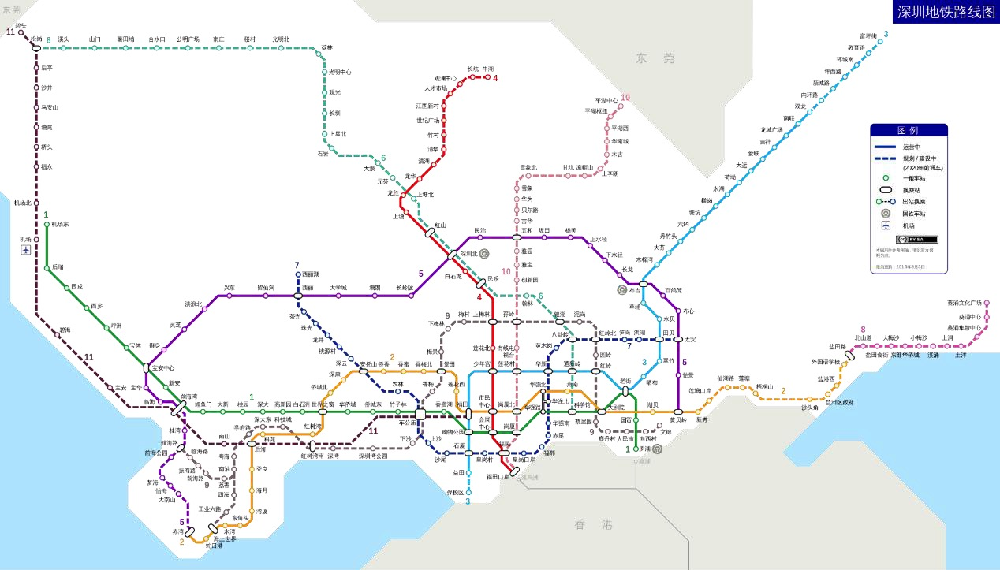
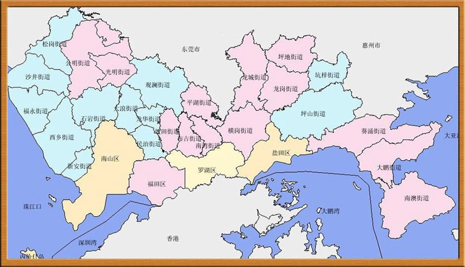
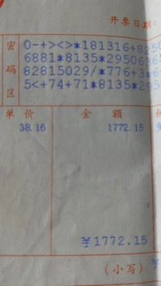
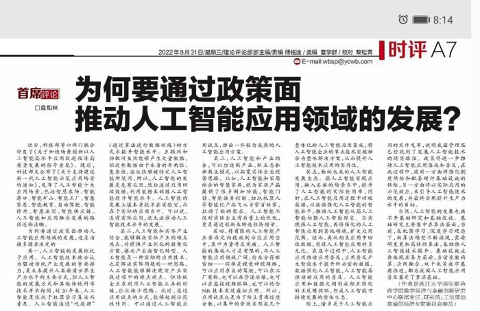

# 2022 年第七期 | 总第七期

2022 年 9 月 12 日

## 目录

[[TOC]]

## 黑马奖

### 如何看待睡前消息引起的非议越来越多？

- 作者：[庄子非鱼](https://www.zhihu.com/people/zhou-zi-yao-80)
- 平台：[知乎🔗原文](https://www.zhihu.com/question/550415397/answer/2663922795)

扯吧。

目前，**睡前消息引起的非议目前是越来越少的。**

之前哪一期睡前消息不是 5000 弹幕起？甚至连续多期过万弹幕都是很正常的。

最近 20 期吧，弹幕评论越来越少了，只有个别不限制弹幕和评论的内容，能有往期的辉煌。

|  |  |
| --------------------------------- | --------------------------------------------------- |

以前每期几乎都上 B 站热门，现在么。。。

之前每期都有知乎提问，动辄几百的回答，热点问题就上千。

最近有几期，知乎都搜不到提问，要通过链接跳转才能看到。

有些干脆禁止提问，非议都没得议。

别怕非议，真理越辩越明；要怕没非议，没有非议的声音就是谎言。

所以，**非议越来越多绝对是大好事儿。**

### 如何看待睡前消息引起的非议越来越多？

- 作者：[秀念别去啊](https://www.zhihu.com/people/wang-fu-wei-66)
- 平台：[知乎🔗原文](https://www.zhihu.com/question/550415397/answer/2655370043)

最搞笑的一点是，现在一个分析各种社会问题和各个行业专业内容的节目。最大的吹点居然是“敢说真话”和从不删视频。而对于他分析出来的很多门外汉理论居然获得了大量拥护，并且会攻击专业人士的分析。可以看的出来他的粉丝已经是属于找到精神领袖了。

### 为何很多人讨厌马督工？

- 作者：[刘洋](https://www.zhihu.com/people/liu-yang-36-58)
- 平台：[知乎🔗原文](https://www.zhihu.com/question/548923462/answer/2663599110)

他在大家闷头吃饭的时候，把菜单拿给了大家，提醒我们，吃饭是要付钱的，起码老百姓得付，而且不仅得付自己的，还得。。。

## 体验

### 中医院的一名普通职工

- 作者：怪力小神

督工好，一直以来都有收看您的视频，谢谢督工给了我更多观察这个世界和了解这个直接到思维方式，更加理性和客观地看到热门新闻。

我是\*\*省\*\*市中医院的一名普通职工，从大学的时候接触到刘大可就在开始反思自己所学的中医学到底是科学还是玄学，从刘大可开始慢慢接触到了督工。

因为生计问题，即使对中医有了更多的反思和思考，但还是留在了中医院糊口饭吃吃，毕竟是编制，提供了生存于世的保障，没有勇气跳出来直指中医。

入职中医院以后，去省里的医院规培了三年，对于混日子的人来说，倒也开心；回到自己医院的这两年，越来越感受到了与中医的对抗，内心苦不堪言。

刚回到自己医院，第一个月除开基本工资，只有 30 元的奖金，深感工作不易，医院里的同事和我说，奖金需要靠开中药获取，一帖中药有 1.5 提成，另外就是挂号费。

可是因为内心深处对中医药的抵抗，实在无法违心，一般都是患者自己要求开中药才会给患者开。

之后几个月奖金也维持在了四五百左右一个月，思来想去要不然辞职，可是贸然辞职也想不出自己哪里还有更好的去处，幸而医院外科发展不佳，人手紧缺，去了医院外科打兼职。

到了外科以后，虽然工作强度大了很多，但是也学习到了更多，外科因为有刀霸主任的存在，底下的年轻医生上手机会少，成长周期慢，流失了很多人才，比较有想法和进取心的很多离开了医院另谋高就，剩下的很多都是混日子的人罢了。

所以医院的外科一直发展不起来，很多技术都没有跟上，泌尿外科的手术主任一手抓，腔镜下疝气修补术也是只有主任操刀，像血管介入、内镜下胆道取石术都没能开展，落后于同市的人民医院一大截，今年同样争取医院三乙等级，人民医院评审通过，中医院就评审失败了，二甲倒是复评保住了。

来到外科以后，奖金多了两三千，生活上的焦虑少了很多，马马虎虎日子也还可以。

今年开始，中药提成大有改变，每贴中药不再有提成，而是在完成中药或者中成药开方后可以收取中医门诊辩证论治，依据医生的等级职称有不同的费用，作为住院医，我的收费是 10 元，我能拿到多少不清楚，应该是不多，门诊的奖金对比之前少了一半左右。

但我不曾在意，因为我在外科能获取两三千左右的奖金，所以对开中药获取奖金一直未予支持。

但今年下半年开始，医院开始要求我们要达到中药开方率，并且每个人的账号上都有中药开方占比，以此作为绩效考核，达不到就扣钱，但对于患者的均次费用都要求比去年低，如果超过 0.1%，则扣费 100；门诊如此，病房亦是如此作为外科，患者的中药口服意愿本来就低，加上外科患者周转率快，经常中药没开上，患者就出院了，如此外科成为了中药达标率倒数的科室。

每个月因此有四五千扣费（好像是的）加上领导施压，大家都在努力地尽量开中药，外科的老一批医生多是西医出生，对中药本来也就不感冒，面对压力只能喊年轻中医师尽量开中药，于是压力就到了我这里。

我不喜欢中医药，我怀疑中医药的效果，觉得不仅副作用可疑，更是对医保资金的浪费，医保资金一直克扣的很严格，为什么钱就要浪费在中医药这里呢最近更过分了，所有住院患者均要求中医病历，可是像肾囊肿、肺结节、膀胱肿物等无症状的现代医学科技手段体检查出来的疾病又到哪里找中医诊断何治疗方案呢，如果不写中医病历，档案室拒收病历，档案室不收病历，又是可口医生的奖金。

我现在内心受到很大的困扰，关于生存和自我意愿，督工我不理解为什么国家会大力扶持中医药，医院竟“逼良为娼”到这样吗。

医院明年要搬新院了，主打招牌是\*\*\*中医药文化研究中心，更有研究玄学的味道了，一点也不符合现代医学发展这么快的今天，最近医院在收集职工的意见，督工，我应该趁着这次机会怎么和医院提关于中医和个人意愿违背的事情呢，对于我们医院外科发展现状您又有什么高见呢。

## 编读往来

### 当下行政区域规划和土地规划已经不能适应当代产业发展需求，规模过小，没有达到当代产业发展发挥规模效应的边界

- 作者：[无用博士](https://space.bilibili.com/479821716)
- 平台：B 站
- 联系方式：B 站私信

::: tip 搬运者注

前情提要：[《蛋卷俱乐部》第六期·编读往来：了解地方政府产业规划工作的简明读物](6#了解地方政府产业规划工作的简明读物)

:::

第六期的蛋卷俱乐部有位观众贴了自己的知乎回答

[为什么大企业要重视政府关系——浅谈政府视角下的产业规划（以新能源汽车为例）- 知乎（zhihu.com）](https://zhuanlan.zhihu.com/p/361893604)、[本地存档](_doc/6-1.md)

从这个帖子已经可以看出，当代的以县、市为单位的行政区划已经不能满足现代化的复杂产业和高科技产业发挥规模效应的需求了，迫切需要新的经济规划单位来超越目前市、县一级的经济规划主体，适应当下最能符合产业发展的城市群趋势。

理论依据：组织边界应当是使得规模效应充分发挥，最终使得扩大规模所取得的边际收益不能弥补组织内部协调的边际成本，二者相等，为最优规模，而目前行政区划作为做经济发展规划和产业规划的实体，规模过小，扩大边界的边际收益是大于成本的

同时还因为行政区域过小而不是过大增加了内部交易成本（也就是说不像企业，组织内部管理成本随着组织内人数上升的增加，行政区划这种管理一部分小人口的中间层级过多反而增加了内部管理成本），应当尽快打通行政阻碍，发挥产业的规模经济，同时也降低内部的交易成本

#### 一、过于分散的行政区域内的土地指标成最大阻碍

帖子已经明确指出，高一级政府需要在下一级行政单位分派用地指标，这带来了严重问题：

利益分配问题严重拉高了交易成本

各级政府首脑都需要靠经济发展成果来实现晋升，但是分派下来的用地指标不够承接一个比较长的产业链，每个更低一级行政单位都希望分到利益更大的产业环节，比如汽车产业链的整车厂，而一条很长的产业链注定某些环节对当地政府没有很大利益，就会遭到这些行政单位一把手的排斥，我猜想，上级政府可能会按照今年给你点吃肉的环节，明年你也承接点喝汤的环节的原则，在奖励和安抚之间横跳，而较难决策出哪个下级单位能力更强，效率更高，最后大幅提高了上一级政府在做产业规划时候的成本。

比如深圳市作为全国在短期内取得极大经济发展成果，大力提升了本市人口吸引力的一个副省级城市，却受制于城市边界的原因，让有限的土地成为本地更有能力的政府班子进一步发挥政府发展潜力的阻碍，本地高昂的用地成本已经让华为搬迁，浪费了深圳市班子比周边城市层级更高的招商引资能力。

结果是：导致的交易失败概率大幅增加，产业竞争力大幅削弱。

当真心要投资发展事业的企业遇到这种局面，就会发现产业链配套达不到预期，最终终端成本下降达不到理想情况，这就必然限制了产品竞争力，不能充分打开市场，然后反而产能不能发挥或者直接不能按照最大的消费市场消纳能力建设产能。

降到某条盈亏平衡线后，当然招商引资会泡汤，而如果全国各大省份都面临这种境况的话，那全国的有效产业投资就会严重不足，按照本帖作者的分析，现实情况确实是这样的，会被政府规划看来稳赚不赔的那些产业，不管是白色家电还是手机电子等，目前在引领新经济增长点，带领中国迈向高收入阶段上，潜力很有限。

如果不能越过这个瓶颈，那么当代复杂产业投资不足，带来的必然是长期萎靡的经济增长率。

所以我们亟待打破这种对发挥规模效应的巨大制约。

如果不能根本上打破制约，那就得发展处一套像生态补偿那样在不同行政单位之间对这种以行政手段划分经济利益的模式的补偿机制，这个看起来就比生态补偿困难多了，因为没有合理标准，注定这个补偿机制并不能降低多少交易成本。

#### 二、 基础设施规划的区域性使得基础设施有效投资同样不足

跟西部地区大力投资基础设施却不能取得收益的情况的相反，我国东南沿海地区其实还没有进入到基础设施投资带来负收益的阶段，但是行政区划负责的基础设施投资已经阻碍了经济效率的进一步发挥。

还是以深圳市为例，东莞向深圳延伸的三角严重阻碍了深圳地铁的连通性（深圳部分受限于地形原因，其地铁连通性很差，线图也可以看出来，深圳地铁只修道边界，让东莞延伸下来的小三角非常难以发挥作用），两个城市谁都不愿意在这里修地铁以达到更好的贯通性，东莞政府不愿意送一批打工人去深圳的企业上班，更想让企业直接去东莞，深圳政府也不好过去把地铁整个给修了，好能留住更多 就业人口在深圳就业，目前深圳的高房价已经成了制约其继续吸引人才的最大阻碍。

|  |  |
| --------------------------------- | --------------------------------- |

地铁这种仅仅需要跨市协调，投资规模并不算很高的尚且如此，那些投资规模更加大的，比如像瑞士那样的地下跌路货运系统，高速公路等等就更是有这些阻碍了，答主 MUMA 举例的由国资委管理的电网、中铁等系统就是这样的例子，一个市政府、县政府很难有调动这些企业资源的能力，国家迫切需要在更大的区划上完成产业规划、配套基础设施建设这样的任务，好站在全国人民的利益而不是某个本地市场利益的角度分配资源，最终提高资源分配效率。

#### 三、过小的行政区划阻碍产业配套人才的聚集

这就说的是居住空间、教育、生活设施了，越现代化越高精尖的产业越需要人才，要把人才留在产业附近也是能长期稳固发展产业的必要条件，过小的行政区域一般没有资源在引进企业的同时提高本地的教育、医疗等配套，再次给产业的长期稳固发展带来阻碍。

哪怕是当今的深圳，经过了这么多年的高速发展也还需要很多时间来追赶北京和上海的医疗和教育，因为这两方面的差异对人才吸引力减弱，再次使得医疗和教育领域的人才也不愿意过来，需要花大价钱去挖人，还需要很长时间去弥补这种需要长期积累的资源。

更小的行政区划就更没财政实力去做这种事情了，过小的行政区划最终因为不能充分调动经济发展潜力而不能充分提高民生。

#### 四、城市群战略和全国统一大市场是解决办法

最后，解决的办法就是在更适应当代产业规模的区划上进行经济发展的指导，承担经济发展的任务，比如京津冀、长三角、珠三角这三大城市群战略，其实需要权利级别更高的行政单位来讲发展经济的重任从下一级政府手中接过来，以更高的权利层级去协调下级政府手中的资源，让投资能达到有效规模。

还应当讲城市群战略推而广之，不要让行政区划和与之挂钩的资源分割阻挠全国找到新的经济增长点，这是我理解的之前中央出台的“建设全国统一大市场”战略的核心要义，就是要让经济要素充分自由流动，发挥出最大的效率，提高有效投资，发挥经济增长潜力。

## 观众社论

### 东北小城的“房产税”——取暖费

- 作者：[闹袄乃蜗](https://space.bilibili.com/384660119)
- 平台：B 站

房屋年租金被取暖费赶超，东北小城房屋已成负资产。

这是母亲朋友的闲置房，88 平郊区老楼，从今年 5 月开始在群里发出租信息，开始要价 5000 一年，后来 4000，现在 3000 了！

然而我们这个供暖半年的东北小城，取暖费每年多少呢？

|  |  |
| ---------------------------------- | ------------------------------------ |

实用面积×38.16，老楼公摊少，哪怕按 70 平实用面积计算，也要 2671.2 元/年，如果实用面积有 80，那更是达到了 3052.8/年，而租金呢？

是 3000/年！

也就是说，哪怕不算物业卫生费等其他费用，这种小城闲置房已经变成了负资产，根本不用等房产税了。至于卖，对于人口严重流出的东北小城而言，找人接盘也并不容易，上半年市区二手房价格暴跌三分之一，在这种普跌背景下，郊区和老楼只会跌得更惨。

这位叔叔本着“房子要有人住才有人气”的朴素思想，还是不想房屋闲置，但在类似处境下，肯定有人选择彻底闲置并断缴供暖费，进而影响邻居的供暖效果。（因为如果隔壁屋子都不供暖且无人住，那么哪怕是供暖的屋子也会感觉冷，相比于过去报团取暖，现在是独自面对寒冬。）

而如果一栋楼只有半数缴纳取暖费，那恐怕就不仅是冷的问题了，供暖公司（发电厂）会出现经营问题——要保证这种半鬼楼的供暖效果，就要加大火力，但这很明显是亏的；可如果摆烂不作为，3000 一年的取暖费换来 16 度不到的室温，并不比候鸟过冬有更好的性价比，加上年轻人口外流和老年人退休，会有更多的东北老人选择去子女所在地过冬，取暖费缴纳人数将会继续下降，形成恶性循环。哪怕人口不外流，托土地财政的福，每个城市都有或多或少的鬼楼存在。

这是东北小城的死局，也将会是所有北方小城的死局。督公常说城市有集中提供市政服务的优势，然而在这种情况下，衰落的城市将会变成一种新型的、更拖累财政的农村——要给所有楼供暖，但只有部分人付费。

如果按这种思路来看房产税呢？取暖费可以断缴，房产税可以拒交吗？拒交的后果是什么？没收房屋吗？这听起来很恐怖，但如果房价跌破某个点的话，可能真就没人在乎了。

一个正经的地级市已经如此，那些县级市和乡镇又会如何？

## 线索

### 关于 479 期地方防疫政策是否非要使用某些极端工具才能有效落实

- 作者：[MUMA](https://www.zhihu.com/people/muma-53-42)
- 平台：[知乎🔗原文](https://www.zhihu.com/question/482527946/answer/2251844582)

关于 479 期地方防疫政策是否非要使用某些极端工具才能有效落实，投稿一个在新冠疫苗接种工作中不靠连座，不靠不打针就不能进公共场所或乘坐公共交通工具，也不靠给市民发礼品和奖金就不声不响的完成任务的地方政府实操案例吧，

见知乎回答：

[怎么能让咱们心甘情愿、积极主动去接种疫苗？](https://www.zhihu.com/answer/2251844582)、[本地存档](_doc/7-1.md)（请支持原文）

> “其他回答都从市民视角讲述被当地政府如何发短信打电话动员，如何奖励油米和金钱、甚至因为没注射疫苗被禁止进入某些场所、以及单位领导给压力下指标，那答主从地方政府视角谈一下新冠疫苗接种工作中普通大众观察不到的操作吧。
>
> 对于地方政府来说，为了让尽可能多的人接种疫苗，这当中的工作其实充满了算计，包括算计上级、算计周边地区、算计居民。在答主看来，地方的疫苗接种工作如果初期采取正确的操作，则后期完全没有必要使用奖励油米和金钱、到外地拉人、又或者禁止未接种人员进入公共场所等让大众吐槽的操作。
>
> 以答主所在地区为例，到 5 月底的时候，本市疫苗接种做得好的几个县区，接种完成率已超过 100%，全省做得好的市，接种率超过 90%。而到了 9 月初答主所在城市接种率整体达到 90%时，最好的县区已经超过 110%，但也有不少做得差的县区只勉强过 80%。”

由于原文也是几万字，估计你们放不完，故我也不发文档了。在回答前的简介注明作者表示内容真实性不予保证，请读者根据常识自行判断。

至于 479 期谈的问题，由于该工作不像疫苗接种工作那样己基本完成，答主受限于工作纪律，现在没法谈，看以后有机会再补充吧。

## 读书

### 读书推荐 村上春树《地下》及《地下 2:应许之地》

- 作者：[目暮十三](https://space.bilibili.com/1702835)
- 平台：B 站
- 联系方式：微信 dcisland

背景介绍：村上春树应该是很多国人都很熟悉的一位日本作家，国内关于他的一些段子也流传很久。我在学生时代就在苏北小城的书店里看见过他的书，印象里应该是《且听风吟》，可能大部分读者说到他，想到的也是这本，或者还有《1Q84》和《挪威的森林》等等。

这次想为大家推荐的是村上为数极少的纪实文学作品。

1995 年 3 月 20 日上午，东京，这一天是周一，无数人像往常一样走进他们熟悉的车站。然后，命运就被拦腰斩断。

这一天，奥姆真理教发动了沙林毒气袭击。

该事件最终造成（维基数据）14 人死亡，近 6300 人不同程度受伤。伤者中，一部分严重患者此后受后遗症折磨终身，他们当中有人视力重度损伤，有人神经系统严重受损失去行动能力，等等。

内容介绍：事件发生的次年，村上春树从 1996 年 1 月起花整整一年时间走访受害者及其家属，几经波折，最终于 1997 将约 60 位受害者或受害相关人员的采访记录整理出版。（绝大部分受害者拒绝采访，或部分受害者接受采访后后悔要求删去相关记录）这就是第一本《地下》。

随后村上再次出发，这一次他采访 8 名奥姆真理教教内成员，这次他试图为我们带来另一个视角，让我们得以一窥那神秘的宗教内部的样貌，这就是第二本采访录，《地下 2：应许之地》

村上迄今为止总共只有三部纪实类作品，这就是其中两部。我个人认为，相比于村上其他那些销量不错的小说，这两部采访录有着更加“源头”的价值，它也是少数不受村上本人写作风格影响的作品，因为它的作者其实并非村上，而是那些录音机前的人们。

村上在《地下》中指出，发动袭击的奥姆信徒们并不像媒体试图渲染的那样是“他们”，而是货真价实的“我们”，邪教与正常人的区分并没有那么明显的一条线。邪教的产生有其深层次的社会原因，简单地归结为“他们疯了”是极其浅薄的，也不能避免再次发生。

相信不少《睡前消息》节目的观众都还对督工提到韩国邪教的内容有些印象（2020年 2 月 25 日 81 期）。或许很多人看到这类新闻时抱有壁上观的心态，觉得韩国之事与我无关。

但我想说的是，韩国的多个新兴宗教、包括早已闻名的统一教，都早已在、且现在仍在我国境内秘密发展信徒，扩张势力。在主流网络不曾关注的角落，他们用一些国内不常用的视频软件远程传教，在东北的一些少数民族自治区，他们更是几乎半公开地活动。

千里之堤溃于蚁穴，我们绝不应轻视邪教问题。

**或许已无人能说清，人们只是在某个夜晚突然发现，夜空中有两个月亮。**

### 一篇关于人工智能时评的读后感

- 作者：[一个路人甲](https://space.bilibili.com/23294400)
- 平台：B 站
- 联系方式：微信 saga1394

科技部等六部门联合印发了《关于加快场景创新以人工智能高水平应用促进经济高质量发展的指导意见》，随后科技部又公布了《关于支持建设新一代人工智能示范应用场景的通知》。

理由：“人工智能”是一个很热门的研究方向，预示着一个巨大的产业市场，人民群众基于朴素认知对“人工智能”抱有美好愿景。然而实际情况是否如此，需要有严肃的媒体节目以相对客观的角度向公众说明相关信息。

一篇关于人工智能时评的读后感，主要提及：

1. 补充时评中提到的十大应用场景之外的应用场景
2. 关于人工智能在生产端大规模应用的过程和影响的推演
3. 人工智能在生活端基础设施的形态设想
4. 人工智能基础研究值得关注的方向

1. 除了通知中提到的十大应用场景之外，我觉得人工智能在未来养老看护上的应用场景值得关注，如智能外骨骼或辅助设备，智能看护机器人或设备设施等。
2. 传统工业场景中，业主其实并不缺少人工智能应用的思路，基于行业认知和生产过程，他们其实最清楚哪些环节和位置最适合进行人工智能改造，但是这样的改造需求往往很科幻，需要了解人工智能技术的人用技术语言进行重构，另外现有的技术并不一定能够支持这些需求有效实现。了解实际需求，把科幻落地成科学，是目前人工智能行业一个非常大的痛点。
3. 接上条，假设 2 的痛点已经完美解决，那必将是一次社会生产力跨越式进步，然而社会生产力进步必须配套合适的生产关系和分配制度，若三者错配，可能会造成新的（剧烈的）社会矛盾。应组织研究社会、经济和法律等社会学科的科学家重点进行相关研究，提前做好事实调研、逻辑推演和理论准备。（在这里有很多有趣讨论和探讨，比如说杨安泽提出的 UBI 方案及其变种）
4. 大规模应用人工智能所需的基础设施除了西数东算这样基于集中大规模算力 和高速通信网络的云计算结构之外，个人或个体运算单元也应该得到足够的重视。因为个体产生的数据全部上网，既不隐私，也不环保。在算力和算法达到要求时候，应让这些个体数据主体留在本地，有选择的上网；另外，一些本地设备和应 用需要的运算和存储，云计算也很难满足（比如由于通信上的物理极限导致网络 延迟），所以个人运算单元就是必不可少的基础设备。类比于目前相对普及的 PC 或手机等终端，个人计算单元的算力至少要是它们的数十倍或百倍以上，才能满足未来的计算需求。这样的设备即使摩尔定律一直有效，也不太可能完全小型化，它的形态很值得探讨。一个比较有趣的想法是个人计算单元可以和智能驾驶的新能源汽车有机结合起来。
5. 基于上述推演，人工智能的基础研究有三个非常值得关注的方向：一是安全，二是系统应用，三是底层算法。

   1. 安全包含两个方面，一是 safety ，人工智能大规模参与甚至取代人类进行社会生产，原有的安全边界肯定要发生剧烈变化，相关流程守则规范都需要研究；二是 security ，人工智能大规模应用到关键或敏感领域，必然面临各式各样的潜在威胁和攻击，由于人工智能本身也可以成为攻击的工具，所以相关防御工作很值得关注；此外值得一提的是人工智能的伦理研究，比如人工智能本身没有危险，但是它的应用会对社会公平、公开和公正等方面产生影响，从而造成安全风险。
   2. 系统应用是指运行人工智能的计算机和网络系统技术的开发。人工智能是一种高算力、密集通讯、频繁储存的技术应用，且对能源、散热和系统健壮性也有很高要求。某些算法在实验室也许有成果，但是在工程上却很难实现经济应用。在硬件上进行研究突破将是很好的探索方向。
   3. 底层算法区别于 5.2，是实现智能效果的核心因素。目前的人工智能算法虽然经过大几十年的发展，屡有重大突破，但底层逻辑仍然是通过数学手段拟合现实世界，输出结果仍然是一种“概率”。概率代表了某种程度上的不确定性，然而现实生活中很多场景需要高度的确定性才能运作，因此底层算法仍然需要不断研究。此外从国家安全的角度考虑，某些底层算法也需要一定程度上的重构和保密，避免被更强算力，更先进算法直接暴力拟合。

### 《心理学与生活》阅读体验

- 作者：Cookie
- 平台：微信
- 联系方式：[lainhuicai@gmail.com](mailto:lainhuicai@gmail.com)

我最近在阅读《心理学与生活》，上一本是《社会心理学》。从《蛤蟆先生去看心理医生》之后，我对这方面的书籍产生兴趣。

我对读书总是懒懒散散，不求甚解。我尽力从脑子里挖出一点自己还记得的体悟，欢迎斧正。

#### 1、人的行为、情绪与认知是分离而又是统一的。

人们对遇到的某一件事情的反应由三个部分组成：首先是认知，然后是情绪，最后是行为。

人们遇到认知之外的事情，第一情绪是茫然，反应是愣住。例如现在突然有一只老虎出现在你面前，人们的第一反应是呆在原地，之后感受恐惧，产生逃跑或者其他表示恐惧和逃避的行为。

人们遇到认知之内的事情，从旧有的经验提取当时的情绪和行为造成的反应，决定延续或者改变现有的情绪与反应。

这是人们的行为、情绪与认知的分离：认知产生情绪，情绪决定行为。

人们的行为、情绪与认知也是统一的。

由于人们的行为通常会对自己、环境或者是他人造成影响，而这种影响会反馈到自己身上，导致或有益或有害的结果，这种反馈的结果会影响到人们的认知，并且通常会造成人们认知的转变。比如你由于忧郁而去酗酒，导致酒驾并受到了惩罚，那么在你下次被忧郁困扰的时候，也许你会用较为平静的情绪和读书行为代替忧伤和酗酒。

人们的行为产生的后果可能会导致人们认知和情绪的改变，认知和情绪又决定着行为。这是关于人的行为、认知和情绪的一点思考。

我想起《活出生命的意义》这本书中所写的，人们在任何时候、任何环境中都拥有选择的权利。

我知道了放弃选择也是一种选择，而每个人都要为每个人的选择承担责任，我学会在大部分时候用沉默来对抗他人的思想灌输。

#### 2、相关不代表因果

心理学测验中的变量被称为“因素”，比如学生的睡眠时长和考试成绩在某项测验中是两个因素，心理学研究者在发起以“学生的睡眠时长与考试成绩之间的关系”为题的研究时，要排除掉其他的干扰，例如被研究者的年龄、性别等等其他无关因素。

排除掉其他的因素之后，产生的实验结果数据经过处理确实体现了“学生的睡眠时长与考试成绩之间存在着一定的关系”，那么，我们就可以说它们之间就有了因果关系吗？当然，在这个例子之中，也许我们可以比较轻易的判断它们确实有某种程度上的因果关系。

那么，我们换个例子，“某知名成龙代言的产品的生厂商大部分都倒闭了”，这个例子中的两个因素，“某成龙代言”和“生厂商倒闭”更可能是相关还是因果呢？

很多事情不像表面看起来那么简单，在现实中，明晰的事件之间的因果关系是很难被发现的，因为相关的因素太多。

这让我开始学习，多问为什么以及质疑权威。

#### 3、 虚假独特性

你穿着一件大红色的衣服走进一间有一百个人的房间，他们全部穿着黑色或者白色的衣服，你觉的这个时候会有多少人会关注你独特的衣服颜色？

对被研究的询问，他们大致会回答有 70%-80% 的人关注到了他们。而对那房间中的一百人进行调查，实际上只有 20% 左右的人关注到这件事。

人们会高估他人对自己的注意程度，因为我们关注自己并认为其他人也是如此，但如果人们都是关注自己的，就意味着对他人的关注是会减少的。

《黑客与画家》说，“人们不会因为你站在那里就关注到你，但是人们会因为你一直站在那里而关注你。”

#### 4、 虚假普遍性

如果你有一辆车，那么你认为其他人也拥有同类型的车的概率是多少？如果你看过一本书，你认为在你周围的人也看过这本书的人占多少比例呢？你觉的你和最要好的朋友之间对一件事情达成共识的概率又会是多少？

我曾经和我的哥哥进行过比较深入的谈话，我们年龄差不多，学习和教育经历也差不多。我们聊的不是很愉快，中间差一点不欢而散，由于一些事情，我们开始互相指责，我沉默了一会，我体会到他的心情，我跟他说：“谢谢你担心我”。

我们延续了谈话，但是不再回到之前的话题。

我想，我和最亲密的人都无法在一些事情上达成一致，也不该猜测其他人能理解我或者是和我有一样的特质与想法。而在这之前，我一向是这么认为的。

我开始学习尽力的不带评论地观察，尽力地先倾听和理解。而不是：“其他人一定也都是这么想，这么做的”，“人人如此”。

#### 5、 偏见与质疑

《霍乱时期的爱情》形容一位上了年纪的贵妇人时有这么一句话，“她的一生都靠偏见活着”。我想，这是对一个人可以进行的最刻薄，最恶毒的批判了。

一个人的头脑中，总是空空如也，被别人的偏见装饰成一间富丽堂皇的破屋子，也是我能想象到的，最悲哀的生活。

偏见是什么？我从书中理解的，是对某一个群体或者对该群体之中的个体的事先的判断和定论。“他是个黑人，就一定是粗鲁的、暴力的”，“他是个白人，一定是存在种族歧视的”，“穷人都是愚昧的”，“富人都不干净”，“他的慈善行为一定都是假装的”，直到我写下这些话的时候，我扪心自问，我依然存在着这些偏见。

偏见从哪里产生？大部分情况下是我们平时接触到的信息渠道之中，例如书籍、媒体、社交网络，一开始，是一个微不足道的观点；紧接着，是铺天盖地的信息之中对你的精准推送和观点强化；到最后，你主动去搜索这一类观点编织而成的文章，你带着答案去寻找答案，“为什么我觉得人出生的时候命运就已经决定 了？”

如何发现并对抗偏见？质疑，从相反的方向进行质疑，想想，“如果人的命运不是一出生就被决定了，而是可以改变的”成为一个事实，你应该如何为这个事实进行辩护，找出相关的论证？你的脑子里冒出了两个人，互相辩论，你一开始的那个观点仍然坚不可摧，不可动摇吗？也许这个时候，心里会出现第三个声音。

#### 6、 关于基因、遗传与社会阶层的思考

这部分内容，是我在回顾以往的蛋卷俱乐部观众投稿时，临时想加入的，行为是临时的，但是想法有了一段时间。

我是计划生育期间出生的，为了躲避罚款户口在奶奶那一辈上，出生大概六十天左右交给奶奶抚养直到六岁。

我的父亲十七岁到工地打工，今年五十多岁，我不记得了，我一直也没有记清楚父母的岁数，但我清楚记得奶奶的年龄。

我的父亲打工打了四十年，我六岁以后的教育经历大致上是放养式的，父亲一年一见，母亲是全职主妇，学校是睡觉、打架、偶尔念书的地方，他们三者有着清晰的分割线。

那么，我的父亲的基因遗传给了我什么东西呢？没有很多钱，也没有什么社会地位，我父亲现在还在山里和一些一样的工人们喝酒，在太阳下做事。他的教育，也是带我去工地上打工，想告诉我不好好念书的下场，想告诉我打工的辛苦。

那么，我的父母的基因遗传给了我什么东西呢？我想那一定是有的，因为培养出我们三个这么优秀的子女，那么，是什么呢？

我想起我的父母，他们在烈日下劳作的场景，用呵斥代替关怀的话语，用体罚代替鼓励的教育，他们在用自己的方式表达对生活和子女的热爱。

那么，他们的基因遗传给我的就是对生活的热爱和坚持了吧。

我尊敬他们，并对此表示感谢。我想这份礼物很重要，我们的基因真的很优秀。

## 评论选登

### 【睡前消息 478】带领全国停贷，大学招生缺额，景德镇只犯了一个错

<BiliComment name="Shi咪" content="居然在这里看到了母校！ 视频站在陶瓷工业化的角度分析了景德镇的陶瓷发展与落寞。站在我的角度来看，随着景德镇陶瓷学院更名为景德镇陶瓷大学，陶院早已从一所艺术院校变成了一所全科大学，然而除了陶瓷化工及艺术相关专业外，其它专业（比如语言类，财会类等）在全国专业中完全没有优势，这或许也是拉低学校竞争力的因素之一"/>

<BiliComment name="一人独行之影" content="我之前在施工单位工作，公司承建了景德镇的一系列陶瓷工业项目。成本表里面有很大的一项采购费用，我好奇之下向项目上的同事询问，项目上的同事说这是从德国引进的生产线，全套德国进口设备。景德镇的产业升级居然要依赖外国设备，这确实有些出乎我的意料。不过看到自媒体上的传统文化遗产大都以“原生态”，“纯手工”，“千年传承”，“血泪交织”等为卖点，景德镇在技术上落后也合情合理。"/>

<BiliComment name="卡箍空" content="作为一个美院人，我真的为景陶感到惋惜，作为一个个别专业全国顶尖的大学，因为专业开设少与一本无缘，为了这个一本，只能开设一堆自己陌生的专业，来凑数，而这些专业没人报考也自然是情理之中。顺带一提，八大美院没有一个是一本，所以这个问题是不是应该大家坐下来，好好为我们的大学谋划一下，总不能这些专业性大学慢慢都变成综合类吧  顺带一提，当初去景德镇写生，感觉很多陶瓷匠人技术真的没得挑，但是对于大众来说，制作出的东西确实有些过时了"/>

<BiliComment name="Old-Farmer" content="可能有人会问景德镇为什么没有走出类似京瓷这样的企业？  其实京瓷是一家大型综合性的工业产品的制造企业。京瓷的产品，更多的是面向工业应用的，零部件业务总计 57.2%，设备及系统业务总计 43.6%。当中，珠宝首饰、厨具属于生活与环保，而整个生活与环保只占 5.0%。如果是“锅碗瓢盆”为代表的陶瓷制民生生活用品的市场份额、市场利润，相对于工业用品来说，太小啦。根本不足以支撑起一家大型企业的崛起。推而言之，世界上有钢铁城、煤城、汽车城等等，但是不会有蛋糕城。景德镇目前还停留在生产锅碗瓢盆及艺术品的阶段，和京瓷比还差一个工业革命的距离。"/>

<BiliComment name="桔子味的天" content="上世纪工业门类的大学基本已经都改名了 海运学院、水产学院、石油学院、纺织学院、机械学院、煤炭学院、公路学院、铁道学院、钢铁学院、冶金学院、水利学院、电力学院"/>

<BiliComment name="匿名甲" content="请你们以后不要再用不严谨的逻辑骂人家傻了！我有三个问题 1.为什么不只景德镇，国内传统瓷区没有一个转建陶很成功的？ 2.艺术瓷是否和产业升级相对立? 3.你凭什么说现在陶瓷要依靠规模化才是出路，依靠智能化才是出路？你是否了解陶瓷的规模化和智能化是做什么，经济效率是否会高？  我就是国务院发布的第一批国家智库里的研究人员，你讲的很多问题，就是我们在研究的。不是不同意你观点，是你们的分析太潦草了，太急于表现出犀利的观点，你打的准不准不提要求的？"/>

<BiliComment name="匿名乙" content="督公的意思是景德镇要上投资跟沿海瓷器工业搞，那么如同睡前消息一贯问题，钱从哪里来？怎么跟沿海瓷器的规模生产和营销体系竞争？靠着景德镇这块招牌做做大师瓷器，传承下传统是最佳选择。因为这块生意好做，利润高，肯定是这样发展啊。从全国上下一盘棋来说，各种工业陶瓷等等有其他人在做了，你何必去卷？也创造不了新的工业增加值，只是存量的博弈，守住传统制瓷就行了。而这里我又不得不提督公的一个严重但是不自知的一个问题，就是双标或者说是逻辑错误（这里不确定是哪一种）。提到农村，督公认为农村应该到城市里，因为这时发展的必由之路，但是提到景德镇却又要他加大投资赶上现代制瓷工业，景德镇的现代制瓷工业没发展起来，那就必然是衰落，有这块招牌发展艺术陶瓷就是最好的选择，如果全国都搞工业，谁来搞艺术？艺术制瓷的利润谁来吃？只能说督公眼里只有工业，对社会的全面分工并不深刻，而全面社会分工，什么都要有人去做，正是现代社会的方式，督公的保卫我们的现代生活只是保护我们的工业生活。  评论好像发不出去，私信您一下。因为本来是评论，所以对于私信来说，看起来似乎有些不太礼貌，请见谅。你当做评论看就好。  现代生活的大部分是工业生活，这一点是确凿无疑的，但现代生活不仅有工业生活。"/>

<BiliComment name="匿名丙" content="马督工50 90年代那个回复得不太好，同样技术普及水平下内地要和沿海竞争显优势需要有两个前提。 1.内地独立之于沿海，有与沿海不同的货币和汇率 2.内地的所有资源以完全市场价格与沿海交易，包括食品，矿产，能源  如果按这个标准， 日本当年何尝不是亚洲面向美国的沿海 台韩港新何尝不是面向日本和美国的沿海 大陆的沿海是面向四小龙和美日的沿海  内地不可能发展为沿海，越南，孟加拉，斯里兰卡，缅甸才能成为新的“沿海”"/>

<BiliComment name="匿名丁" content="作为景德镇生活过的人说几句 景德镇最近2-30年拉了和当时的市里领导班子有关系 类似东北90年代那个情况 说要搞市场经济，当时瓷厂全是有政府参与的，所以为了搞政绩，把瓷厂全部关闭了转私人，工人全部下岗，技术人员被挖走，国有资产大量流失。 当时的领导班子把景德镇家底败没了，导致后面一蹶不振，当时领导还凭借这个所谓的政绩平步青云。"/>

<BiliComment name="匿名戊" content="你好督工，我是景德镇工作的普通一员，大学专业土木工程。十大瓷厂年代虽然还没在景德镇工作生活，但现在也有耳闻，说是那个年代国企改革浪潮下，当时的领导舒晓琴牵头进行改革，一夜之间十大瓷厂全部关门。那些年每个厂都有成名之作，每年都能搞展览，都算当时生产线能达到的较高技艺水平，在国内外都有一定知名度，而且也在谋求转型引进新的生产线工艺。但全部改制后大规模技工下岗流失到外地，反而指导外地发展新的生产线，如佛山、西安等地，而本地再无一家规模性企业支撑产业方向，我个人觉得，如果当时改革没有一刀切，集十大瓷厂的资源和力量，不断更新改造生产线，到现在应该有景德镇三字的知名品牌。国企虽然没有民营企业灵活且契合市场，但是国企规模优势明显，而且底蕴深厚，至少下大力气改革，不轻易全盘推掉流失资产，还是有转型成功的机会的。现在景德镇全是小企业小作坊，谈不上规模，只能越来越卷，越来越艺术，讲小而美，追求文化玄学去了，官方引导的能力也越来越弱。"/>

### 【睡前消息 477】慧育中国，新“民师”教家长“带孩子”

<BiliComment name="最帅的阿辉" content="许多职业都需要考证，证明自己拥有对应的能力和技能来为这个社会提供服务。而能影响人最大的父母，却不需要任何的证明自己有能力成为父母。"/>

<BiliComment name="德古拉-三-伯劳" content="很多年前我在网上看到过一种言论——农村的农民以“我祖祖辈辈都是种地的，我难道不比年轻学生更会种地”这样的理由拒绝由农业大学推广的新种子或新耕作方法。那个言论认为，农民这样的观点是农业大学的研究成果难以投入实际生产的主要原因。  有没有这样一种可能：不只是现代农业，现代社会的早教也能够、也可以、也应该有一套工业化的高效方案来推广和实施。  当然相比于学校高度针对阶段性考试的学校教育，这套早教方案主要针对的应该是“快速熟悉目前基础的社会生活方式”之类。"/>

