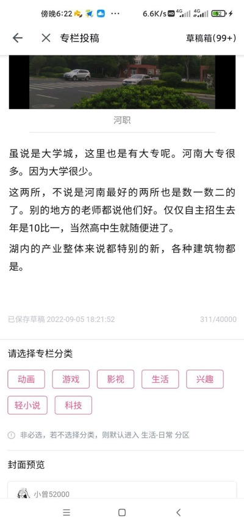

# 2022 年第八期 | 总第八期

2022 年 10 月 24 日

## 目录

[[TOC]]

## 黑马奖

<BiliComment name="医学院の工科生" content="在马逆的评论区下，你甚至分辨不出来哪些是粉，哪些是黑。<br>在黑马逆上达成了高度的一致。" time="6小时前" like="522" uid="350817036" reply="<div class='bc-reply'>拳高天外</div>小黑子，露出马脚了吧🐶<div class='bc-reply'>爱狗人士玛奇玛</div>第一：铁粉是黑的<br>第二：就算年轻时是粉的，时间久了也会变黑<div class='bc-reply'>草地贪夜蛾</div>我原则赞同马逆的部分观点，但我还同时是睡前消息的忠实观众和声讨马逆的中坚力量"/>


https://space.bilibili.com/316568752/dynamic


<BiliComment name="公诚勤朴" content="好消息：百万粉丝Up主转发了你的直播间<br>坏消息：这个Up主是马逆" time="8小时前" like="76" uid="79968011" reply="<div class='bc-reply'>叫你打豆豆</div>成分复杂，"/>


https://www.bilibili.com/video/BV16e4y1C7xQ

## 读书

### 国家间的分与合——评沈志华《中苏关系史纲：1917-1991 年中苏关系若干问题再探讨》

- 作者：腾云驾雾—袁
- 平台：QQ
- 联系方式：[563369062@qq.com](mailto:563369062@qq.com)

#### 摘要

如果了解新中国史与党史回避了苏联的作用与影响，这是一种非常严重的错误。中苏两大社会主义国家的关系一向为历史爱好者所关注，在当下“新四史”不断受到重视的情况下，了解其他社会主义国家的经验教训尤为重要，苏联的历史更是如此。沈志华先生在其主编的著作《中苏关系史纲：1917-1991 年中苏关系若干问题再探讨》中，通过编年体的形式，在掌握丰富的中国与苏联历史档案的基础上，详尽而深刻地论述了中苏两国关系的历史。

**关键词**：沈志华；中苏关系；社会主义国家

#### 内容

1991 年，伴随着镰锤红旗在莫斯科上空缓缓落下，昔日的社会主义联盟不复存在。苏联解体的影响不仅在于政经领域，更在于历史研究领域。俄联邦档案馆解密了不少苏联时期的档案，这对于当时的历史研究者而言无疑是一笔巨大的“福利”。而在我国，也有很多人对于苏联的秘密档案产生了浓厚的兴趣，沈志华先生便是其中之一。20 世纪 90 年代，沈志华先生与社科院合作，个人出资 140 万元，专程到俄罗斯和美国搜集俄国解密档案，随后与其他研究人员组织翻译、整理，并最终出版了 36 卷《苏联历史档案选编》。如此丰富的一手史料不仅提升了沈志华先生的地位，也为我国的研究人员提供了新的视角来看待这个昔日的 “红色大国”。

此后，在针对苏联历史的研究中，相关人士不断推出了很多相关的历史著作，并涌现出如郑异凡、冯绍雷、杨奎松、李丹慧、牛军等教授。这些人的作品极大扩充了相关历史资料，并对某些争议事件有了更为翔实的描述。接下来笔者将会从书籍本身与历史现实的结合中，为各位读者阐释这本书对于了解中苏关系，认识苏联历史的重要史学价值。

##### 一、书籍的演变

目前笔者所拥有的书是 2016 年 10 月出版的第三版著作。2007 年 1 月，新华出版社将该书的第一版公之于众，彼时各卷撰稿人为杨奎松、沈志华、李丹慧与栾景河，并得到了中国前驻俄罗斯大使李凤林的支持与协助。该书刚一公布便得到了关注，且在 2008 年 10 月荣获第九届上海市哲学社会科学优秀成果奖。但因为第一版的问题较为突出，尤其是文章间的逻辑不清，故在 2010 年进行了第二版的写作。


<p class="imgCaption">图一：第九届上海市哲学社会科学优秀成果奖名单，源：王志娟. 上海市第 9 届哲学社会科学优秀成果奖一览[J]. 上海文化年鉴, 2009(1):2.</p>

在第二版的写作中，编写团队除了将栾景河换为牛军进行第四篇的写作以外，还参考了一批在这段时期里国内外出现的崭新学术成果，使其得以在第一篇的基础上有所润色，更能为广大读者所接受。然而在某些程度上，第二版依旧有其局限，如中苏经济合作内容的缺失、中苏文化交流与影响以及中苏两国对于第三世界国家的争夺等内容便未能体现。2016 年 10 月，在修缮辞藻，增加第四篇关于中苏关系的最新论述后，第三版，即最新版本的《中苏关系史纲》正式刊行。

时至当下，针对中苏两国关系的研究日趋重要。从结盟走向分裂，从对抗走向“正常化”，认识中苏关系便如同打开了理解“新四史”的钥匙，无疑会对我们认识冷战时期大国外交与人民政权发展历程有所裨益。“以史为鉴，可以知得失”，中苏关系作为 20 世纪最重要的双边国际关系之一，从我们对这一关系获得的启示中，我们会正确认识当下的中俄关系，使我们不会被污言秽语所叨扰。


<p class="imgCaption">图二：《中苏关系史纲：1917-1991 年中苏关系若干问题再探讨》第三版封面</p>

##### 二、著作的特点

从整体上看，全书共分为两册四个篇章：“难以确定的对手”（1917-1949）、 “同志加兄弟”（1949-1960）、“从分裂到对抗”（1960-1978）与“走向正常化之路”（1979-1991）。其中又以第二篇与第三篇为全书的重中之重。而相较于某些史学著作，《中苏关系史纲》拥有许多特点：

1. 参考的史料繁多，且某些史料为俄文原文史料。恰如恩格斯在《恩格斯致格奥尔格·亨利希·福尔马尔》一文中所说：“研究原著本身，不会让一些简述读物和别的第二手资料引入迷途。”得益于先前对苏联解密档案的研究，该书的创作团队可以参考很多前人所无法看到的学术成果。除却很多名人选集、相关专著以外，还有很多苏方档案的原件与有关部门的数据档案。“史料是史书的血液”，如果无法在参考史料上下足功夫，再好的辞藻也只是空谈，再冠冕堂皇的论断都难以服众。<br>譬如在第一篇论述苏联对殖民地半殖民地的民族解放运动时，便引用了列宁在《为共产国际第二次代表大会准备的文件—民族和殖民地问题提纲（初稿）》中的论述：“各国共产党必须帮助这些国家的资产阶级民主解放运动；把落后国家沦为殖民地或在财政上加以控制的那个国家的工人，首先有义务给予最积极的帮助。”，这也就为之后苏联支持中国革命的阐述埋下了铺垫。
2. 以编年体的形式，通过时间顺序突出中苏关系的变化的原因。尽管全书分为四篇，实则由两大部分组成：1917-1949 年，是苏维埃俄国/苏联与旧中国的关系；1949-1991 年，是苏联与新中国的关系。尽管对于前者只有第一篇有论述，但后者的三篇无时不刻在受着第一篇的影响。例如第二篇第一章“同盟条约的签订与中苏利益冲突”中，作者先是对中苏旧约，即《中苏友好同盟条约》进行回顾，随后引出了毛泽东主席对于“重签中苏条约”的坚定要求，最后才是对中苏谈判的论述与《中苏友好互助同盟条约》的内容。这种前后文呼应在全书中比比皆是，使读者在阅读中“忽有恍然大悟之感”。
3. 对于某些内容的评价较为客观。列宁在《立宪民主党人的胜利和工人政党的任务》里有云：“马克思主义教导我们，要从发展中观察一切现象，不要只满足于作表面的东西，不要相信漂亮的招牌，要分析各个政党的经济基础和阶级基础，要研究预先决定这些政党的政治活动的意义和结局的客观政治环境。”对于这本书而言也是如此。诚然因为作者本身的学识与领域所限，客观理性因条件所限无法完全展现，但得益于资料的丰富性，利用数份资料相互印证，相对客观又得以实现。中苏关系涉及到很多关键人物与时间，故作者在全书中没有“非黑即白”的情绪化表达，而是就事论事，针对某些矛盾给予有依据的论点，对于中苏关系中苏方的黑历史，尤其是 20 世纪 50 年代后的期出现问题，如中苏论战、1969年的珍宝岛与铁列克提事件均站到了中方正确的立场。
4. 补充了很多领域的资料，尤其是中苏两国在经济领域的数据。长期以来，关于中苏两国在经济领域的合作内容始终是一处空白，相关史料数据模棱两可，甚至对于双方的援助金额都因为币值的变化而无法确定，庞杂的数据又无法直接引用，这对于中苏两国关系的深入认识产生了不利的影响。沈志华先生在其著作《无奈的选择:冷战与中苏同盟的命运(1945-1959)》中将先前的资料予以整合，并在最后形成了一些直观的数据：


<p class="imgCaption">数据来源：社会科学文献出版社，《无奈的选择：冷战与中苏同盟的命运1945-1959》，沈志华，2013, P329-330</p>

这些数据的产生无疑有助于让读者更为直观的认识到中苏关系的发展程度，随后的时间里也出现了更多类似的数据。在这本书中，类似的数据不断出现，或是对旧内容的整理与应用，或是在此基础上的创新，如此的量化数据，正式对全书内容的完善与知识体系的形成。下面列举出几份有关内容，不一定是该书的，但也是密切相关的：


<p class="imgCaption">此份资料引用来源：资料来源：张泽宇. 中苏科技合作委员会述论（1954～1966 年）—基于苏联解密档案的研究[J]. 当代中国史研究, 2016, 23(6):81.</p>

|  |  |
| ---------------------------------- | --------------------------------------- |

<p class="imgCaption">资料来源：《苏联技术向中国的转移 1949-1966》，山东教育出版社，2004：75<br>由于 1958-1960中苏关系恶化与工期等主客观原因，实际完成 150 项。其中 4 项（第二汽车制造厂、第二拖拉机制造厂、山西潞安一号立井、山西大同白土窑立井)因为选址争议，2 项则因为陕西 422厂统计了两次，造成两项重复计算。</p>


<p class="imgCaption">数据来源：董志凯、吴江著《新中国工业的奠基石156项建设研究》，广东经济出版社，2004：420-493<br>*：有两项苏援工程未列入156工程统计，即国营733厂与狮子滩电站</p>

##### 三、个人对于中苏关系史的看法

对于苏联这个国家，我们应当如何看待？在当下，“精苏”作为一种特殊的互联网群体，在红色思想愈发深入人心的今天成为一种特殊的存在。诚然苏联在历史上的影响与其光辉事迹令人动容，加上社会主义的情谊加成，这种崇拜也可理解。然而某些“精苏”的极端行为与言论实则出格，它们所崇拜的不是苏联背后的红色精神，不是苏联人民在立国初期的伟大奋斗，更不是“英特纳雄奈尔”的崇高理想，而是“红沙俄”的武力与那些段子！没有经过足够的理论学习，没有充足的阅读量，如此“精苏”，止增笑耳。而真正的“精苏”，则在理论的学习中充实了自己的能力，他们早已不是“精苏”，而是又红又专，信仰坚定之人。

那么，对于中苏关系，我们又应当如何来评价？可以这样说：有利有弊，在不同的时间段发挥了各自的作用。

首先在中国共产党的百年党史中，苏俄及其日后的苏联始终为我国的革命事业发挥了较为关键的作用。早在新中国成立以前，苏联及布尔什维克党便是中国共产党的合作伙伴，尽管双方在某些问题上相互有意见，“左”倾错误、外蒙古问题与旅顺军港问题上更是争论激烈，但合作依旧是双方的主题。新中国成立以后，中苏两国两党不断深化关系，并在此过程中壮大了社会主义力量。“156 项工程”作为中苏两国关系的标志而永载史册，俄语更是那个时期必学的外语，仅“老大哥”一词便足以代表友好关系。

其次，在经历了“中苏友好期”以后，双方的关系反而向坏的方向发展。苏共二十大以后，中苏在意识形态问题的分歧愈发严重。一篇《关于个人崇拜及其后果》在否定了斯大林的同时，更为中国带来了新的思考。这便是《论十大关系》与《关于正确处理人民内部矛盾的问题》的出版，其中毛泽东指出中国向外国学习的口号是对的，但也要求学习一定要与中国实际相结合，探索中国国情与马克思主义的“第二次结合”，要“走自己的路”。1958 年“长波电台”与“联合舰队”事件则大大加深两国在主权利益上的分歧。1960 年，因中苏两国在罗马尼亚布加勒斯特举行的“罗共第三次代表大会”上争论激烈，苏联在同年 7 月 16 日撤走驻华专家，中苏友好关系走向了终点。

此后的历史进程更为曲折，勃列日涅夫上任后更是加剧了双方的矛盾，中苏分裂与对抗程度加深。苏联对中国的抨击日趋增加，以致“百万苏军陈兵边境”，两国的关系步入了焦灼的状态，边境冲突不断，不断膨胀的帝国主义争霸又带来了针对我国的军事压力。直到 20 世纪 80 年代中苏关系正常化，紧张的关系才得以结束，1989 年，戈尔巴乔夫访华标志着中苏关系恢复正常，两年后，苏联作为红色大国在积重难返下，走向了解体的惨烈命运。

最后，中苏关系作为 20 世纪最为重要的双边关系之一，其中的过程值得在当下中俄关系的发展下予以深切的思考，具体而论，中苏关系拥有许多特点值得我们总结：其一，中苏关系的主权观念不明确，表现为国际主义理念与民族或国家利益诉求之间的矛盾，以意识形态的同一性替代或掩盖了国家利益的差异性。然而，在意识形态与国家主权与利益的冲突中，却各自有所主张。大国，强国，处于领导地位的国家和党，通常强调国际主义原则，而小国，弱国，处于被领导地位的国家和党，则往往强调国家利益。这种不平等对于刚刚经历屈辱的近代史的新中国而言无法接受，便导致了最终的对立与无疾而终。其二，两国平等意识不清晰，表现为同盟内部领导与被领导的组织原则与各国享有平等权利的准则之间的矛盾，以社会主义阵营的统一领导排斥了同盟各国应享有的平等权利。从共产国际时期开始，国家与党际之间的不平等便有所显现，在此后 1956 年的匈牙利事件与 1968 年的“布拉格之春”中，关系的不平等更体现在苏联的军事行动中。可以说伴随着 60 年代初期不断升级的边境纠纷，两国关系的持续恶化和对抗终于爆发了 1969 年的边界武装冲突。就社会主义国家之间的关系而言，中苏同盟从此走上了不归之路。

放眼于当下的中俄关系，不得不说是这是在吸取中苏关系教训的基础上，辅以当下的局势所形成的。恰如马克思在《十八世纪外交史内幕》所言：“要了解一个限定的历史时期，必须跳出它的局限，把它与其他历史时期相比较。”，这也是中苏关系在当下作用的体现：以史为鉴。苏联模式的缺点与失当的政策已逐步被更多人所认知，在新时代到来之际，我们要做的便是未雨绸缪，吸取教训，为新时代的社会主义建设做出应有的贡献！也希望各位读者在阅读这套书时，可以从中坚定信念，有所收获。

##### 四、参考文献

[1] 沈志华. 无奈的选择:冷战与中苏同盟的命运(1945-1959)[M]. 社会科学文献出版社, 2013.<br>[2] 沈志华主编. 中苏关系史纲 ——1917～1991 年中苏关系若干问题再探讨（第三版）[M]. 社会科学文献出版社, 2016.<br>[3] 张柏春、姚芳、张久春、蒋龙. 苏联技术向中国的转移（1949-1966）[M]. 山东教育出版社, 2004.<br>[4] 毛泽东. 毛泽东选集（第一卷-第四卷）[M]. 人民出版社, 1991.<br>[5] 董志凯, 吴江. 新中国工业的奠基石 156 项建设研究(1950-2000)[M]. 广东经济出版社, 2004.<br>[6] 中共中央马、恩、列、斯著作编译局.马克思恩格斯全集[M].人民出版社, 1982.<br>[7] 中共中央马、恩、列、斯著作编译局. 列宁选集[M]. 人民出版社, 2012.<br>[8] 李天健. 新中国缩小区域经济差距的初次尝试及其长期影响—对 156 项工程的再审视[J]. 当代经济研究, 2021(6):103-112.<br>[9] 张泽宇. 中苏科技合作委员会述论（1954～1966 年）—基于苏联解密档案的研究[J]. 当代中国史研究, 2016, 23(6)<br>[10] 王志娟. 上海市第 9 届哲学社会科学优秀成果奖一览[J]. 上海文化年鉴, 2009(1):2.

### 《小王子》阅读体验

- 作者：Cookie
- 平台：微信
- 联系方式：[lainhuicai@gmail.com](mailto:lainhuicai@gmail.com)

心理学中指出，人的记忆是不可靠的东西。

就像青虫长成为蝴蝶之后，以为自己小时候是只小蝴蝶。

就像所有的大人首先都是小孩子，而大人们却常常忽略了这一点。

周国平说，“我想，应该把《小王子》译成各种文字，发行几十亿册，让世界上每个孩子和每个尚可挽救的大人都读一读，这样世界一定会变得可爱一些，会比较适合不同年龄的小王子们居住。”

我赞同他的话，并且我觉得这比世界上的很多事情都有意义。

《小王子》是一本适合每个年龄段的人阅读的童话。

童话的内容，关于一些最基本又最容易被忽略的东西，比如说爱、责任、成长和花。它们都有着“转瞬即逝的危险”。

当我们长大，生活变得没有以前那么有趣，变得渐渐地苍白僵硬了起来，所有的 一切像是被灰蒙蒙的白雾包裹住了，让你再不能像从前那样看的清澈透明的时候。你可以翻开这本书来看看，也许你能从这本童话中找到一些感动来抖落心上的灰尘。

#### 1. 星上长出玫瑰花

来自遥远行星的小王子与迫降在沙漠中的飞行员偶遇了，在小王子的好奇与自言自语中，飞行员得知了小王子居住的星球上有着独一无二的玫瑰花、活着的和沉睡的火山、危险的猴面包树以及一天一百四十四次的落日。

小王子和玫瑰花闹了别扭，因为他还太年轻，不懂得如何爱它。

小王子离开了自己的星球踏上旅途，在旅途中遇见了各种各样的古怪的大人。

旅途止于地球，小王子在这里遇见了一只狐狸和千千万万的玫瑰花，他从狐狸那里懂得了爱的意义，而在那之后，小王子开始担心起自己独一无二的玫瑰花了，她只有虚张声势的爪子保护自己，她可能转瞬即逝。

小王子将要和狐狸告别了，我们在进入一段关系之前，就要做好离别的准备，虽然我们常常在接近终点的时候才明白这个道理。

关于离别，狐狸也告诉他：“由于麦子的颜色，我并不是毫无所得，事实上，当风吹麦浪，跃动的金黄会让我想起你头发的颜色，我看到的麦浪就和千千万万的人所看到的不一样，它独一无二。”

小王子最终告别了狐狸和飞行员，回到了玫瑰花的身边。

#### 2. 心上长出玫瑰花

小王子那颗遥远的星球在哪儿呢？

我觉得它就在每个孩子和每个尚可挽救的大人身体里，是那颗跳动的鲜艳的心脏。

如果你的心上也埋藏了一些种子和火山，那么勤快的清扫活着的和沉睡的火山，别让它们喷发；小心的分辨出猴面包树的幼苗，果断的拔除掉；精心的呵护那朵玫瑰的花苞，它可能要精心地打扮很久，因为她不愿像迎春花一样皱巴巴的示人，她如此爱俏！别让花儿独自一人，别让绵羊把花吃掉。

如果绵羊把花吃掉了，所有笑着的星星都变成了泪珠。

## 观众社论

### 评睡前消息第 480 期：反对以前现代机器制造破产灾难

- 作者：郭宏源
- 平台：微信

::: details 【Bilibili】【睡前消息480】5斤芹菜罚6万，菜贩在挨骂与同情之间

<iframe src="//player.bilibili.com/player.html?bvid=BV1Ja41137LL&page=1&high_quality=1" scrolling="no" border="0" frameborder="no" framespacing="0" allowfullscreen="true" height=400 width=100%> </iframe>
:::

#### 总结一下马前卒这一期的逻辑和主要观点：

```markdown
1. [团购平台罚五万，舆论认为不多]-->[菜贩罚五万，舆论认为多]
     -->[非理性的同情“情怀”]
     
2. [为什么该罚?]-->[不能提供进货渠道和台账]
     -->[致使食品安全全链条监管沦为空谈](原文)
     
3. [索证索票进货查验义务]-->[问题芹菜不能有效追溯]-->[理应承担不利后果]

4. 支持/反对 不同情/同情 小菜贩-->[用钱投票]

5. [引用论文1](小菜贩贡献的物流价值不高，是落后的生产方式，应该被淘汰)
   类比小菜贩和残疾人车：
     交警因为残疾人身份（弱势身份）不管，造成交通问题
     -->不管小菜贩也会造成食品安全问题
   解决方法：
     [政府补贴，收回特权]-->[培训转型，增加低保]
   
6. [引用论文2](释放资本活力)
```

#### 首先点评一下市场监管报的逻辑：

1. 菜贩不能提供进货渠道和台账导致了监管链条沦为空谈<br>不能提供进货渠道和台账导致检出农药的市场监管方/当地食安部门不能追溯该批次芹菜的流通，因此不能减免罚款，这个逻辑没有问题；但末端的商贩不能配合调查就导致监管链条论为空谈实在是有点黑色幽默。就查验和监管责任而言，如果批发商、批发市场、零售市场、食品安全部门中任何一方能够尽到查验农残和监管责任，就一定不会让农残超标的农产品流到终端的零售商手里。三四线城市菜场的基本事实是在流通途径上该有的监管几乎没有，即使到了销售端的检查也大多是走走过场。所以根本不是小菜贩不能提供票据让监管链条论为空谈，而是目前的以突击检查、抽查为主的市场监管体制谈<span style='color:orange;font-weight:bold;'>监管链条，本来就是空谈。</span>
2. 问题芹菜不能有效追溯，应由商贩承担不利后果<br>由 1，本次食品安全隐患的产生，监管部门、小菜贩、批发商、市场方都有相应责任。在无法明确责任主体的时间上，我想引用任冲昊在谈高空抛物问题时的逻辑：监管部门和市场方而言，产生无法追溯的食品安全问题应该属于食品安全事故，扣罚相关人员本年度或当月奖金；批发商同样未履行查验义务，不能明确时哪一个批发商就让这家菜店进货的批发商一起出钱，缴一份比菜贩罚款至少十倍的钱；把这些钱汇入一个独立基金账户，用来预备赔偿该批次问题芹菜的潜在受害者——所以相应中毒症状的患者都一定是本次事件的受害者，如果广泛存在农残受害者来冒领，就更说明目前的食安机制是完全的笑话；或者直接以罚款的方式收归地方和中央财政，用医保兜底可能造成的伤害。

#### 马前卒工作室的观点：

1. 是否支持小菜贩，群众会用钱投票<br>当然会用钱投票，广泛的底层工人、农民工进城、低收入人群，一直在用钱投票，支持小菜贩、小市场、菜农，相较于食品安全，这些人迫切的需要是用一两千块 的月收入养活家里的三四口人。我不知道是不是任冲昊先生在上海苏州生活的久 了，觉得开车去逛一逛西安和独山的景点就算下基层了，而忘了或者说从来没关 心过自己家乡承德，和其他正在衰落中的早先工业城市人口的生活状态。即使这 批工人最年轻的也将近四十岁了，以中国快八十岁的预期寿命而言，至少二十年 内这些人也依然会是中国最广泛的底层人口，不能因为在互联网时代他们失声了，就臆想用钱投票就能消灭小菜贩，消灭底层人口。
2. 低价值的物流方式应该被淘汰<br>落后的生产力一定会被淘汰，我不否定客观规律。但马前卒工作室以残疾人车来类比是缺乏逻辑，缺少合理性的。

#### 作者点评：

1. 就像写这一期稿件的编辑没见过三四线城市的小菜场一样，我怀疑他同样在现实生活中没有接触过什么残疾人。打车补贴，提高低保，可以解决残疾人十公里的同行问题，但就像地铁去解决普通人的交通问题覆盖不到最后一公里一样，即使给残疾人法打车补贴，也不能像轮椅、无障碍通道、残疾人专用机动车一样解决残疾人的最后一公里，甚至对于残疾人来说现实的是最后一百米，最后二十米的问题。
2. 马前卒工作室喜欢谈两个问题，钱从哪里来，钱花到哪里去；这一期节目却对第一个问题闭口不谈，因为马前卒工作室自己也知道，中国是一个及其割裂的社会，没有人会为普遍的食品安全问题买单；看重食品安全问题的人，就和恐惧教育导致的未来阶级下降的人一样，前者用钱投票，把食品供应交给各种大型的连锁超市，甚至是中产阶级会员店，而后者会把孩子交给贵族学校和各种各样的培训班。用马前卒解决教育公平问题的方法，征收房产税来提高公立教育质量、建设食安部门牵头的社区超市，才是马前卒工作室一贯的作风。
3. 综上，马前卒引用别人的演讲，引出了最后的结论：释放资本活力，消灭落后生产力去解决问题——一个和马前卒前三百期鼓吹大政府，强调当前中国社会主义性质的基本论调几乎方向完全相反的结论。如果马前卒能坚持自己写稿，得到的结论也会在消灭落后生产力的同时强调社会主义国家政府的兜底，讲清钱从哪里来，花到哪里去，甚至是认为产业升级应该在大政府的指导下，引进资本活力，而不是强调用前现代的方式，先用钱投票，让资本以最野蛮的价格武器，砸钱摧毁一批个体经营户，制造和大下岗和圈地运动一样严重的人道主义灾难之后，再让社会主义政府出钱提高低保无偿兜底。叫停社区买菜也许扼杀了一个互联网行业新的经济增长点，但一定避免了资本涌入导致的个体户大范围破产。

### 484 期河北唐山污染最严重

- 作者：我是巧克力小甜甜
- 平台：B 站
- 联系方式：[windshope@outlook.com](mailto:windshope@outlook.com)

::: details 【Bilibili】【睡前消息484】人均全国第5，增速全国第7——都是倒数

<iframe src="//player.bilibili.com/player.html?bvid=BV12g411m7yT&page=1&high_quality=1" scrolling="no" border="0" frameborder="no" framespacing="0" allowfullscreen="true" height=400 width=100%> </iframe>

:::

北京的蓝天白云需要保障就要治理唐山这个重污染城市，让人民放弃烧煤烧柴改用天然气是没有意义的。

唐山各大钢厂和小钢厂我都去过，全都是换汤不换药的同类企业，进去之后给人的感觉就是乌烟瘴气，明明拿着德国七八十年代的图纸，就是不按图纸来，因为这帮人脑子里想的是弯道超车，看着图纸：这没用，这多余，这太麻烦，总觉得自己很聪明别人很傻。举个简单的例子：德国钢厂的图纸要求水冷设备的无缝钢管进行酸洗镀锌，可实际呢别说什么除锈了不漏水就算合格的产品，然后各种腐蚀导致这些设备要 3 个月一换，排出来的污水多了去了，有的甚至堵住了排不出来。要知道按图纸施工的设备可以用 3 年。

唐山最好的钢厂是迁安钢铁，他下游的各种重污染小钢厂多数是为他服务的。污染都是小事，每年这些钢厂死很多人。运输钢坯的车随处可见，唐山市区外没有一条好的公路。牺牲这么大练出好钢了吗？并没有讲个笑话：北京首钢早前买过一批国外的钢板用来做混铁炉（我当年就是干这行的铆工），等钢板下料压型好等待焊接的时，工人发现国产的焊条根本焊不了，焊好就开裂。后面又买了国外的焊条，工人又发现这种焊条自己不会用焊不了。后来又请了国外的工人来教，再到后面不了了之全都废弃丢到角落。

<span style='text-decoration:line-through 1px'>河北以外的国内大钢厂也经常去比如首钢，张家港沙钢，三明，九江，罗源，大冶，湘钢等等。你会不经意的发现他们都是瞎搞乱搞，管理管理不行，生产生产不行，有问题不解决顺其自然习以为常，这就是这帮人的本性。举个例子：地面是有承重标准的，这帮人在一个地方堆钢坯导致地面下陷厂房废弃。钢厂什么时候最乌烟瘴气？是加镁粉等金属粉的时候，那真是漫天雪花令人窒息的美景，可怕的还有工人竟然没有口罩可带。德国的钢厂我没有机会去，但绝对比国内这帮强。</span>

<span style='text-decoration:line-through 1px'>以前我就说买车最好买进口的，因为进口车的钢材比国内要好很多。国外炼钢加 料好比我们做菜用量勺加油加盐等调料一样甚至更加精确。国内炼钢就好比在做珍珠粉粹白玉堂以及大乱炖一样，根本就总结不出什么经验，技术更不会得到提升，值得他们骄傲的是反正我们把这个东西造出来了，哈哈。</span>

## 体验

### 逻辑与感受——对互联网情绪的看法

- 作者：[我在门前摆大巴](https://www.zhihu.com/people/81-83-16-92-22)
- 平台：知乎
- 联系方式：[986346535@qq.com](mailto:986346535@qq.com)

作为近几年才积极上网冲浪的年轻网民，在冲浪的过程中有一些感悟，以暴论为主，但毕竟督工也是暴论频出，所以就大胆投给督工这里看看吧。

首先，我认为互联网上的内容 90%以上缺乏理性。很明显的趋势是，理性中立的内容会被观点相左的两端喷，然后日渐稀少。类似于督工最近两期对戈尔巴乔夫的文献总结类的内容可以说内容满满，但大概率也没多少人细读之后作笔记学习。人本质上就是情绪动物，来上网就是来图一爽，目的就是获取情绪价值，获得快感。而我将这情绪主要分为两种，逻辑情绪和感受情绪，下面详述一下我对这两种情绪的看法。

先根据自己的主观经验对国内互联网的平台区分一下，贴吧，知乎，虎扑之类所谓“直男”社区的逻辑情绪多些，微博，小红书，豆瓣之类偏女性化的社区的感受情绪多些。抖音快手 B 站之类的视频平台则更平均。这两种情绪当然并无高下之分，只是略有反应出思维模式的不同。

逻辑情绪的快感来自于认可，它更像是一种高高在上的，对现实世界的嘲弄，而缺少自身的代入。就以知乎为例，当今知乎主流的回答也并不是文献综述式的干货，大多还是几百字的浅分析或是段子。其中浅分析大多契合读者的预定立场。读者作为网上冲浪的老手，对大多数事件往往早有预定立场，所谓神神兔兔，男拳女拳。而回答只要契合这些预定立场，结合新闻事件略作阐述，便会让读者产生很强的认可感——和我想的一样嘛！（即使读者可能在看到回答前并没有思考），从而获取情绪的快感。而所谓“抖机灵”的段子则往往是借故讽今，要让读者自己读懂其中的典故，感受到自己理解的过程，从而产生逻辑情绪的快感。逻辑情绪的特点，就决定了读者天生处在一种高高在上的地位，像皇帝欣赏御座底下的歌舞表演。因此逻辑情绪的占比越高，往往这个地方的油水越小——歌姬反倒向我们皇帝老爷们推销起产品了，你们配吗？

（在我看来，督工给读者带来的主要就是逻辑情绪，类似于小约翰可汗，半佛仙人等知乎有号的大 V。虽然有人会指出督工的干货更多观点更直接等等，但在我看来观众看督工和看知识区的大 V 所获取的情绪价值是类似的，产生认可，带来快感。而督工的特点就是不希望观众无脑根据自己的立场产生认可，所以没有那么老少咸宜。不过督工作为国内少有的敢于且能够对热点问题做出分析的自媒体，所占据的生态位比较独特，这也是督工现在还是比较生龙活虎的原因吧。）


<p class="imgCaption">（大概可以说明平台特点的一张图)</p>

感受情绪的快感则来自认同。对任何一件能和自己产生相关性的事感同身受，产生共情，换位思考——或者不如说是把自己当作主人公的思考，是感受情绪的特点。这种“主人翁”式的思考我将其分作两类，“我是”和“我执”。我是，就 是将自己带入所处情境。所谓“我是”，就以小红书为例，美妆博主用了某某化妆品效果很好，那我自然也会使用后效果很好，买买买。某用户分享了自己看的某位作家的书很好看，我正好也看过类似的书，赶紧分享一番。有人分享了自己曾经被男朋友不懂风情气到，我也会联想到自己生活中遇到的啥也不懂的直男们，然后批判一番等等。将网上的所见联系到自己身上，大概就是所谓“我是”的特点。而“我执”就是对自己喜爱东西的偏执。比较常见的如追星，在被偶像的颜值吸引后对其无所不至，疯狂的阅览与其有关的一切，看到对偶像的好评就如同在夸自己一样。也难怪有人说一个小红书用户的价值大概能顶一百个知乎用户，产生认同感后，别人买了当然我也要买，别人用着很好用自然我也可以用，消费不就这么起来了吗？

所以比较残酷的一点就是，只要督工还是只以做睡前消息这种新闻评点的方式做节目，就大概率不能从带货中赚到大钱。观众已经在点评国内国际大事的过程中坐到了御座之上指点江山，就很难从座位上走下来听进去督工说 xxx 真不错，买买买了。

虽然看上去上文所述的逻辑价值更偏男性，感受价值更偏女性，但现实生活中自然是交叉混杂。男生看游戏主播打新游戏，然后入手，就更多是感受情绪，女生一样会写段子作脱口秀，更多的就是逻辑价值了。当然，本人非心理学科班，只是从个人视角说些暴论，而且作为男生对女生的心理自然也不是很懂，所以如有冒犯还望多多见谅。

可能有人会觉得我说完对逻辑/感受情绪的看法后会升华主题，指出我们要尽可能摒弃情绪，理性看待问题，那也不是这样。因为情绪本身也是我们生活所必不可少的一环。没有这些情绪的支持，我们的生活未免也太干瘪了。只是在冲浪的过程中，我们还是要意识到自己的情绪与理性之间的区别。不要被情绪冲昏了头，让情绪无约束的占据了意识的主导。这才是理智的观众，或者说睡前消息的忠实观众们所应该成为的模样吧。

### 如何看待《睡前消息》484 期？——投诉天津市口腔医院的亲身经历

- 作者：[木又](https://www.zhihu.com/people/13-70-21-30)
- 平台：微信、即刻、[知乎🔗原文](https://www.zhihu.com/question/553463197/answer/2676028767)
- 联系方式：微信号 sjrmy-yyjqh、知乎平台私信

说个刚刚经历的天津段子：

我去天津市口腔医院就诊的时候，发现进医院的流程极其繁琐，要流调四次，分别是：

1. 大门口保安查行程码；
2. 医院大楼入口护士查行程码并流调；
3. 继续往前走，护士把一堆人关进小黑屋用大喇叭播放录音，问你有没有去过***地点；
4. 扫入院码填写自己流调信息。

#### 第一次投诉

既然医院这么热爱防疫，我就决定让他们更爱防疫一点，于是我就打了天津 12345 投诉天津市口腔医院不严格落实疫情防控政策，具体问题有七条：

##### 1、入院不查健康码

根据天津市口腔医院微信公众号推送的调整进出医院路线的通知，查健康码这一步应该是在大门口的保安来执行。

但实际上保安只查行程码，不查健康码。

[【关注】天津市口腔医院疫情防控期间调整和平院区患者进出医院路线的通知](https://mp.weixin.qq.com/s/LtwLZN8wL6uqZiyhaU_TLA)

##### 2、主动制造人群聚集

上述通知里，并没有要在小黑屋里听语音流调这一步，但是所有入院人员都要经历这一步，主动制造了人群聚集，增加了感染风险。

##### 3、没有落实隔一位就坐

在医院里的一半座椅上都贴着隔一位就座的通知。

但实际上随便坐，根本没人管，甚至两个人抱在一个座位上也没人管。

##### 4、没有落实只能有一个陪护的政策

医生给我说，原则上只有无行为能力的小孩可以有陪护。

但实际上诊室里人多得离谱，无论是否是小孩 ，患者随行人员随便进，没人管。

##### 5、不戴口罩没人管

根据我在候诊区域的观察，三个摘下口罩的人都是自行戴上口罩的，在自行戴上口罩之前，负责管理秩序的护士一直看着，从未出言提醒。

##### 6、没有提供网上预约和远程医疗服务

根据国家卫健委发布的医疗机构第三版技术指南：

> **三、基本要求**<br>**（五）加强人员管控，减少人群聚集。**<br>医疗机构门急诊应当合理设置就诊及等候区域，优化就诊流程，避免人群 聚集。鼓励应用人工智能、大数据分析、远程医疗等技术，提供网上预约 和远程医疗服务。发现新冠病毒感染者时，对其本人及密切接触者及时采 取规范的隔离控制措施。

[【关注】《医疗机构内新型冠状病毒感染预防与控制技术指南（第三版）》印发](https://mp.weixin.qq.com/s/w5pvgmE08x64r3L-rOiQTw)

但是医生和医院提供的科室电话无人接听，我自己打了十遍才打通，就诊过程中那个电话一直在响，但是没人接。

##### 7、没有落实一室一医一患

还是同一份文件

[【关注】《医疗机构内新型冠状病毒感染预防与控制技术指南（第三版）》印发](https://mp.weixin.qq.com/s/w5pvgmE08x64r3L-rOiQTw)

> **四、重点科室、部门技术要求**<br>**（三）接受诊疗措施时需患者摘除口罩的科室/部门（如鼻/咽拭子采集、 口腔诊疗、支气管镜或上消化道内镜诊疗等）。**<br>
> 1.所在地区发生多点散发或聚集性疫情时，应当严格实行一室一医一患， 必要时可安排一名医务人员辅助开展工作，避免交叉感染。

但是医院没有落实一室一医一患，所有人都挤在大厅里。

接线员问我是实名投诉还是匿名投诉，我说匿名投诉。

然后接线员说七个工作日内会有结果。

#### 二次投诉

七个工作日以后，我又打了 12345，接线员说收到了口腔医院的回复，大部分都是将加强管理的套话，但是

- 没有回复第二条，为什么「主动制造人群聚集」；
- 对于第六条「没有提供网上预约和远程医疗服务」，医院提供了另一个电话；
- 对于第七条「没有落实一室一医一患」，医院回复说客观条件不允许。

我对结果不满意，进行了二次投诉，内容是：

- 没有回复第二条；
- 第六条，电话打不通的正确做法要么是给电话安排个人，让电话能打通，如果没人就把电话撤了。现在提供另一个电话号，是让所有打不通这个电话的人都打 12345 投诉一遍吗？
- 第七条，这个要求是国家文件，不是我的个人建议，做不到和上级主管部门说去，别和我说。

这次接线员没问我是匿名投诉还是实名投诉。

#### 二次回复

第七个工作日的时候，我收到了他们打来的电话。

我问他们哪来的我的电话，他们说我的第一次是匿名投诉，第二次投诉是实名投诉。

但是我二次投诉的时候接线员没问我是匿名投诉还是实名投诉；

我问他们为什么要「主动制造人群聚集（第二条）」，他们说是根据天津市卫生健康委发的「津卫医政 2022 年 372 号」文件的要求。

但是我在官网上没找到这份文件（官网的前一份文件编号 363，后一份文件 374），口腔医院也不管在哪能找到这份文件，反正就是有这份文件，而且要严格执行。

我问他们为什么「没有落实一室一医一患（第七条）」。

他们说是客观条件不允许，需要满足更多患者的就医需求，而且正因为之前多次流调，已经保证了入院患者足够安全，所以灵活执行了政策。

他们引用的文件是市级文件，而且公开途径看不到，但是要严格执行；我引用的是国家文件，而而且他们自己的微信公众号都发布了这份文件，写明了是「严格执行」，结果他们说要根据实际情况灵活执行。

影响到了他们赚钱的政策要灵活执行，影响患者就诊体验的政策就要严格执行。

另外，12345 做得好的城市会在处理结束后打回访电话，询问投诉是否得到解决，处理结果是否满意。

但是天津 12345 不会有回访电话，投诉结果也只能自己打 12345 查询，更不用说匿名投诉突然就变实名投诉了。

我的经历应该能侧面说明天津为啥没希望了。

### 6 点钟起床，写点关于龙子湖大学城建设给本地居民带来的变化

- 作者：小曾 52000
- 平台：B 站
- 联系方式：QQ 2869831050

呃，不知道你们是要第一视角带入的好，还是要睡前消息那样严肃第三视角的好，索性都给你写写吧

我并不是郑州人本地人，但是跟随着父母在郑州生活。

我 02 年的，在我小学毕业后看见这里的安置房小区外立面基本盖好，上面只有零零散散的建筑工人在这些安置房上工作，后来我的初中就开始在龙子湖这边上了。这个中学叫 94 中，因为我的小学是在市里面上的，这个初中给我最大的不同就是很多当地口音。

初一的时候，并没有什么异常，初二的时候班里的部分人开始花钱相比其他人更加大手大脚起来。衣服也逐渐从地摊或者豆豆鞋，变成了一些牌子货。初三的时候班里有一部分人开始发晚上在哪个饭店出去恰烧烤起来。

老师在训斥班里摆烂的人的时候，偶尔的中心思想就是，就算你家里突然有钱，但是也要学习的中心思想。

这所初中在我上的时候，其实并没有对升高中有太多重视，为什么呢？我们在初三的时候才知道 985 211 的概念 怎么讲，（老师和我们解释的)，河南的教育能力让我用一句话就这么提现出来了。不过后来我们毕业内会儿，七年级一个班从原来的 9 个班变成了 13 个班，听朋友说学校对于高中的升学重视越来越高了。哈哈，我内会儿的时候只有实验班才让重视。内会儿什么狼性文化，什么的都给他们整起来了，把我一个进实验班的哄得一愣一愣变的特别傲气后来就不联系了。

后来我们毕业了，太格茂也建成了，本地的老太太在安置小区聚集闲谈偶尔也会听到一两句“我下午去太格茂转了转的话”

我毕业内会，和几个朋友去转了转，内会太格茂刚刚建成，门口还有点建筑材料，下了负一层是恰东西的地方，相比于今天的太格茂，小摊就有点少了，我们仅用 10 分钟就看完了所有卖吃的小店，然后就买了点鸭肠边走路边恰完了。

第一视角差不多了，简单写写接着还是正经叙述吧

龙子湖这一圈大学城，养活了湖中心的太格茂，永和龙子湖中央广场，博雅广场等等这些商业区，也为这附近什么智慧岛大厦，信息产业大厦这总写字楼提供人才。也养活了他上面内块儿很多小区。

以我的观点来说，一个地方是否繁荣，取决于年轻人住的地方小不小，自从龙子湖大学城建起来，户内的商业区也建起来了，然后我这边原本只有低矮的安置房小区，后来也出现了 20 多层的高层小区建筑。合租，单间也越来越多。来这里待着的年轻人越来越多了。

这些小区楼房都是在恒大暴雷前早早就建起来的，咳咳即使强如这里，我们这边也依然有个烂尾楼，不过还好，只有两栋，

我画的这一圈，本地人分房是按照人头来分的，具体怎么分我还要再问问我当地人的朋友。不过可以肯定的是，在分的内会，当地人都很急着去结婚生孩子以求获得更多的房子。

就在昨天，我们准备去水上乐园，谈话中的无意一指，“这间门面是我家的”就是这个概念了。。。这间门面一年租金大概 5 万 5 最少，所以各位你们一年能存 5 万 5 吗？

大概是这一块儿原来是桃林和杏树林，当地很多人都在这里种果树。现在已经成道路，成了高端小区，这里还见了一个新的学校，如果你们要我骑车给你拍去。其实这里本地人很多以前都是种地，直到他们这边孩子出生这会儿才变成现在。

emm 这里本地人和商户，我说的他们也说所有人，和曾经的我，他们在享受经济发展，带来的物质生活大幅度跃迁的同时也就仅仅是享受了吧。

大多数人在这里租赁门面开店，想的是这里的大学生多，小区里面的民宿宾馆觉得这里的年轻人多。外卖小哥着急等着 9 月开学。

很多人都没有对于大学城建立的感激，觉得这些都是自然而然的。

为什么上热搜，不仅仅，是内个央视的新闻一直在发酵，内个新闻我是 1 年半前看到的。

我发现我国部分媒体越来越喜欢冷处理和忘却，这可能就是现代版的愚民吧。

疫情原因下，大学城的所有大学全部被封校，他们一个学期都没有出来。自然而然的没有消费。这使得，我所在的湖外社区和湖内商业区都肉眼可见的凋敝。湖内还好有写字楼撑腰，和商业区的吸引力。湖外社区到是很多门面都贴上了大大的转让，很多变成了足浴店。自然而然的让大家想起来这几所大学城有多么重要。。。。

|  |  |  |
| ----------------------------------- | ----------------------------------- | ----------------------------------- |

|  |  |
| ----------------------------------- | ----------------------------------- |


## 编读往来

### 对于防疫政府应该做好的统计

- 作者：燃烧的火吉他
- 平台：微信
- 联系方式：QQ 395757632

1. 全市共多少家公立医院，私立医院，假设疫情爆发的时候需要多少个医生，护士，统计全市静默期间需要的核酸检测人员数量。从往年医疗记录里对各种医疗需求做评估推算出疫情期间这些常规性医疗需求的数量，以及所需的配套医护人员及资源量。<br>开展线上医疗服务，组织对于居民医疗需求做线上预诊断，将患者依据病例，病情进行分级处理。对于可能危及生命的转入快速急诊通道。
2. 对全市所有企业，事业单位，民营大食堂等可以提供大规模餐饮快餐制作的单位做实地调查，评估疫情期间各个单位的快捷盒饭数量。
3. 调查城市各食品，生鲜集散单位，每日集散数量，所需人数，评估疫情期间将居民所需基本生活用品从集散地直接通过快速物流体系配送至居民小区所需的时间以及人力物力。
4. 将城市依据现有道路做网格化拆分，评估静默期间维护社会治安所需警力。
5. 对各个系统假设出现疫情爆发所需资源现有资源对比计算出缺口，一旦疫情爆发，可以由志愿者和基层社区人员填补的，立刻组织大规模志愿者招募，不能的由中央向没有发生疫情的地区立即征调人力物力资源填补。
6. 假设疫情爆发，实地调研城市中哪些地方可以进行快速改造作为方舱医院和临时隔离点。对这种地方有年久失修情况的提前进行维护和休整。
7. 对全市酒店现有房间进行统计和筛查，一旦疫情爆发迅速设置紧急状态，政府有权给予这些酒店合理的经济补偿的情况下调用这些房间作为援助团队或者隔离人员住宿使用，
8. 统计全市所有初中，高中，大学，专业学院等宿舍房间情况，假设疫情爆发全校必须就地隔离或者转移隔离的情况下，老师，学生，以及相关工作人员的住宿，食品，基本生活用品的供应方案，医疗资源的对接通道。
9. 统计全市所有基本生活物资的生产工厂，探讨疫情爆发期间有哪些可以就地隔离，由政府提供食品保障，让这些工厂可以迅速进去生产状态，为全市人民提供基本生活需求。
10. 这些方案对于疫情期间有重大作用，同样对未来可能发生的战争也有重大作用，如果各个城市连这样一份详细的工作报告都提供不出来，我们既不能够相信这些城市能够在出现疫情之后能够妥善的处理既要又要还要的抗疫，民生，经济发展问题，也不能够相信这样的地方政府能够在战时承担政府的应尽责任。

督工能针对这个主题做详细的调查或者方案吗？觉得这个很重要，并且对当前国情很有用。但我个人能力和精力有限没法深入全面的整合成一个可实施的方案

我觉得这种方案是可行的，每一个任务都可以分派给对应的管理部门去统计，最后再统一汇总


## 合订本

### 问题楼盘向上海扩散

- 作者：匿名
- 平台：B 站

1. [上海市浦东新区惠南镇“君御公馆”（B4 地块在建）项目因债务纠纷诉讼（原告方向法院申请诉讼保全）导致该项目面临停滞](https://qxf.sh.gov.cn/310115/reply.setDetailInit.do?id=BB84C8022C184A58AD2641D8E502A47E)
2. [上海世茂房地产公司浦城路 580 弄无法按规定办理房屋过户与购房者签署《买卖合同解除协议》至今未退还任何款项](https://qxf.sh.gov.cn/310115/reply.setDetailInit.do?id=4F576215C5AD45B7BC538B16437D7D5E)
3. [上海市浦东新区玉盘南路 799 弄《枫丹悦融雅筑》（融创未来金融城 13c-01地块）开发商暴雷工地停工](https://qxf.sh.gov.cn/310115/reply.setDetailInit.do?id=126AF64CD7B8486A8E856A334D3D190A)
4. [徐汇区尚海湾 2 期 16 号自竣工一年多仍未交付](https://qxf.sh.gov.cn/310104/reply.setDetailInit.do?id=EC5C3A0910D04B2AADA54C3FB14A8AD5)
5. [浦东新区康安路 586 弄颐盛云锦苑新楼盘认筹金拖延不退](https://qxf.sh.gov.cn/310115/reply.setDetailInit.do?id=9195A9E8E7444455B4ACC01D67F87222)
6. [上海禾柃房地产开发有限公司违法挪用预售资金致上海市崇明区泰禾大城小院楼盘烂尾，目前已由公安部门对企业资金情况通过司法审计作进一步核查](https://qxf.sh.gov.cn/310230/reply.setDetailInit.do?id=F2EF419E7084483D98DB7BF1B40AF11D)
7. 还有如[明天华城](https://xw.qq.com/cmsid/20220726A02QCG00)、[大城小院](http://liuyan.people.com.cn/threads/content?tid=10524923)等众多烂尾楼盘

::: tip 搬运者注

上述链接均已网页存档，若失效可访问 [web.archive.org](https://web.archive.org/) 查询

:::


## 评论选登

### 【睡前消息 481/483】苏联解体前，戈尔巴乔夫的中国形象（上、下）

<BiliComment name="東雪蓮Officiall" content="本就是如此，以前也说过这个问题，为何南美会陷入所谓“中等收入陷阱”？因为落后的政治制度无法承担高速的经济增长，其往往表现为低效的福利和动荡的政局，所以为何会经济失败，根本原因是政治改革失败，无非匹配承载新的经济增长。" uid="10362021"/>

<BiliComment name="取个破名不能用" content="总会有一个具体的人来为一个政权的覆灭背锅，这其实是一种情绪化的表达，虽然荒谬但也情有可原，重要的是不要陷入其中无法自拔，用理智来寻找更深层的原因，做到前车之鉴后车之师，《是首相》里有一句话说的很对，历史就是无情对无脑的胜利史，只要是人就不可能完全脱离情感，但不能被情感完全支配" uid="86152159"/>

<BiliComment name="六界帝尊" content="本来他们是要缓缓撞向冰山的，但是戈尔巴乔夫强行让船转了向，但是因为船已经太老旧了，所以转的太急搞得船直接断掉了" uid="384870736"/>

<BiliComment name="匿名甲" content="评论发了好几次但用小号一看都没发出去😓<br>“有个悲观的论点，以十年为尺度，集体记忆是可能被重塑的。不管在当时发生了什么事，有些人可以利用年轻人的信息差来重新捏造事实从而让舆论有利于自己<br>每次发生了什么不好的事，我们总说历史会记住啥的（比如你说的红码事件），但我们下一代人登场照样接着奏乐接着舞。长此以往，以前犯过的错误会反复上演”"/>

<BiliComment name="匿名乙" content="您好督公，关于戈尔巴乔夫的视频，您提到了8.19事件，这个事件虽然大体情况我们普遍知道一些，但始终没找到系统的、知识性的前因后果讲解，想听您讲😘"/>

<BiliComment name="匿名丙" content="我明白你们想给戈翻案，想把戈说成是为了一个不得不改革的孤勇者或者想说戈不是个罪人。第一，你读的这些文章也需要看看当时的中文环境——改革开放。一个满口改革的苏联领导人自然会有天生的好感。第二，戈作为苏联的最高领导人，他对于苏联的问题应该做到心中有数，应该抓住主要矛盾（即畸形发展的重工业严重限制了百姓的生活）。但是戈的经济改革进退失据，只能喊出动听的口号，却无法做出真正有效的政策。第三，在经济改革失败后，戈没有正确总结经验教训，而是全面归责与苏联的政治体制。然后同样在没有成熟理论指导下，贸然开始了政治体制改革。他的民主改革无论是主观上还是客观上都给野心家提供了舞台和表演的原动力。第四，苏联几乎没有正确总结历史经验和教训的习惯，这就导致了戈对于苏联的改革没有可以保证社会主义底色的锚，当改革处处失败的时候，其必然走向全面向社会主义制度开战。再加上戈从来不是一个坚定的社会主义者，苏联亡在他手上是可以预见的。<br><br>总而言之，无论戈是为了维护权力而改革，还是为了拯救社会主义祖国而改革，只有他自己才知道。但是毫无疑问他的改革是没有切中要害，而且基本属于激进盲动。你说他没有能力也好，动机不纯也罢，但是这都无法说明戈只是苏联解体的见证者而不用付半点责任。"/>

### 【睡前消息 482】避免另一个“汉芯”，对国产 CIM 软件要宽容

<BiliComment name="匿名丁" content="IBM和应用材料公司在12寸晶圆的mes系统方面有一定的成熟经验，是因为他们Mes系统开发积累的时间更长。中国的mes开发人员在这方面积累是显然不可能比他们多的。要弥补这一个缺陷，就应该利用中国人的大系统的思维进行更多的穿透性的概括归纳总结。使我们能够更有效的综合以往的系统开发经验以及理论和技术。在这种归纳和总结中应该大胆的扬弃欧美人一些对系统的硬性框框。应该相信在理顺大系统方面，中国人是有先天的思维优势的。也就是说中国人有可能具有大系统方面的穿透性思维。"/>

<BiliComment name="炮哥哥哥哥哥哥" content="督工说了这么多芯片相关的，有一个最重要的点没说到，就是这么多年产学研和人才培养几乎没啥进步。国内陈进那时候就没啥人学 vlsi，现在多了些，但教授很多都是骗 funding 的，对教学也没啥热情。我这两年在几大半导体 conference 做 committee，看了很多国内来的 paper，基本都是为了发而发，很难在产业中用上。本来就落后，一群人为了发 paper 还做一些根本不能用的东西。人才培养这方面，很多在国内本科研究生读半导体专业的中国学生，之后都转码了，因为好找工作，薪水更好，没几个是真有兴趣愿意留下这一行的。再往后人才断层更严重。" uid="18158805"/>

<BiliComment name="-半清醒--" content="顶楼的炮哥信息比较滞后了。前几年微电子专业的学生确实很多转行，但是现在已经不是这样了，这两年不知道多少专业的转微电子，微电子的工资也堪比宇宙机了。（不过今年有点难）。另外，产学研方面其实情况比较复杂，资源分配及不均衡，很多学校根本没能力发能落地的项目。因为要落地就要流片，而流片机会都集中在头部院校，我所在的复旦实验室一年一次甚至两次三次，你有需求就能流片，而我本科大连理工大学根本没听过哪个老师能有机会给学生流片。就这大连理工大学还是 985，29 所示范性微电子学院之一（信息可能也落后了，本科时了解的）。差距太大了。" uid="249308468"/>

<BiliComment name="Hakula_" content="IC 前两年确实热度有些起来了，但今年形势也不太好，之后会怎么样也不好说。其实炮哥说的长期趋势我觉得也没什么滞后一说，国内的教学水平、产学研结合、学术圈风气，短期内都看不到好转的迹象，如果没有实质性的改变，人才断层可以说是大势所趋。读书期间可能会比较关注 offer 的薪资、转行的情况，但这些其实是很表层、短期的，说明不了多少问题。就像互联网的 shopee 去年还风光一时，现在说垮就垮了。说「现在已经不是这样了」，可能还是为时过早。这方面我感觉像炮哥这样已经深入业界的前辈不是看不到短期的热度，「消息滞后了」，而是看得会更加本质些。" uid="3507112"/>

<BiliComment name="一业平" uid="382877250">
03:47 针对出的这个图，谈下自己的看法，本人非芯片厂的 MES 从业人员，抛砖引玉：

**一、MES 承担的时间不敏感的角色**

1. 数据的汇总，分析的工作，就是工艺过程中各个工序产生的过站信息，产品信息，检测信息等
2. 整体制造过程的协调。例如从订单开始转工单，工单下发产线。从产品 BOM获取物料信息，调取库存信息，把物料准备到线边仓。物料齐套后可以进行生产，生产过程中友会产生 1 点中提到的数据，最后到成品，如成品仓。

上面这些场景相对来说对于数据或者说信号的实时性要求没有特别敏感，处于设备的上一层。

**二、中控软件或者总线型的调度软件对时间是敏感的**

1. 极其敏感的：单设备内部的电机、机械臂、视觉，气缸等是时间敏感的，通常都是毫秒级的，到秒级那就是设备故障了。常见的如贴合、点胶这些设备。
2. 次之的：若要设备和设备之间的调度则对时间是敏感的，但远没有设备内部逻辑控制的要求高。可还是比 MES 的时间要求高一些。设备的输入和输出看工艺和 IE 的设计了，可以缓存，也可以通过加并行设备的方式协调整线的平衡。

多设备调度的一个例子就是 AGV 调度系统类似督公说的工业小脑了。总的来说时间敏感且要一个大脑来控制最细节的设备内部的动作流程，这个从软件设计的角度来看是不太合理的，应该是分设备来治理，至少应该分段来治理，不然对于这个“大脑”的压力太大了。当然我不太了解芯片的具体工艺，仅共参考。
</BiliComment>

<BiliComment name="一业平" uid="382877250">

回复 @小冻果果：分布式是指把不同的功能部署到不同的地方，需要先在架构设计的时候把服务独立出来定义好对外的接口，还需要一套服务去监控这些服务，管理服务的生命周期。从形式上讲有点类似，MES 承担信息汇总的角色。不同之处：

1. 微服务里需要对服务进行保活，但 MES 不需要承担这个角色，只需要知道设备活着不活着，有的情况下 MES 甚至不知道设备活着不活着。
2. 分布式需要一开始就定义好各个服务之间的边界，接口，通讯方式。而 MES不会定义，这部分定义有工艺决定边界，MES 要求设备商提供接口和通讯方式。

</BiliComment>

<BiliComment name="ohzso" content="答主说的挺有道理，我在某大汽车厂 MES 干过，这个系统更多是用来统计物料/生产信息的，不太能参与最前线的行为决策。<br>另外就算是完全体的 MES，从信息技术上来说，确实没难度，主要问题在于繁琐善变。" uid="198650444"/>

<BiliComment name="不追之追" content="本人年初在浙江某市某智能制造设领域龙头企业任人力总监，不得不说智能制造工业软件领域国内可能属于幼儿园水平，而这方面的顶层软件开发和智能机器人集成系统开发是我们彻底摆脱廉价劳动力模式并拉开和越南，印度制造业水平的核心条件，很遗憾，目前十分悲观，智能制造我们没有突破，而人力成本已经加速度攀升"/>

<BiliComment name="佐启_" content="做设备的现金流不行，没办法在科研上投入太多，应用是主要方向" uid="27547805"/>

<BiliComment name="柒扌合柒" content="督工嘴上说投资和科研要允许失败，实际上最不允许失败的恰恰是这些一有风吹草动就散播焦虑的媒体，上扬行不行，中芯自己不知道吗" uid="342964716"/>

### 【睡前消息 484】人均全国第 5，增速全国第 7——都是倒数

<BiliComment name="匿名戊" content="老马，我是沧州泊头的，看到你说河北发展不起来的原因，是河北被京津割裂，我觉得不是主要原因。最主要原因是河北以自己为京津政治护城河自居，各级领导以维护京津稳定唯第一要务造成的。如，一到大型会议和重要活动，我们这里都要限产限电，关停企业。另外，从治理污染环境开始，我们这边砍掉700多家铸造厂，却没有配套升级或改型方案，全部一刀切，企业不关停，直接免职县委书记。大批产业工人无所事事，给社会造成7年不稳定状态，这批人曾在2010年每月收入8000元，到后来每月无收入，不少年轻人收入落差太大，以至于白天在路上抢劫。还因此造成太多单身，那一段黑暗时期，40岁以下的都不敢一个人出门。这种状况一直持续到现在，因为扫黑除恶，才得到缓解。泊头人口，从二零零几年60多万，到现在52万，人口锐减，只要能上学出去的，没几个愿意回来的，都是因为在河北，看不到光明。"/>

<BiliComment name="三儿 T1" content="山西砍柴河北烧，河南和面东北削。山东汤里撒葱花，天津余温烤地瓜。 出锅香气雄安品，盛面炸酱上京浇。拱北众星常灿灿，朝东万水自滔滔。（转自B站）"/>

<BiliComment name="茅台路边读毛选" content="河北是个双黄被啃掉剩五仁的月饼"/>

<BiliComment name="刘海组" content="终于到我的“专业领域”了，在河北张家口和沧州都生活过较长时间，也跑过承德，石家庄，秦皇岛，勉强算是对河北有个比较全面的认识。在老家张家口本地人总认为是北京拖慢了整个地区的发展速度，因为严格的环保政策导致没有跟上上个世纪的工业化经济红利，另一方面北京严重影响着整个河北的交通，以至于几年前其他地区去承德最好的办法还是借道北京。（前些年才算是有了张承高速，虽然冬天经常被天气原因影响）<br><br>冬奥会给张家口带来的新的发展点，冬奥经济冬奥英语冬奥运动的口号一个跟一个，但事实证明效果目前并不显著，如果你现在去张家口，能看到一个在建的类鸟巢建筑就在清水河附近，那应该是“冬奥遗产”了，由于经济不景气，崇礼作为冬奥重要参与地区，其实交通并不发达（如果你去过，它就是个在山沟里只有俩条主干路的小县城，兴许现在多点了）有高铁站，但几乎只有和北京的交流。<br><br>如果你来了河北，你想从张家口或承德到南边的保定石家庄沧州，你就得去北京转乘，高速就要绕远路，省内城市间交通路网发展情况似乎十几年来除了日常翻新以外，只有雄安新区和冬奥会带来了些改变。督工对石家庄制药产业的评价很合适，石家庄现状也是卡在一个高不成低不就的位置上，在张家口承德甚至都没有存在感。<br>这就是河北，如果你想来旅游，是很不错的选择，你可以去看白洋淀那种平原风光，去看秦皇岛享受海滨度假，去张北去看大草原，去大境门去看北方特色的山林。但旅游业不该成为这样一个大省唯一的支柱产业，近些年各个地方也在努力革新，努力参与到科技革命中来（比如说张北建成的那些数据中心）。冀中冀南都寄希望于雄安新区了。<br><br>只能说望河北越来越好，这也是河北人的一种奢望了……别让冀成了寄啊！"/>

<BiliComment name="肥皂 FinceSEAL2" content="这段时间从燕郊一路骑自行车，经过了唐山天津沧州德州济南淄博潍坊青岛日照连云港淮安，不禁感叹省份经济差距：淮安在江苏排倒数第三（仅强于连云港宿迁），但在山东则是中等水平，城区建设强过淄博主城区（张店区），要是放在河北，主城区不比唐山差（唐山经济主要来自工业，路上明显感受得到非常多的工厂卡车，三产不如石家庄），更是比沧州这个河北第三要强得多，城市建设上恐怕仅次于石家庄我接下来还要去南京，然后沿着长三角诸多城市一路向东到上海，一趟下来多少写个游记给督工投个稿，作为一个从小一直呆在北京，除了回老家基本哪儿都没去过的山东人，这一趟真是开了大眼了"/>

<BiliComment name="匿名己" content="我是在北京的张家口人。我认为离北京太近的影响较为明显，短时间要求去产能，保护环境，但是不帮助钢铁企业产业升级。历史百年的宣钢集团，被迫迅速下马，工人只能选择去外地或者去别的公司，可是这种安置到位没有，落实到什么程度，根本没有保证，河北钢铁集团的介入，没什么改变。我印象很深，08年的时候，为了开奥运会，我们不允许烧媒，可是当时还有很多家庭使用炉子，澡堂也是烧锅炉，这对人民生活是有影响的。这只是北京为了自己，压榨河北的一个缩影。"/>

### 【睡前消息 485】干掉统一教，日本会更好？

<BiliComment name="舒子航" content="宗教只有邪教和资深邪教"/>


<BiliComment name="皖中左铲" content="提个建议，这期漫画转场看似新颖，实际上很影响观感，因为人的眼睛聚焦变焦是需要时间的，本来就是要认真看一眼的漫画，莫名其妙左右转场，看的甚至头昏，希望下期可以改进或者改回去" uid="358312814"/>

<BiliComment name="黑色剑士瞳仁" uid="1968115">

作为在地方宗教管理机构工作的打工人，补充一些小知识

1. 正规宗教团体都会在民政部门注册登记，并聘用专业会计算账（也有些是信徒自愿帮忙），宗教场所的收支账目是在信徒内部、宗教管理组织公开，只是不对外公布。
2. 一般来说，各省管理方式不一样，我们这边是是信徒在宗教场所内的消费只能用于宗教活动和宗教建筑维护，不能用于宗教管理者个人消费（这点看各个地方管理监督水平）。因此收税比较难，因为大部分消费都是直接捐赠，只有小部分采购香烛收点间接税。
3. 我们这边的宗教人员的收入主要来自法事和私人宗教活动，也就是用仪式感开展心理安慰收费。
4. 我和我老大之前都相信随着时间推移，社会发展，信徒会越来越少，但现在马前卒说的情况已经有些苗头了，让我对未来有点担心。

</BiliComment>

<BiliComment name="Hodor 丿" content="唉，啥时候管管农村的这些宗教，佛教道教封建迷信教，我也说不清是啥教，因为他可能即信太上老君又信如来佛还夹杂各种地方神，可能更多是封建迷信偏多吧，我姥姥就天天去参加，花钱不说还挺像家庭关系，同时他们也不单纯搞宗教，还搞传销，卖营养品洗护用品，我就被姥姥苦口婆心劝说买了什么香皂，劝了也不听，宗教加持下给老年人卖保健品兼职事半功倍，农村地区真的改管管了，我也不知道宗教局知不知道这些情况" reply="<div class='bc-reply'>可选型自闭</div>这就不得不向您推荐我们的中医保健品了<br><div class='bc-reply'>Hodor 丿</div>回复 @可选型自闭：中医保健品可能还是药监局批准的，他们推销的那些都是三无产品，老人就有时候信的很虔诚，囤了他们好多香皂的货让她推车小车出去卖，亲戚朋友面子上过不去就也会买，但背地里都说闲话" uid="398428790"/>

<BiliComment name="吾非沙滩之子" content="想起我大学的外教老师 一位德高望重和蔼负责的日本老头，一把年纪却很有精神。体力非常好网球经常可以打一下午。我们学生可以通过参加他主持的读书会练习日语口语，作为长期读书的回报他还会为我们写去日本留学的推荐信。当时很多同学都参加了，我在大三的时候才知道读的是创价学会会长池田大作（亲中）的著作人间革命。并且后来听到他说参加了他的读书会的人必须读到他死为止。我顿感汗毛倒竖，瞬间对我们的这位老师一直敬爱之外还多了一些畏惧。" uid="7178233"/>

<BiliComment name="木偶十二" content="创价学会因为宗教原因在日本没有和中国建交就和中国交流了，创价大学一直是对中国留学生最友好的大学，是最早鼓励中国留学生去日本的大学，甚至中国驻日大使程永华就是创价大学毕业的" uid="801741"/>

<BiliComment name="队里有笨猪啊" content="查理芒格说过，如果我没有办法推翻自己的观点我就不能拥有它。看马前卒的节目也是一样，如果你没有办法驳斥他的观点，那么看这个节目的人基本上就会沦为价值输出工具没有自己的思想，这是十分危险的事情我相信也违背了马前卒做节目的初衷，最终也会导致这档节目必然提前走向终结。虽然现在这个节目依然充满了瑕疵，但是它也在越来越好，从全平台来看这么好的节目太少了，我还是希望有生之年多看几期。" uid="5317931"/>

<BiliComment name="BT平" content="边缘群体问题，不能光看新宗教对信徒的剥削，还要看到信徒为什么愿意被剥削。说到日韩，我刻板印象就是整个社会对失败者边缘群体无微不至的刻薄。而新宗教在敛财的同时，却也提供一个信徒们互相抱团的平台。这就是为什么信徒们明知新宗教贪图他的钱也愿意加入并抱团的行为。对于各种原因变成边缘群体的人来说，亲人子女都是负担，都是失败生活对他自身存在无时无刻的嘲笑，而教友对他而言就是新生，新家人。那么献财产献子女这种事也就不奇怪了…………<br><br>这是我在安培倒下的当天群聊时想到，来源不过是几部相关漫画，比如《欢迎加入 NHK》等等，我不清楚沉迷传销不肯醒来的那些装睡者的社会背景，想来大概也是重合的边缘人群。" uid="1368037"/>

<BiliComment name="匿名庚" content="督工，我算半个心理工作者，在我认识的同行中，的确有很多心理咨询师转去做宗教端了。<br><br>并不是他们专业性不强，而是的确套宗教的皮后，在获客容易度，和税收省钱上，都有提升。<br><br>毕竟对一部分工作者来说，这种灵活变更没啥大不了的。还是做一样的工作。"/>

<BiliComment name="小小火韦" content="督工您好，我是集成电路设计方向的博士，关于482期汉芯张捷的说法我有一些疑虑。他描述的技术过程感觉像是逆向研发，是除了头部大公司以外芯片公司常见的研发手段，是在芯片设计阶段的。但是dsp芯片这样的大规模数字芯片，理论上来说是很难通过这种方式逆向研发的。其实之前得说法，陈进拿了代码，然后走数字流程设计没成功，这个说法比较通顺。就我之前关于汉芯看到的说法是他们去掉封装上的logo。感觉双方说的不是一回事情。是不是有这么一个解释，汉芯项目数模接口部分电路是逆向开发，比如io，ldo，pll，adda等电路，这些部分是成功的，然后数字部分用陈进代码，但是由于代码不全或者数字综合流程出了问题，导致项目进度赶不上验收，所以用改动了封装logo的芯片实物，和部分研发出来的技术材料进行的验收。这样子才骗过了验收的专家们，毕竟按照专家们以往的经验，这样开发是确实算是比较有把握的。" uid="19172823"/>