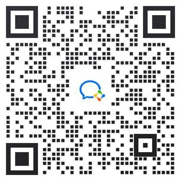

# 蛋卷俱乐部

非官方整理

友链（皆为非官方）：[eggroll.club](https://eggroll.club/)、[EggrollPress](https://zam157.github.io/EggrollPress/)

|   栏目   |        0        |        1        |        2        |        3        |        4        |        5        |        6        |        7        |        8        |
| :------: | :-------------: | :-------------: | :-------------: | :-------------: | :-------------: | :-------------: | :-------------: | :-------------: | :-------------: |
|  黑马奖  |  [✅](0#黑马奖)  |  [✅](1#黑马奖)  |  [✅](2#黑马奖)  |  [✅](3#黑马奖)  |  [✅](4#黑马奖)  |  [✅](5#黑马奖)  |  [✅](6#黑马奖)  |  [✅](7#黑马奖)  |  [✅](8#黑马奖)  |
|  合订本  |  [✅](0#合订本)  |                 |  [✅](2#合订本)  |                 |                 |                 |  [✅](6#合订本)  |                 |  [✅](8#合订本)  |
| 观众社论 | [✅](0#观众社论) | [✅](1#观众社论) | [✅](2#观众社论) | [✅](3#观众社论) | [✅](4#观众社论) | [✅](5#观众社论) | [✅](6#观众社论) | [✅](7#观众社论) | [✅](8#观众社论) |
|   线索   |   [✅](0#线索)   |   [✅](1#线索)   |   [✅](2#线索)   |   [✅](3#线索)   |   [✅](4#线索)   |   [✅](5#线索)   |   [✅](6#线索)   |   [✅](7#线索)   |                 |
|   段子   |   [✅](0#段子)   |                 |   [✅](2#段子)   |                 |                 |                 |                 |                 |                 |
| 编读往来 |                 |                 |                 | [✅](3#编读往来) | [✅](4#编读往来) | [✅](5#编读往来) | [✅](6#编读往来) | [✅](7#编读往来) | [✅](8#编读往来) |
|   体验   |                 |   [✅](1#体验)   |   [✅](2#体验)   |   [✅](3#体验)   |   [✅](4#体验)   |   [✅](5#体验)   |                 |   [✅](7#体验)   |   [✅](8#体验)   |
|   读书   |                 |                 |                 |                 |   [✅](4#读书)   |   [✅](5#读书)   |                 |   [✅](7#读书)   |   [✅](8#读书)   |
|   带货   |                 |                 |   [✅](2#带货)   |   [✅](3#带货)   |                 |                 |                 |                 |                 |
| 另类参考 |                 |                 |                 |                 |                 | [✅](5#另类参考) |                 |                 |                 |
| 评论选登 |                 |                 |                 |                 |                 |                 | [✅](6#评论选登) | [✅](7#评论选登) | [✅](8#评论选登) |

## 《蛋卷俱乐部》征稿通知

- **黑马奖**：收集对睡前消息节目的 **批评和反对意见** ，如果提供的内容创意，我们会刊载出来。
- **合订本**：就是我们往期节目有关的 **后续新闻** 。
- **观众社论**：如果你还记得之前“兴风作浪的观众”栏目，那么这个新栏目就是收集大家对节目的 **直接评论** 。
- **线索**：如果你有什么新闻或者热点方向建议我们深挖，可以相关的一组链接给我们，并附上简单的理由。（ **推荐话题** ）
- **段子**：包括但不限于全网 **梗图，笑话，反差** ，如果适合创作，我们可以安排左手王同学根据大家的创意画图。
- **编读往来**：对《蛋卷俱乐部》马督工点评的 **再反馈** ，以及对直播中马前卒观点的商榷。
- **体验**：就是来自 **生产生活一线** 的投稿，讲述自己对本行业以及社会的体验和观点。
- **读书**：共享你最新的 **阅读和学习体悟** 。
- **带货**：也就是 **广告栏** ，如果你发现了适合我们调性的好物，你的家乡特产，也可以给我们提供招商机会。
- **另类参考**：代表了一种 **典型思潮** ，对其内容不表态，权做各位读者参考。
- **评论选登**：展示各期睡前消息下的精彩观众评论。

欢迎添加《蛋卷俱乐部》管理员微信。

