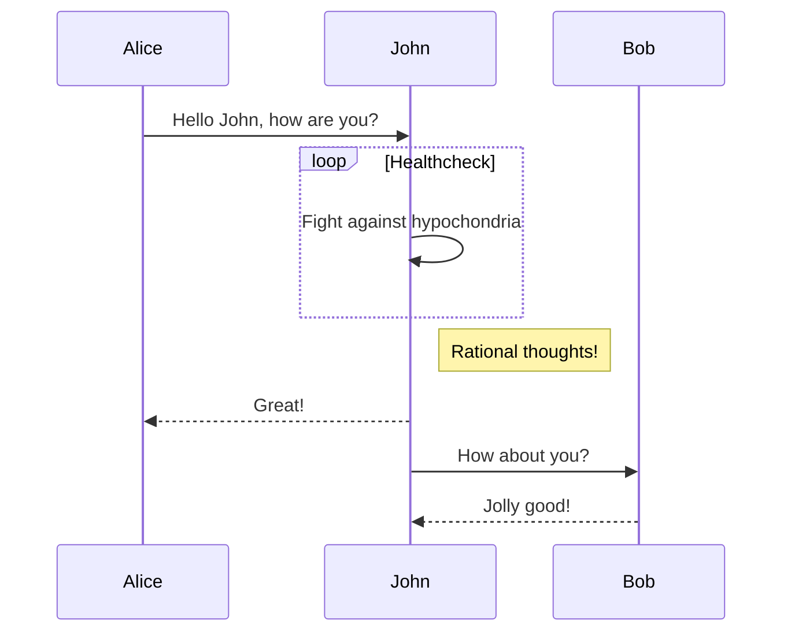

# 测试页面

<!-- <LineChartx /> -->
<!-- <linechart :chartData="{labels: ['January', 'February', 'March', 'April', 'May', 'June', 'July'],datasets: [{label: 'Data One',backgroundColor: '#f87979',data: [40, 39, 10, 40, 39, 80, 40]}]}" :chartOptions="{responsive: true,maintainAspectRatio: false}"/> -->

## 常用emoji

| 🔄 后续hzxu | ⏩ 预告kkjb | 🔘 简讯jmxy | 📰 广告bcvi | 💬 评论pkly |
| :--------: | :--------: | :--------: | :--------: | :--------: |
| 🏞️ 照片vcpm | 📄 文档wfdh |   👍 赞zj   |   👎 踩cd   |  ❓ 问号wh  |

## 常用html

**<span style='color:orange'>静静提问为加粗橙色（搜狗jkjk）</span>** <span style='color:grey'>灰色为不重要的内容</span>

```html
**<span style='color:orange'>橙色加粗</span>**
<span style='color:grey'>灰色</span>
```

<span style='color:#db1f1f;background-color:#db1f1f22;'>~~删除（搜狗delete）~~</span> 
<span style='color:#97cb25;background-color:#97cb2522;'>插入（搜狗insert）</span>

```html
<span style='color:#db1f1f;background-color:#db1f1f22;'>~~删除（搜狗delete）~~</span>
<span style='color:#97cb25;background-color:#97cb2522;'>插入（搜狗insert）</span>
```

下标<sub>[1]</sub>  上标<sup>[2]</sup>  <ruby>注音<rt>zhùyīn</rt></ruby> 

```html
下标<sub>[1]</sub>
上标<sup>[2]</sup>
<ruby>注音<rt>zhùyīn</rt></ruby> 
```

非标题跳转

```html
<!-- 锚点（搜狗pin） -->
<a id=“标签”>📌</a>
<!-- 跳转按钮（搜狗link） -->
<a href=“#标签”>显示内容</a>
```

<div style='text-align:center;font-size:14px;color:#777'>图片说明居中</div>

```html
<div style='text-align:center;font-size:14px;color:#777'>图片说明居中</div>
```


## 自定义块及iframe


::: info 往期马督工点评
灰色，搜狗info
:::

::: tip 搬运者注
绿色，搜狗tip
:::

::: warning 马督工点评
黄色，搜狗warning、mdg
:::

::: danger 编辑
红色，搜狗danger、bmji
:::

```markdown
::: info 往期马督工点评
灰色
:::

::: tip 搬运者注
绿色
:::

::: warning 马督工点评
黄色
:::

::: danger 编辑
红色
:::
```

::: details 【Bilibili】卖大麻竟然都卖亏本，加拿大此刻啥心情？
<iframe src="//player.bilibili.com/player.html?bvid=BV1st411L7ne&page=1&high_quality=1" scrolling="no" border="0" frameborder="no" framespacing="0" allowfullscreen="true" height=400 width=100%> </iframe>
:::

```html
::: details 【Bilibili】卖大麻竟然都卖亏本，加拿大此刻啥心情？
<iframe src="播放器链接" scrolling="no" border="0" frameborder="no" framespacing="0" allowfullscreen="true" height=400 width=100%> </iframe>
:::
```

## 插件

### $\LaTeX$ 支持（markdown-it-mathjax3）
行内$\LaTeX$支持

公式块支持

$$
\begin{align*}
P(X<x|Y=y)&=\sum_{u=-\infty}^xP(X=u|Y=y)   \\
          &=\sum_{u=-\infty}^x{\frac{P(Y=y|X=u)P(X=u)}{P(Y=y)}}   \\
          &=\lim_{\varepsilon\rightarrow0}\sum_{u=-\infty}^x{\frac{P(y<Y<y+\varepsilon)P(u<X<u+\varepsilon)}{P(y<Y<y+\varepsilon)}}   \\
          &=\lim_{\varepsilon\rightarrow0}\sum_{u=-\infty}^x{\frac{(f_{Y|X}(\varepsilon_1|u)\cdot\varepsilon)(f_{X}(\varepsilon_2)\cdot\varepsilon)}{f_{Y}(\varepsilon_3)\cdot\varepsilon}}   \\
\end{align*}
$$

与Typora用法一致，不给代码块了

但是为mathjax3，没有xy-pic这类绘制曲线图表的库，只有基础包

### Twitter Embed（vue-tweet）

原生方法：https://publish.twitter.com/#

<blockquote class="twitter-tweet" align="center"><p lang="ja" dir="ltr">好想有人陪着呀……</p>&mdash; 我好惨。我是垃圾。我全面溃败。来生再见。 (@timoskky) <a href="https://twitter.com/timoskky/status/1584179519874682882?ref_src=twsrc%5Etfw">October 23, 2022</a></blockquote>

```html
<blockquote class="twitter-tweet" align="center"><p lang="ja" dir="ltr">好想有人陪着呀……</p>&mdash; 我好惨。我是垃圾。我全面溃败。来生再见。 (@timoskky) <a href="https://twitter.com/timoskky/status/1584179519874682882?ref_src=twsrc%5Etfw">October 23, 2022</a></blockquote>
```
vue-tweet插件：https://github.com/DannyFeliz/vue-tweet

<!-- <Tweet tweet-id="1582133989544165376" width=550 align="center" lang="zh-cn"/> -->

```html
<Tweet tweet-id="1582133989544165376" width=550 align="center" lang="zh-cn"/>
```
### mermaid（vitepress-plugin-mermaid）



### 图片点击放大（medium-zoom）


### Sitemap（sitemap）

[点击加载](/sitemap.xml)
### 自定义扩展 Vue 组件

<BiliComment name="贰鼠" content="过去中国搞建设虽然也有通过无人区的铁路，但是绝大多数铁路至少有一端是人口稠密地区，这条敦格铁路的两端，敦煌19万人口，格尔木也只有20万人口出头，<br>为什么要为这两个小城市修一条直通的铁路呢？" time="2022-09-29 15:58" like="2211"/>

```html
<BiliComment name="昵称" content="内容<br>换行" time="时间" like="0"/>
```

<BiliCommentX name="贰鼠" content="过去中国搞建设虽然也有通过无人区的铁路，但是绝大多数铁路至少有一端是人口稠密地区，这条敦格铁路的两端，敦煌19万人口，格尔木也只有20万人口出头，<br>为什么要为这两个小城市修一条直通的铁路呢？"/>

```html
<BiliCommentX name="昵称" content="内容<br>换行"/>
```

### 评论系统（Valine）

如下↓