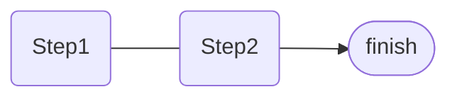

# 测试页面

部分Badge内部为设置的搜狗快捷短语，本人用的是小鹤双拼，如<Badge type="info" text="hvvh(徽章)" />

<!-- 测试img标签，之前一直会报错 -->
<!--  -->

<!-- <LineChartx /> -->
<!-- <linechart :chartData="{labels: ['January', 'February', 'March', 'April', 'May', 'June', 'July'],datasets: [{label: 'Data One',backgroundColor: '#f87979',data: [40, 39, 10, 40, 39, 80, 40]}]}" :chartOptions="{responsive: true,maintainAspectRatio: false}"/> -->

<!-- <Demo /> -->

<!-- <CalendarHeatmap :values="[{ date: '2018-9-22', count: 6 },{ date: '2018-9-23', count: 7 },{ date: '2018-9-24', count: 8 }]" dark-mode/> -->

## 常用emoji

🔄 后续<Badge type="info" text="hzxu" />&nbsp;&nbsp;&nbsp;
⏩ 预告<Badge type="info" text="kkjb" />&nbsp;&nbsp;&nbsp;
🔘 简讯<Badge type="info" text="jmxy" />&nbsp;&nbsp;&nbsp;
📰 广告<Badge type="info" text="bcvi" />&nbsp;&nbsp;&nbsp;
💬 评论<Badge type="info" text="pkly" />

🏞️ 照片<Badge type="info" text="vcpm" />&nbsp;&nbsp;&nbsp;
📄 文档<Badge type="info" text="wfdh" />&nbsp;&nbsp;&nbsp;
👍 赞<Badge type="info" text="zj" />&nbsp;&nbsp;&nbsp;
👎 踩<Badge type="info" text="cd" />&nbsp;&nbsp;&nbsp;
❓ 问号<Badge type="info" text="wh" />

## 常用html

**<span style='color:orange'>静静提问为加粗橙色</span>** <MyBadge hue=30 text="jkjk" />
<span style='color:grey'>灰色为不重要的内容</span><Badge type='info' text="grey" />

```html
**<span style='color:orange'>橙色加粗</span>**
<span style='color:grey'>灰色</span>
```

仿知乎问题日志的文字增删效果
<span class='delete'>删除文字</span><MyBadge hue=0 text="delete" />
<span class='insert'>插入文字</span><MyBadge hue=80 text="insert" />

```html
<span class='delete'>删除</span>
<span class='insert'>插入</span>
```

下标<sub>[1]</sub>  上标<sup>[2]</sup>  <ruby>注音<rt>zhùyīn</rt></ruby> 

```html
下标<sub>[1]</sub>
上标<sup>[2]</sup>
<ruby>注音<rt>zhùyīn</rt></ruby> 
```

非标题跳转

```html
<!-- 锚点（搜狗pin） -->
<a id=“标签”>📌</a>
<!-- 跳转按钮（搜狗link） -->
<a href=“#标签”>显示内容</a>
```

<p class="imgCaption">图片说明居中<Badge type="info" text="vuui" /></p>

<p class="imgCaption">常规文字 <a href="https://github.com/vuejs/vitepress">可以带链接</a><Badge type="info" text="vuuil" /></p>

```html
<p class="imgCaption">图片说明居中</p> <!-- 搜狗vuui(注释) -->
<p class="imgCaption">常规文字 
  <a href="https://github.com/vuejs/vitepress">
    可以带链接 <!-- 搜狗vuuil(注释link) -->
  </a>
</p>
```

## Badge 徽章 <MyBadge hue=300 text="二级标题样式不同" />

Badge <Badge type="info"><span style='color:orange'>alpha.27</span> 新增</Badge>
以及我自定义的组件 MyBadge（需传入hue值，见下方）<Badge type="info" text="hvvh" /><MyBadge hue=150 text="hvvhx" />

<Badge type="info" text="info" />
<Badge type="tip" text="tip" />
<Badge type="warning" text="warning" />
<Badge type="danger" text="danger" />
<Badge type="info" text="插槽" />
<br>

<MyBadge hue=0 text="0" /><MyBadge hue=10 text="10" /><MyBadge hue=20 text="20" /><MyBadge hue=30 text="30" /><MyBadge hue=40 text="40" /><MyBadge hue=50 text="50" /><MyBadge hue=60 text="60" /><MyBadge hue=70 text="70" /><MyBadge hue=80 text="80" /><MyBadge hue=90 text="90" />

<MyBadge hue=100 text="100" /><MyBadge hue=110 text="110" /><MyBadge hue=120 text="120" /><MyBadge hue=130 text="130" /><MyBadge hue=140 text="140" /><MyBadge hue=150 text="150" /><MyBadge hue=160 text="160" /><MyBadge hue=170 text="170" /><MyBadge hue=180 text="180" /><MyBadge hue=190 text="190" />

<MyBadge hue=200 text="200" /><MyBadge hue=210 text="210" /><MyBadge hue=220 text="220" /><MyBadge hue=230 text="230" /><MyBadge hue=240 text="240" /><MyBadge hue=250 text="250" /><MyBadge hue=260 text="260" /><MyBadge hue=270 text="270" /><MyBadge hue=280 text="280" /><MyBadge hue=290 text="290" />

<MyBadge hue=300 text="300" /><MyBadge hue=310 text="310" /><MyBadge hue=320 text="320" /><MyBadge hue=330 text="330" /><MyBadge hue=340 text="340" /><MyBadge hue=350 text="350" /><MyBadge hue=360 text="360" />

```html
<Badge type="info" text="..." />
<Badge type="tip" text="..." /> <!-- 无type则默认为tip -->
<Badge type="warning" text="..." />
<Badge type="danger" text="..." />
<Badge type="info">插槽</Badge>
<MyBadge hue=300 text="..." /> <!-- 自定义颜色，hue值见上方 -->
```

## 自定义块及iframe


::: info 往期马督工点评 <Badge type="info" text="info" />
:::

::: tip 搬运者注 <Badge type="tip" text="tip" />
:::

::: warning 马督工点评 <Badge type="warning" text="warning" /> <Badge type="warning" text="mdg(马督工)" />
:::

::: danger 编辑吐槽 <Badge type="danger" text="danger" /> <Badge type="danger" text="bmji(编辑)" />
:::

::: details 点击展开 <MyBadge hue=200 text="details" /> <MyBadge hue=200 text="bilibili" /> <MyBadge hue=200 text="youtube" />
通常用于嵌入视频iframe，如下方演示
:::

```markdown
::: info | tip | warning | danger | details 标题
内容
:::
```

::: details 嵌入视频iframe示例
<iframe src="https://player.bilibili.com/player.html?bvid=BV1st411L7ne&page=1&high_quality=1" scrolling="no" border="0" frameborder="no" framespacing="0" allowfullscreen="true" height=400 width=100%> </iframe>
:::

```html
::: details 标题
<iframe src="播放器链接" scrolling="no" border="0" frameborder="no" framespacing="0" allowfullscreen="true" height=400 width=100%> </iframe>
:::
```

## 插件

### $\LaTeX$ 支持（markdown-it-mathjax3）
行内$\LaTeX$支持

公式块支持

$$
\begin{align*}
P(X<x|Y=y)&=\sum_{u=-\infty}^xP(X=u|Y=y)   \\
          &=\sum_{u=-\infty}^x{\frac{P(Y=y|X=u)P(X=u)}{P(Y=y)}}   \\
          &=\lim_{\varepsilon\rightarrow0}\sum_{u=-\infty}^x{\frac{P(y<Y<y+\varepsilon)P(u<X<u+\varepsilon)}{P(y<Y<y+\varepsilon)}}   \\
          &=\lim_{\varepsilon\rightarrow0}\sum_{u=-\infty}^x{\frac{(f_{Y|X}(\varepsilon_1|u)\cdot\varepsilon)(f_{X}(\varepsilon_2)\cdot\varepsilon)}{f_{Y}(\varepsilon_3)\cdot\varepsilon}}   \\
\end{align*}
$$

与Typora用法一致，不给代码块了

但是为mathjax3，没有xy-pic这类绘制曲线图表的库，只有基础包

### Twitter Embed（vue-tweet）

原生方法：[推特官方提供](https://publish.twitter.com/#)

<blockquote class="twitter-tweet" align="center"><p lang="ja" dir="ltr">好想有人陪着呀……</p>&mdash; 我好惨。我是垃圾。我全面溃败。来生再见。 (@timoskky) <a href="https://twitter.com/timoskky/status/1584179519874682882?ref_src=twsrc%5Etfw">October 23, 2022</a></blockquote>

```html
<blockquote class="twitter-tweet" align="center"><p lang="ja" dir="ltr">好想有人陪着呀……</p>&mdash; 我好惨。我是垃圾。我全面溃败。来生再见。 (@timoskky) <a href="https://twitter.com/timoskky/status/1584179519874682882?ref_src=twsrc%5Etfw">October 23, 2022</a></blockquote>
```
[vue-tweet插件](https://github.com/DannyFeliz/vue-tweet) （暂时取消）：

<!-- <Tweet tweet-id="1582133989544165376" width=550 align="center" lang="zh-cn"/> -->

```html
<Tweet tweet-id="1582133989544165376" width=550 align="center" lang="zh-cn"/>
```
### mermaid（vitepress-plugin-mermaid）



### 图片点击放大（medium-zoom）

以及图片表格样式调整（只保留内部竖边框）

|  |  |
| --------------------------- | ------------------------- |

### Sitemap（sitemap）

点击加载： [sitemap.xml](/sitemap.xml) 、 [sitemap.txt](/sitemap.txt)
### 自定义组件-仿B站评论（BiliComment）

基础：<Badge type="info" text="bcx" />

<BiliComment name="贰鼠" content="过去中国搞建设虽然也有通过无人区的铁路，但是绝大多数铁路至少有一端是人口稠密地区，这条敦格铁路的两端，敦煌19万人口，格尔木也只有20万人口出头，<br>为什么要为这两个小城市修一条直通的铁路呢？"/>

```html
<BiliComment name="昵称" content="内容<br>换行"/>
```

完整：<Badge type="info" text="bc" /> <Badge type="info" text="reply" />

<BiliComment name="陈睿" content="你所热爱的，就是你的生活。"  time="2020-05-04 00:14" like="79586" reply="<div class='bc-reply'>蒙古上单</div>你 妈什么时候死啊？"/>

```html
<!-- time、like、reply皆为可选项 -->
<BiliComment
  name="陈睿"
  content="你所热爱的，就是你的生活。"
  time="2020-05-04 00:14"
  like="79586"
  reply="<div class='bc-reply'>蒙古上单</div>你 妈什么时候死啊？"
/>
```

可用插槽：<Badge type="info" text="bcs (bc-slot)" />

<BiliComment name="匿名甲">

插槽内可用md语法，以及自定义组件<Badge type="info" text="slot" />
```html
<BiliComment name="匿名甲">一些内容。。。</BiliComment>
```

</BiliComment>

<BiliComment name="贰鼠（可点击）" time="2022-10-16 00:32" like="114514" uid="22245854" reply="<div class='bc-reply'>贰鼠二号</div>头像背景颜色是用散列函数根据用户名随机生成的，所以一个id只对应一个颜色<div class='bc-reply'>贰鼠三号</div>1. 添加了回复功能，如此<br>2. 添加了可选参数uid，用于点击昵称跳转链接，见上方<br>3. 添加了插槽功能，能在里面用md语法了，见下方">

好不容易写了个评论组件，记录一下，今后督工的观众评论截图就用这个代替了，方便搜索。另外换行请用\<br\>

</BiliComment>

<BiliComment name="匿名贰鼠" content="若为匿名则头像为noface">

```html
<!-- （以下参数除name外均为可选项） -->
<BiliComment 
    name="昵称" content="内容" 
    time="时间" like="赞数" uid="用于昵称链接">
...
</BiliComment>
```

</BiliComment>

### 评论系统（Valine）

如下↓